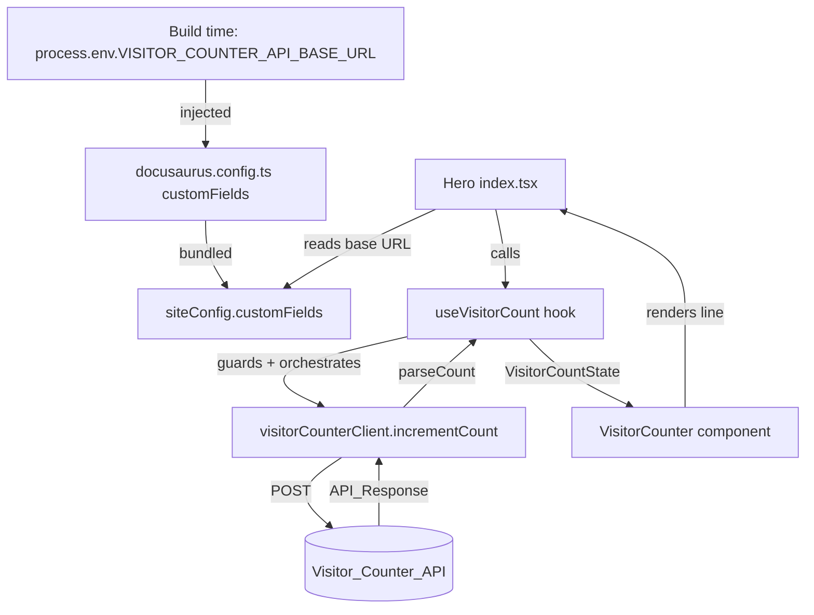

# Design Document

## Overview

This feature adds a visitor counter to the homepage `Hero` component (`src/components/Hero/index.tsx`). On mount, the component sends a single `POST` to the existing Visitor_Counter_API to increment the visit count, then renders the returned total as a subtle line beneath the intro paragraph (for example, `You are visitor #1,234`). A subtle placeholder shows while the request is in flight. Any failure — network error, malformed response, or a missing API base URL — results in the counter hiding itself silently, leaving the Hero visually unchanged.

The design keeps the network/side-effect logic out of the JSX by isolating it in a `useVisitorCount` hook and a small pure API client. The API base URL is supplied at build time through an environment variable, surfaced to the browser bundle via Docusaurus `customFields`, and read client-side through `useDocusaurusContext()`.

The implementation language is **TypeScript / React** (functional components and hooks), matching the existing site stack. Styling uses **Tailwind CSS + clsx + CSS modules**, consistent with the current `Hero` component.

## Architecture



Layering, from outermost to innermost:

1. **Config wiring (build → client):** `docusaurus.config.ts` reads `process.env.VISITOR_COUNTER_API_BASE_URL` at build time and places it in `customFields`. This is required because raw `process.env` is not reliably present in the browser bundle; `customFields` is the supported Docusaurus channel for exposing build-time values to client code. The existing config already reads `process.env` (`BASE_URL`, `LAST_BUILD_DATE`) at build time, so this follows an established pattern in the same file.
2. **Presentation (`Hero`, `VisitorCounter`):** `Hero` reads the base URL from `useDocusaurusContext()`, invokes `useVisitorCount`, and renders `VisitorCounter` beneath the intro paragraph. `VisitorCounter` is a pure, state-driven renderer.
3. **State/orchestration (`useVisitorCount`):** owns the effect that fires exactly one increment per mount, the base-URL guard, loading/success/hidden state, and response validation.
4. **I/O + pure helpers (`visitorCounterClient`, `buildCounterUrl`, `parseCount`, `formatCount`):** the only layer that touches `fetch`; the helpers around it are pure and independently testable.

## Components and Interfaces

### File layout

```
src/components/Hero/
  index.tsx                      # existing; renders <VisitorCounter/> beneath intro <p>
  styles.module.css              # existing; add .visitorCounter, .visitorCounterPlaceholder
  VisitorCounter/
    index.tsx                    # presentational, state-driven component
    useVisitorCount.ts           # hook: effect, guard, state machine
    visitorCounterClient.ts      # API client (fetch) + buildCounterUrl
    format.ts                    # formatCount, parseCount (pure)
    __tests__/                   # unit + property tests
```

Keeping these under `Hero/` matches the current single-folder-per-component convention.

### Data types

```typescript
// The subset of the API_Response we rely on.
interface ApiResponse {
  count?: unknown; // expected number; validated at runtime
  updatedAt?: unknown; // present but unused by the client
}

// Discriminated union describing what the counter should render.
type VisitorCountState =
  { status: 'loading' } | { status: 'success'; count: number } | { status: 'hidden' };
```

`hidden` is the single terminal state for every failure path (request error, non-numeric count, missing base URL), which keeps Requirement 4 uniform: there is exactly one way to "hide silently."

### API client (`visitorCounterClient.ts`)

```typescript
export function buildCounterUrl(baseUrl: string, pageId?: string): string {
  const trimmed = baseUrl.replace(/\/+$/, ''); // drop trailing slashes
  const query = pageId ? `?pageId=${encodeURIComponent(pageId)}` : '';
  return `${trimmed}${query}`;
}

// Increments the count. Resolves with the raw response body (unvalidated),
// or throws on network / non-OK responses.
export async function incrementCount(
  baseUrl: string,
  options?: { pageId?: string; signal?: AbortSignal },
): Promise<ApiResponse> {
  const res = await fetch(buildCounterUrl(baseUrl, options?.pageId), {
    method: 'POST',
    headers: { 'Content-Type': 'application/json' },
    signal: options?.signal,
  });
  if (!res.ok) {
    throw new Error(`Visitor counter request failed: ${res.status}`);
  }
  return (await res.json()) as ApiResponse;
}
```

The client only sends `POST` (increment). `GET` (read-without-increment) is part of the backend contract but is not used by this feature. `pageId` is optional; the server applies its `DEFAULT_PAGE_ID` when it is omitted, so the client omits it by default. CORS is handled server-side, so no special client handling is required.

### Formatting and validation (`format.ts`)

```typescript
// Requirement 2.2 / 2.3 — thousands separators.
export function formatCount(count: number): string {
  return count.toLocaleString('en-US');
}

export function formatVisitorLine(count: number): string {
  return `You are visitor #${formatCount(count)}`;
}

// Requirement 4.2 — accept only a finite, non-negative integer count.
export function parseCount(response: ApiResponse | null | undefined): number | null {
  const value = response?.count;
  if (typeof value === 'number' && Number.isFinite(value) && value >= 0) {
    return Math.trunc(value);
  }
  return null; // missing / null / string / NaN / negative → hide
}
```

`en-US` locale is pinned deliberately so grouping is deterministic regardless of the visitor's runtime locale, keeping the display and the tests stable.

### Hook (`useVisitorCount.ts`)

```typescript
export function useVisitorCount(baseUrl: string | undefined): VisitorCountState {
  const [state, setState] = useState<VisitorCountState>({ status: 'loading' });
  const hasRun = useRef(false); // Requirement 1.3: exactly one increment per mount

  useEffect(() => {
    if (hasRun.current) return;
    hasRun.current = true;

    // Requirement 4.3: no base URL → skip request, hide.
    if (!baseUrl) {
      setState({ status: 'hidden' });
      return;
    }

    const controller = new AbortController();
    incrementCount(baseUrl, { signal: controller.signal })
      .then((response) => {
        const count = parseCount(response);
        setState(count === null ? { status: 'hidden' } : { status: 'success', count });
      })
      .catch(() => {
        setState({ status: 'hidden' }); // Requirement 4.1: silent failure
      });

    return () => controller.abort();
  }, [baseUrl]);

  return state;
}
```

The `hasRun` ref guard ensures a single increment even when React re-invokes the effect (for example, under StrictMode double-mounting in development). The `AbortController` cleanup prevents a state update after unmount; an aborted request lands in `catch`, which is already the silent-hide path.

### Presentational component (`VisitorCounter/index.tsx`)

```typescript
export default function VisitorCounter({ state }: { state: VisitorCountState }) {
  if (state.status === 'hidden') return null;

  if (state.status === 'loading') {
    return (
      <p
        aria-hidden="true"
        className={clsx('mt-2 text-sm text-gray-400', styles.visitorCounterPlaceholder)}
      >
        {'\u00A0'}
      </p>
    );
  }

  // success
  return (
    <p className={clsx('mt-2 text-sm text-gray-400', styles.visitorCounter)}>
      {formatVisitorLine(state.count)}
    </p>
  );
}
```

The component is a pure function of `state`: it renders exactly one of placeholder / formatted line / nothing. This keeps Requirements 2, 3, and 4's rendering aspects in one small, testable unit.

### Hero integration (`Hero/index.tsx`)

`Hero` reads the base URL from the client-accessible config and renders the counter as the last child inside the existing `max-w-4xl` container, immediately after the intro `<p>` (Requirement 2.4):

```typescript
const { siteConfig } = useDocusaurusContext();
const baseUrl = siteConfig.customFields?.visitorCounterApiBaseUrl as string | undefined;
const state = useVisitorCount(baseUrl);

// inside <div className="max-w-4xl mx-auto px-4 text-center"> ... after the intro <p>:
<VisitorCounter state={state} />
```

### Config wiring (`docusaurus.config.ts`)

Add a `customFields` entry populated from the build-time environment variable:

```typescript
const config: Config = {
  // ...
  customFields: {
    visitorCounterApiBaseUrl: process.env.VISITOR_COUNTER_API_BASE_URL || '',
  },
  // ...
};
```

When the variable is unset at build time, the value is an empty string, which the hook's guard treats as "unavailable" and hides the counter (Requirement 4.3). Requirement 5 is satisfied end-to-end: the value is read from a build-time env var (5.1) and accessed through the Docusaurus-provided `customFields` in the client bundle (5.2).

## Data Models

| Field                      | Source         | Type               | Use                                             |
| -------------------------- | -------------- | ------------------ | ----------------------------------------------- |
| `count`                    | API_Response   | number (validated) | The visitor total displayed after increment     |
| `updatedAt`                | API_Response   | string             | Part of the contract; unused here               |
| `visitorCounterApiBaseUrl` | `customFields` | string             | Base URL for the request; empty ⇒ hidden        |
| `pageId`                   | client option  | string (optional)  | Omitted; server falls back to `DEFAULT_PAGE_ID` |

`VisitorCountState` (above) is the internal model that drives rendering.

## Error Handling

All error and degenerate paths converge on the `hidden` state, and none surface any message to the user:

| Condition                        | Detection point                         | Result                                 |
| -------------------------------- | --------------------------------------- | -------------------------------------- |
| Missing/empty base URL           | hook guard before request               | no request sent; `hidden` (Req 4.3)    |
| Network failure / non-OK status  | `incrementCount` throws → hook `.catch` | `hidden` (Req 4.1)                     |
| Response missing/invalid `count` | `parseCount` returns `null`             | `hidden` (Req 4.2)                     |
| Component unmounts mid-request   | `AbortController` cleanup → `.catch`    | `hidden`, no post-unmount state update |

There is intentionally no retry, no error UI, and no console error for expected failures, matching the "silent hide" requirement.

## Correctness Properties

_A property is a characteristic or behavior that should hold true across all valid executions of a system — essentially, a formal statement about what the system should do. Properties serve as the bridge between human-readable specifications and machine-verifiable correctness guarantees._

### Property 1: URL construction from the base URL

_For any_ API base URL string and any optional `pageId`, `buildCounterUrl` SHALL produce a URL that begins with the base URL stripped of trailing slashes, appends a `pageId` query only when a `pageId` is provided, and never introduces a double slash between the base and the query.

**Validates: Requirements 1.2**

### Property 2: Count formatting with thousands separators

_For any_ finite non-negative integer count, `formatCount` SHALL produce the `en-US` grouped representation of that integer, and stripping the grouping separators from the result SHALL yield exactly the base-10 digits of the count.

**Validates: Requirements 2.2**

### Property 3: Response validation accepts only finite numeric counts

_For any_ API response object, `parseCount` SHALL return a non-negative integer when and only when the response's `count` is a finite, non-negative number, and SHALL return `null` for every other case (missing, `null`, non-numeric, `NaN`, negative), so that only valid counts lead to a displayed count and all others hide the counter.

**Validates: Requirements 4.2**

### Property 4: State-driven rendering is exclusive and correct

_For any_ `VisitorCountState`, the `VisitorCounter` component SHALL render exactly one of: the loading placeholder (when `loading`), a single line containing the identifying phrase and the formatted count (when `success`), or nothing (when `hidden`); and in the `success` case the rendered text SHALL contain both the visitor phrase and `formatCount(count)`.

**Validates: Requirements 2.1, 2.3, 3.2, 4.1**

## Testing Strategy

_A property is a characteristic or behavior that should hold true across all valid executions of a system._

The feature is tested with a **dual approach**: property-based tests for the pure, input-varying logic and example-based tests for lifecycle, wiring, and DOM-structure behavior. React tests use React Testing Library; property tests use **fast-check** (the standard PBT library for the TypeScript/JS ecosystem) alongside the existing test runner.

### Property-based tests

Each property test runs a minimum of **100 iterations** and is tagged with its design property.

- **Feature: hero-visitor-counter, Property 1: URL construction from the base URL** — generate arbitrary base URLs (with and without trailing slashes) and optional `pageId` strings; assert the invariants in Property 1.
- **Feature: hero-visitor-counter, Property 2: Count formatting with thousands separators** — generate arbitrary non-negative integers; assert grouped output and digit-preservation.
- **Feature: hero-visitor-counter, Property 3: Response validation accepts only finite numeric counts** — generate arbitrary response shapes (valid numbers, negatives, NaN, strings, missing/null); assert `parseCount` accepts only valid counts.
- **Feature: hero-visitor-counter, Property 4: State-driven rendering is exclusive and correct** — generate arbitrary states (loading, success with random count, hidden); render and assert exactly-one-output and success content.

### Example-based / integration tests

These cover behavior that does not vary meaningfully with input (lifecycle, guards, wiring, structure):

- **Increment on mount (Req 1.1, 1.3):** render `Hero`/hook with a mocked client; assert exactly one `POST` per mount, including under a simulated effect re-run.
- **Placeholder while loading (Req 3.1):** render with the request pending; assert the placeholder is present and no final count.
- **Placement (Req 2.4):** on success, assert the counter node is inside the `max-w-4xl` container and ordered after the intro paragraph.
- **Silent failure (Req 4.1):** mock the client to reject; assert `hidden` and no error text rendered.
- **Missing base URL (Req 4.3):** render with empty/undefined base URL; assert the client is never called and the state is `hidden`.
- **Config accessor (Req 5.1, 5.2):** mock `useDocusaurusContext` returning `customFields.visitorCounterApiBaseUrl`; assert the value flows into the client call.
- **Styling consistency (Req 6.1, 6.2):** assert the counter renders a single subtle line with the expected muted Tailwind utilities via `clsx`.
