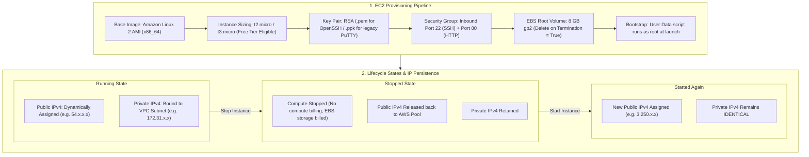
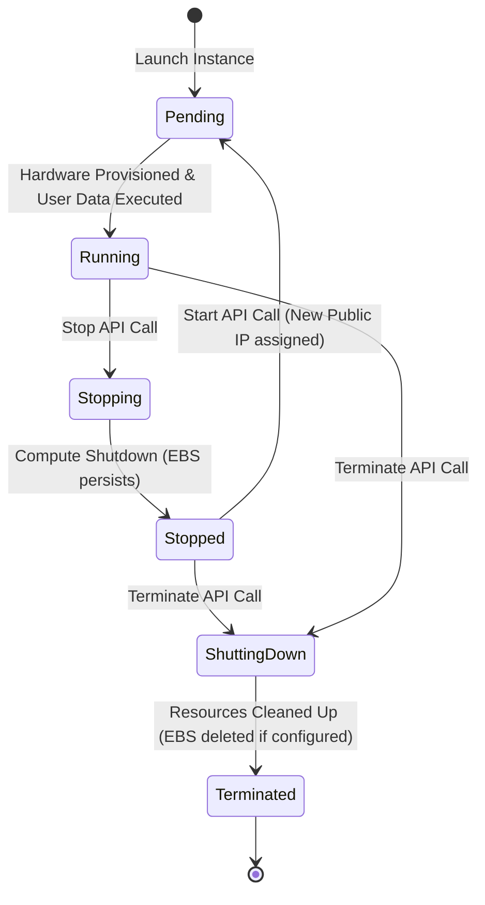

# Hands-On Lab: Provisioning an Amazon EC2 Web Server with User Data, Security Groups & Lifecycle State Management

---

## Key Takeaways

Launching an Amazon EC2 instance brings together foundational cloud concepts: choosing an Amazon Machine Image (AMI), sizing compute via instance types, securing network traffic through Security Groups, and automating software configuration at launch using **EC2 User Data**.



Key principles to remember:

- **The Bootstrapping Flow:** Supplying a script in **User Data** installs updates, installs the web server (`httpd`), and creates web content automatically on the very first boot without manual SSH intervention.
- **Firewall Rules (Security Groups):** To access a web server, the attached Security Group must explicitly allow **inbound HTTP traffic on Port 80**. By default, new groups also allow inbound **SSH on Port 22**. Outbound traffic is completely unrestricted by default.
- **Public vs. Private IPv4 Behavior on Stop/Start:**
  - **Public IPv4:** Dynamic by default. Stopping and restarting an instance releases the original public IP back to AWS and assigns a **new public IPv4 address**.
  - **Private IPv4:** Statically allocated from the VPC subnet CIDR block for the entire life of the instance; it **never changes** across stop and start cycles.
- **Storage Persistence (EBS):** The root EBS volume persists its filesystem across stop/start cycles. However, the default setting `Delete on Termination = Yes` ensures the storage volume is automatically cleaned up when the instance is permanently terminated.

---

## Hands-On Workflow: End-to-End Walkthrough

1. **Navigate to EC2 and Launch Instance:**
   - Open the AWS Management Console and navigate to **EC2**.
   - In the left navigation menu, click **Instances**, then click **Launch instances**.
   - **Name:** Enter `My First Instance`.
2. **Select Operating System (AMI) & Instance Type:**
   - Configure the compute foundation:
   - **Application and OS Images (Amazon Machine Image):** Select **Amazon Linux** $\rightarrow$ **Amazon Linux 2 AMI** (Free Tier eligible, 64-bit x86 architecture).
   - **Instance type:** Select `t2.micro` (or `t3.micro` depending on region availability).
3. **Configure SSH Key Pair:**
   - Manage authentication credentials:
   - Under **Key pair (login)**, select **Create new key pair**.
   - **Key pair name:** `EC2 Tutorial`.
   - **Key pair type:** `RSA`.
   - **Private key file format:**
     - Select `.pem` for OpenSSH (macOS, Linux, modern Windows 10/11 OpenSSH).
     - Select `.ppk` for legacy Windows environments using PuTTY.
   - Click **Create key pair** and store the downloaded file securely.
4. **Configure Network & Security Group Firewall Rules:**
   - Under **Network settings**, leave VPC and Subnet defaults in place:
   - Select **Create security group** (named automatically by the wizard, e.g., `launch-wizard-1`).
   - Check **Allow SSH traffic from** $\rightarrow$ `Anywhere (0.0.0.0/0)` (Port 22).
   - Check **Allow HTTP traffic from the internet** (Port 80).
   - _Notice:_ Port 443 (HTTPS) is left unchecked for this lab since SSL/TLS certificates are not yet configured on the instance.
5. **Configure EBS Storage & Verify Delete-on-Termination:**
   - Review the block storage configuration:
   - Leave the root volume set to the default: **8 GiB gp2** (General Purpose SSD).
   - Note the advanced setting: **Delete on termination** is set to `Yes`, meaning the volume will be removed when the instance is terminated to avoid orphaned storage charges.
6. **Add Bootstrapping Script via EC2 User Data:**
   - Expand **Advanced details** at the bottom of the page and scroll to the **User data** field:
   - Paste the initialization script:

   ```bash
   #!/bin/bash
   # Update packages
   yum update -y
   # Install Apache Web Server (httpd)
   yum install -y httpd
   # Start and enable the web service
   systemctl start httpd
   systemctl enable httpd
   # Generate dynamic index HTML using EC2 instance metadata
   echo "<h1>Hello World from $(hostname -f)</h1>" > /var/www/html/index.html
   ```

   - Review the summary panel on the right and click **Launch instance**.

7. **Verify Web Application Access:**
   - Once the instance transitions from `Pending` to `Running`:
   - Select the instance and locate the **Public IPv4 address**.
   - Copy the IP address and open it in a web browser using explicit HTTP: `http://<Public-IPv4>`.
   - _Important:_ Ensure the protocol is `http://` and not `https://`. Modern browsers often auto-upgrade to HTTPS, which will hang indefinitely because port 443 is closed.
   - The page renders: `Hello World from <private-dns-hostname>`.
8. **Test Stop, Start, and IP Address Reallocation:**
   - Evaluate instance state behavior:
   - Select the instance $\rightarrow$ **Instance state** $\rightarrow$ **Stop instance**.
   - While in the `Stopping` / `Stopped` state, the web page becomes unreachable.
   - Select **Instance state** $\rightarrow$ **Start instance**.
   - Observe the networking details once back in the `Running` state:
     - The **Public IPv4 address has changed** (a new IP is allocated from AWS's public pool).
     - The **Private IPv4 address remains identical**.
   - Access the web server using `http://<New-Public-IPv4>` to verify service recovery.

---

## 3. Deep Dive: Instance States & Networking Behavior



| Lifecycle State | Compute Billing? | EBS Storage Billing?                       | Public IPv4 State        | Private IPv4 State   | Data on Instance Store? |
| --------------- | ---------------- | ------------------------------------------ | ------------------------ | -------------------- | ----------------------- |
| **Running**     | Yes              | Yes                                        | Bound and accessible     | Bound and accessible | Retained                |
| **Stopped**     | **No**           | **Yes**                                    | **Released** back to AWS | **Retained**         | **Lost (Terminated)**   |
| **Terminated**  | **No**           | No (deleted if `DeleteOnTermination=true`) | **Released**             | **Released**         | **Lost**                |

---

## Exam Guide

### Exam Tips

- **Public IP Reallocation (Core Exam Concept):** By default, when an Amazon EC2 instance is **stopped and started**, its **Public IPv4 address changes**. Its **Private IPv4 address remains constant**. To retain a static public IPv4 across stops and starts, an **Elastic IP (EIP)** must be allocated and attached.
- **Security Group Rules:**
  - **Inbound Rules:** Traffic must be explicitly allowed. For an unencrypted HTTP web server, inbound traffic on **Port 80** from `0.0.0.0/0` must be permitted.
  - **Outbound Rules:** Security groups allow **all outbound traffic** by default, allowing the User Data script to reach external package repositories (`yum`/`dnf`) during boot.
- **Browser Timeout Troubleshooting:** If browsing to an EC2 web server results in an infinite loading spinner or timeout:
  1. Check the URL protocol: ensure it is `http://` (Port 80) rather than `https://` (Port 443).
  2. Check the Security Group: verify an inbound rule exists for Port 80.
- **User Data Execution:** EC2 User Data executes **only once** during initial launch. It does not re-run when an instance is stopped and started.
- **SSH Key Formats:**
  - `.pem`: Used with OpenSSH tools on Linux, macOS, and modern Windows terminals.
  - `.ppk`: Used specifically with legacy PuTTY clients on older Windows platforms.

---

### Practice Test

#### Question 1

A solutions architect launches an Amazon EC2 instance with an Apache web server configured via User Data. The architect can access the web application at `[http://54.210.12.45](http://54.210.12.45)`. Due to a maintenance window, the instance is stopped for two hours and then restarted. After restarting, attempting to connect to `[http://54.210.12.45](http://54.210.12.45)` results in a connection timeout. What is the most likely reason for this connection failure?

- [ ] A. The Apache service configuration files on the root EBS volume were deleted when the instance was stopped
- [ ] B. Stopping and starting the EC2 instance released the original public IPv4 address and assigned a new one
- [ ] C. The User Data script executed again upon restart and overwrote the Apache configuration
- [ ] D. The Security Group attached to the instance automatically revoked the Port 80 inbound rule upon shutdown

<details>
<summary>Correct Answer</summary>

- [x] B. Stopping and starting the EC2 instance released the original public IPv4 address and assigned a new one
  - **Explanation:** In Amazon EC2, default public IPv4 addresses are dynamic. When an instance is **stopped and started**, the public IP address is released back to the AWS regional pool, and a new public IPv4 address is assigned upon launch. The private IPv4 remains unchanged, but web clients must connect using the new public IP address (or an Elastic IP).

</details>

---

#### Question 2

A developer launches an EC2 instance to test an inference API. The developer configures a Security Group with an inbound rule allowing Port 22 (SSH) from `0.0.0.0/0`, but omits any rule for Port 80. A User Data script starts an HTTP web service listening on Port 80. What will occur when an external client attempts to connect to `http://<Public-IP>` in a browser?

- [ ] A. The connection will succeed because User Data automatically opens required network ports
- [ ] B. The request will fail with an HTTP 403 Forbidden error returned by the operating system
- [ ] C. The browser request will hang and eventually time out because the Security Group drops the inbound Port 80 traffic
- [ ] D. AWS CloudTrail will intercept the request and redirect it to Port 22

<details>
<summary>Correct Answer</summary>

- [x] C. The browser request will hang and eventually time out because the Security Group drops the inbound Port 80 traffic
  - **Explanation:** Security Groups act as stateful virtual firewalls that operate with an implicit deny by default. Because no inbound rule was added for Port 80 (HTTP), incoming connection requests are silently dropped at the hypervisor boundary, resulting in a client-side connection timeout.

</details>

---
