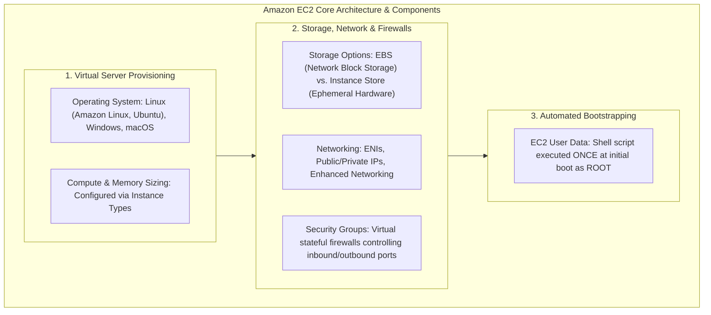
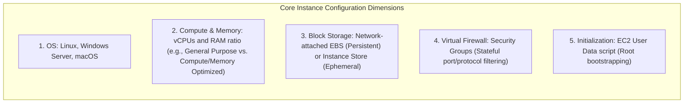
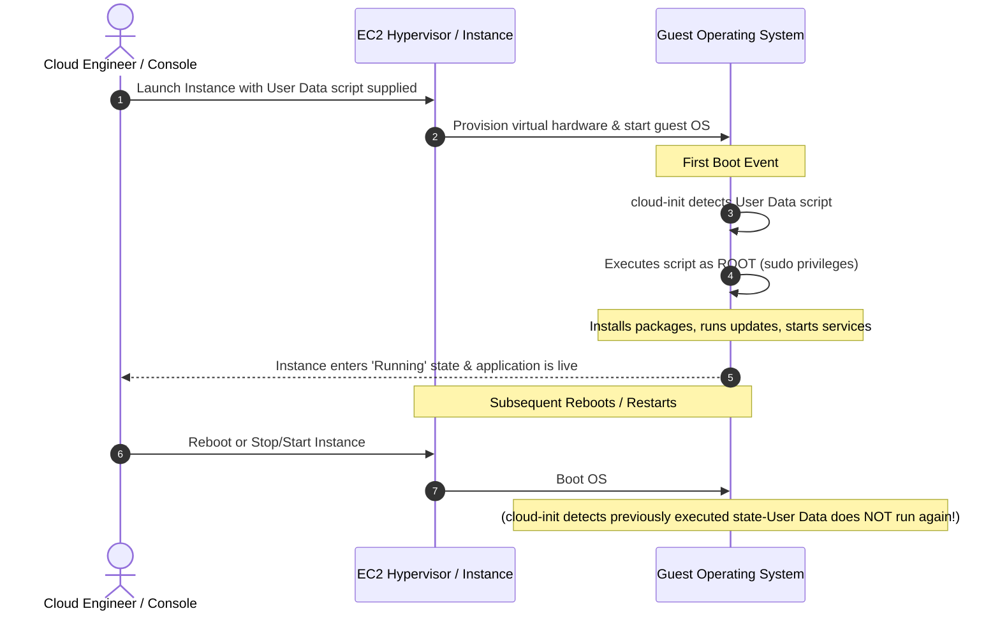

# Amazon Elastic Compute Cloud (Amazon EC2): Infrastructure as a Service, Virtual Hardware & Bootstrapping

---

## Key Takeaways

**Amazon EC2 (Elastic Compute Cloud)** is AWS’s flagship **Infrastructure as a Service (IaaS)** offering. It provides scalable, resizable compute capacity in the cloud, allowing you to launch and configure virtual servers (known as **EC2 Instances**) on demand within minutes.



Key principles to remember for the exam:

- **Service Model:** Amazon EC2 represents **Infrastructure as a Service (IaaS)**. Unlike PaaS or SaaS, you retain full administrative control over the guest operating system, runtime environment, and installed software stacks.
- **Core Hardware Customization:** When provisioning an instance, you define the **Operating System (OS)**, **Compute (vCPU)**, **Memory (RAM)**, **Storage** (network-attached Elastic Block Store vs. physical ephemeral Instance Store), and **Networking/Security Groups**.
- **Bootstrapping via EC2 User Data:** An automated shell script that executes **exactly once during the instance's initial launch**. It runs with elevated **root/sudo privileges** to perform automated initialization tasks (e.g., updating packages, installing dependencies, cloning repositories, or configuring web servers).

---

## Main Discussion

### The Anatomy of an EC2 Instance



| Dimension              | Configurable Options                                                                                                        | Architectural Role in Cloud & AI Workloads                                                                                |
| ---------------------- | --------------------------------------------------------------------------------------------------------------------------- | ------------------------------------------------------------------------------------------------------------------------- |
| **Operating System**   | Linux (Amazon Linux 2023, Ubuntu, Red Hat), Windows, macOS.                                                                 | Hosts the application runtimes, Docker containers, and CUDA drivers for accelerated computing.                            |
| **Compute & Memory**   | Categorized into instance families (e.g., `t3`, `m5`, `c6i`, `r6g`, `p5`, `trn1`).                                          | Balances compute, memory, and specialized hardware (GPUs/Trainium) to match workload requirements.                        |
| **Storage**            | **Amazon EBS** (Network-attached, persistent volumes) or **Instance Store** (Physically attached, temporary block storage). | EBS stores the OS, applications, and persistent model weights; Instance Store serves as high-speed caching/scratch space. |
| **Network & Firewall** | Elastic Network Interfaces (ENIs), Public/Private IPv4, and **Security Groups**.                                            | Controls network reachability. Security Groups enforce inbound/outbound traffic rules by port, protocol, and IP/CIDR.     |
| **Bootstrapping**      | **EC2 User Data** script.                                                                                                   | Automates initial system configuration and package installation without baking a custom AMI beforehand.                   |

---

### Understanding Bootstrapping with EC2 User Data

**Bootstrapping** is the process of executing an automated script to configure an instance as soon as it boots up for the first time.



#### Key Characteristics of User Data

1. **Runs Only Once:** The script executes automatically during the very first boot cycle of the instance. Subsequent reboots or stop/start cycles will not re-execute the script by default.
2. **Elevated Privileges:** The script runs under the `root` administrative user account. Commands do not require `sudo`.
3. **Common Tasks:**
   - Applying security patches (`dnf update -y` or `apt-get update -y`).
   - Installing web servers (Apache, Nginx) or Python runtimes.
   - Downloading application binaries, scripts, or container images from external repositories or Amazon S3.
4. **Boot Time Trade-off:** The more complex the User Data script, the longer the instance will take to transition into a ready/healthy state.

#### Practical Example: Web Server Bootstrap Script

```bash
#!/bin/bash
# Update installed packages
dnf update -y

# Install Apache HTTP Server
dnf install -y httpd

# Start the service and enable it across reboots
systemctl start httpd
systemctl enable httpd

# Write a simple welcome page
echo "<h1>Hello from Amazon EC2 deployed via User Data!</h1>" > /var/www/html/index.html

```

---

### EC2 in the Context of AI & Machine Learning

While high-level managed services like **Amazon Bedrock** provide serverless API access to models, and **Amazon SageMaker** provides fully managed training/inference infrastructure, raw **Amazon EC2** is frequently used when complete low-level hardware control is needed:

- **Accelerated Computing Instances:** Instances equipped with NVIDIA GPUs (such as the `G5` and `P5` families) or AWS custom silicon (such as **AWS Trainium (`Trn1`)** and **AWS Inferentia (`Inf2`)**) can be spun up directly on EC2.
- **Scope 5 Ownership:** As seen in the Generative AI Security Scoping Matrix, training models from scratch on raw EC2 instances represents the highest level of customization and operational ownership.

---

## Exam Guide

### Exam Tips

- **IaaS Definition:** Amazon EC2 is an **Infrastructure as a Service (IaaS)** solution. You manage the guest OS, runtime, and software; AWS manages the physical host hardware, hypervisors, and data centers.
- **EC2 User Data Execution Rules (High Frequency):**
  - Runs **only once** by default during the initial boot.
  - Runs automatically with **root privileges** (no `sudo` required).
  - Used for **bootstrapping** (installing packages, configuring initial services, downloading setup files).
- **Virtual Firewall:** Firewalls for EC2 instances are called **Security Groups**. They operate at the instance level (not the subnet level).
- **Storage Options at a Glance:**
  - **Amazon EBS:** Network-attached virtual disk; persists independently of the instance lifecycle.
  - **Instance Store:** Physically attached disk; provides high I/O throughput but is **ephemeral** (data is lost when the instance is stopped or terminated).

---

### Practice Test

#### Question 1

A systems engineer needs to launch an Amazon EC2 instance that automatically installs software updates, downloads a machine learning model artifact from an S3 bucket, and starts an HTTP inference service as soon as the instance launches for the first time. Which EC2 feature should be used to automate this deployment process?

- [ ] A. Amazon EC2 Instance Store
- [ ] B. EC2 User Data
- [ ] C. AWS Config Rules
- [ ] D. Amazon CloudWatch Synthetics

<details>
<summary>Correct Answer</summary>

- [x] B. EC2 User Data
  - **Explanation:** **EC2 User Data** is designed specifically for bootstrapping instances. It executes shell commands or configuration scripts automatically during the initial launch with root privileges, making it the standard method to install software and start services at launch time.

</details>

---

#### Question 2

An enterprise architect is evaluating cloud computing options for deploying a custom computer vision pipeline. The team requires complete root access to the underlying Linux operating system to install custom kernel drivers, specific CUDA versions, and low-level system libraries. Which AWS service model and offering fulfills these requirements?

- [ ] A. Software as a Service (SaaS) using Amazon Rekognition
- [ ] B. Platform as a Service (PaaS) using Amazon Bedrock
- [ ] C. Infrastructure as a Service (IaaS) using Amazon EC2
- [ ] D. Serverless Functions as a Service (FaaS) using AWS Lambda

<details>
<summary>Correct Answer</summary>

- [x] C. Infrastructure as a Service (IaaS) using Amazon EC2
  - **Explanation:** **Amazon EC2** is an **Infrastructure as a Service (IaaS)** offering that provides full administrative and root access to the guest operating system, enabling custom installations of kernel-level drivers, low-level software stacks, and dependencies.

</details>

---
