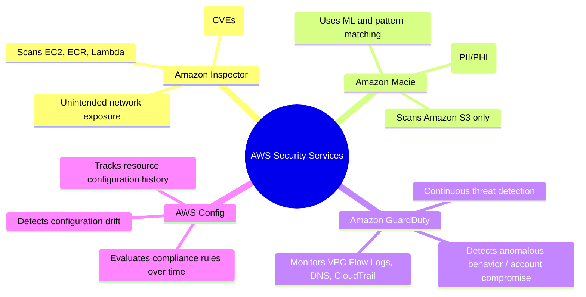

# Amazon Inspector: Automated Vulnerability Management, CVE Scanning & Workload Security

---

## Key Takeaways

**Amazon Inspector** is an automated vulnerability management service that continually scans AWS workloads for software vulnerabilities (Common Vulnerabilities and Exposures / CVEs) and unintended network exposure.

<div className= "grid grid-cols-1 md:grid-cols-3">

<div className= "col-span-2">
```mermaid
flowchart TD
    subgraph WorkloadTargets [1. Supported Workload Targets]
        direction TB
        EC2["Amazon EC2 Instances<br>(Scanned via AWS Systems Manager / SSM Agent)"]
        ECR["Amazon ECR Container Images<br>(Scanned on push & continuously for new CVEs)"]
        Lambda["AWS Lambda Functions<br>(Scanned on deployment: function code & dependencies)"]
    end

    subgraph InspectorCore [2. Continuous Assessment Engine]
        CVE_DB["National Vulnerability Database (NVD) & CVE Feeds"]
        NetReach["Network Reachability Analysis (EC2 network exposure)"]
        RiskScore["Inspector Risk Score (Context-based severity rating)"]

        CVE_DB & NetReach --> RiskScore
    end

    subgraph FindingsDestination [3. Aggregation, Alerting & Automation]
        direction TB
        SecHub["AWS Security Hub (Centralized posture & compliance dashboard)"]
        EventBridge["Amazon EventBridge (Real-time finding events)"]
        Automation["Automated Remediation (Lambda, SSM Runbooks, Jira/Slack)"]

        SecHub --- EventBridge --> Automation
    end

    WorkloadTargets --> InspectorCore
    InspectorCore --> FindingsDestination

````
</div>


</div>

- **Core Purpose:** Automated security assessment scanning for **software vulnerabilities (CVEs)** and **unintended network accessibility**.
- **Three Target Workloads:**
  1. **Amazon EC2:** Uses the **AWS Systems Manager (SSM) Agent** to inventory installed packages and OS-level vulnerabilities, combined with agentless network path analysis.
  2. **Amazon ECR (Elastic Container Registry):** Scans container images (e.g., custom Docker containers for model training or inference) upon push and continuously as new CVEs are discovered.
  3. **AWS Lambda:** Evaluates serverless application code and packaged third-party dependencies as functions are deployed and updated.
- **Continuous & Event-Driven:** Scans occur automatically upon workload changes (e.g., new container pushed, instance launched) and re-evaluate automatically whenever the central CVE database is updated.
- **Integrations:** Findings are sent to **AWS Security Hub** for centralized visibility and to **Amazon EventBridge** to trigger automated alerts or patching runbooks.

---

## Main Discussion

### Supported Workloads & Assessment Mechanisms

```mermaid
flowchart LR
    subgraph TargetWorkloads [Scanned Workloads]
        direction TB
        EC2_Node["EC2 Virtual Machine"]
        ECR_Repo["ECR Container Image"]
        Lambda_Func["Lambda Function"]
    end

    subgraph ScanMechanisms [Inspector Capabilities]
        direction TB
        SSM["SSM Agent + Network Reachability"]
        ImageScan["Static Container Layer Inspection"]
        DepScan["Code & Dependency Analysis"]
    end

    subgraph FindingOutput [Outcome]
        Findings["Aggregated Vulnerability Findings + Risk Score"]
    end

    EC2_Node --> SSM --> Findings
    ECR_Repo --> ImageScan --> Findings
    Lambda_Func --> DepScan --> Findings
````

| Workload Target             | Assessment Mechanism                                             | Primary Vulnerability Focus                                              | Role in AI/ML Systems                                                               |
| --------------------------- | ---------------------------------------------------------------- | ------------------------------------------------------------------------ | ----------------------------------------------------------------------------------- |
| **Amazon EC2 Instances**    | AWS Systems Manager (SSM) Agent + Network reachability analysis. | OS-level package CVEs and unintended open network ports.                 | Secures custom GPU/Trainium training hosts and self-hosted model hosting instances. |
| **Amazon ECR Repositories** | Image scanning on push + continuous rescanning.                  | Outdated base OS packages, libraries, and container CVEs.                | Scans custom SageMaker training and inference Docker containers before deployment.  |
| **AWS Lambda Functions**    | Analyzes runtime dependencies and deployed packages.             | Vulnerabilities in Python/Node.js packages and application dependencies. | Validates serverless prompt-preprocessing and API Gateway integration functions.    |

---

### Understanding the Inspector Risk Score

Unlike raw CVE databases that provide a generic Common Vulnerability Scoring System (CVSS) rating, Amazon Inspector calculates a contextual **Inspector Risk Score**:

```mermaid
flowchart TD
    CVSS["Base CVSS Score (Standard Industry Severity)"]
    NetExp["Network Exposure Context (Is the instance internet-facing?)"]
    Exploit["Active Exploit Availability (Are public exploits circulating?)"]

    CVSS & NetExp & Exploit --> RiskEngine["Inspector Risk Score Engine"]
    RiskEngine --> AdjustedScore["Contextual Inspector Risk Score (1.0 to 10.0)"]
```

- **Context-Driven Prioritization:** If a vulnerability has a high theoretical CVSS score but exists on an EC2 instance isolated in a private subnet with no internet route, Inspector lowers the score.
- Conversely, if an exploit is actively observed in the wild and the instance is directly reachable over the public internet, the score is elevated to prioritize immediate remediation.

---

### Service Disambiguation: Inspector vs. Macie vs. GuardDuty vs. Config

Because security services are heavily tested on AWS foundational exams, distinguishing their distinct scopes is vital:



| AWS Service          | Target Scope                                       | Primary Detection Objective                            | Typical Example                                                  |
| -------------------- | -------------------------------------------------- | ------------------------------------------------------ | ---------------------------------------------------------------- |
| **Amazon Inspector** | EC2, ECR, Lambda                                   | **Software vulnerabilities (CVEs)** and package flaws. | Finding an outdated OpenSSL library in a container image.        |
| **Amazon Macie**     | Amazon S3                                          | **Sensitive data / PII** discovery.                    | Finding unmasked credit card numbers in an S3 training bucket.   |
| **Amazon GuardDuty** | Account & Network logs (CloudTrail, VPC Flow, DNS) | **Active threats** and unauthorized behavior.          | Detecting crypto-mining activity or compromised IAM access keys. |
| **AWS Config**       | AWS resource configurations                        | **Configuration drift** and compliance baselines.      | Verifying that S3 buckets have encryption at rest enabled.       |

---

## Exam Guide

### Exam Tips

- **Target Workload Rule (High Frequency):** Amazon Inspector scans exactly three workload types:
  1. **Amazon EC2 instances**
  2. **Amazon ECR container images**
  3. **AWS Lambda functions**
- _It does NOT scan S3 bucket contents for PII (that is Macie)._
- **Detection Focus:** Focuses on **known software vulnerabilities (CVEs)** and **unintended network exposure**.
- **SSM Agent Dependency:** For EC2 scanning, Inspector requires instances to be managed by **AWS Systems Manager (SSM)** via the SSM Agent.
- **Continuous Rescanning:** When a new CVE is published to the national vulnerability database, Inspector automatically evaluates your existing inventory without requiring manual scan triggers.
- **Reporting Destinations:** Findings are centralized in **AWS Security Hub** and emitted to **Amazon EventBridge** for automated alerting or remediation.

---

### Practice Test

#### Question 1

A machine learning operations (MLOps) team packages custom deep learning algorithms into Docker containers and pushes them to Amazon Elastic Container Registry (Amazon ECR). The security team requires an automated solution that continuously inspects these container images for known software vulnerabilities and Common Vulnerabilities and Exposures (CVEs). Which AWS service should be used?

- [ ] A. Amazon Macie
- [ ] B. AWS CloudTrail
- [ ] C. Amazon Inspector
- [ ] D. AWS Trusted Advisor

<details>
<summary>Correct Answer</summary>

- [x] C. Amazon Inspector
  - **Explanation:** **Amazon Inspector** natively integrates with Amazon ECR to provide automated, continuous vulnerability assessments of container images, scanning for known software vulnerabilities (CVEs) on push and whenever new CVE definitions are published.

</details>

---

#### Question 2

An AI practitioner is reviewing security requirements for a fleet of Amazon EC2 instances hosting open-source LLM inference endpoints. The compliance department needs to identify whether any instance operating systems contain known package vulnerabilities or open, unintended network paths to the internet. Which service provides automated vulnerability assessments for this fleet?

- [ ] A. Amazon Inspector
- [ ] B. Amazon GuardDuty
- [ ] C. AWS Config
- [ ] D. AWS Artifact

<details>
<summary>Correct Answer</summary>

- [x] A. Amazon Inspector
  - **Explanation:** **Amazon Inspector** runs automated security assessments on Amazon EC2 instances to detect software package vulnerabilities (CVEs) and analyze network reachability to identify unintended exposure.

</details>

---

#### Question 3

A healthcare company is deploying AI systems on AWS to manage patient data and improve diagnostic accuracy. To ensure compliance with strict healthcare regulations and to enhance the security of their applications, the company's security team is looking for an AWS service that can automate security assessments.

What do you recommend?

- [ ] A. Amazon Inspector
- [ ] B. AWS Config
- [ ] C. AWS Artifact
- [ ] D. AWS Audit Manager

<details>
<summary>Correct Answer</summary>

- [x] A. Amazon Inspector
  - **Explanation:** Amazon Inspector is an automated security assessment service that helps improve the security and compliance of applications deployed on AWS. It automatically assesses applications for exposure, vulnerabilities, and deviations from best practices, making it an essential tool for ensuring the security of AI systems.

<details>
<summary>Incorrect Answers</summary>

- [ ] B. AWS Config
  - **Explanation:** AWS Config is a service that enables you to assess, audit, and evaluate the configurations of your AWS resources. While it is important for governance and compliance monitoring, it does not perform automated security assessments of applications.
- [ ] C. AWS Artifact
  - **Explanation:** AWS Artifact provides on-demand access to AWS’s compliance reports and online agreements. It helps with compliance documentation and agreements rather than performing automated security assessments of applications.
- [ ] D. AWS Audit Manager
  - **Explanation:** AWS Audit Manager helps you continuously audit your AWS usage to simplify how you assess risk and compliance with regulations and industry standards. It focuses on audit evidence collection and compliance reporting rather than automated security vulnerability assessments.

</details>

Reference:

- https://aws.amazon.com/inspector/features/

</details>

---
