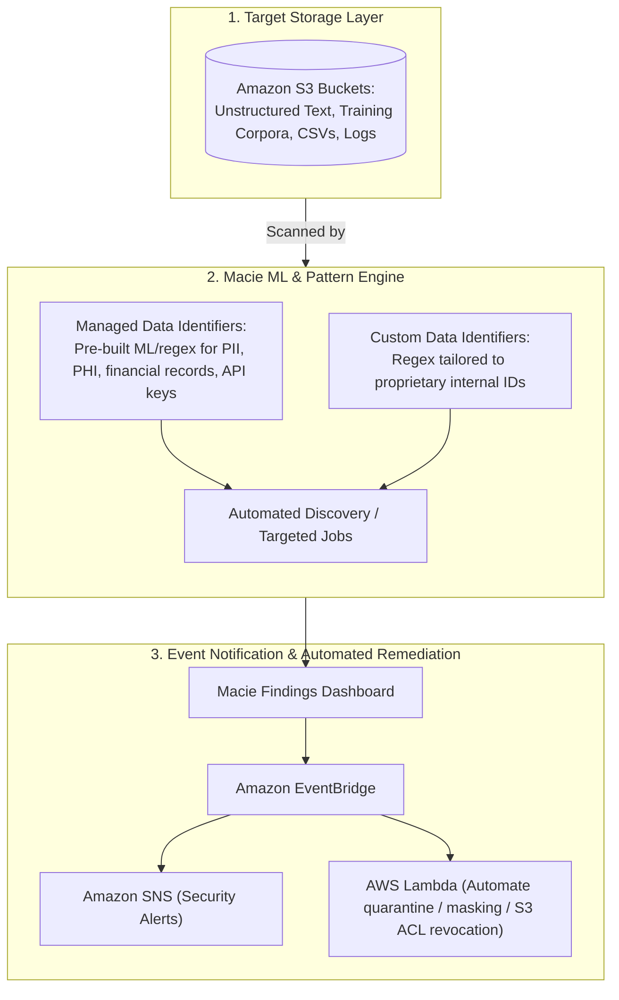
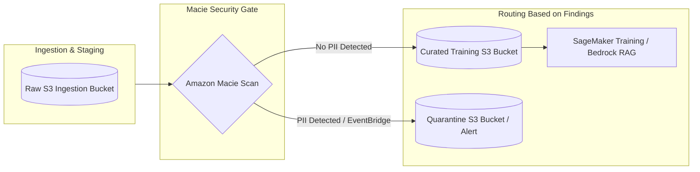
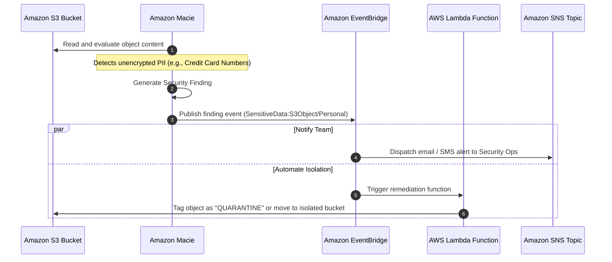

# Amazon Macie: Sensitive Data Discovery, PII Detection & Data Governance for AI/ML Pipelines

---

## Key Takeaways

**Amazon Macie** is a fully managed data security and data privacy service that uses **machine learning and pattern matching** to automatically discover, classify, and protect sensitive data stored in **Amazon S3**.

- **Core Purpose:** Detects sensitive data, specifically **Personally Identifiable Information (PII)** and Protected Health Information (PHI), within Amazon S3 buckets.
- **Underlying Mechanism:** Combines pre-trained **machine learning models** with regular-expression pattern matching (Managed Data Identifiers).
- **AI/ML Relevance:** Acts as a data governance gatekeeper before training. Inspects raw datasets destined for **Amazon SageMaker** training jobs or **Amazon Bedrock** fine-tuning/RAG pipelines to prevent accidental ingestion of sensitive customer information.
- **Event-Driven Integration:** Emits findings via **Amazon EventBridge**, allowing downstream automation via **AWS Lambda** (e.g., auto-quarantining unmasked objects) or **Amazon SNS** (notifying compliance officers).

---

## Main Discussion

### The Role of Amazon Macie in AI Data Governance

In enterprise machine learning workflows, training models or building RAG indexes on unvetted data poses major regulatory risks (e.g., GDPR, HIPAA, PCI-DSS) and potential security leaks (e.g., model weight extraction of private customer records).

1. **Pre-Training Scrubbing:** Before datasets are passed into model pre-training, fine-tuning, or embedding pipelines, Macie audits the target S3 buckets.
2. **Preventing Memorization Risks:** If foundation models are trained or fine-tuned on raw PII (such as credit card numbers, social security numbers, or private medical details), those models can inadvertently reproduce that sensitive information when prompted by end users.
3. **Continuous Inventory:** Beyond one-time evaluation jobs, Macie provides automated sensitive data discovery across your entire AWS account or AWS Organizations hierarchy.

---

### Macie Discovery Mechanisms: Managed vs. Custom Data Identifiers

| Identifier Type              | Detection Technique                                                                  | Typical Data Matches                                                                                                                      |
| ---------------------------- | ------------------------------------------------------------------------------------ | ----------------------------------------------------------------------------------------------------------------------------------------- |
| **Managed Data Identifiers** | Built-in ML classifiers and pattern-matching rules maintained by AWS.                | Passport numbers, Social Security Numbers (SSNs), driver's license IDs, credit card numbers, AWS secret keys, private cryptographic keys. |
| **Custom Data Identifiers**  | User-defined regular expressions (regex), maximum match distances, and ignore words. | Proprietary employee IDs, customer account numbers, custom medical record format strings, project code names.                             |

---

### Event-Driven Alerting & Remediation Workflow

Macie does not modify or delete objects in Amazon S3 directly. Instead, it generates **Findings** and integrates with AWS event-driven services:

- **Findings:** Detailed JSON reports specifying the S3 bucket, object key, sensitive data type, count of occurrences, and risk severity score.
- **Amazon EventBridge:** Captures Macie finding events in real time and routes them according to defined rules.
- **AWS Lambda & Amazon SNS:** Lambda functions can automatically move violating files to an isolated quarantine bucket, apply restrictive bucket policies, or invoke data-masking scripts before data scientists access the dataset.

---

## Exam Guide

### Exam Tips

- **Core Association (High Frequency):** Whenever an exam question mentions **discovering PII or sensitive data in Amazon S3**, the answer is almost certainly **Amazon Macie**.
- **Scope Limitation:** Amazon Macie evaluates data **specifically in Amazon S3**. It does not natively scan relational databases (like Amazon RDS) or local EBS volumes directly without prior export to S3.
- **AI/ML Governance Use Case:** Used in the data preparation and compliance validation phases of MLOps to prevent sensitive customer details from entering training sets or vector databases used in RAG.
- **Integration Pairings:** Macie findings $\rightarrow$ **Amazon EventBridge** $\rightarrow$ **Amazon SNS** (alerts) or **AWS Lambda** (automated remediation).

---

### Practice Test

#### Question 1

An organization is preparing to ingest historical customer email threads from Amazon S3 to fine-tune an Amazon Bedrock foundation model. The compliance department mandates that all source buckets must be inspected to ensure no unmasked credit card numbers or government identity numbers are included in the training corpus. Which AWS service should the organization use to meet this requirement?

- [ ] A. Amazon Inspector
- [ ] B. Amazon Macie
- [ ] C. AWS Artifact
- [ ] D. AWS Shield

Correct Answer

- [x] B. Amazon Macie
  - **Explanation:** **Amazon Macie** is a fully managed data security and privacy service that uses machine learning and pattern matching to discover, classify, and protect sensitive data (such as PII, credit card numbers, and national IDs) stored in Amazon S3.

---

#### Question 2

A financial services firm wants to trigger an automated notification to its security team whenever sensitive customer PII is detected in an S3 analytics bucket. How can this automated alerting workflow be achieved?

- [ ] A. Configure Amazon Macie to send findings to Amazon EventBridge, which routes notifications to an Amazon SNS topic
- [ ] B. Create an Amazon CloudWatch Synthetics canary that monitors S3 bucket size
- [ ] C. Enable AWS CloudTrail Insights and forward logs to AWS Artifact
- [ ] D. Configure an S3 Lifecycle rule to transition objects to S3 Glacier Deep Archive upon detection

Correct Answer

- [x] A. Configure Amazon Macie to send findings to Amazon EventBridge, which routes notifications to an Amazon SNS topic
  - **Explanation:** Amazon Macie publishes findings directly to **Amazon EventBridge**. EventBridge rules can match Macie finding events and forward them to **Amazon SNS** to alert security personnel, or to **AWS Lambda** for automated remediation.

---
