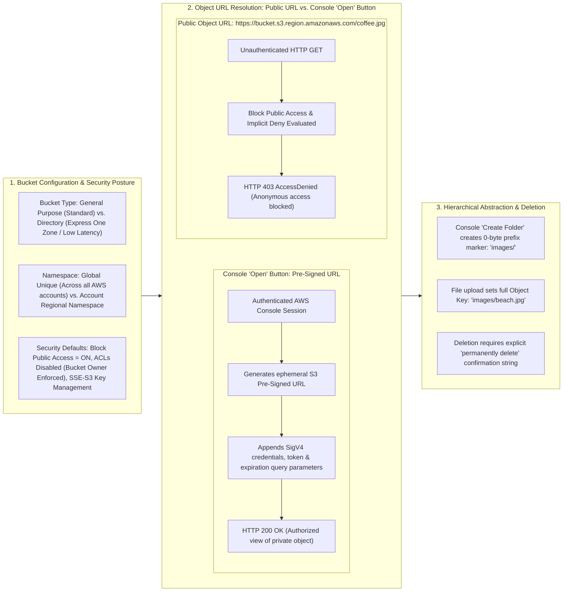
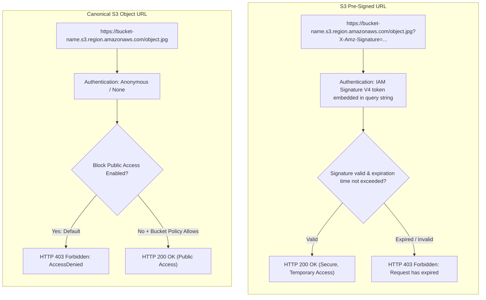

# Hands-On Lab: Amazon S3 Bucket Provisioning, Object Operations, Pre-Signed URLs & Public Access Boundaries

---

## Key Takeaways

Managing **Amazon S3** hands-on demonstrates how buckets, prefixes, and access mechanisms interact in production. By default, Amazon S3 enforces a strict security posture through **Block Public Access** and disabled Access Control Lists (ACLs), making newly uploaded objects private to the outside world.

- **Default Security Baseline:** New general-purpose buckets automatically enable **Block Public Access** and **Server-Side Encryption with Amazon S3 managed keys (SSE-S3)**, while disabling legacy Object ACLs (`Bucket owner enforced`).
- **The Public URL vs. Pre-Signed URL Paradox:**
  - Accessing an object via its canonical **Public Object URL** results in an **HTTP 403 `AccessDenied**` response because public read access is blocked.
  - Clicking the console's **Open** button works seamlessly because AWS generates a temporary **Pre-Signed URL** containing Signature Version 4 (SigV4) authentication tokens tied to your active login session.
- **Prefixes as Folders:** Creating a folder in the S3 console generates a 0-byte object key ending in a forward slash (e.g., `images/`), providing a familiar directory-style UI abstraction over a flat key-value store.
- **Deletion Safeguards:** Deleting non-empty prefixes or objects via the console requires typing the confirmation phrase `permanently delete` to prevent accidental data loss.

---

## 2. Hands-On Workflow: Bucket Creation to Object Retrieval

1. **Initialize General Purpose S3 Bucket:**
   - Open the AWS Management Console and search for **S3**.
   - Click **Create bucket**.
   - **AWS Region:** Select your desired deployment region (e.g., `eu-west-1` Ireland or `ap-southeast-2` Sydney).
   - **Bucket type:** Keep **General purpose** selected. (Note that _Directory buckets_ are reserved for ultra-low latency S3 Express One Zone workloads).
   - **Bucket naming strategy:**
   - Under **Global namespace**, bucket names must be globally unique across all AWS accounts worldwide.
   - Alternatively, selecting **Account Regional namespace** automatically appends your account ID and region suffix (`-<account-id>-<region>-an`), guaranteeing collision-free names.
   - Enter an available name (e.g., `enterprise-ai-datasets-v101`).
2. **Review Security & Encryption Defaults:**
   - Inspect the baseline security configurations before finalizing creation:
   - **Object Ownership:** Keep **ACLs disabled (recommended)** selected. All objects will be owned exclusively by the bucket owner.
   - **Block Public Access:** Verify **Block all public access** remains enabled to prevent unauthorized internet exposure.
   - **Bucket Versioning:** Leave disabled for initial testing.
   - **Default encryption:** Select **Server-side encryption with Amazon S3 managed keys (SSE-S3)** and ensure the **Bucket Key** optimization is enabled to reduce KMS request costs when applicable.
   - Click **Create bucket**.
3. **Upload an Object & Inspect the Flat Key:**
   - Locate the created bucket in the global bucket list and click its name:
   - Click **Upload** $\rightarrow$ **Add files**.
   - Select a local image file (e.g., `coffee.jpg`).
   - Review the target destination path (`s3://<bucket-name>/coffee.jpg`).
   - Click **Upload**, verify completion, and return to the bucket overview.
4. **Analyze AccessDenied vs. Pre-Signed Console Open:**
   - Click on `coffee.jpg` to inspect its object properties:
   - **Test 1 (Canonical Public URL):** Locate the **Object URL** field (`https://<bucket-name>.s3.<region>[.amazonaws.com/coffee.jpg](https://.amazonaws.com/coffee.jpg)`). Copy and paste this URL into a separate browser tab.
     - _Result:_ Returns an XML payload with `<Code>AccessDenied</Code>` because anonymous public requests are rejected by default.
   - **Test 2 (Console 'Open' Button):** Return to the S3 console and click the **Open** button in the top-right corner.
     - _Result:_ The image loads successfully in a new tab.
     - _Inspection:_ Inspect the browser's address bar. Notice that query parameters such as `X-Amz-Algorithm=AWS4-HMAC-SHA256`, `X-Amz-Credential`, `X-Amz-Date`, `X-Amz-Expires`, and `X-Amz-Signature` are appended to the URL. This confirms the link is a **Pre-Signed URL** generated using your authenticated console credentials.
5. **Create Nested Prefixes (Folders) and Manage Deletions:**
   - Return to the bucket root:
   - Click **Create folder**, set the folder name to `images`, and click **Create folder**.
   - Navigate into the `images/` prefix and click **Upload** $\rightarrow$ **Add files** to upload a second file (e.g., `beach.jpg`).
   - The destination key resolves to `s3://<bucket-name>/images/beach.jpg`.
   - Navigate back to the bucket root, select the `images` folder, and click **Delete**.
   - Notice the confirmation prompt: type `permanently delete` into the input field and click **Delete objects** to confirm removal of the prefix and nested files.

---

## Deep Dive: Canonical Object URL vs. S3 Pre-Signed URL

| Dimension                 | Canonical Object URL                                                                                               | S3 Pre-Signed URL                                                                                                                                  |
| ------------------------- | ------------------------------------------------------------------------------------------------------------------ | -------------------------------------------------------------------------------------------------------------------------------------------------- |
| **URL Structure**         | Simple, static REST endpoint: `https://<bucket>.s3.<region>[.amazonaws.com/](https://.amazonaws.com/)<key>`        | Complex query string: Appends `X-Amz-Signature`, `X-Amz-Credential`, `X-Amz-Expires`, and `X-Amz-Security-Token`.                                  |
| **Authentication Source** | None (evaluated as anonymous user) unless explicitly signed via SDK/CLI.                                           | Inherits the permissions of the IAM user or role that generated the link.                                                                          |
| **Access Requirements**   | Requires bucket public access to be unblocked and an S3 Bucket Policy allowing `s3:GetObject` to `Principal: "*"`. | Bypasses public access restrictions; valid as long as the generating identity has access and the URL has not expired.                              |
| **Primary AI Use Case**   | Serving public model documentation or open asset libraries.                                                        | Granting external users or web clients temporary, secure access to download generated output files or upload data without sharing IAM credentials. |

---

## Exam Guide

### Exam Tips

- **Default S3 Security Baseline:** Newly provisioned S3 buckets are **private by default**. **Block Public Access** is enabled, and all incoming anonymous requests are met with an implicit deny (`AccessDenied`).
- **Console "Open" Button Mechanism:** When you click **Open** in the S3 console, you are not accessing a public endpoint. S3 dynamically generates a short-lived **Pre-Signed URL** using the active console session's IAM credentials.
- **Pre-Signed URL Use Cases (High Exam Relevance):**
  - Used to grant temporary read or write permissions to users or applications that do not have direct AWS IAM credentials.
  - Time-limited: Configured with an explicit expiration window.
- **Directory Buckets vs. General Purpose Buckets:**
  - **General Purpose Buckets:** The standard storage model for virtually all application, data lake, and backup workloads.
  - **Directory Buckets (S3 Express One Zone):** Designed for single-digit millisecond latency and high request rates, commonly used to accelerate compute-intensive AI model training clusters.
- **Account Regional Namespace vs. Global Namespace:**
  - **Global Namespace:** Names must be globally unique across all AWS accounts in all regions.
  - **Account Regional Namespace:** Names are scoped to your specific AWS account and Region, using an automated suffix to prevent naming conflicts.

---

### Practice Test

#### Question 1

A data engineering team uploads proprietary dataset files into an Amazon S3 bucket with default settings (Block Public Access enabled, ACLs disabled). When an external partner attempts to access a dataset using its direct public object URL (`[https://my-data-bucket.s3.us-east-1.amazonaws.com/dataset.csv](https://my-data-bucket.s3.us-east-1.amazonaws.com/dataset.csv)`), they receive an `AccessDenied` error. What is the most secure method to grant the external partner temporary read access to this specific file without altering the bucket's public access settings or provisioning an IAM user?

- [ ] A. Disable Block Public Access on the bucket and attach an S3 Bucket Policy granting public read access
- [ ] B. Generate an S3 Pre-Signed URL with a defined expiration time and share it with the partner
- [ ] C. Enable S3 Bucket Versioning and configure Cross-Region Replication
- [ ] D. Convert the general purpose bucket into an S3 Express One Zone directory bucket

Correct Answer

- [x] B. Generate an S3 Pre-Signed URL with a defined expiration time and share it with the partner
  - **Explanation:** An **S3 Pre-Signed URL** grants temporary read or write access to an S3 object using the permissions of the IAM identity that generates the URL. This allows external parties to download specific private objects securely without opening the bucket to the public or creating dedicated IAM credentials.

---

#### Question 2

An engineer creates an S3 general purpose bucket and attempts to name it `training-data`. The AWS Management Console displays an error stating that the bucket name already exists, even though the engineer has no buckets with that name in their account. What is the root cause of this error, and how can the engineer resolve it while keeping the base name?

- [ ] A. The bucket name violates naming syntax by containing a hyphen; resolve it by replacing hyphens with underscores
- [ ] B. The global namespace requires bucket names to be unique across all AWS accounts worldwide; resolve it by selecting the Account Regional namespace or choosing a globally unique name
- [ ] C. General purpose buckets must be named after an existing IAM user group; resolve it by creating an IAM group named `training-data`
- [ ] D. Bucket names must end with the `-s3alias` suffix; resolve it by appending the suffix to the name

Correct Answer

- [x] B. The global namespace requires bucket names to be unique across all AWS accounts worldwide; resolve it by selecting the Account Regional namespace or choosing a globally unique name
  - **Explanation:** Under the traditional **Global namespace**, S3 bucket names must be globally unique across every AWS account in all commercial regions. If another AWS customer has already claimed `training-data`, the creation request will fail. To resolve this, the engineer can choose a globally unique name (e.g., adding unique prefixes/dates) or switch to the **Account Regional namespace**, which automatically appends an account-and-region-specific suffix to guarantee uniqueness.

---
