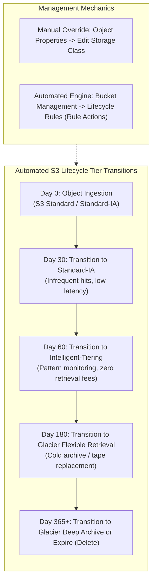
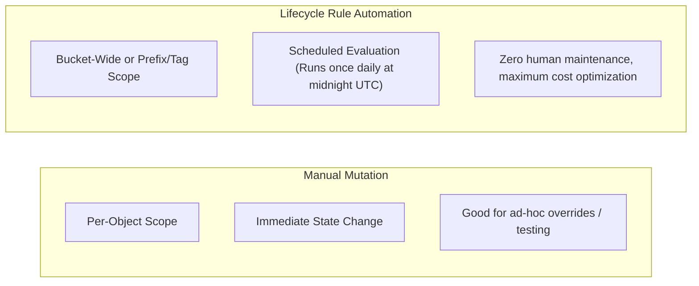

# Hands-On Lab: Amazon S3 Storage Class Transitions & Lifecycle Rules Automation

---

## Key Takeaways

Storage classes aren’t locked in stone when you upload an object—you can manually swap them on the fly or set up **S3 Lifecycle Rules** to automate the whole pipeline so you’re never overpaying for cold data.

Here’s the key takeaways:

- **Manual Re-tiering:** You can head into any object’s properties anytime and switch classes (e.g., flipping from `Standard-IA` to `One Zone-IA` or `Glacier Instant Retrieval`) without re-uploading the file.
- **S3 Lifecycle Rules:** The real cheat code. Under the **Management** tab of a bucket, you define rules (like `DemoRule`) that trigger automatic transitions based on days elapsed since object creation.
- **Transition Workflows:** You can cascade objects down the temperature ladder—e.g., Day 0 Standard $\rightarrow$ Day 30 Standard-IA $\rightarrow$ Day 60 Intelligent-Tiering $\rightarrow$ Day 180 Glacier Flexible Retrieval $\rightarrow$ Expiration/Permanent Deletion.
- **Deprecated Classes:** If you spot **Reduced Redundancy Storage (RRS)** in the console, ignore it. It’s an old deprecated tier with lower durability (99.99%) that AWS phased out in favor of S3 Standard / One Zone-IA.

---

## Hands-On Lab: Manual Modification & Lifecycle Rule Configuration

1. **Create a Test Bucket & Upload with Explicit Storage Class:**
   - In the Amazon S3 console, click **Create bucket**.
   - Name the bucket something unique (e.g., `s3-storage-classes-lab-<your-id>`).
   - Hit **Create bucket** and open it up.
   - Click **Upload** $\rightarrow$ **Add files** and select your test asset (like `coffee.jpg`).
   - Expand **Properties** on the upload page, scroll to **Storage class**, and explicitly select **Standard-IA** instead of the default Standard.
   - Hit **Upload**.
2. **Verify and Manually Modify Storage Class:**
   - Navigate back to the bucket objects list:
   - Click on `coffee.jpg` and scroll down to **Storage class**. It'll say `Standard-IA`.
   - Click **Edit** under storage class options.
   - Switch it to **One Zone-IA** (or **Glacier Instant Retrieval**).
   - Hit **Save changes**. The object tier updates immediately without needing to re-upload.
3. **Configure Automated S3 Lifecycle Rules:**
   - Back out to the bucket root and click the **Management** tab:
   - Scroll down to **Lifecycle rules** and hit **Create lifecycle rule**.
   - **Lifecycle rule name:** Name it `DemoLifecycleRule`.
   - **Rule scope:** Select **Apply to all objects in the bucket** (acknowledge the warning prompt).
   - **Lifecycle rule actions:** Check **Move current versions of objects between storage classes**.
4. **Define the Cascading Transition Pipeline:**
   - Build your tiered transitions:
   - **Transition 1:** Select **Standard-IA** and enter `30` days.
     - Hit **Add transition**.
   - **Transition 2:** Select **Intelligent-Tiering** and enter `60` days.
     - Hit **Add transition**.
   - **Transition 3:** Select **Glacier Flexible Retrieval** and enter `180` days.
   - Review the transition timeline chart at the bottom and click **Create rule**.
   - S3 will now automatically evaluate and move your objects according to this timeline behind the scenes.

---

## Storage Class Configuration Comparison

| Dimension              | Manual Class Selection                             | S3 Lifecycle Rules                                                                                         |
| ---------------------- | -------------------------------------------------- | ---------------------------------------------------------------------------------------------------------- |
| **Operational Effort** | High (manual point-and-click or ad-hoc CLI calls). | Zero (set it once and let AWS run it on autopilot).                                                        |
| **Granularity**        | Single individual object keys.                     | Entire bucket, specific key prefixes (e.g., `logs/`), or object tags.                                      |
| **Timing**             | Instantaneous upon API execution.                  | Evaluated asynchronously (transitions take effect based on object age).                                    |
| **Supported Actions**  | Class switching only.                              | Transitions across classes **plus automated expiration (deletion)** of old objects or noncurrent versions. |

---

## Exam Guide

### Exam Tips

- **Lifecycle Rule Scope:** S3 Lifecycle configuration rules can apply to:
  1. **All objects in the bucket**.
  2. A subset of objects filtered by **Prefix** (e.g., `training-data/checkpoints/`).
  3. A subset of objects filtered by **Object Tags** (e.g., `Environment: Dev`).
- **Lifecycle Actions:** There are two main lifecycle actions:
  - **Transition Actions:** Moving objects from one storage class to a cooler one (e.g., Standard $\rightarrow$ Standard-IA $\rightarrow$ Glacier).
  - **Expiration Actions:** Permanently deleting objects after a certain number of days to save storage costs.
- **Cascading Rules Constraint:** Transitions must flow from warmer tiers to cooler tiers. You cannot use a lifecycle rule to move an object from Glacier back to S3 Standard.
- **Reduced Redundancy Storage (RRS):** If an exam question asks about low-cost, recreatable data storage, **do not pick RRS**—it’s deprecated. The modern answer is **S3 One Zone-IA**.

---

### Practice Test

#### Question 1

A computer vision team stores raw video training files in an Amazon S3 bucket. The data must be immediately accessible with high throughput for the first 30 days of model experimentation. Between days 31 and 90, the data is rarely accessed but still requires rapid access when needed. After 90 days, the files must be archived for compliance and retained for at least 3 years, with retrieval times of several hours being acceptable. What is the most cost-effective and operationally automated way to manage this data?

- [ ] A. Manually edit the storage class of each object on Day 30 and Day 90 using the S3 console
- [ ] B. Configure an S3 Lifecycle rule to transition objects to S3 Standard-IA after 30 days and to S3 Glacier Flexible Retrieval after 90 days
- [ ] C. Upload all objects directly into S3 Glacier Deep Archive on Day 1
- [ ] D. Write a nightly AWS Lambda function that copies objects between separate S3 buckets

Correct Answer

- [x] B. Configure an S3 Lifecycle rule to transition objects to S3 Standard-IA after 30 days and to S3 Glacier Flexible Retrieval after 90 days
  - **Explanation:** An **S3 Lifecycle rule** automates transitions across tiers without operational overhead. Transitioning to **S3 Standard-IA** at 30 days provides lower storage costs with rapid access, and moving to **S3 Glacier Flexible Retrieval** at 90 days optimizes costs for long-term archival where multi-hour retrieval times are acceptable.

---

#### Question 2

An AI startup wants to automatically delete intermediate checkpoint files and temporary CSV exports stored in an S3 bucket 14 days after they are created to avoid unnecessary storage costs. Which S3 feature should the team configure?

- [ ] A. S3 Object Lock with legal hold
- [ ] B. An S3 Lifecycle rule with an expiration action set to 14 days
- [ ] C. S3 Cross-Region Replication (CRR)
- [ ] D. S3 Intelligent-Tiering Archive Instant Access

Correct Answer

- [x] B. An S3 Lifecycle rule with an expiration action set to 14 days
  - **Explanation:** An **S3 Lifecycle rule** supports **Expiration actions**, which automatically and permanently delete objects after a specified number of days (in this case, 14 days) to prevent storage bloat and reduce costs.

---
