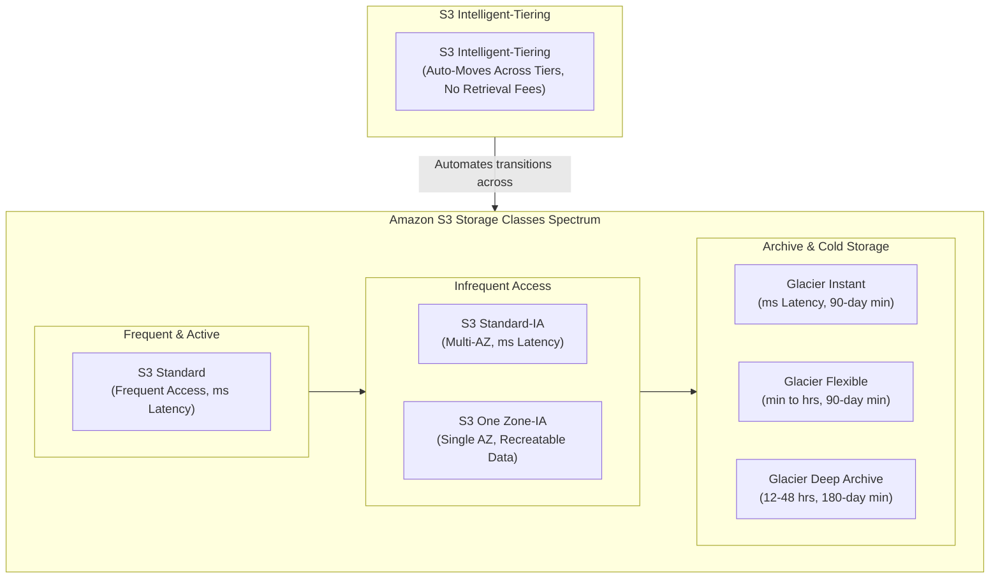
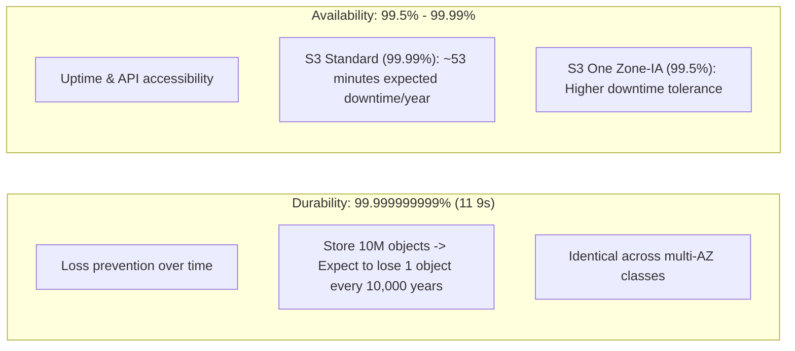
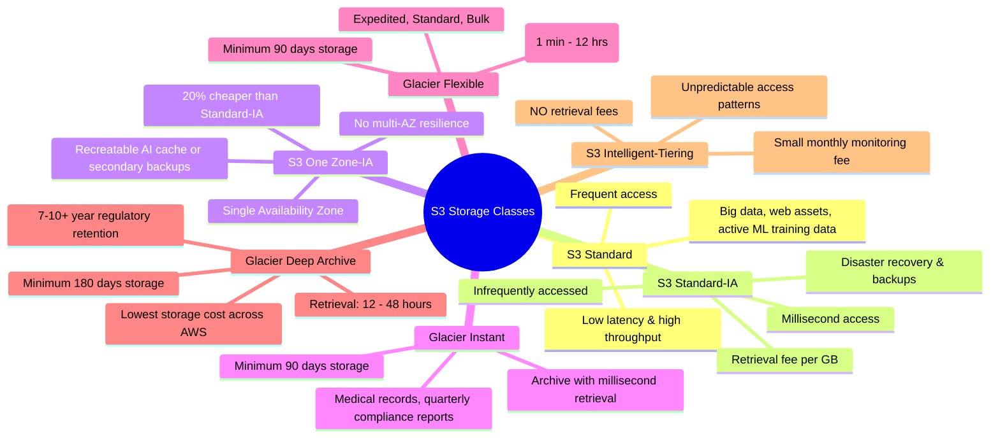
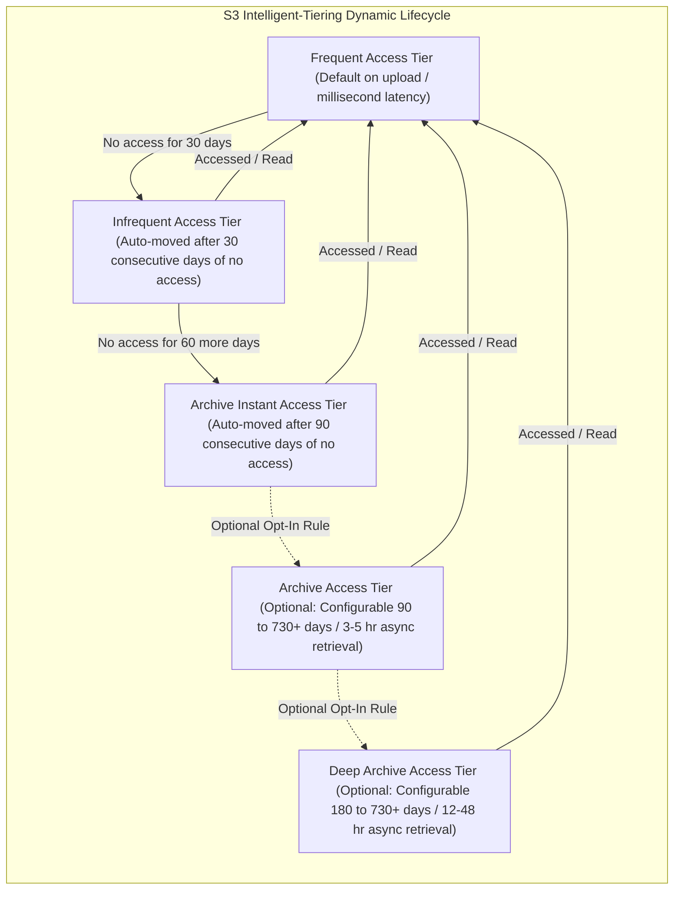

# Amazon S3 Storage Classes: Durability vs. Availability, Glacier Tiers & Intelligent-Tiering

---

## Key Takeaways

Amazon S3 offers a tiered portfolio of storage classes tailored to different access patterns, latency requirements, and cost profiles. Objects can be assigned to a specific storage class upon creation, transitioned manually, or transitioned automatically via **S3 Lifecycle Rules**.

Key takeaways for the exam:

- **Durability vs. Availability:**
  - **Durability (11 9s / 99.999999999%):** The probability that an object is never lost. All S3 storage classes share the exact same 11 9s of durability (except One Zone-IA only achieves this within a single physical Availability Zone).
  - **Availability:** How readily an object can be accessed without temporary downtime or errors (ranges from 99.99% for Standard down to 99.5% for One Zone-IA).
- **Glacier Tiers & Retrieval Speeds:**
  - **Glacier Instant Retrieval:** Millisecond access for cold data accessed ~once per quarter.
  - **Glacier Flexible Retrieval:** Expedited (1–5 min), Standard (3–5 hours), and Bulk (5–12 hours).
  - **Glacier Deep Archive:** Lowest cost in AWS; Standard (12 hours) and Bulk (48 hours).
- **S3 Intelligent-Tiering:** Purpose-built for data with unknown, changing, or unpredictable access patterns. Moves objects automatically between frequent, infrequent, and archive access tiers for a small monthly monitoring fee with **zero retrieval charges**.

---

## Main Discussion

### Durability vs. Availability

- **Durability:** Measures resistance to permanent data loss or disk corruption. S3 redundantly stores objects across multiple independent geographic facilities (Availability Zones) within a region to sustain concurrent facility failures.
- **Availability:** Measures the percentage of time S3 API endpoints successfully respond to retrieval requests. Decreases slightly as you transition to lower-cost, infrequent tiers.

---

### Comparison Matrix: Amazon S3 Storage Classes

| Storage Class                     | Availability SLA | Min Storage Duration | Retrieval Fee? | Latency                          | Primary AI / Cloud Use Case                                                                                                                 |
| --------------------------------- | ---------------- | -------------------- | -------------- | -------------------------------- | ------------------------------------------------------------------------------------------------------------------------------------------- |
| **S3 Standard**                   | 99.99%           | None                 | None           | Milliseconds                     | Active datasets, live ML feature repositories, frequently queried files, web backbones.                                                     |
| **S3 Standard-IA**                | 99.9%            | 30 days              | Yes (per GB)   | Milliseconds                     | Disaster recovery copies, secondary backups, audit logs queried infrequently.                                                               |
| **S3 One Zone-IA**                | 99.5%            | 30 days              | Yes (per GB)   | Milliseconds                     | Secondary backups, easily re-generated ML training data, pre-rendered thumbnail caches.                                                     |
| **S3 Glacier Instant Retrieval**  | 99.9%            | 90 days              | Yes (per GB)   | Milliseconds                     | Compliance documents, raw medical scans, or archives accessed roughly once per quarter that require instant viewing.                        |
| **S3 Glacier Flexible Retrieval** | 99.9%            | 90 days              | Yes (per GB)   | Minutes to Hours                 | Offline model checkpoints, tape replacement, data archives where retrieval wait times (1–5 min expedited, 3–5 hrs standard) are acceptable. |
| **S3 Glacier Deep Archive**       | 99.9%            | 180 days             | Yes (per GB)   | Hours (12–48 hrs)                | Long-term digital preservation, regulatory financial compliance (e.g., NASDAQ 7-year retention), lowest AWS cost tier.                      |
| **S3 Intelligent-Tiering**        | 99.9%            | None (in base tiers) | **None**       | Milliseconds (for default tiers) | Workloads with unknown, varying, or unpredictable access patterns.                                                                          |

---

### Deep Dive: S3 Intelligent-Tiering Automation

S3 Intelligent-Tiering is the only cloud storage class that delivers automatic cost savings by moving data between access tiers based on frequency of use without performance impact or operational overhead.

- **No Retrieval Charges:** Unlike Standard-IA and Glacier classes, there are **no data retrieval fees** when an object in Intelligent-Tiering is read or moved back to the Frequent Access tier.
- **Monitoring Fee:** A small, flat monthly monitoring and automation fee is charged per 1,000 objects.
- **Automatic Tiers:** Frequent Access, Infrequent Access (after 30 days of inactivity), and Archive Instant Access (after 90 days of inactivity) require zero configuration.
- **Asynchronous Tiers (Opt-In):** Archive Access and Deep Archive Access can be enabled for objects where asynchronous retrieval times (hours) are acceptable.

---

## Exam Guide

### Exam Tips

- **Unpredictable / Changing Access Pattern $\rightarrow$ S3 Intelligent-Tiering:** Whenever an exam question mentions _unpredictable access patterns_, _unknown data access frequency_, or _wants cost savings without paying retrieval fees_, **S3 Intelligent-Tiering** is almost always the correct answer.
- **Millisecond Archive $\rightarrow$ Glacier Instant Retrieval:** If an archive scenario requires **immediate, millisecond access** (such as medical imaging or quarterly financial reporting), choose **Glacier Instant Retrieval**, not Flexible Retrieval or Deep Archive.
- **Recreatable Data / Cost-Sensitive $\rightarrow$ S3 One Zone-IA:** If an application stores data that can be re-generated or has a secondary on-premises copy and cost must be minimized, choose **S3 One Zone-IA**. Remember: _data will be lost if the single Availability Zone suffers a catastrophic disaster_.
- **Lowest Cost Across AWS $\rightarrow$ S3 Glacier Deep Archive:** If long-term compliance retention (e.g., 7–10 years) is required and retrieval delays of 12 to 48 hours are acceptable, **S3 Glacier Deep Archive** provides the absolute lowest cost per GB.
- **Durability Constant:** Every tier provides **11 9s (99.999999999%)** of durability. Do not let exam distractors convince you that Glacier or IA tiers have lower durability than S3 Standard.

---

### Practice Test

#### Question 1

A media technology company processes thousands of audio and video clips used to train multimodal AI models. After initial model training is complete, the data access frequency becomes highly unpredictable—some datasets are queried repeatedly by research teams for several weeks, while others remain unaccessed for months. The company needs to optimize storage costs automatically without paying retrieval charges or impacting application performance. Which S3 storage class should they use?

- [ ] A. S3 Standard-Infrequent Access (S3 Standard-IA)
- [ ] B. S3 Intelligent-Tiering
- [ ] C. S3 Glacier Flexible Retrieval
- [ ] D. S3 One Zone-Infrequent Access (S3 One Zone-IA)

Correct Answer

- [x] B. S3 Intelligent-Tiering
  - **Explanation:** S3 Intelligent-Tiering is purpose-built for data with unknown, changing, or unpredictable access patterns. It automatically moves objects between frequent, infrequent, and archive instant access tiers without performance degradation and imposes **no data retrieval fees**.

---

#### Question 2

A healthcare analytics platform stores historical patient diagnostic records in Amazon S3 for long-term compliance audits. The records are accessed infrequently (less than once per quarter), but when requested by an auditor or physician, the application must display the records within milliseconds. Which Amazon S3 storage class provides the most cost-effective solution while meeting the latency requirement?

- [ ] A. S3 Glacier Flexible Retrieval
- [ ] B. S3 Glacier Deep Archive
- [ ] C. S3 Glacier Instant Retrieval
- [ ] D. S3 Standard-IA

Correct Answer

- [x] C. S3 Glacier Instant Retrieval
  - **Explanation:** **S3 Glacier Instant Retrieval** is designed for archive data that is rarely accessed (e.g., once a quarter) but requires **millisecond retrieval** when requested. S3 Glacier Flexible Retrieval and Deep Archive require minutes to hours for retrieval and cannot provide millisecond response times.

---
