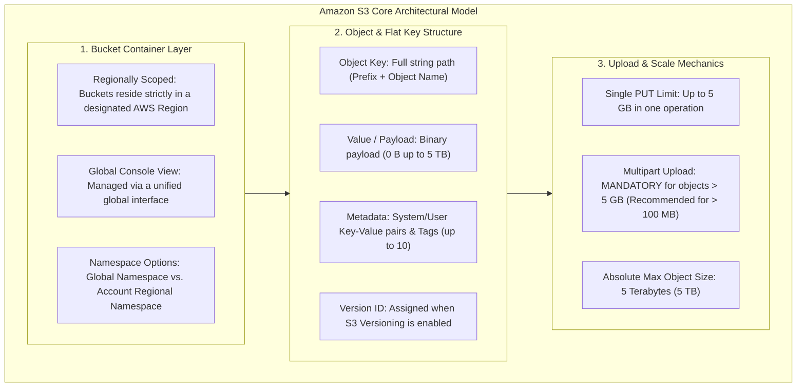
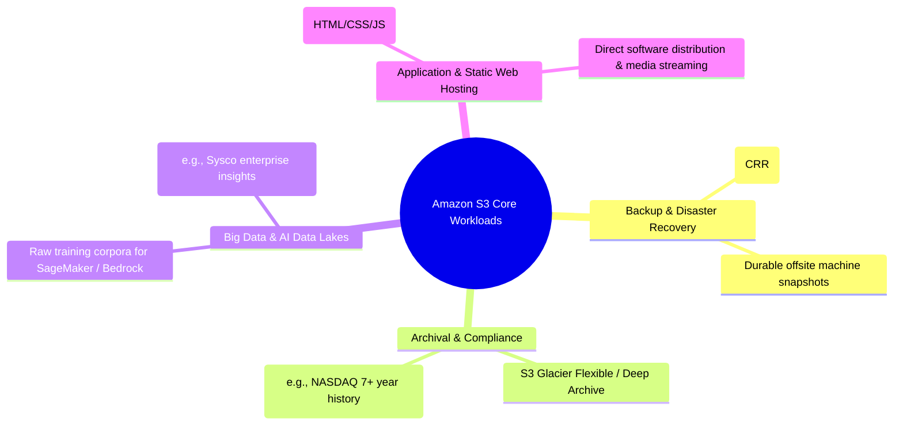
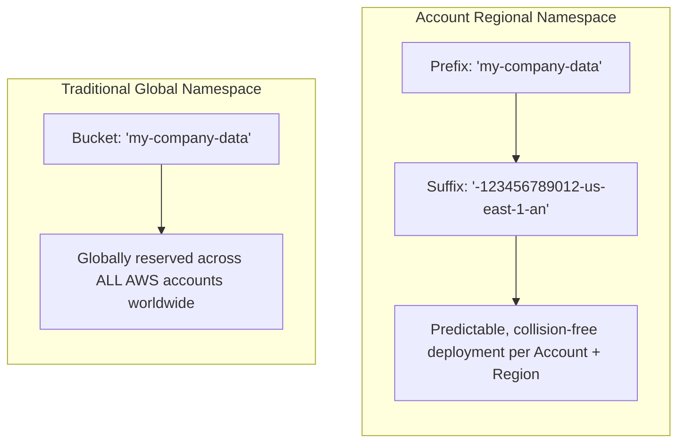
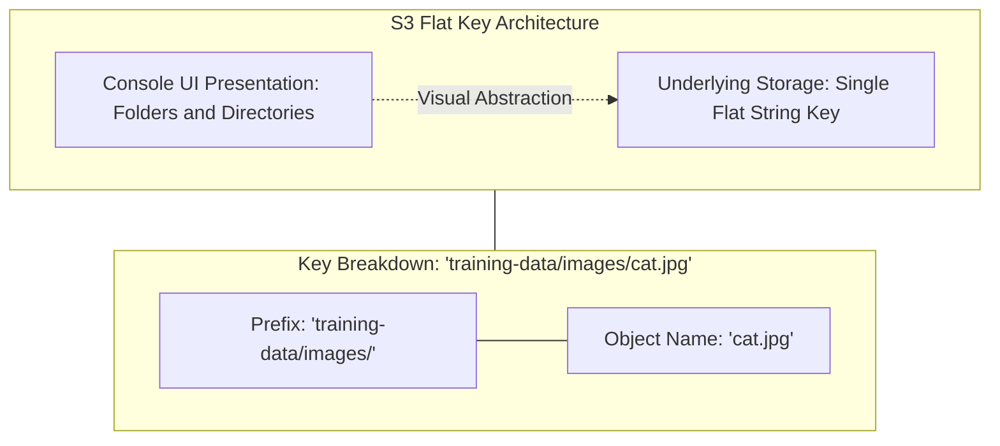
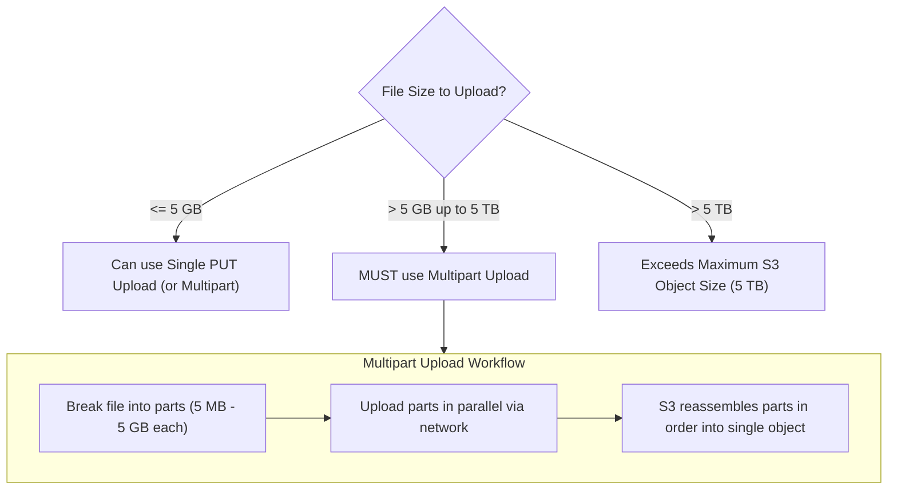

# Amazon Simple Storage Service (Amazon S3): Architecture, Object Keys, Namespaces & Limits

---

## Key Takeaways

**Amazon S3 (Simple Storage Service)** is AWS's foundational, object-based cloud storage service designed to offer 99.999999999% (11 9s) of data durability, virtually infinite scalability, and native integration across the AWS ecosystem.

- **Storage Model:** S3 is a **flat object store**, not a block or POSIX hierarchical file system. There are no real physical "directories"; slashes (`/`) in an object path are simply characters within a single string called the **Object Key**.
- **Bucket Scoping & Namespaces:** Buckets are created in a specific AWS Region. Traditional buckets exist in a **global namespace** (globally unique across all AWS accounts). The **Account Regional Namespace** option allows organizations to reuse bucket name prefixes across accounts and regions by automatically attaching a dedicated unique suffix (`-<account-id>-<region>-an`).
- **Critical Size Limits:**
  - **Maximum single object size:** **5 TB**.
  - **Single upload limit:** **5 GB**.
  - **Multipart Upload:** **Mandatory** for any file **greater than 5 GB** (and recommended for any file exceeding 100 MB).

---

## Main Discussion

### High-Level Use Cases & Industry Applications

Amazon S3 serves as the backbone data layer for web-scale applications, big data pipelines, and artificial intelligence architectures:

---

### Buckets: Regional Deployment & Namespaces

A bucket is a logical container for objects. While you manage buckets through a unified global console interface, every bucket physically resides in the **single AWS Region** you choose during creation.

#### Bucket Namespaces Compared

- **Global Namespace (Traditional):** Bucket names must be globally unique across all existing AWS accounts in all commercial regions. Once an account claims a name, no other entity can use it until deleted.
- **Account Regional Namespace:** Scopes bucket names specifically to your AWS Account and Region combination. AWS guarantees uniqueness by binding your 12-digit Account ID and region code as a suffix. This simplifies automated Infrastructure-as-Code (IaC) templates by preventing naming collisions between dev, staging, and production environments.

#### Bucket Naming Rules

- Length must be between 3 and 63 characters long.
- Must contain only lowercase letters, numbers, and hyphens (`-`).
- Must **not** contain uppercase letters or underscores (`_`).
- Must begin and end with a letter or number.
- Must not be formatted as an IP address (e.g., `192.168.5.4`).
- Must not begin with `xn--` or end with `-s3alias`.

---

### Objects: Keys, Flat Hierarchies & Metadata

In S3, an object consists of its **Key**, **Value (Body)**, **Metadata**, and optional attributes:

- **The Object Key:** The full path string that uniquely identifies the object within the bucket. For a file visually located at `data/2026/report.csv`, the key is literally `"data/2026/report.csv"`. The prefix is `"data/2026/"` and the object name is `"report.csv"`.
- **Value (Body):** The binary content of the file. S3 objects can range from **0 bytes to 5 terabytes** in size.
- **Metadata:** Key-value pairs providing descriptive information.
  - _System metadata:_ Managed by AWS (e.g., `Content-Type`, `Last-Modified`, `Content-Length`).
  - _User-defined metadata:_ Custom key-value pairs assigned during upload (prefixed with `x-amz-meta-`).
- **Tags:** Separate Unicode key-value pairs (up to 10 per object) commonly used for access control policies and automated S3 Lifecycle management rules.
- **Version ID:** A unique string generated by S3 to track object iterations when **S3 Versioning** is enabled on the bucket.

---

### Upload Size Boundaries & Multipart Upload

- **Single PUT Upload Limit:** You can upload files up to **5 GB** in a single HTTP `PUT` request.
- **Multipart Upload Threshold:**
  - **Mandatory:** For any object **larger than 5 GB**, you must use the Multipart Upload API.
  - **Best Practice:** Use multipart uploads for any file **exceeding 100 MB** to improve throughput and network resilience.
- **Benefits of Multipart Upload:**
  - _Parallelism:_ Parts are uploaded simultaneously to maximize bandwidth.
  - _Fault Tolerance:_ If an individual part fails during transmission, only that single part needs to be retransmitted, avoiding a full restart of a large multi-gigabyte upload.

---

## Exam Guide

### Exam Tips

- **Max Object vs. Single PUT Limits (High Frequency):**
  - Maximum size of **any single object** in S3 = **5 TB**.
  - Maximum size uploaded via a **single PUT operation** = **5 GB**.
  - Any upload exceeding **5 GB must use Multipart Upload**.
- **Flat Architecture:** S3 does not use true folders or subdirectories. The "folder structure" seen in the console is a visual representation derived from forward slashes (`/`) inside the **Object Key** string.
- **Regional Buckets, Global Interface:** S3 buckets are defined and created inside a **specific AWS Region**, but listed and viewed via a global console management plane.
- **Bucket Naming Constraints:**
  - 3 to 63 characters long.
  - Strictly lowercase letters, numbers, and hyphens. No uppercase letters or underscores.
- **Object Metadata vs. Object Tags:**
  - **Metadata:** Retrieved with object headers; cannot be modified independently without creating a new copy of the object.
  - **Tags:** Key-value pairs (up to 10) that can be added, updated, or removed independently without rewriting the underlying object; used for S3 Lifecycle rules and attribute-based access control (ABAC).

---

### Practice Test

#### Question 1

A data engineering team is configuring an automated pipeline to ingest large raw video datasets into Amazon S3 to fine-tune a multimodal computer vision model. Several individual video files are 12 GB in size. What upload mechanism must the team use to upload these files to Amazon S3 successfully?

- [ ] A. A single standard HTTP PUT API call with base64 encoding
- [ ] B. Multipart Upload API
- [ ] C. S3 Transfer Acceleration with Single PUT
- [ ] D. Compress the files below 1 GB using gzip before uploading

Correct Answer

- [x] B. Multipart Upload API
  - **Explanation:** In Amazon S3, any single file upload exceeding **5 GB** cannot be uploaded using a standard single PUT operation and **must** use the **Multipart Upload API**. (The absolute maximum size for an object in S3 is 5 TB.)

---

#### Question 2

An AI developer is inspecting an Amazon S3 storage path displayed in the AWS Management Console as:

`s3://company-ai-datasets/nlp-training/v2/train_corpus.json`

Which statement accurately describes how Amazon S3 internally organizes and stores this file?

- [ ] A. S3 provisions a POSIX-compliant folder hierarchy on a regional virtual disk drive
- [ ] B. S3 stores the file as an object whose Key is the complete string `"nlp-training/v2/train_corpus.json"` within a flat bucket namespace
- [ ] C. The file is split across multiple directories, with `nlp-training` functioning as an independent sub-bucket
- [ ] D. S3 automatically restricts the maximum size of this individual file to 50 Terabytes

Correct Answer

- [x] B. S3 stores the file as an object whose Key is the complete string `"nlp-training/v2/train_corpus.json"` within a flat bucket namespace
  - **Explanation:** Amazon S3 is a flat object store rather than a hierarchical file system. The forward slashes are simply delimiter characters that make up the full string known as the **Object Key** (`"nlp-training/v2/train_corpus.json"`). Additionally, the maximum supported object size in S3 is 5 TB, not 50 TB.

---
