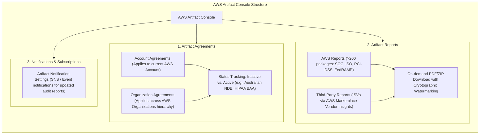
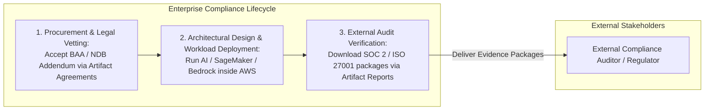

# Hands-On Lab: Navigating the AWS Artifact Console, Managing Agreements & Downloading Audit Reports

---

## Key Takeaways

This hands-on walkthrough demonstrates the operational workflow inside the **AWS Artifact** console: reviewing legal terms, accepting regulatory addendums, and downloading third-party compliance packages on demand.

Key takeaways for the exam:

- **Account vs. Organization Agreements:** Agreements can be accepted for an individual AWS account or centrally at the management account level across an entire **AWS Organization** (e.g., the Australian Notifiable Data Breach Addendum or HIPAA BAA).
- **Self-Service Auditor Artifacts:** Over 200 security and compliance documents (including SOC 1/2/3, ISO certifications, and PCI attestations) are available for immediate download as watermarked PDFs to provide to enterprise auditors.
- **Third-Party Marketplace Visibility:** Artifact hosts independent security reports submitted by Independent Software Vendors (ISVs) contracted through **AWS Marketplace Vendor Insights**.
- **Report Update Notifications:** Administrators can subscribe to notifications to be alerted whenever AWS or an ISV publishes a revised compliance report.

---

## Hands-On Workflow: End-to-End Walkthrough

1. **Navigate to the AWS Artifact Console:**
   - Open the AWS Management Console and search for **Artifact**.
   - Select **AWS Artifact** from the service list.
   - Review the primary left-hand navigation menu divided into:
     - **Agreements**
     - **Reports**
     - **Notifications**
       
2. **Inspect and Review Artifact Agreements:**
   - Click on **Agreements** in the left navigation pane:
   - Observe the split between **Account agreements** and **Organization agreements**:
     - _Account agreements:_ Bind solely the active AWS account.
     - _Organization agreements:_ Available when signed in with management account credentials to apply terms to all member accounts.
   - Scroll through the list of regional and statutory agreements (such as the **Australian Notifiable Data Breach Addendum** or the **Business Associate Addendum (BAA)** for HIPAA).
   - Notice the **Status** column: unaccepted contracts display as `Inactive`.
   - Selecting an agreement allows you to download the contractual terms or click **Accept agreement** to activate legal coverage.  
     
3. **Search and Download AWS Audit Reports:**
   - Click on **Reports** in the left navigation pane:
   - Notice that the catalog contains over 400 reports validating AWS cloud security controls.
   - Use the search bar to filter by report family:
     - Type `SOC` to surface the latest **SOC 1**, **SOC 2 Type II**, and **SOC 3** reports covering security, availability, and confidentiality.  
       
     - Type `ISO` to locate international standards certifications (e.g., ISO 27001, ISO 27017 for cloud security, ISO 27018 for cloud privacy).  
       
   - Select a report (e.g., _AWS SOC 2 Type II Report_) and click **Download report**.
   - Observe that downloaded PDFs include customer-specific watermarks confirming official receipt for compliance audits.
4. **Review Third-Party ISV Reports:**
   - Within the **Reports** section, toggle or scroll to the **Third-party reports** view:
   - Reports from Independent Software Vendors (ISVs) appear here when you subscribe to vendor solutions via **AWS Marketplace Vendor Insights**.
   - These documents allow security officers to evaluate vendor security postures before integrating third-party AI models or SaaS tooling.
5. **Examine Notification Settings:**
   - Click on **Notifications** (or Notification settings) in the navigation menu:
   - Review the notification configuration options.
   - Administrators can configure alerts to receive automated messages whenever AWS or integrated third-party vendors publish updated compliance packages, ensuring enterprise audit files remain current.

---

## Deep Dive: Architectural Role of Artifact in Compliance Audits

| Console Area                | Status / Scope                             | Primary Target Audience                              | Operational Outcome                                                                                                |
| --------------------------- | ------------------------------------------ | ---------------------------------------------------- | ------------------------------------------------------------------------------------------------------------------ |
| **Account Agreements**      | Single AWS Account (`Active` / `Inactive`) | Legal counsel, compliance leads.                     | Legally establishes required terms (e.g., HIPAA BAA, Australian NDB) for the current account.                      |
| **Organization Agreements** | AWS Organizations Multi-Account Fleet      | Enterprise risk managers, Org administrators.        | Enforces a single legal addendum across all linked development, staging, and production accounts.                  |
| **AWS Reports**             | >400 downloadable auditor packages         | Information security officers, third-party auditors. | Provides verifiable proof that AWS physical, logical, and environmental controls meet ISO, SOC, and PCI standards. |
| **Third-Party Reports**     | ISVs via AWS Marketplace                   | Software procurement teams, AI architects.           | Evaluates third-party software vendor security controls alongside AWS native certifications.                       |

---

## Exam Guide

### Exam Tips

- **Agreements Scope (Single vs. Multi-Account):**
  - **Account Agreements:** Apply to the specific, individual AWS account you are currently logged into.
  - **Organization Agreements:** Applied centrally from the management account to cover every member account across an **AWS Organization**.
- **Self-Service Verification:** When auditors request proof of SOC 2 compliance, ISO certifications, or PCI DSS Attestations of Compliance (AoC) for the AWS cloud, customers do not open a support ticket—they **download the packages directly from AWS Artifact Reports**.
- **Third-Party Vendor Integration:** Independent Software Vendor (ISV) compliance data from the **AWS Marketplace** is centralized inside **AWS Artifact**, giving teams a unified portal for both AWS and third-party vendor documentation.
- **Notification Capabilities:** Administrators can automate tracking of compliance document releases using **Artifact Notifications** rather than manually polling the console for newly released reports.

---

### Practice Test

#### Question 1

A multinational company operates hundreds of AWS accounts managed under a single AWS Organizations hierarchy. The legal and compliance department needs to accept the AWS Business Associate Addendum (BAA) so that all accounts across the entire organization can legally process regulated healthcare datasets. What is the most operationally efficient method to accept this agreement?

- [ ] A. Log in to each member account individually and accept the BAA under Account Agreements in AWS Artifact
- [ ] B. Accept the agreement under Organization Agreements in AWS Artifact while logged into the AWS Organizations management account
- [ ] C. Open an enterprise support case requesting that an AWS solutions architect sign a manual contract
- [ ] D. Create a custom AWS Config rule that automatically deploys the BAA across all S3 buckets

Correct Answer

- [x] B. Accept the agreement under Organization Agreements in AWS Artifact while logged into the AWS Organizations management account
  - **Explanation:** In **AWS Artifact**, an administrator signed in to the management account of an **AWS Organization** can review and accept agreements under **Organization Agreements**. This action applies the legal coverage across all existing and future member accounts within the organization without requiring individual per-account execution.

---

#### Question 2

During an annual regulatory assessment, an external cybersecurity auditor asks an AI engineering firm to prove that the AWS data centers hosting their foundation model workloads comply with ISO 27001 and SOC 2 Type II security requirements. How should the firm fulfill this request?

- [ ] A. Submit a request to AWS Support to schedule a physical audit of the local AWS data center
- [ ] B. Download the official ISO 27001 certification and SOC 2 Type II reports directly from the AWS Artifact Reports dashboard
- [ ] C. Export the AWS CloudTrail event history from the previous 90 days and send it to the auditor
- [ ] D. Generate an Amazon Inspector compliance assessment report for the target S3 buckets

Correct Answer

- [x] B. Download the official ISO 27001 certification and SOC 2 Type II reports directly from the AWS Artifact Reports dashboard
  - **Explanation:** **AWS Artifact Reports** provides on-demand, self-service access to official third-party audit reports and certifications for AWS infrastructure, including ISO 27001 and SOC 2 Type II reports. Physical data center access is not permitted under the AWS Shared Responsibility Model.

---
