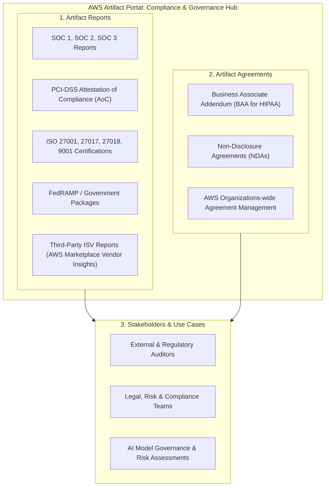
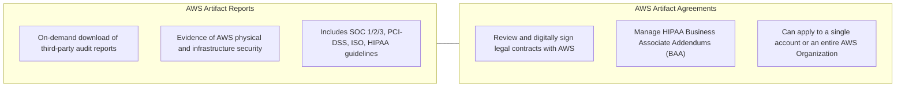
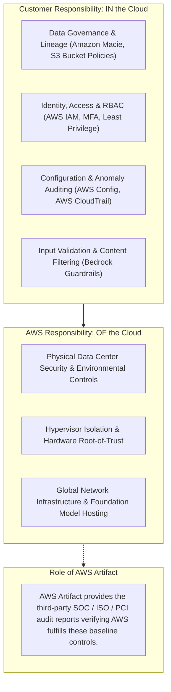

# AWS Artifact: Compliance Documentation, Regulatory Audits & Agreements

---

## Key Takeaways

**AWS Artifact** is a self-service compliance portal providing on-demand access to AWS security and compliance reports, independent third-party audit documents, and legal agreements. It serves as the primary resource for evidence required by internal governance, legal departments, and external regulators.

Key takeaways for the exam:

- **Core Definition:** A self-service portal (not an API, compute, or monitoring service) for downloading **compliance reports** and managing **legal agreements** directly through the AWS Management Console.
- **Two Core Pillars:**
  1. **Artifact Reports:** Downloadable compliance documents created by independent, third-party auditors covering AWS infrastructure (SOC, ISO, PCI-DSS, FedRAMP).
  2. **Artifact Agreements:** Contracts between your organization and AWS, such as the **Business Associate Addendum (BAA)** required for processing protected health information under HIPAA.
- **Third-Party ISV Reports:** Extends compliance visibility beyond AWS infrastructure by hosting security attestation reports from Independent Software Vendors (ISVs) via **AWS Marketplace Vendor Insights**.
- **AI/ML Governance Relevance:** Used to demonstrate inherited cloud compliance when conducting AI risk assessments (such as verifying ISO 27001 or SOC 2 compliance for the physical facilities hosting Amazon Bedrock or SageMaker).

---

## Main Discussion

### The Two Pillars of AWS Artifact

| Dimension                | AWS Artifact Reports                                                                                              | AWS Artifact Agreements                                                                   |
| ------------------------ | ----------------------------------------------------------------------------------------------------------------- | ----------------------------------------------------------------------------------------- |
| **Primary Function**     | Download authoritative third-party auditor security findings and certifications.                                  | Review, accept, terminate, and track compliance contracts with AWS.                       |
| **Typical Documents**    | Service Organization Control (SOC) reports, ISO certifications, PCI Attestations of Compliance, FedRAMP packages. | Business Associate Addendum (BAA) for HIPAA compliance, Non-Disclosure Agreements (NDAs). |
| **Key Stakeholder**      | Internal audit, security assessors, external enterprise auditors.                                                 | Legal counsel, privacy officers, chief risk officers (CROs).                              |
| **Scope of Application** | Evidence verifying that AWS infrastructure adheres to strict security frameworks.                                 | Enforces legal obligations across single accounts or all accounts in an AWS Organization. |

---

### Artifact in the Shared Responsibility Model for AI

Under the **AWS Shared Responsibility Model**, AWS manages the security _of_ the cloud, while the customer manages security _in_ the cloud. AWS Artifact provides the verifiable audit proof for the lower tier of this model:

When building an enterprise Generative AI application (such as a clinical summary agent using Amazon Bedrock):

1. The organization accepts the **Business Associate Addendum (BAA)** in **AWS Artifact Agreements** so the account is legally authorized to process Protected Health Information (PHI) under HIPAA.
2. The security team downloads the **AWS SOC 2 Type II** and **ISO 27001** reports from **AWS Artifact Reports** to present to healthcare regulators as evidence that the physical infrastructure hosting the AI service meets statutory standards.

---

### Third-Party ISV Reports & Vendor Insights

AWS Artifact also supports **independent software vendor (ISV)** third-party reports:

- Integrated with **AWS Marketplace Vendor Insights**.
- Allows organizations evaluating third-party AI software or SaaS models on the AWS Marketplace to review the vendor's security and compliance posture directly within the Artifact console.
- Administrators can configure email notifications to alert them when an ISV publishes updated compliance documentation or security assessments.

---

## Exam Guide

### Exam Tips

- **Trigger Keywords (High Frequency):** Whenever an exam question asks where to obtain **SOC reports**, **ISO certifications**, **PCI compliance documents**, or where to sign/manage a **HIPAA Business Associate Addendum (BAA)**, the answer is **AWS Artifact**.
- **Not a Technical Monitoring Tool:** AWS Artifact does not actively scan code, monitor infrastructure, or evaluate configuration rules. It is strictly a **documentation and legal portal**:
  - Scans S3 for PII? $\rightarrow$ **Amazon Macie**
  - Scans EC2, ECR, and Lambda for CVE vulnerabilities? $\rightarrow$ **Amazon Inspector**
  - Audits resource configuration changes and compliance? $\rightarrow$ **AWS Config**
  - Logs API calls and user events? $\rightarrow$ **AWS CloudTrail**
  - Provides compliance reports and auditor documentation? $\rightarrow$ **AWS Artifact**
- **Organization-Wide Agreements:** Agreements (like the HIPAA BAA) can be accepted at the organizational master/management account level to cover all current and future member accounts within an **AWS Organization**.

---

### Practice Test

#### Question 1

A healthtech enterprise is building a generative AI diagnostic assistance tool using Amazon Bedrock. To satisfy regulatory guidelines under HIPAA, the organization must sign a Business Associate Addendum (BAA) with AWS before processing Protected Health Information (PHI). Which AWS resource should the compliance team use to review and accept the BAA?

- [ ] A. AWS Systems Manager
- [ ] B. AWS Artifact Agreements
- [ ] C. Amazon CloudWatch Logs
- [ ] D. AWS Security Hub

Correct Answer

- [x] B. AWS Artifact Agreements
  - **Explanation:** **AWS Artifact Agreements** provides on-demand access to review, accept, and track legal contracts with AWS, including the Business Associate Addendum (BAA) required for HIPAA compliance.

---

#### Question 2

An enterprise security team is preparing for an annual cybersecurity compliance audit. The external auditor requires official documentation verifying that the physical infrastructure and hypervisors hosting AWS services satisfy SOC 2 Type II and ISO 27001 security standards. Where can the team obtain this documentation?

- [ ] A. AWS Artifact Reports
- [ ] B. AWS Trusted Advisor
- [ ] C. AWS Config Resource Timeline
- [ ] D. Amazon Inspector findings dashboard

Correct Answer

- [x] A. AWS Artifact Reports
  - **Explanation:** **AWS Artifact Reports** is the designated portal where customers can download third-party compliance reports, including SOC 1/2/3, ISO 27001/27017/27018, and PCI-DSS documentation validating AWS infrastructure security.

---
