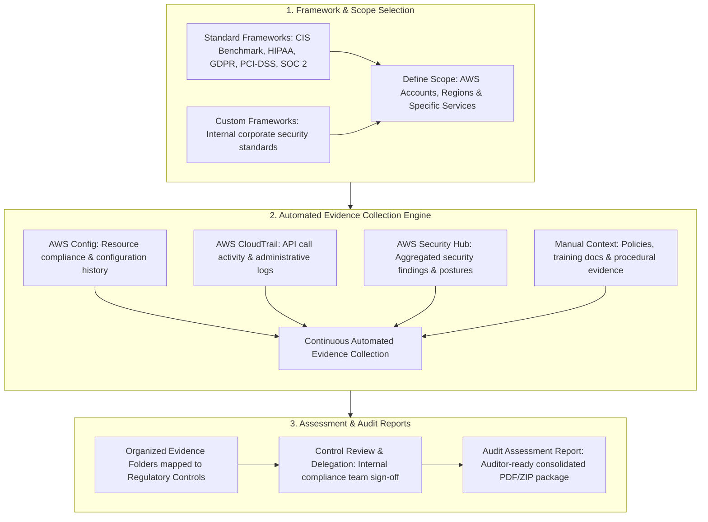
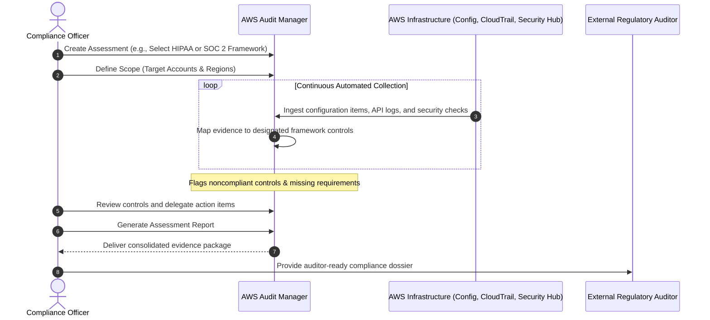
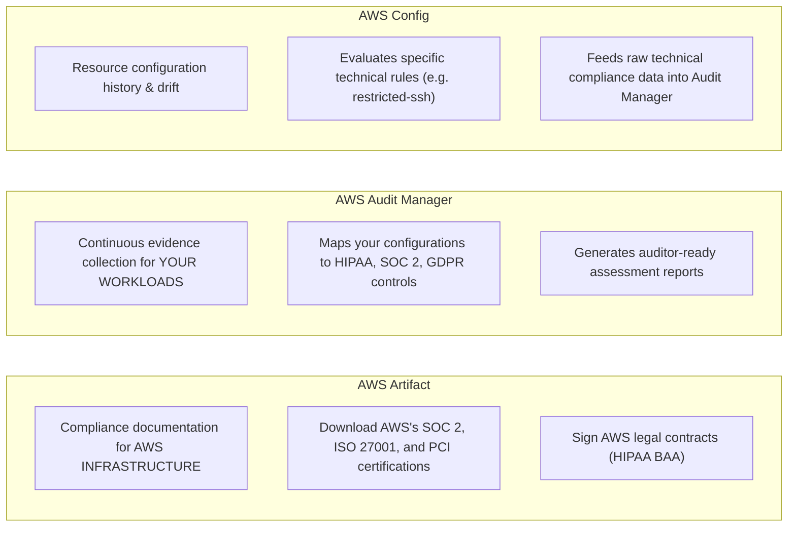

# AWS Audit Manager: Automated Evidence Collection, Continuous Compliance Assessments & Regulatory Frameworks

---

## Key Takeaways

**AWS Audit Manager** helps you continuously audit your AWS usage to simplify risk assessment and compliance with regulations and industry standards. It automates the manual, labor-intensive process of **collecting and organizing audit evidence** across your AWS infrastructure.

- **Core Purpose:** Replaces manual spreadsheet evidence gathering by **automatically and continuously collecting evidence** to prove your AWS workloads comply with regulations and frameworks.
- **Supported Frameworks:** Provides pre-built standard frameworks (e.g., **HIPAA**, **GDPR**, **PCI-DSS**, **SOC 2**, **CIS AWS Foundations Benchmark**) as well as custom frameworks tailored to organizational policies.
- **Underlying Data Sources:** Automatically extracts and organizes evidence from **AWS Config** (configurations), **AWS CloudTrail** (API events), **AWS Security Hub** (security checks), and direct AWS API calls.
- **Assessment Reports:** Consolidates gathered evidence into organized **evidence folders** mapped directly to specific regulatory controls, producing an **auditor-ready Assessment Report**.
- **Distinction from AWS Artifact:**
  - **AWS Artifact:** Used to download reports proving **AWS's infrastructure compliance** (AWS's side of the Shared Responsibility Model).
  - **AWS Audit Manager:** Used to collect evidence and evaluate **your own workloads and configurations** (your side of the Shared Responsibility Model).

---

## Main Discussion

### The Compliance Evidence Pipeline

Auditing traditionally requires engineering teams to take manual screenshots, run CLI queries, and export configuration dumps. AWS Audit Manager shifts this into an automated, continuous workflow:

1. **Select a Framework:** Choose a pre-built template (such as the _PCI-DSS v3.2.1_ or _SOC 2_ standard) or build a custom framework that maps to internal requirements.
2. **Define Scope:** Specify the AWS accounts (single account or whole AWS Organizations hierarchy), AWS Regions, and services included in the assessment.
3. **Automated Continuous Evidence Gathering:** Once enabled, Audit Manager automatically queries underlying services:
   - **AWS Config:** Verifies whether storage buckets have encryption enabled or access restrictions enforced.
   - **AWS CloudTrail:** Captures evidence of administrative access and user activity trails.
   - **AWS Security Hub:** Pulls in real-time security check statuses.
4. **Control Review & Delegation:** Internal reviewers can validate evidence, add contextual notes, or delegate specific controls to resource owners for remediation.
5. **Generate Assessment Report:** Generates an organized package of evidence files that can be handed directly to external auditors.

---

### Comparison: AWS Artifact vs. AWS Audit Manager vs. AWS Config

Because governance services share overlapping themes, understanding their distinct boundaries is critical for certification exams:

| Service               | Primary Question Answered                                                                                         | Target of Evaluation                                          | Primary Deliverable                                                                                     |
| --------------------- | ----------------------------------------------------------------------------------------------------------------- | ------------------------------------------------------------- | ------------------------------------------------------------------------------------------------------- |
| **AWS Artifact**      | _"Has AWS secured the underlying physical and cloud infrastructure?"_                                             | **AWS Infrastructure** (AWS responsibility).                  | Downloadable third-party certifications and signable legal agreements (BAA).                            |
| **AWS Audit Manager** | _"Can we prove to an external auditor that our application workloads comply with regulations?"_                   | **Customer Workloads & Configs** (Customer responsibility).   | Consolidated **Assessment Reports** with attached evidence folders mapped to frameworks.                |
| **AWS Config**        | _"What was the technical configuration of this specific resource at a point in time, and did it violate a rule?"_ | **Individual AWS Resources** (Technical configuration items). | Resource configuration histories, compliance states (`COMPLIANT` / `NONCOMPLIANT`), and timeline diffs. |

---

### AWS Audit Manager in AI Governance & Responsible AI

With frameworks like the **NIST AI Risk Management Framework (AI RMF)** and emerging enterprise AI regulations, Audit Manager provides a structured mechanism to audit AI workloads:

- **Custom AI Frameworks:** Organizations can create custom frameworks in Audit Manager mapping directly to responsible AI pillars (e.g., data provenance, privacy protection, and model explainability).
- **Tracking Model Access:** Ingests CloudTrail data to prove that only authorized IAM roles invoked Amazon Bedrock foundation models or accessed sensitive S3 training data.
- **Data Protection Evidence:** Collects continuous evidence from AWS Config proving that S3 buckets hosting raw training corpora enforce encryption at rest and Block Public Access.

---

## Exam Guide

### Exam Tips

- **Core Keywords for AWS Audit Manager (High Frequency):**
  - **"Continuously audit AWS usage"**
  - **"Automated evidence collection"**
  - **"Prepare for audits"**
  - **"Map AWS resources to compliance frameworks (HIPAA, GDPR, PCI-DSS, SOC 2)"**
- **The "Artifact vs. Audit Manager" Trap:**
  - If the question asks for official documentation proving that **AWS data centers** or **AWS services** are certified compliant $\rightarrow$ **AWS Artifact**.
  - If the question asks how a company can **collect evidence on their own workloads** to prepare for an upcoming audit $\rightarrow$ **AWS Audit Manager**.
- **Evidence Feeds:** Audit Manager does not reinvent the wheel; it automatically ingests configuration data and events from **AWS Config**, **AWS CloudTrail**, and **AWS Security Hub**, as well as supporting manual evidence uploads.
- **Assessment Reports:** The final output of Audit Manager is an **Assessment Report**, which compiles organized evidence mapped to specific controls for auditors to review.

---

### Practice Test

#### Question 1

A healthcare organization is deploying an AI-powered diagnostic application on AWS. To prepare for an upcoming HIPAA compliance audit, the organization needs a solution that continuously collects evidence from AWS Config and AWS CloudTrail, automatically maps the evidence to HIPAA controls, and produces an assessment report for external auditors. Which AWS service should they implement?

- [ ] A. AWS Artifact
- [ ] B. AWS Audit Manager
- [ ] C. Amazon Inspector
- [ ] D. AWS Trusted Advisor

Correct Answer

- [x] B. AWS Audit Manager
  - **Explanation:** **AWS Audit Manager** simplifies audit preparation by automatically and continuously collecting evidence across AWS services, mapping that evidence to compliance frameworks (such as HIPAA or GDPR), and generating consolidated assessment reports. (AWS Artifact is for downloading AWS's own compliance documents, not assessing customer workloads.)

---

#### Question 2

A financial enterprise needs to prove to regulators that all Amazon S3 buckets containing financial data have encryption at rest enabled and access logging configured. Rather than collecting screenshots and configuration snapshots manually across hundreds of accounts, the compliance team wants an automated tool to gather this evidence and map it to PCI-DSS framework controls. Which AWS service fulfills this requirement?

- [ ] A. AWS Shield
- [ ] B. AWS Systems Manager Run Command
- [ ] C. AWS Audit Manager
- [ ] D. Amazon GuardDuty

Correct Answer

- [x] C. AWS Audit Manager
  - **Explanation:** **AWS Audit Manager** automates the collection of evidence needed to demonstrate compliance with standards like PCI-DSS. It continuously pulls configuration states from services like AWS Config and formats the data into evidence folders mapped to specific framework requirements.

---
