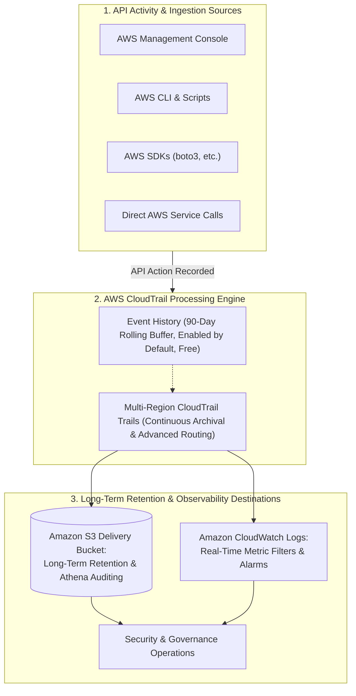
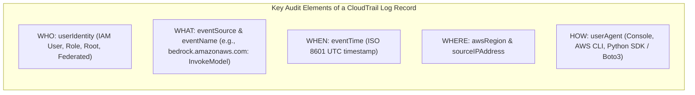
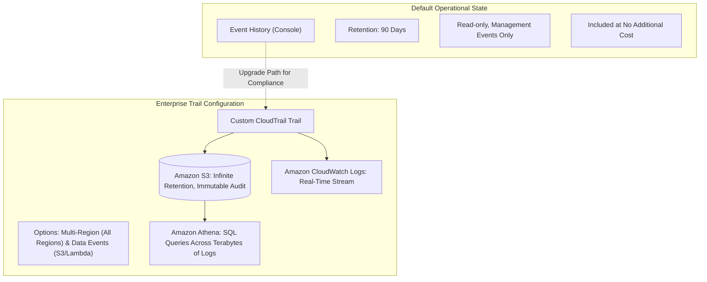

# AWS CloudTrail: Governance, Auditing, API Event History & Security Accountability

---

## Key Takeaways

**AWS CloudTrail** is the central governance, compliance, operational auditing, and risk auditing service for AWS accounts. It continuously records and logs **API calls and account activity** executed across the AWS Management Console, AWS Command Line Interface (CLI), AWS SDKs, and automated AWS service integrations.




Key takeaways for the exam:

- **Core Purpose:** Answers the four fundamental audit questions: **Who** made the API request? **What** specific action was taken? **When** was it executed? **From where** (source IP and endpoint) did the call originate?
- **Default Event History:** CloudTrail is **enabled by default** for all AWS accounts, retaining a rolling **90-day history** of management events without requiring manual setup.
- **Long-Term Retention via Trails:** To retain audit records beyond 90 days, you must create a **Trail** and deliver the JSON log files to an **Amazon S3 bucket** (for long-term storage and querying via Amazon Athena) or stream them into **Amazon CloudWatch Logs** (for real-time alerting on unauthorized actions).
- **Multi-Region Scope:** Best practice mandates configuring a trail to apply to **all AWS Regions**, ensuring any unexpected or unauthorized activity outside your primary working region is captured.

---

## Main Discussion

### Anatomy of a CloudTrail Event

Whenever an action is performed against AWS resources—such as launching an EC2 instance, deleting an S3 dataset, or invoking an Amazon Bedrock foundation model—CloudTrail records a structured JSON event record.

```json
{
  "eventVersion": "1.08",
  "userIdentity": {
    "type": "IAMUser",
    "principalId": "AIDAEXAMPLEUSERID",
    "arn": "arn:aws:iam::123456789012:user/data-scientist-alice",
    "accountId": "123456789012",
    "userName": "data-scientist-alice"
  },
  "eventTime": "2026-08-14T03:15:20Z",
  "eventSource": "bedrock.amazonaws.com",
  "eventName": "InvokeModel",
  "awsRegion": "us-east-1",
  "sourceIPAddress": "203.0.113.195",
  "userAgent": "boto3/1.34.0 Python/3.11",
  "requestParameters": {
    "modelId": "anthropic.claude-3-sonnet-20240229-v1:0"
  },
  "responseElements": null
}
```



---

### CloudTrail Architecture: Event History vs. Trails



| Dimension               | Default Event History                                | Custom CloudTrail Trail                                                                               |
| ----------------------- | ---------------------------------------------------- | ----------------------------------------------------------------------------------------------------- |
| **Activation**          | Automatically enabled by default.                    | Must be explicitly provisioned and configured.                                                        |
| **Log Retention**       | Strictly limited to a rolling **90 days**.           | **Indefinite retention** governed by the S3 destination bucket's lifecycle rules.                     |
| **Storage Destination** | Accessible solely within the AWS CloudTrail console. | Delivers compressed `.json.gz` log files directly to **Amazon S3** and/or **Amazon CloudWatch Logs**. |
| **Event Scope**         | Standard management events only.                     | Captures management events, data events (e.g., S3 `GetObject`, `PutObject`), and CloudTrail Insights. |
| **Auditing & Analysis** | Manual console search and basic filtering.           | SQL querying using **Amazon Athena**, automated metric filters, or ingestion into SIEM tools.         |

---

### Role of CloudTrail in AI Governance and Security

For AI/ML workloads, data governance and traceability are strict requirements:

1. **Model Invocations & Traceability:** Auditing calls to generative AI services (such as `bedrock:InvokeModel` or `sagemaker:InvokeEndpoint`) ensures accountability by tracking which application or developer submitted requests to which foundation model.
2. **Data Integrity & Lineage Verification:** When training datasets in Amazon S3 are modified, overwritten, or deleted, CloudTrail identifies the exact IAM principal and timestamp responsible for the change, confirming data provenance.
3. **Detection of Compromised Credentials:** Unusual API activity—such as an IAM user invoking models from unexpected IP addresses or spinning up high-cost GPU instances in an unapproved region—is surfaced in CloudTrail records.

---

## Exam Guide

### Exam Tips

- **The Ultimate Trigger Question (High Frequency):** If an exam question asks:
  - _"A resource was deleted or modified—how do we find out **who did it**, **when**, and **which API was used**?"_
  - **The answer is always AWS CloudTrail.**
- **Enabled by Default (90-Day Rule):** CloudTrail is enabled by default with a **90-day rolling history** of management events. To store audit logs beyond 90 days, you must configure a **Trail** delivering to an **Amazon S3 bucket**.
- **Global / Multi-Region Best Practice:** Trails should always be configured to **Apply trail to all regions** to catch unauthorized or rogue resource creation outside the organization's primary working regions.
- **CloudTrail vs. CloudWatch vs. Config:**
  - **AWS CloudTrail:** Logs API calls, user identities, and action histories (**"Who did what, and when?"**).
  - **Amazon CloudWatch:** Monitors runtime health, metrics, alerts, and application logs (**"How is the system performing?"**).
  - **AWS Config:** Tracks resource configuration states and compliance baselines over time (**"What does the resource look like, and is it compliant?"**).

---

### Practice Test

#### Question 1

A security auditor notices that an Amazon SageMaker real-time inference endpoint running an expensive GPU compute instance was terminated outside of the scheduled maintenance window. The compliance team needs to identify the exact IAM user who issued the deletion request, the time of the event, and the IP address from which the request originated. Which AWS service provides this information?

- [ ] A. Amazon CloudWatch Metrics
- [ ] B. AWS CloudTrail
- [ ] C. Amazon Inspector
- [ ] D. AWS Systems Manager

<details>
<summary>Correct Answer</summary>

- [x] B. AWS CloudTrail
  - **Explanation:** **AWS CloudTrail** records all API activity across an AWS account. It logs the user identity (IAM user or assumed role), timestamp, target API action (`DeleteEndpoint`), source IP address, and request parameters, making it the appropriate tool for auditing operational actions.

</details>

---

#### Question 2

An enterprise requires an immutable, long-term audit trail of all API calls executed across its AWS infrastructure for a minimum regulatory retention period of 7 years. The solution must support SQL-based compliance queries across the audit history. Which combination of services should the organization implement?

- [ ] A. CloudTrail Event History with an Amazon DynamoDB stream
- [ ] B. A multi-region AWS CloudTrail trail delivering logs to an Amazon S3 bucket, queried using Amazon Athena
- [ ] C. AWS Config rules delivering snapshots to Amazon EC2 ephemeral storage
- [ ] D. Amazon Inspector security findings forwarded to AWS Artifact

<details>
<summary>Correct Answer</summary>

- [x] B. A multi-region AWS CloudTrail trail delivering logs to an Amazon S3 bucket, queried using Amazon Athena
  - **Explanation:** While default CloudTrail Event History retains records for only 90 days, creating a **CloudTrail Trail** delivering to an **Amazon S3 bucket** provides durable, long-term storage configured with S3 lifecycle and retention policies. **Amazon Athena** can directly query these CloudTrail JSON log files using standard SQL.

</details>

---
