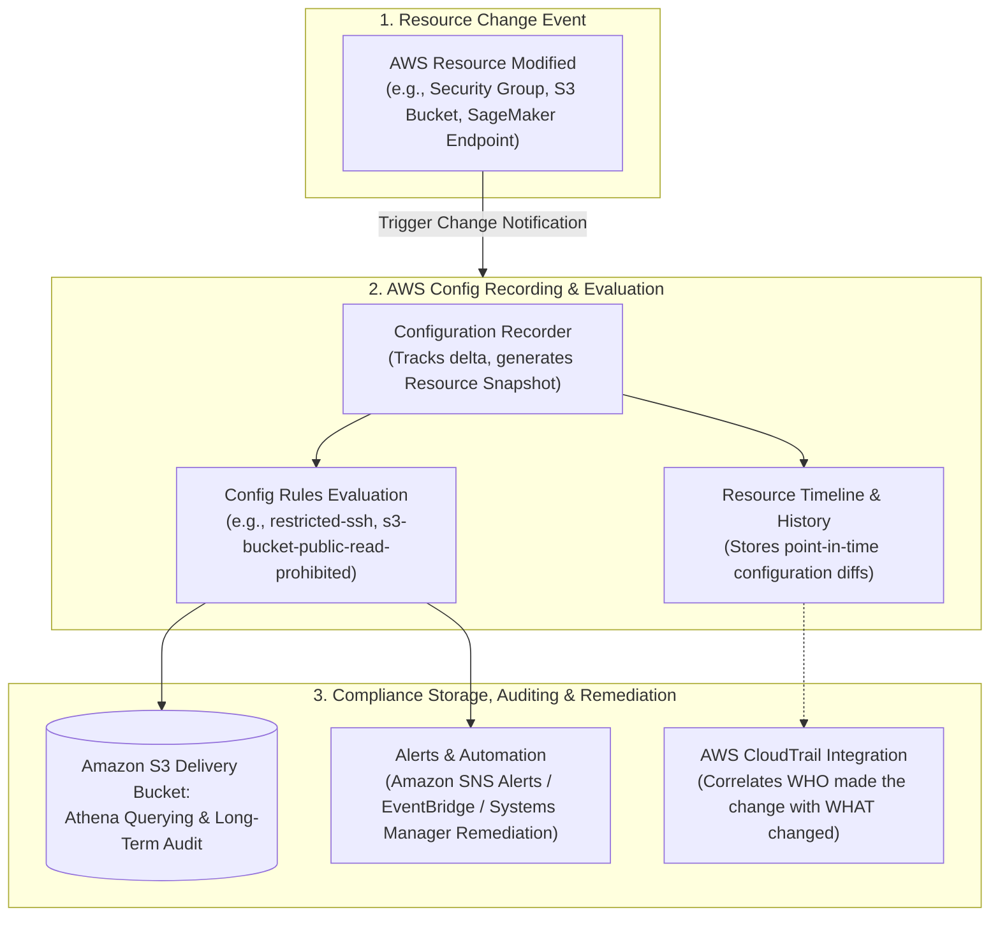
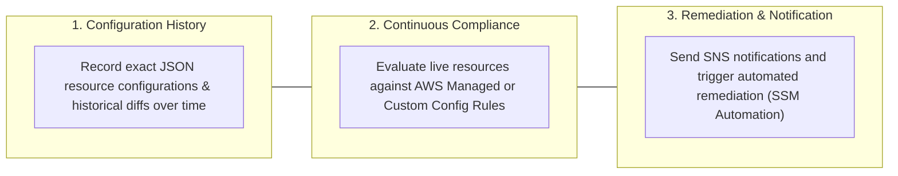
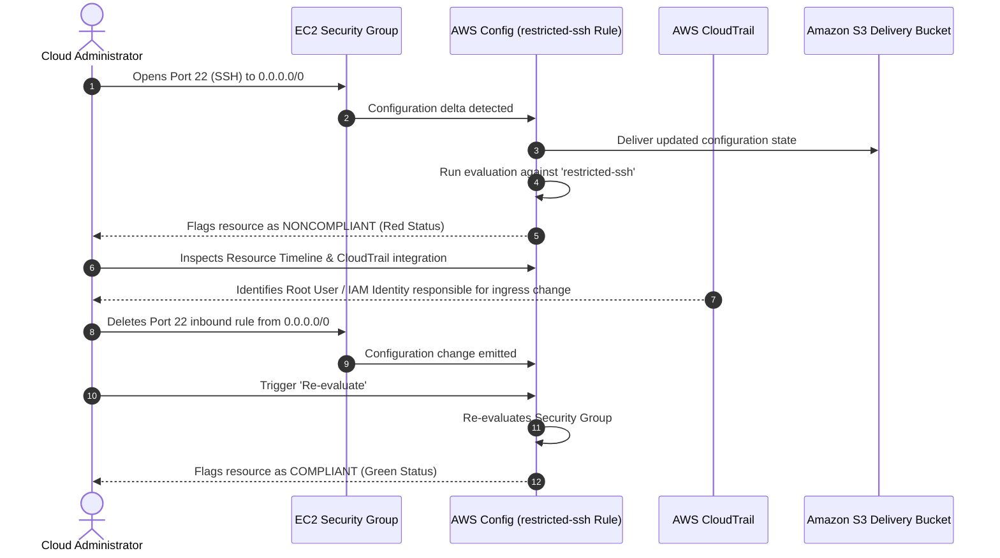

# AWS Config: Configuration Auditing, Compliance Tracking, Resource Timelines & Remediation

---

## Key Takeaways

**AWS Config** is a fully managed governance service that continually assesses, audits, and evaluates the configurations of your AWS resources against desired baselines. It records configuration histories and evaluates changes against predefined or custom **Config Rules** to alert on drift and compliance violations.

Key principles to remember for the exam:

- **Core Purpose:** Answers **"What did my resource look like at any point in time?"** and **"Is my infrastructure currently compliant with organizational security policies?"**
- **Config Rules:** Automated compliance guardrails (e.g., detecting if SSH port 22 is open to `0.0.0.0/0`, verifying S3 public access blocks, or ensuring SageMaker notebook instances have encryption enabled).
- **Resource Timeline:** A historical ledger providing visual timelines of all changes made to a resource, tracking configuration diffs across updates.  
  
- **CloudTrail Correlation:** Links directly with **AWS CloudTrail** so you can view not only the delta of what changed on the resource, but also the identity (user, role, IP) that executed the API call.  
  
- **Regional with Multi-Account/Multi-Region Aggregation:** AWS Config runs on a per-region basis, but you can configure **Aggregators** to compile inventory and compliance statuses across multiple regions and accounts into a centralized dashboard.

---

## Main Discussion

### The Three Operational Pillars of AWS Config

1. **Configuration Recording & Historical Ledger:**
   - AWS Config records the relationships and point-in-time states of supported resources into a **Configuration Item (CI)** whenever an API or manual change occurs.
   - Configuration data is periodically delivered to an **Amazon S3 bucket**, where teams can perform SQL queries using **Amazon Athena** or archive snapshots for external auditors.
2. **Compliance Evaluation with Config Rules:**
   - **AWS Managed Rules:** Pre-packaged rules authored and maintained by AWS (e.g., `restricted-ssh`, `s3-bucket-level-public-access-prohibited`, `sagemaker-notebook-instance-kms-key-configured`).  
     
   - **Custom Rules:** Built using AWS Lambda functions or Guard DSL to validate custom business logic.
   - Resources are flagged as **Compliant** or **Noncompliant** in near-real time or upon scheduled evaluations.  
     
3. **CloudTrail Correlation & Automated Remediation:**
   - **AWS Config vs. AWS CloudTrail:** CloudTrail logs **API events** (who called which API, when, and from where). Config logs the resulting **resource state and compliance** (what the resource looks like after the API call).
   - **Remediation Action:** You can attach AWS Systems Manager (SSM) Automation runbooks to Config Rules to automatically remediate noncompliant resources (e.g., automatically revoking an open security group ingress rule).

---

### Step-by-Step Compliance Cycle: Identifying & Resolving Configuration Drift

---

### Comparison: AWS Config vs. AWS CloudTrail vs. Amazon CloudWatch

Understanding the boundaries between these governance and monitoring services is essential for AWS exams:

| Feature Dimension             | AWS Config                                                                                                   | AWS CloudTrail                                                                             | Amazon CloudWatch                                                                          |
| ----------------------------- | ------------------------------------------------------------------------------------------------------------ | ------------------------------------------------------------------------------------------ | ------------------------------------------------------------------------------------------ |
| **Primary Question Answered** | _"What does the resource look like, how has it changed, and is it compliant?"_                               | _"Who made the API call, when, and from what IP address?"_                                 | _"What are the current performance metrics, logs, and operational health states?"_         |
| **Data Captured**             | Resource configuration items (CIs), relationships, and rule compliance statuses.                             | API call history, user identity, event timestamps, source IP, request parameters.          | CPU/GPU utilization, network metrics, application logs, and metric threshold alarms.       |
| **Key AI/ML Use Case**        | Ensuring SageMaker endpoints, training volumes, and S3 datasets comply with encryption and privacy policies. | Auditing who invoked an Amazon Bedrock foundation model or modified an inference endpoint. | Monitoring model inference latency, error rates (`4XX`/`5XX`), and GPU memory consumption. |

---

## Exam Guide

### Exam Tips

- **Keywords for AWS Config:** Whenever a scenario highlights **evaluating compliance over time**, **tracking configuration changes**, **configuration drift**, or **auditing whether security groups/S3 buckets meet specific standards**, the answer is **AWS Config**.
- **Config vs. CloudTrail Distinction (High Frequency):**
  - Need to audit the **user identity** behind an API call? $\rightarrow$ **AWS CloudTrail**.
  - Need to inspect the **point-in-time configuration** of a resource and verify if it matches security policies? $\rightarrow$ **AWS Config**.
- **S3 Storage of State:** Config stores its periodic configuration snapshots and history logs directly into **Amazon S3**, which can then be queried using **Amazon Athena**.
- **Multi-Account & Multi-Region Aggregation:** AWS Config can aggregate configuration and compliance data across multiple AWS accounts and regions into a single centralized view using an **Aggregator**.
- **Billing Awareness:** AWS Config charges per configuration item recorded and per rule evaluation; it is not a zero-cost default service.

---

### Practice Test

#### Question 1

An enterprise deploying machine learning pipelines in Amazon SageMaker must comply with an internal policy requiring all data storage resources and model training volumes to have encryption at rest enabled. The governance team needs an automated service that continuously checks whether active storage and compute resources comply with this policy and records historical changes over time. Which AWS service should be implemented?

- [ ] A. Amazon CloudWatch
- [ ] B. AWS Config
- [ ] C. AWS CloudTrail
- [ ] D. AWS Artifact

Correct Answer

- [x] B. AWS Config
  - **Explanation:** **AWS Config** continually evaluates, audits, and records the configurations of your AWS resources against desired baseline rules (such as checking if storage encryption at rest is enabled) and maintains a historical timeline of changes.

---

#### Question 2

A security engineer receives an alert that a production security group inadvertently permitted unrestricted public ingress access on SSH Port 22. The engineer needs to identify the exact point in time when the security group became noncompliant and see which IAM identity executed the change. How can the engineer accomplish this using AWS services?

- [ ] A. Use Amazon Macie to inspect the S3 access logs and generate an alert
- [ ] B. Check the Resource Timeline in AWS Config to see when the compliance state shifted and follow the integrated CloudTrail link to view the associated API event and identity
- [ ] C. Query AWS Artifact to download the SOC 2 compliance report for the region
- [ ] D. View the billing dashboard to check for compute instance usage spikes

Correct Answer

- [x] B. Check the Resource Timeline in AWS Config to see when the compliance state shifted and follow the integrated CloudTrail link to view the associated API event and identity
  - **Explanation:** **AWS Config** tracks the compliance timeline and configuration history of resources, showing exactly when a resource transitioned from compliant to noncompliant. Its native integration with **AWS CloudTrail** allows the engineer to view the underlying API event and identify the user or role that executed the change.

---
