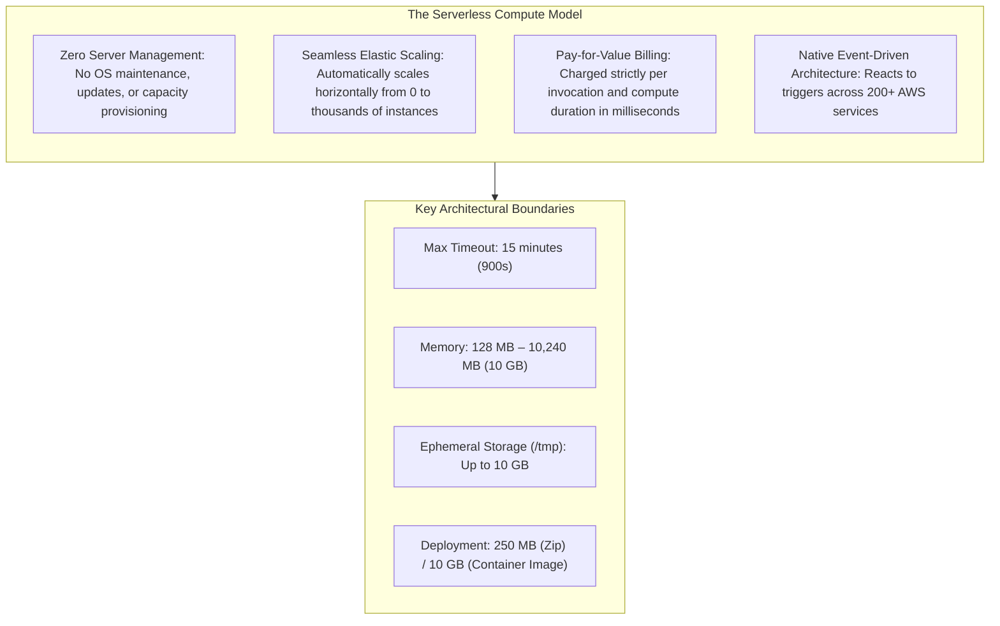
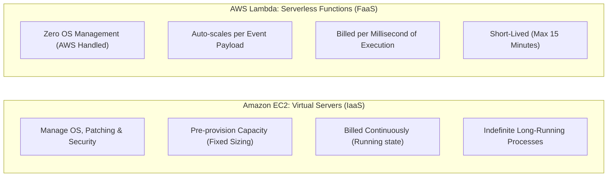
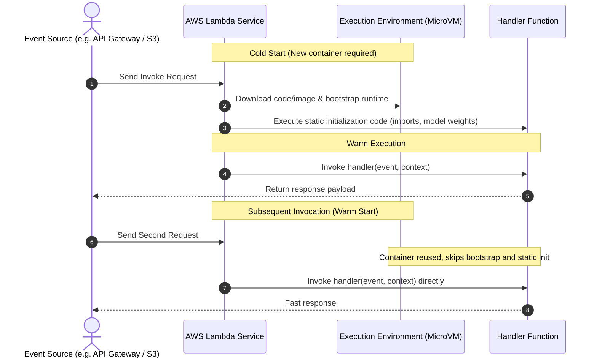
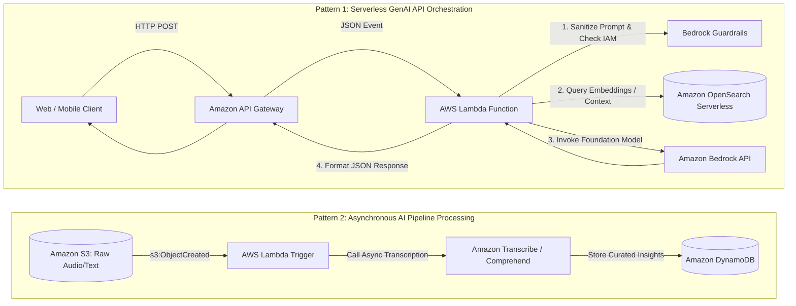

# AWS Lambda: Serverless Architecture, Core Mechanics & AI/ML Workflows

---

## Key Takeaways

**AWS Lambda** is a serverless compute service that runs code in response to events and automatically manages the underlying compute resources. It eliminates the operational overhead of provisioning, scaling, patching, and maintaining virtual machines or container infrastructure.

Key takeaways for the exam:

- **Serverless Compute:** You focus exclusively on your business logic. AWS provisions execution environments, runs the code, scales capacity to meet incoming demand, and tears down idle resources.
- **Cost Efficiency:** Billed on request count and execution duration rounded to the nearest millisecond, scaled by allocated memory. When idle, compute cost is exactly zero.
- **Architectural Boundaries:**
  - **Timeout:** Configurable from 1 second up to a hard maximum of **15 minutes (900 seconds)**.
  - **Memory:** Configurable from 128 MB to 10,240 MB (10 GB). Allocating more memory automatically allocates proportional vCPU compute power.
- **AI/ML Position:** Lambda acts as the operational orchestrator and "glue" for AI pipelines—handling real-time prompt preprocessing, input validation, invoking foundation models via **Amazon Bedrock**, or triggering **Amazon Rekognition** and **Amazon Comprehend** upon file uploads.

---

## Main Discussion

### Serverless vs. Traditional Compute (EC2 vs. Lambda)

| Architectural Dimension | Amazon EC2 (IaaS)                                                                            | AWS Lambda (Serverless / FaaS)                                                                        |
| ----------------------- | -------------------------------------------------------------------------------------------- | ----------------------------------------------------------------------------------------------------- |
| **Administration**      | Full control over the guest OS, kernel modules, drivers, and runtime libraries.              | Managed entirely by AWS; you upload code or container images.                                         |
| **Scaling**             | Configured manually or via Auto Scaling Groups (takes minutes to spin up instances).         | Instantaneous, automated horizontal concurrency per incoming request.                                 |
| **Cost Model**          | Billed per second for running instances, regardless of whether workloads are active or idle. | Billed strictly per request and duration of execution; zero cost when no events trigger the function. |
| **Execution Duration**  | Unconstrained; instances can run continuously for years.                                     | Strictly bound by a 15-minute maximum execution timeout per invocation.                               |
| **Primary AI Use Case** | Large-scale model training, distributed clusters, heavy GPU/Trainium hardware jobs.          | Event triggers, prompt sanitization, RAG pre/post-processing, serverless model API invocation.        |

---

### Lambda Execution Lifecycle & Cold Starts

Understanding the execution lifecycle helps optimize performance in latency-sensitive applications (such as real-time GenAI chatbots):

- **Cold Start:** Occurs when a function is invoked for the first time or after scaling up. AWS provisions a secure microVM, downloads your code, and runs initialization code (such as importing libraries like `boto3` or loading lightweight models into memory).
- **Warm Start:** If subsequent requests arrive while an execution container remains warm, Lambda reuses the existing container, skipping initialization and executing the handler immediately.
- **Optimization Pattern:** Place persistent database connections, AWS SDK client instantiations (e.g., `bedrock_client = boto3.client('bedrock-runtime')`), and static assets outside the main handler function so they persist across warm invocations.

---

### AWS Lambda in Generative AI & Machine Learning Architectures

Lambda functions frequently serve as the glue in modern cloud-native AI architectures:

1. **RAG & Prompt Orchestration:** An API Gateway endpoint invokes a Lambda function that coordinates a Retrieval Augmented Generation (RAG) query—retrieving matching documents from a vector database and submitting the enriched prompt to an **Amazon Bedrock** model.
2. **Event-Driven Data Extraction:** Uploading documents, audio, or images to an **Amazon S3** bucket triggers a Lambda function to call managed AI services like **Amazon Textract**, **Amazon Transcribe**, or **Amazon Rekognition** without maintaining dedicated polling servers.  
   
3. **Guardrail Pre-Validation:** Inspecting and sanitizing user inputs before passing payloads into expensive foundation model endpoints to reduce costs and intercept prompt injection attempts early.

---

## Exam Guide

### Exam Tips

- **Serverless Compute Identity:** AWS Lambda is the core **Serverless Functions-as-a-Service (FaaS)** platform on AWS.
- **The 15-Minute Rule (Crucial Exam Distractor):**
  - Maximum timeout is **15 minutes**.
  - Any workload described as taking hours (e.g., distributed training of deep neural networks) **cannot run on Lambda**. The correct answer will involve **Amazon SageMaker Training Jobs**, **AWS Batch**, or **Amazon EC2**.
- **Billing Dimensions:** Billed on total request count and duration measured in **milliseconds**, scaled by configured memory.
- **IAM Execution Roles:** Lambda functions must assume an IAM role with a trust policy for `lambda.amazonaws.com`. To write telemetry and logs, the role must include permissions for **Amazon CloudWatch Logs** (typically via the managed policy `AWSLambdaBasicExecutionRole`).
- **Container Support:** Lambda functions can be packaged as container images up to **10 GB** in size, which is useful when bundling large Python libraries (such as NumPy, PyTorch, or tokenizers) that exceed standard 250 MB uncompressed zip limits.

---

### Practice Test

#### Question 1

A startup wants to build a lightweight API endpoint that takes a customer query, adds internal product metadata, and passes the augmented prompt to an Amazon Bedrock foundation model. The application experiences sporadic traffic with long periods of zero activity. The solutions architect wants to minimize operational maintenance and eliminate infrastructure costs during idle periods. Which service should host this integration logic?

- [ ] A. Amazon EC2 using On-Demand instances
- [ ] B. AWS Lambda
- [ ] C. Amazon EMR cluster
- [ ] D. Amazon SageMaker Notebook Instance

Correct Answer

- [x] B. AWS Lambda
  - **Explanation:** **AWS Lambda** is a serverless compute service that automatically executes code in response to API events and scales to zero when no traffic is present, eliminating costs when idle and removing the need to manage underlying servers.

---

#### Question 2

An engineer is designing an automated workflow to process incoming invoices. When a PDF invoice is saved to an Amazon S3 bucket, it needs to be processed by Amazon Textract to extract line items, and the extracted data must be saved to Amazon DynamoDB. The processing time for each invoice averages 30 seconds. Which architecture provides the most cost-effective and operationally simple solution?

- [ ] A. An Amazon EC2 instance that continuously polls the S3 bucket every 10 seconds
- [ ] B. An S3 Event Notification configured to invoke an AWS Lambda function that calls Amazon Textract and writes results to DynamoDB
- [ ] C. A persistent Amazon EMR cluster running an Apache Spark job
- [ ] D. An AWS Glue ETL streaming job running 24/7

Correct Answer

- [x] B. An S3 Event Notification configured to invoke an AWS Lambda function that calls Amazon Textract and writes results to DynamoDB
  - **Explanation:** An **S3 Event Notification triggering an AWS Lambda function** is the standard event-driven serverless pattern on AWS. It executes only when a file arrives, runs well within the 15-minute Lambda execution limit (taking only 30 seconds), calls Amazon Textract, and requires zero ongoing server administration.

---
