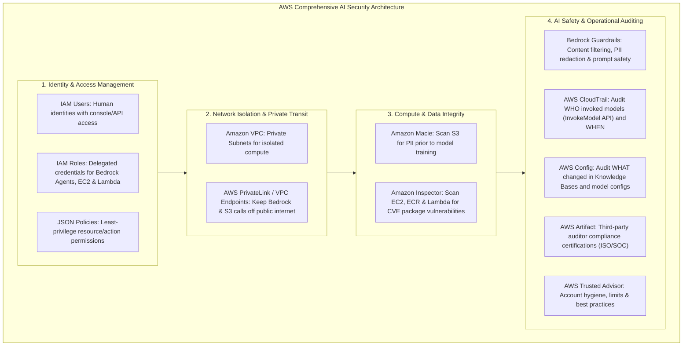
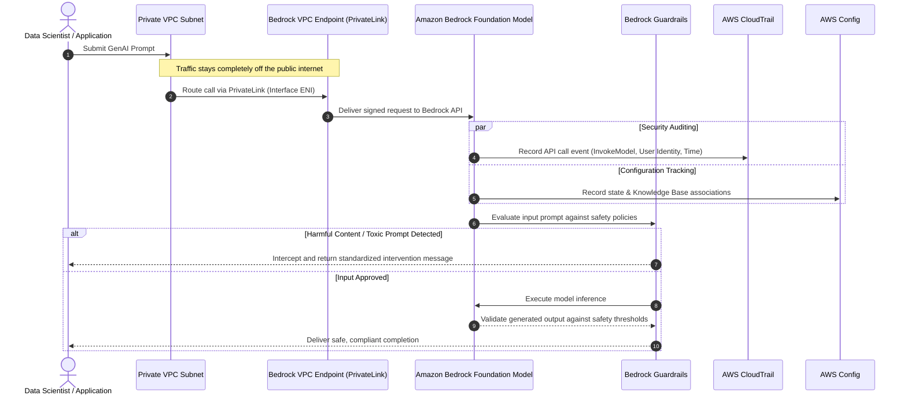

# AWS Security Services Synthesis: Comprehensive Mapping, Bedrock Security Integrations & AI Governance

---

## Key Takeaways

Securing artificial intelligence and machine learning systems on AWS requires a defense-in-depth approach that spans identity, compute isolation, data privacy, vulnerability management, compliance tracking, and specialized Generative AI guardrails.

- **The Core Security Matrix:** Every foundational AWS security service fulfills a distinct operational role. Confusing their scopes (e.g., Macie vs. Inspector vs. Config) is one of the most common pitfalls on the AIF-C01 exam.
- **Amazon Bedrock Unified Security Stack:**
  - **IAM:** Controls _who_ can access foundation models and allows Bedrock Agents to assume execution roles.
  - **Bedrock Guardrails:** Evaluates prompts and completions at runtime to block toxic content, enforce organizational safety policies, and redact sensitive terms.
  - **AWS PrivateLink:** Ensures API invocations to Bedrock stay entirely within the private AWS network boundary without traversing the public internet.
  - **AWS CloudTrail:** Captures immutable audit records of all API actions (e.g., `InvokeModel`, `CreateKnowledgeBase`).
  - **AWS Config:** Tracks configuration drift on Bedrock resources, such as changes to vector knowledge bases or provisioned throughput.

---

## Main Discussion

### The Master AWS Security Disambiguation Matrix

This reference chart maps the key security services studied across previous modules:

| Service                             | Target Scope             | Primary Evaluation Function                                                                                 | Core Exam Keyword Trigger                                                             |
| ----------------------------------- | ------------------------ | ----------------------------------------------------------------------------------------------------------- | ------------------------------------------------------------------------------------- |
| **AWS IAM**                         | Identities & Services    | Authentication, authorization, JSON permission policies, temporary service roles.                           | _"Least privilege", "Role for Bedrock Agent", "Cross-account access"_                 |
| **Amazon Macie**                    | **Amazon S3 Buckets**    | Discovers sensitive data (PII, PHI, financial data) using ML and pattern matching.                          | _"Find PII in S3 before training a model", "Credit card numbers in data lake"_        |
| **Amazon Inspector**                | **EC2, ECR, Lambda**     | Scans for software package vulnerabilities (CVEs) and unintended network exposure.                          | _"Container image scanning", "CVE detection", "EC2 operating system vulnerabilities"_ |
| **AWS Config**                      | AWS Resources            | Records configuration history, evaluates compliance rules, and detects drift over time.                     | _"Configuration drift", "Resource compliance timeline", "Audit security group rules"_ |
| **AWS CloudTrail**                  | Account API Actions      | Records user and service API requests across the Console, CLI, and SDKs.                                    | _"Who deleted the resource?", "Audit InvokeModel API calls", "API call history"_      |
| **AWS Artifact**                    | Compliance Documentation | Self-service portal to download AWS's third-party compliance reports (SOC, ISO) and sign BAAs.              | _"SOC 2 report", "ISO 27001", "Sign HIPAA BAA agreement"_                             |
| **AWS Trusted Advisor**             | Whole AWS Account        | Inspects account health across 6 pillars: Cost, Performance, Security, Fault Tolerance, Limits, Operations. | _"Check service quotas/limits", "Account-level best practice recommendations"_        |
| **AWS PrivateLink (VPC Endpoints)** | VPC to AWS Services      | Enables private, internal connectivity to AWS APIs without crossing the public internet.                    | _"Invoke Bedrock privately", "No internet gateway", "Keep traffic on AWS network"_    |

---

### Amazon Bedrock End-to-End Security Architecture

Amazon Bedrock serves as a prime example of how these security components work together across an enterprise Generative AI workload:

1. **Pre-Ingestion Hygiene (Amazon Macie):** Raw enterprise documents destined for Bedrock Knowledge Bases are scanned in Amazon S3 to scrub unmasked customer PII before vector embeddings are generated.
2. **Access Control (AWS IAM):** Data scientists and application runtimes assume IAM roles restricted with least-privilege policies (e.g., granting `bedrock:InvokeModel` only on designated model ARNs). Bedrock Agents assume dedicated execution roles to query vector stores and invoke external Lambda action groups.
3. **Private Network Transit (AWS PrivateLink):** Compute instances residing in private subnets without Internet Gateways or NAT Gateways route all inference calls to Bedrock over VPC Interface Endpoints.
4. **Runtime Safety (Bedrock Guardrails):** Evaluates incoming user inputs and outgoing model completions to enforce safety policies, filter hate speech and sexual content, block restricted topics, and mask remaining PII on the fly.
5. **Traceability (AWS CloudTrail):** Every `InvokeModel`, `CreateAgent`, or model customization call is logged with the caller's identity, source IP, and timestamp for post-incident audits.
6. **Configuration Auditing (AWS Config):** Continuous recording tracks any changes made to Bedrock Knowledge Bases, data sources, or throughput settings over time to ensure regulatory compliance.

---

## Exam Guide

### Exam Tips

- **The "Pre-Training Data Scrubbing" Pattern:** If an exam question asks how to ensure raw training files stored in S3 do not contain unencrypted Personally Identifiable Information (PII) before training or fine-tuning an AI model, the answer is **Amazon Macie**.
- **Bedrock Guardrails vs. IAM Policies:**
  - **IAM Policies:** Regulate **administrative and API access** (who has permission to invoke a model or configure an endpoint).
  - **Bedrock Guardrails:** Regulate **content safety and model behavior** at runtime (filtering toxic prompts, blocking restricted topics, and redacting sensitive data in prompts and responses).
- **Private Connectivity:** When a scenario specifies that sensitive enterprise data must reach Bedrock **without traversing the public internet**, choose **VPC Endpoints / AWS PrivateLink**.
- **Auditing Scenarios:**
  - To answer _"Who called the model API and at what time?"_ $\rightarrow$ **AWS CloudTrail**.
  - To answer _"Has the configuration of the model or knowledge base drifted from our compliance baseline?"_ $\rightarrow$ **AWS Config**.
  - To answer _"Does AWS hold external certifications proving their physical infrastructure is secure?"_ $\rightarrow$ **AWS Artifact**.

---

### Practice Test

#### Question 1

An enterprise AI engineering team is deploying an internal conversational assistant powered by Amazon Bedrock. Company security policy mandates that:

1. Training datasets stored in Amazon S3 must be scanned for customer Personally Identifiable Information (PII) before processing.
2. All model invocation traffic from applications in a private VPC must never traverse the public internet.
3. User prompts and model responses must be filtered for prohibited topics and harmful content at runtime.

Which combination of AWS services and features fulfills these requirements?

- [ ] A. Amazon Inspector, AWS Direct Connect, and AWS Config
- [ ] B. Amazon Macie, AWS PrivateLink (VPC Endpoints), and Amazon Bedrock Guardrails
- [ ] C. Amazon GuardDuty, NAT Gateway, and AWS Artifact
- [ ] D. AWS Trusted Advisor, Internet Gateway, and IAM Role Policies

Correct Answer

- [x] B. Amazon Macie, AWS PrivateLink (VPC Endpoints), and Amazon Bedrock Guardrails
  - **Explanation:** **Amazon Macie** automatically scans S3 buckets for sensitive PII data prior to model ingestion; **AWS PrivateLink** (VPC Endpoints) ensures traffic between the VPC and Amazon Bedrock stays within the AWS private network; and **Amazon Bedrock Guardrails** provides runtime content filtering, topic blocking, and PII redaction on inputs and completions.

---

#### Question 2

A regulatory agency requires an organization to provide an audit trail demonstrating which application services invoked foundation models via Amazon Bedrock over the past 60 days, including the caller identity and timestamps. Which service should the team query to produce this audit log?

- [ ] A. AWS Config
- [ ] B. AWS CloudTrail
- [ ] C. Amazon Inspector
- [ ] D. AWS Artifact Reports

Correct Answer

- [x] B. AWS CloudTrail
  - **Explanation:** **AWS CloudTrail** captures and records API calls made to AWS services, including `InvokeModel` requests to Amazon Bedrock. It provides the caller identity, request timestamp, source IP address, and request parameters required for compliance audits.

---
