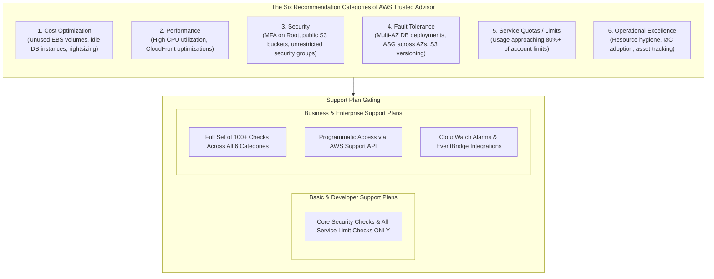
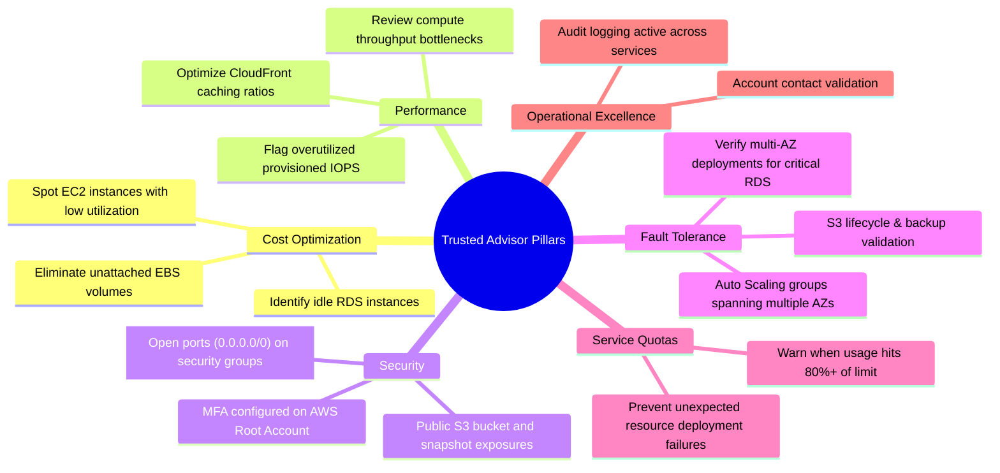
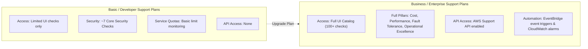

# AWS Trusted Advisor: Account Health Checks, Six Core Pillars & Support Tier Access

---

## Key Takeaways

**AWS Trusted Advisor** is an online tool that acts as a automated cloud consultant, continuously evaluating your AWS account against AWS best practices across **six core categories**. It inspects your deployed resources and generates actionable recommendations to help you optimize costs, enhance performance, harden security, improve fault tolerance, track service quotas, and maintain operational excellence.

- **Zero Installation / Agentless:** No agents, sidecars, or daemons to install. Trusted Advisor inspects your account configurations directly through metadata.
- **Six Recommendation Categories:** Cost Optimization, Performance, Security, Fault Tolerance, Service Quotas (formerly Service Limits), and Operational Excellence.
- **Core vs. Full Check Sets (Support Tier Gating):**
  - **Basic & Developer Support:** Grants access to **Core Security checks** (e.g., MFA on Root, S3 Bucket Permissions, Security Groups - Specific Ports Unrestricted) and **Service Quotas** checks.
  - **Business & Enterprise Support:** Unlocks the **complete catalog of 100+ checks** across all six categories, plus programmatic API access via the **AWS Support API**.
- **Visual Status Indicators:** Evaluates each check as **OK / Green** (no problem detected), **Investigation Recommended / Yellow** (potential issue or suboptimal configuration), or **Action Recommended / Red** (severe risk or high-priority remediation needed).

---

## Main Discussion

### The Six Evaluation Pillars Explained

1. **Cost Optimization:**
   - Flags idle or underutilized resources, such as Amazon EC2 instances with low CPU utilization, unassociated Elastic IP addresses, or unattached Amazon EBS volumes, directly reducing cloud spend.
2. **Performance:**
   - Identifies compute, storage, and networking bottlenecks, advising on rule adjustments, instance scaling, or Amazon CloudFront distribution configurations.
3. **Security:**
   - Checks whether Multi-Factor Authentication (MFA) is enabled on the AWS root account, validates that security groups do not expose administrative ports (e.g., SSH port 22, RDP port 3389) to `0.0.0.0/0`, and verifies that Amazon S3 buckets or EBS/RDS snapshots are not inadvertently made public.
4. **Fault Tolerance:**
   - Confirms whether workloads are architected for high availability—such as verifying that Auto Scaling Groups span multiple Availability Zones, RDS instances use Multi-AZ failover, and S3 versioning is active.
5. **Service Quotas (Service Limits):**
   - Monitors your actual resource usage against AWS regional quotas (e.g., maximum VPCs per region, maximum EC2 vCPUs). It flags resources that have reached 80% or more of their allowable limit so you can request limit increases proactively.
6. **Operational Excellence:**
   - Validates account hygiene, communication contacts, and deployment practices to ensure standard maintenance and operational workflows run smoothly.

---

### Support Plan Gating & Architectural Integration

A recurring topic across AWS foundational exams is understanding which features unlock with premium support tiers:

| Dimension                | Basic & Developer Support              | Business & Enterprise Support                                                                                         |
| ------------------------ | -------------------------------------- | --------------------------------------------------------------------------------------------------------------------- |
| **Available Categories** | Core Security & Service Quotas only.   | **All 6 Categories** (Cost, Performance, Security, Fault Tolerance, Service Quotas, Operational Excellence).          |
| **Available Checks**     | Limited core set (~7 security checks). | **Full catalog (100+ checks)**.                                                                                       |
| **Programmatic Access**  | Console only; no API access.           | Full programmatic integration via the **AWS Support API**.                                                            |
| **Automated Monitoring** | Manual console review.                 | Integration with **Amazon EventBridge** and **Amazon CloudWatch** to automate notifications or remediation workflows. |

---

### Trusted Advisor vs. AWS Config vs. Amazon Inspector vs. Security Hub

Because AWS provides multiple security and governance tools, keeping their distinct responsibilities straight is essential:

| Service                 | Primary Question Answered                                                                                      | Evaluation Focus                                                                                               |
| ----------------------- | -------------------------------------------------------------------------------------------------------------- | -------------------------------------------------------------------------------------------------------------- |
| **AWS Trusted Advisor** | _"Is my entire AWS account following AWS best practices across cost, security, performance, and limits?"_      | High-level account assessment, cost waste, and best practice compliance.                                       |
| **AWS Config**          | _"Did this specific resource change state, and does its configuration comply with our defined rule?"_          | Resource-level configuration history, compliance baselines, and configuration drift.                           |
| **Amazon Inspector**    | _"Are there known software vulnerabilities (CVEs) or open network paths on my EC2, ECR, or Lambda workloads?"_ | Package vulnerability scanning and network reachability.                                                       |
| **AWS Security Hub**    | _"What is my consolidated security posture and CIS/PCI compliance score across all security tools?"_           | Centralized security dashboard aggregating findings from Inspector, Macie, GuardDuty, and IAM Access Analyzer. |

---

## Exam Guide

### Exam Tips

- **Six Categories (High Frequency):** Be prepared to identify the six pillars:
  1. Cost Optimization
  2. Performance
  3. Security
  4. Fault Tolerance
  5. Service Quotas (formerly Service Limits)
  6. Operational Excellence
- **Support Tier Distinction (High Frequency):**
  - **Basic & Developer:** Provides access to **Core Security checks** (such as MFA on root, public S3 buckets, unrestricted security groups) and **Service Quotas**.
  - **Business & Enterprise:** Required to unlock the **full set of checks** (including all Cost Optimization and Performance checks) and to enable programmatic access via the **AWS Support API**.
- **Proactive Service Quota Monitoring:** If a question asks how an organization can be alerted _before_ hitting regional service limits (like maximum EC2 vCPUs or Elastic IPs), **AWS Trusted Advisor Service Quotas checks** (or Service Quotas directly) is the intended answer.
- **Agentless Architecture:** Trusted Advisor requires **no agent installation**; it performs assessments automatically using internal AWS telemetry.

---

### Practice Test

#### Question 1

A machine learning startup subscribed to the AWS Developer Support plan wants to use AWS Trusted Advisor to review automated recommendations for reducing monthly cloud infrastructure spend and identifying underutilized Amazon EC2 training instances. When opening the Trusted Advisor console, the team notices the Cost Optimization checks are unavailable. What must the startup do to view these Cost Optimization recommendations?

- [ ] A. Install the AWS Systems Manager Agent on all EC2 instances
- [ ] B. Upgrade their AWS Support plan to Business or Enterprise
- [ ] C. Enable AWS CloudTrail Insights in all active regions
- [ ] D. Deploy an AWS Config Aggregator across the account

Correct Answer

- [x] B. Upgrade their AWS Support plan to Business or Enterprise
  - **Explanation:** In AWS Trusted Advisor, customers on Basic and Developer Support plans only receive access to the **core security checks** and service quota checks. To unlock the full catalog of checks—including **Cost Optimization**, **Performance**, **Fault Tolerance**, and **Operational Excellence**—the account must be upgraded to **Business Support** or **Enterprise Support**.

---

#### Question 2

An infrastructure administrator is reviewing security configurations across an enterprise AWS account. Which of the following checks is included as part of the core security checks available to all AWS customers in AWS Trusted Advisor at no extra cost?

- [ ] A. Amazon S3 Bucket Permissions allowing global public read/write access
- [ ] B. Operating system patch status for Amazon EC2 instances
- [ ] C. Software library CVE vulnerabilities inside Amazon ECR container images
- [ ] D. Static code analysis of AWS Lambda functions

Correct Answer

- [x] A. Amazon S3 Bucket Permissions allowing global public read/write access
  - **Explanation:** The **Amazon S3 Bucket Permissions** check—which flags buckets with open public access or global read/write permissions—is one of the **core security checks** provided to all AWS accounts by default in AWS Trusted Advisor, regardless of support plan tier. Container scanning and OS vulnerability analysis are performed by **Amazon Inspector**, not Trusted Advisor.

---
