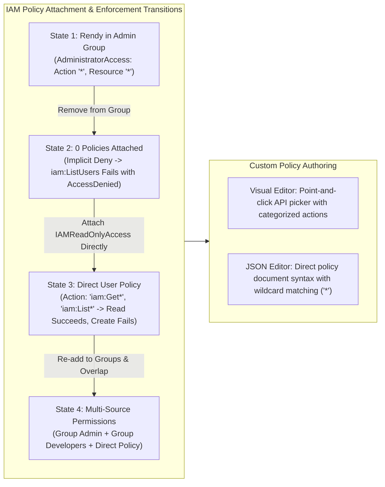
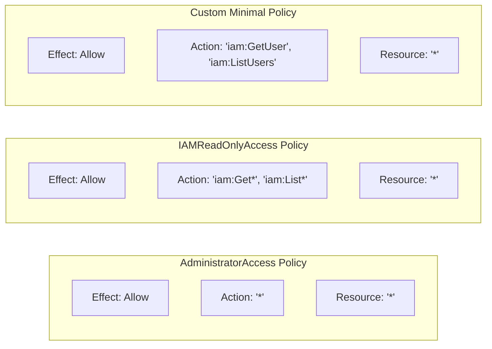

# Hands-On Lab: IAM Policy Evaluation, Explicit Permissions, Visual Editor & JSON Policy Authoring

---

## Key Takeaways

This lab illustrates how AWS evaluates permissions in real time: removing an identity from a group revokes inherited policies instantly, triggering default implicit denies (`AccessDenied`). Adding explicit read-only policies restores viewing permissions while blocking write and management actions.



- **Implicit Deny in Action:** By default, all API calls are implicitly denied until an explicit `Allow` statement applies. Removing a user from an admin group immediately produces `AccessDenied` errors for API actions such as `iam:ListUsers`.
- **Read-Only vs. Administrative Scope:** Attaching `IAMReadOnlyAccess` allows inspect operations (`Get*`, `List*`) but blocks mutating actions (like `iam:CreateGroup`), enforcing the principle of least privilege.
- **Wildcards (`*`):** In JSON policies, `*` matches any sequence of characters (e.g., `Action: "*"` matches all actions, while `iam:Get*` matches `iam:GetUser`, `iam:GetGroup`, etc.).
- **Multi-Source Permission Aggregation:** A single IAM user can receive permissions from multiple origins simultaneously: direct attachments, inline policies, and inherited group memberships.

---

## Hands-On Workflow: Step-by-Step Execution

1. **Test Admin Access & Trigger Implicit Deny:**
   - Open the IAM console with your administrative user in a secondary browser window.
   - Verify full access by viewing the **Users** and **User groups** lists.
   - In your primary/root window, open **User groups**, select `admin`, and remove the user.
   - Return to the secondary window and refresh. The console immediately returns an `AccessDenied` banner stating you lack permission to perform `iam:ListUsers`.
2. **Attach IAMReadOnlyAccess Directly to the User:**
   - Navigate to **Users** in the admin window and select the user identity.
   - Under the **Permissions** tab, click **Add permissions** $\rightarrow$ **Attach policies directly**.
   - Search for and select the AWS Managed Policy **`IAMReadOnlyAccess`**.
   - Click **Next** and confirm the attachment.
   - Switch back to the test window and refresh: user and group lists become visible again.
3. **Verify Read-Only Enforcement Against Mutating Actions:**
   - Attempt to create a new group named `developers` while authenticated with the read-only user.
   - Click **Create group**; the console displays an error banner blocking the operation.
   - The action fails because `IAMReadOnlyAccess` includes read operations (`Get*`, `List*`), but strictly omits mutating actions like `iam:CreateGroup`.
4. **Inspect Policy JSON Structures & Wildcard Patterns:**
   - In the main console, navigate to **Policies** and examine:
   - **`AdministratorAccess`:** Features `"Effect": "Allow"`, `"Action": "*"`, and `"Resource": "*"`, authorizing every API call across AWS.
   - **`IAMReadOnlyAccess`:** Uses wildcards across read actions, including `"Action": ["iam:Get*", "iam:List*"]` to capture all retrieval operations.
5. **Build a Scoped Policy via the Visual Editor:**
   - Navigate to **Policies** and click **Create policy**.
   - **Visual Editor:** Select the **IAM** service.
   - Select specific actions: check `ListUsers` under **List** and `GetUser` under **Read**.
   - Under **Resources**, select **All resources** (`*`).
   - Switch to the **JSON** tab to inspect the generated document:

   ```json
   {
     "Version": "2012-10-17",
     "Statement": [
       {
         "Sid": "VisualEditor0",
         "Effect": "Allow",
         "Action": ["iam:GetUser", "iam:ListUsers"],
         "Resource": "*"
       }
     ]
   }
   ```

   - Name the policy `MyIAMPermissions` and finish creation.

6. **Clean Up Temporary Resources:**
   - Restore your user's administrative configuration:
   - Add the user back to the `admin` group.
   - Remove the directly attached `IAMReadOnlyAccess` policy from the user profile.
   - Delete any temporary groups created during testing (e.g., `developers`).

---

## Policy JSON Comparison



| Policy                    | Effect  | Target Actions                           | Permission Boundary                                                                          |
| ------------------------- | ------- | ---------------------------------------- | -------------------------------------------------------------------------------------------- |
| **`AdministratorAccess`** | `Allow` | `*`                                      | Full administrative control across all AWS services and resources.                           |
| **`IAMReadOnlyAccess`**   | `Allow` | `iam:Generate*`, `iam:Get*`, `iam:List*` | Allows reading and listing all IAM configuration data; blocks creates, updates, and deletes. |
| **`MyIAMPermissions`**    | `Allow` | `iam:GetUser`, `iam:ListUsers`           | Scoped to two explicit read APIs; all other operations remain implicitly denied.             |

---

## Exam Guide

### Exam Tips

- **Wildcard Syntax (`*`):**
  - `"Action": "*"` means all API calls across all AWS services.
  - `"Action": "s3:Get*"` encompasses actions like `s3:GetObject` and `s3:GetBucketLocation`.
  - `"Resource": "*"` applies the statement to every resource compatible with the specified action.
- **Implicit Deny vs. Explicit Deny:**
  - **Implicit Deny:** The default state. If an action is not explicitly permitted by any policy, access is denied.
  - **Explicit Deny:** An explicit `"Effect": "Deny"` in an attached policy overrides all other `Allow` statements.
- **Visual Editor vs. JSON Editor:** Policies can be authored either visually (selecting services and action checkboxes) or by writing/pasting raw JSON syntax directly.
- **Policy Attachment Hierarchy:** IAM evaluates the union of all policies attached directly to a user alongside those inherited from every group the user belongs to.

---

### Practice Test

#### Question 1

A junior machine learning engineer is tasked with inspecting model artifacts and checking the status of training jobs in the Amazon SageMaker console. The engineer should not be able to create new endpoints, delete models, or modify training pipelines. What is the most operationally efficient way to configure these permissions?

- [ ] A. Assign the user to an administrative group and set an automated script to delete unapproved endpoints
- [ ] B. Attach an AWS managed read-only policy for SageMaker (such as `AmazonSageMakerReadOnly`) to the user's IAM group
- [ ] C. Use the root user credentials and restrict console access by IP address
- [ ] D. Create an IAM policy with `"Effect": "Allow"`, `"Action": "*"`, and `"Resource": "arn:aws:sagemaker:*:*:model/*"`

<details>
<summary>Correct Answer</summary>

- [x] B. Attach an AWS managed read-only policy for SageMaker (such as `AmazonSageMakerReadOnly`) to the user's IAM group
  - **Explanation:** Attaching an AWS managed read-only policy (`AmazonSageMakerReadOnly`) via an IAM group aligns with the principle of least privilege by granting list and read permissions across SageMaker resources while preventing creation, modification, or deletion actions.

</details>

---

#### Question 2

An IAM policy contains the following statement block:

```json
{
  "Effect": "Allow",
  "Action": "s3:List*",
  "Resource": "*"
}
```

Which action is permitted by this policy statement?

- [ ] A. Deleting an existing Amazon S3 bucket
- [ ] B. Listing the contents of any Amazon S3 bucket in the account
- [ ] C. Uploading training datasets to Amazon S3
- [ ] D. Modifying Amazon S3 bucket encryption keys in AWS KMS

<details>
<summary>Correct Answer</summary>

- [x] B. Listing the contents of any Amazon S3 bucket in the account
  - **Explanation:** The wildcard action `"s3:List*"` matches any S3 API operation that begins with `List`, such as `s3:ListBucket` and `s3:ListAllMyBuckets`, permitting the user to list bucket contents across all resources. Mutating operations like delete or upload are not included.

</details>

---
