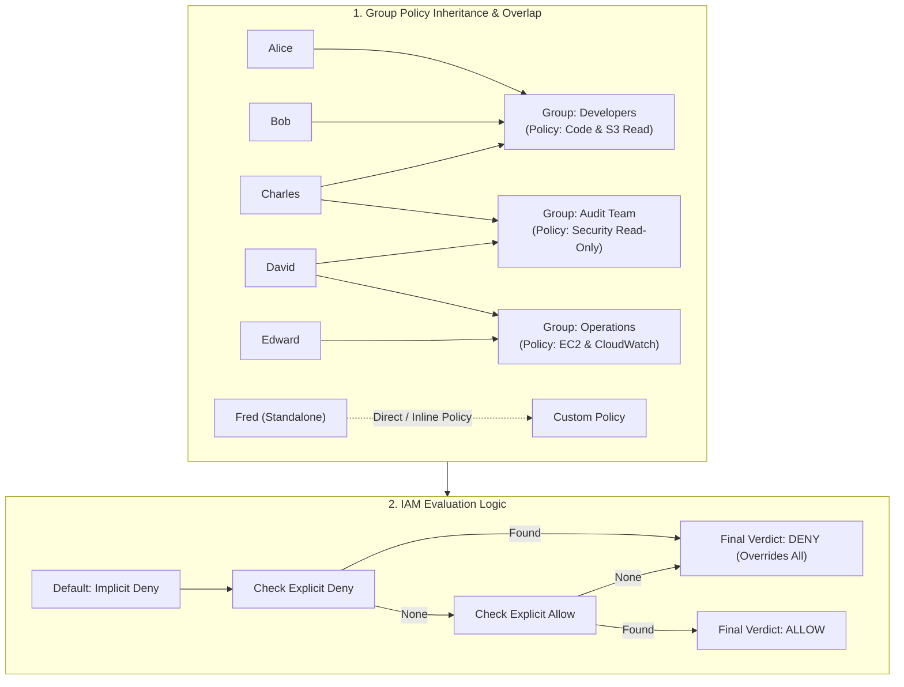
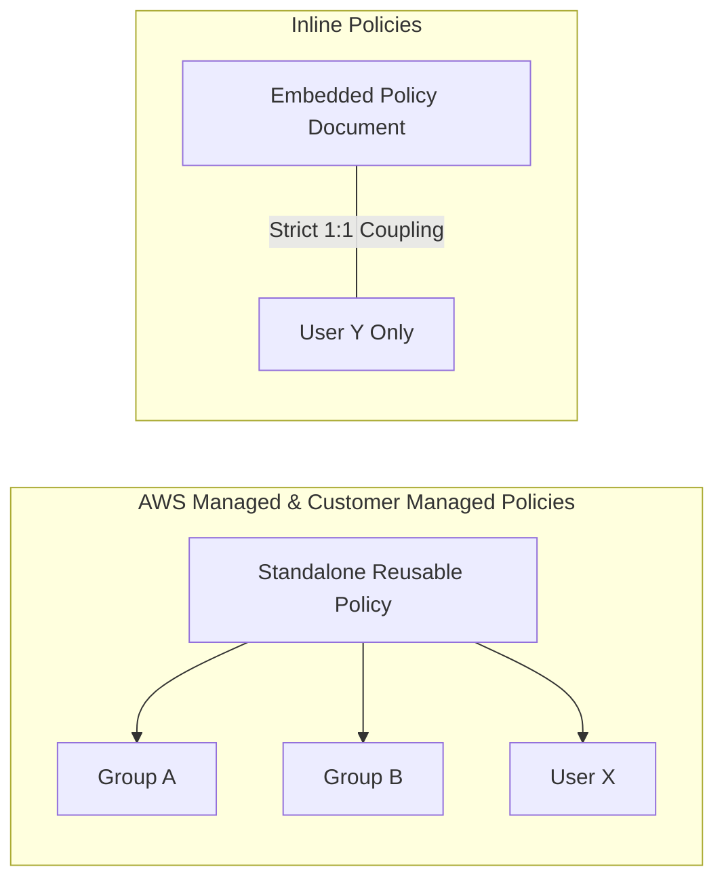
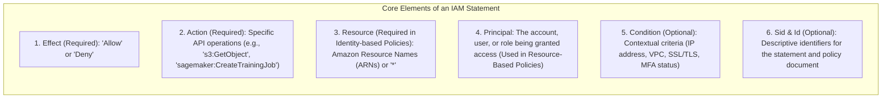

# AWS IAM Policies: Policy Inheritance, Inline vs. Managed Policies & JSON Document Structure

---

## Key Takeaways

**IAM Policies** are JSON documents that define permissions by specifying what actions are allowed or denied on specific AWS resources. Permissions can be inherited through group memberships or assigned directly to individual identities.



Key takeaways for the exam:

- **Multi-Group Policy Aggregation:** When a user belongs to multiple groups (such as Charles belonging to _Developers_ and _Audit_), their effective permissions are the **logical union** of all allowed statements across those groups, provided there is no explicit deny.
- **Inline vs. Managed Policies:** Managed policies can be attached to multiple identities and version-controlled independently. An **Inline Policy** is directly embedded into a single specific user, group, or role with a strict 1:1 relationship.
- **Core JSON Statement Elements:** Every IAM statement contains an `Effect` (`Allow` or `Deny`), an `Action` (API calls permitted or forbidden), and a `Resource` (target ARNs). Statements can optionally include an `Sid` (statement ID), a `Principal` (mandatory in resource-based policies), and a `Condition` (contextual constraints).
- **Explicit Deny Overrides:** An explicit deny always trumps an explicit allow, regardless of where or how the policies are attached.

---

## Main Discussion

### IAM Policy Types & Inheritance Mechanics



| Policy Type                 | Reusability                                                        | Version Control                                                                                     | Primary Use Case                                                   |
| --------------------------- | ------------------------------------------------------------------ | --------------------------------------------------------------------------------------------------- | ------------------------------------------------------------------ |
| **AWS Managed Policy**      | Reusable across multiple users, groups, and roles.                 | Managed and updated automatically by AWS (e.g., `AdministratorAccess`, `AmazonBedrockFullAccess`).  | Standardized service access across typical job functions.          |
| **Customer Managed Policy** | Reusable across multiple entities in your account.                 | Standalone policy with custom versioning (up to 5 versions) created and maintained by the customer. | Custom organizational roles and strict least-privilege scoping.    |
| **Inline Policy**           | **Non-reusable.** Strictly bound to a single user, group, or role. | Deleted automatically if the parent identity is deleted; no independent version control.            | Precise 1:1 exceptions or temporary overrides for a single entity. |

---

### Anatomy of an IAM Policy JSON Document

An IAM policy document contains the following structural components:

```json
{
  "Version": "2012-10-17",
  "Id": "S3AndSageMakerAccessPolicy",
  "Statement": [
    {
      "Sid": "AllowS3TrainingDataRead",
      "Effect": "Allow",
      "Action": ["s3:GetObject", "s3:ListBucket"],
      "Resource": [
        "arn:aws:s3:::corporate-ai-training-data",
        "arn:aws:s3:::corporate-ai-training-data/*"
      ]
    },
    {
      "Sid": "DenyUnencryptedInferenceTraffic",
      "Effect": "Deny",
      "Action": "sagemaker:InvokeEndpoint",
      "Resource": "arn:aws:sagemaker:*:*:endpoint/prod-*",
      "Condition": {
        "Bool": {
          "aws:SecureTransport": "false"
        }
      }
    }
  ]
}
```



#### Detailed Breakdown of JSON Fields

- **`Version`:** Specifies the policy language release. Always use `"2012-10-17"` (the current version supporting advanced conditions and variables).
- **`Statement`:** An array containing one or more policy statement blocks.
- **`Effect`:** Declares the access result—either `"Allow"` or `"Deny"`.
- **`Action`:** The specific service actions allowed or blocked (e.g., `["s3:GetObject", "sagemaker:InvokeEndpoint"]`). Wildcards (`*`) match multiple operations.
- **`Resource`:** Specifies the exact target resources using **Amazon Resource Names (ARNs)** (e.g., `arn:aws:s3:::my-bucket/*`).
- **`Principal`:** Specifies who or what the policy applies to. In standard **identity-based policies** (attached to users or groups), the principal is implicit (the attached user/group). In **resource-based policies** (like an S3 Bucket Policy or KMS Key Policy), the `Principal` field is required.
- **`Condition`:** Adds contextual constraints, such as requiring TLS transport (`aws:SecureTransport: true`) or restricting requests to a specific corporate IP range (`aws:SourceIp`).

---

## Exam Guide

### Exam Tips

- **Group Permission Combining:** A user belonging to multiple groups inherits permissions from **all** of those groups simultaneously.
- **The Override Rule:** If a user has an policy allowing `s3:GetObject`, but belongs to a second group with an explicit `"Effect": "Deny"` on `s3:GetObject`, **access is denied**. Explicit Deny always wins.
- **Principal Field Placement:**
  - **Identity-Based Policies:** Attached to IAM users, groups, or roles $\rightarrow$ **No Principal field** (it is implicitly the attached identity).
  - **Resource-Based Policies:** Attached to resources (e.g., S3 Bucket Policies, KMS Key Policies) $\rightarrow$ **Must contain a Principal field** to define who can access the resource.
- **Policy Version String:** `"2012-10-17"` is the required policy language version string.
- **Inline vs. Customer Managed:** Prefer customer-managed policies over inline policies for modularity, reusability across multiple users, and version tracking.

---

### Practice Test

#### Question 1

A data scientist belongs to the `AnalyticsGroup`, which has an IAM policy granting `Allow` on `s3:GetObject` for an S3 training bucket. The data scientist is also added to the `RestrictedAccessGroup`, which has an IAM policy containing `"Effect": "Deny"` on `s3:*` for all resources. What occurs when the data scientist attempts to read a dataset using `s3:GetObject`?

- [ ] A. The action succeeds because the `AnalyticsGroup` policy explicitly allows it
- [ ] B. The action succeeds because group permissions are evaluated in alphabetical order
- [ ] C. The action is denied because an explicit Deny in any applicable policy overrides an Allow
- [ ] D. The action triggers an automated escalation workflow in AWS Audit Manager

<details>
<summary>Correct Answer</summary>

- [x] C. The action is denied because an explicit Deny in any applicable policy overrides an Allow
  - **Explanation:** In AWS IAM authorization logic, an explicit **Deny** statement always takes absolute precedence over any explicit **Allow** statements, regardless of how or where the policies are attached.

</details>

---

#### Question 2

An administrator is reviewing the JSON definition of an IAM identity-based policy. Which combination of statement elements is required to define what operations are permitted on which AWS resources?

- [ ] A. `Version`, `Sid`, and `Id`
- [ ] B. `Effect`, `Action`, and `Resource`
- [ ] C. `Principal`, `Condition`, and `Sid`
- [ ] D. `Protocol`, `Port`, and `CIDR`

<details>
<summary>Correct Answer</summary>

- [x] B. `Effect`, `Action`, and `Resource`
  - **Explanation:** In an IAM identity-based policy statement, the three required elements are **`Effect`** (specifying Allow or Deny), **`Action`** (specifying the target API operations), and **`Resource`** (specifying the Amazon Resource Names of the target resources).

</details>

---
