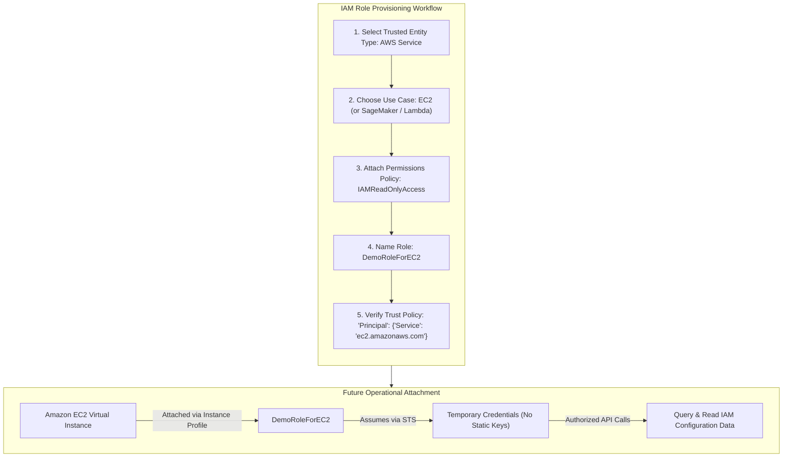
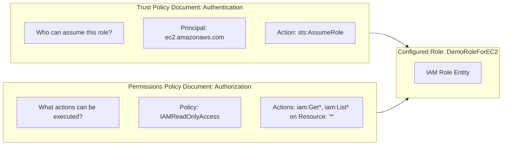

# Hands-On Lab: Provisioning AWS IAM Roles for AWS Services & Configuring Trusted Entities

---

## Key Takeaways

Creating an **IAM Role** establishes a non-human identity with an explicit trust relationship, allowing an AWS service (such as Amazon EC2, Amazon SageMaker, or AWS Lambda) to perform actions on your behalf using temporary, automatically managed credentials.



- **Trusted Entity Selection:** An IAM Role requires choosing who or what can assume it. The primary category for infrastructure workloads is an **AWS service** (e.g., EC2, Lambda, SageMaker).
- **Trust Policy Configuration:** Designating a use case like Amazon EC2 automatically writes a trust policy specifying `"Principal": { "Service": "ec2.amazonaws.com" }` with the `sts:AssumeRole` action.
- **Separation of Concerns:** Creating an IAM role is a separate step from attaching it. The role exists as an independent IAM identity in your account until it is bound to compute resources (via an EC2 Instance Profile, a SageMaker notebook lifecycle configuration, or a Lambda function execution configuration).
- **Exam Relevance:** AWS heavily tests the elimination of long-term credentials in favor of **IAM service roles** across both general compute (EC2) and AI services (SageMaker training jobs and Bedrock agents).

---

## Hands-On Workflow: Step-by-Step Role Creation

1. **Navigate to Roles in the IAM Console:**
   - Open the AWS Management Console and navigate to **IAM**.
   - In the left-hand navigation pane, click on **Roles**.
   - Observe any default or service-linked roles already present in the account.
   - Click **Create role** in the top-right corner.
2. **Select Trusted Entity Type & AWS Service Use Case:**
   - Under **Trusted entity type**, select **AWS service**.
   - Review the common use cases displayed in the console (e.g., **EC2**, **Lambda**).
   - Select **EC2** as the primary service use case.
   - Leave default options for standard EC2 instances and click **Next**.
3. **Attach an IAM Permissions Policy:**
   - In the **Add permissions** step:
   - Search for the AWS managed policy: **`IAMReadOnlyAccess`**.
   - Select the checkbox next to the policy name.
   - This grants the role permissions to read, list, and describe IAM resources (such as users, groups, and policies) without mutating permissions.
   - Click **Next**.
4. **Configure Role Name & Inspect the Trust Policy:**
   - In the **Name, review, and create** step:
   - **Role name:** Enter `DemoRoleForEC2`.
   - **Role description:** Keep or update the default descriptive text.
   - Inspect the **Select trusted entities** JSON block:

   ```json
   {
     "Version": "2012-10-17",
     "Statement": [
       {
         "Effect": "Allow",
         "Principal": {
           "Service": "ec2.amazonaws.com"
         },
         "Action": "sts:AssumeRole"
       }
     ]
   }
   ```

   - Note that this JSON document explicitly authorizes the Amazon EC2 service to assume this role.

5. **Create and Verify the Role:**
   - Review the attached permissions (`IAMReadOnlyAccess`) and click **Create role**.
   - Filter the role list to find `DemoRoleForEC2`.
   - Click on the role name to view its summary:
   - The **Permissions** tab confirms `IAMReadOnlyAccess` is attached.
   - The **Trust relationships** tab verifies that `ec2.amazonaws.com` is configured as the trusted principal.
   - The role is now ready to be attached to an EC2 virtual server in subsequent sections.

---

## Deep Dive: Architectural Role Structure



| Component              | Function in `DemoRoleForEC2`                          | What Happens if Missing?                                                                                      |
| ---------------------- | ----------------------------------------------------- | ------------------------------------------------------------------------------------------------------------- |
| **Role Name**          | Unique identifier (`DemoRoleForEC2`) in the account.  | Role cannot be referenced or created.                                                                         |
| **Trust Policy**       | Authorizes `ec2.amazonaws.com` to assume the role.    | EC2 instances cannot obtain credentials; the AWS CLI/SDK throws an authorization exception during assumption. |
| **Permissions Policy** | Grants `IAMReadOnlyAccess` (`iam:Get*`, `iam:List*`). | The instance can assume the role, but any API call to read IAM data fails with `AccessDenied`.                |

---

## Exam Guide

### Exam Tips

- **Trusted Entity Identification:** The first configuration step when creating an IAM role is selecting the **trusted entity type** (AWS service, AWS account, Web identity, or SAML 2.0 federation). For compute and ML workloads, the selection is **AWS service**.
- **Trust Policy Principal Syntax:**
  - EC2 instance role: `"Principal": { "Service": "ec2.amazonaws.com" }`
  - SageMaker training/notebook role: `"Principal": { "Service": "sagemaker.amazonaws.com" }`
  - Bedrock service role: `"Principal": { "Service": "bedrock.amazonaws.com" }`
- **Zero Static Secrets:** Attaching an IAM role to an AWS resource relies on the **AWS Security Token Service (STS)** to vend temporary credentials, completely avoiding the need to store `AWS_ACCESS_KEY_ID` and `AWS_SECRET_ACCESS_KEY` in environment variables or configuration files.
- **Instance Profile Concept:** In Amazon EC2, an IAM role is passed to the virtual machine via an **Instance Profile**, which acts as a container for the role.

---

### Practice Test

#### Question 1

A systems administrator creates an IAM role named `ModelAuditRole` intended to allow automated Python scripts running on an Amazon EC2 instance to read evaluation results from an Amazon S3 bucket. However, when the script runs on the instance, it cannot assume the role. Which configuration tab in the IAM role console must be inspected to verify that the EC2 service is allowed to assume the role?

- [ ] A. Permissions policies
- [ ] B. Permission boundaries
- [ ] C. Trust relationships
- [ ] D. Access Advisor

<details>
<summary>Correct Answer</summary>

- [x] C. Trust relationships
  - **Explanation:** The **Trust relationships** tab displays the role's Trust Policy (AssumeRole policy), which specifies the trusted `Principal` allowed to assume the role (such as `"Service": "ec2.amazonaws.com"`). If this relationship is missing or misconfigured, the EC2 service cannot assume the role.

</details>

---

#### Question 2

An AI practitioner is configuring an automated workflow where an Amazon SageMaker Processing Job cleans training data stored in Amazon S3. Which entity should be supplied to the SageMaker Processing Job to provide it with access to the S3 bucket in accordance with the principle of least privilege?

- [ ] A. An IAM User with programmatic access keys embedded in the preprocessing script
- [ ] B. The AWS root account access keys
- [ ] C. An IAM Role with a trust policy for `sagemaker.amazonaws.com` and permissions to read and write to the S3 bucket
- [ ] D. An IAM User Group with `AdministratorAccess` attached

<details>
<summary>Correct Answer</summary>

- [x] C. An IAM Role with a trust policy for `sagemaker.amazonaws.com` and permissions to read and write to the S3 bucket
  - **Explanation:** In accordance with AWS security best practices, services like Amazon SageMaker should be assigned an **IAM Role** that trusts `sagemaker.amazonaws.com` and contains a scoped permissions policy granting access only to the necessary S3 buckets. Services and automated jobs must never use hardcoded IAM user keys or root credentials.

</details>

---
