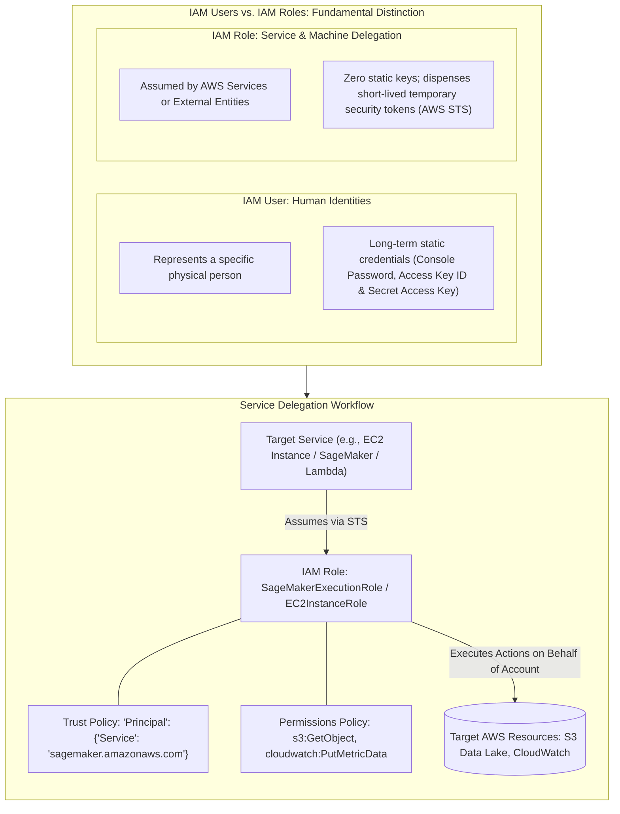
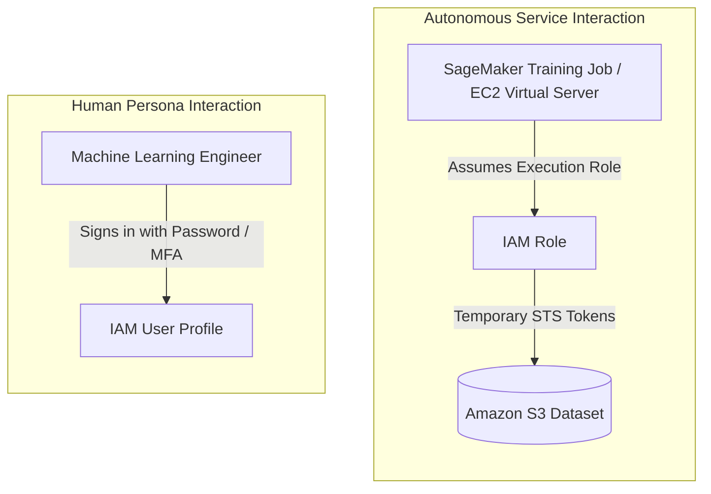
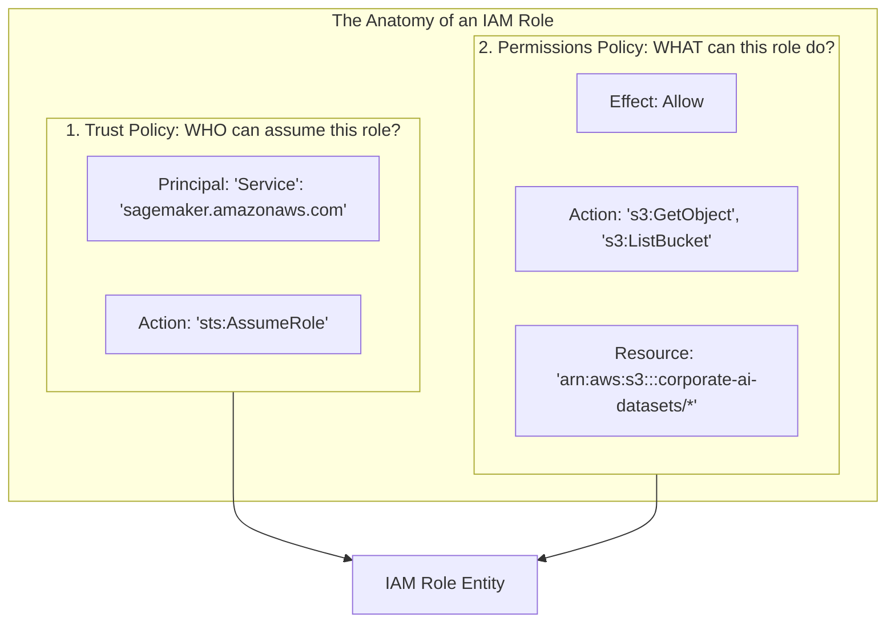
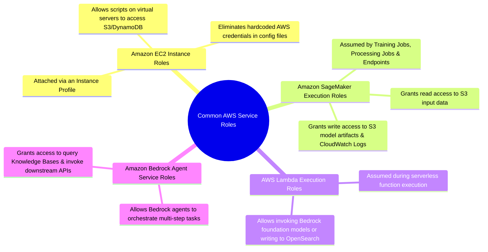

# AWS IAM Roles: Service Delegation, Temporary Credentials & Execution Roles in AI/ML

---

## Key Takeaways

**AWS IAM Roles** are secure identity entities created in an AWS account that have specific permissions assigned via policies, but are **not associated with a specific person or static long-term credentials**. Instead, IAM Roles are intended to be assumed by **AWS services** (such as Amazon EC2 instances, AWS Lambda functions, Amazon SageMaker training jobs, or Amazon Bedrock agents) to perform actions on your behalf using **short-lived, temporary security credentials**.



- **Purpose of IAM Roles:** Grants an AWS service or external identity permission to perform actions in your account without ever storing or embedding hardcoded access keys in code or virtual servers.
- **Temporary Credentials (AWS STS):** When a service assumes a role, the **AWS Security Token Service (STS)** issues temporary session tokens that automatically rotate and expire, mitigating credential theft risks.
- **The Dual-Policy Architecture of Roles:** Every IAM Role requires two distinct policy components:
  1. **Trust Policy (AssumeRole Policy):** Defines _who_ is allowed to assume the role (e.g., `ec2.amazonaws.com`, `sagemaker.amazonaws.com`, or `bedrock.amazonaws.com`).
  2. **Permissions Policy:** Defines _what_ actions the assumed role can execute (e.g., read training data from an S3 bucket or log metrics to CloudWatch).
- **AI/ML Exam Context:** In AI workloads, roles are essential—**SageMaker Execution Roles** enable training containers to pull datasets from Amazon S3, and **Bedrock Service Roles** allow generative AI agents to query knowledge base vector stores.

---

## Main Discussion

### IAM Users vs. IAM Roles



| Security Dimension         | IAM User                                                                                | IAM Role                                                                                           |
| -------------------------- | --------------------------------------------------------------------------------------- | -------------------------------------------------------------------------------------------------- |
| **Primary Consumer**       | Physical people (developers, admins, data scientists) requiring console or CLI access.  | AWS services (EC2, SageMaker, Lambda), applications, or cross-account federated identities.        |
| **Credential Lifetime**    | **Long-term credentials** (console passwords, static Access Keys). High risk if leaked. | **Temporary credentials** (dynamically generated and automatically rotated by AWS STS).            |
| **Access Mechanism**       | Permanent membership in user groups with attached policies.                             | Assumed temporarily by an entity using the `sts:AssumeRole` API call.                              |
| **Best Practice Scenario** | Logging into the AWS Management Console to review billing or view dashboards.           | Granting a virtual machine or automated ML pipeline access to read training datasets in Amazon S3. |

---

### Anatomy of an IAM Role: Trust Policy vs. Permissions Policy

An IAM Role is defined by two interlocking JSON documents:



#### 1. The Trust Policy (AssumeRole Policy)

This policy controls the boundary of trust, explicitly authorizing which AWS service or principal has permission to assume the role:

```json
{
  "Version": "2012-10-17",
  "Statement": [
    {
      "Effect": "Allow",
      "Principal": {
        "Service": ["ec2.amazonaws.com", "sagemaker.amazonaws.com"]
      },
      "Action": "sts:AssumeRole"
    }
  ]
}
```

#### 2. The Permissions Policy (Identity Policy)

Once the trusted service assumes the role, this policy determines what API actions it can perform against AWS resources:

```json
{
  "Version": "2012-10-17",
  "Statement": [
    {
      "Sid": "AllowS3TrainingDataPull",
      "Effect": "Allow",
      "Action": ["s3:GetObject", "s3:ListBucket"],
      "Resource": ["arn:aws:s3:::training-corpus", "arn:aws:s3:::training-corpus/*"]
    }
  ]
}
```

---

### Common Service Roles in Modern AWS AI/ML Architectures



1. **Amazon EC2 Instance Roles:** When running custom ML training scripts or model inference servers on Amazon EC2, you attach an IAM Role to the instance via an **Instance Profile**. Applications running on the instance automatically retrieve temporary credentials from the instance metadata service (IMDS).
2. **Amazon SageMaker Execution Roles:** When launching a SageMaker notebook, training job, or real-time inference endpoint, you specify an execution role. SageMaker assumes this role to securely pull container images from Amazon ECR, fetch training data from S3, and stream container logs into Amazon CloudWatch.
3. **AWS Lambda Execution Roles:** Serverless functions preprocessing incoming prompts or formatting API responses assume a Lambda execution role to securely interact with downstream services.

---

## Exam Guide

### Exam Tips

- **The Hardcoded Credential Trap (High Frequency):** If an exam scenario asks how an EC2 instance, container, or SageMaker training job should access an S3 bucket securely, **never choose creating an IAM user with access keys and storing them in code or configuration files**. The correct answer is always to **create an IAM Role with required permissions and attach it to the service/instance**.
- **Role Consumer:** IAM Users are for human beings; **IAM Roles are for AWS services, applications, or temporary federated access**.
- **Temporary Security Credentials:** IAM Roles rely on the **AWS Security Token Service (STS)** to generate short-lived, self-expiring credentials rather than permanent access keys.
- **Trust Policy vs. Permissions Policy:**
  - **Trust Policy:** Specifies which service **principal** (e.g., `sagemaker.amazonaws.com`, `ec2.amazonaws.com`) can assume the role via `sts:AssumeRole`.
  - **Permissions Policy:** Defines what actions (`Action`) and resources (`Resource`) the assumed identity is permitted to access.
- **SageMaker Execution Role:** The specific IAM role passed to Amazon SageMaker so that managed jobs can read training sets from S3 and publish model evaluation metrics to CloudWatch.

---

### Practice Test

#### Question 1

An AI startup is deploying an automated document classification script onto an Amazon EC2 instance. The script needs to download newly ingested PDF files from an Amazon S3 bucket, run an inference model, and upload summary text files back to another S3 bucket. In accordance with AWS security best practices, how should access to the S3 buckets be granted to the application?

- [ ] A. Create an IAM user with programmatic access keys, and embed the `AWS_ACCESS_KEY_ID` and `AWS_SECRET_ACCESS_KEY` directly inside the script's environment configuration
- [ ] B. Attach an IAM role with policies allowing read and write access on the target S3 buckets directly to the EC2 instance
- [ ] C. Make the target Amazon S3 buckets public and enable server-side encryption with AWS KMS
- [ ] D. Share the account root user access keys with the development team running the virtual machine

<details>
<summary>Correct Answer</summary>

- [x] B. Attach an IAM role with policies allowing read and write access on the target S3 buckets directly to the EC2 instance
  - **Explanation:** Attaching an **IAM Role** to the Amazon EC2 instance (via an Instance Profile) allows the instance and running applications to obtain temporary, automatically rotated credentials via AWS STS. This eliminates the operational security hazard of hardcoding static IAM access keys in source code or server configuration files.

</details>

---

#### Question 2

When creating an IAM Role that will be assumed by an Amazon SageMaker training job to read training datasets from Amazon S3, which policy element defines that the Amazon SageMaker service is authorized to assume this specific role?

- [ ] A. The `Resource` element in the Identity-based Permissions policy
- [ ] B. The `Principal` element specifying `sagemaker.amazonaws.com` in the Role's Trust Policy
- [ ] C. The AWS Account Alias in the console sign-in URL
- [ ] D. A Bucket Policy containing an explicit Deny statement attached to the S3 bucket

<details>
<summary>Correct Answer</summary>

- [x] B. The `Principal` element specifying `sagemaker.amazonaws.com` in the Role's Trust Policy
  - **Explanation:** An IAM Role requires a **Trust Policy** (or AssumeRole policy) that defines the trusted entity. Setting the `Principal` to `{"Service": "sagemaker.amazonaws.com"}` explicitly authorizes the Amazon SageMaker service to assume the role using the `sts:AssumeRole` action.

</details>

---
