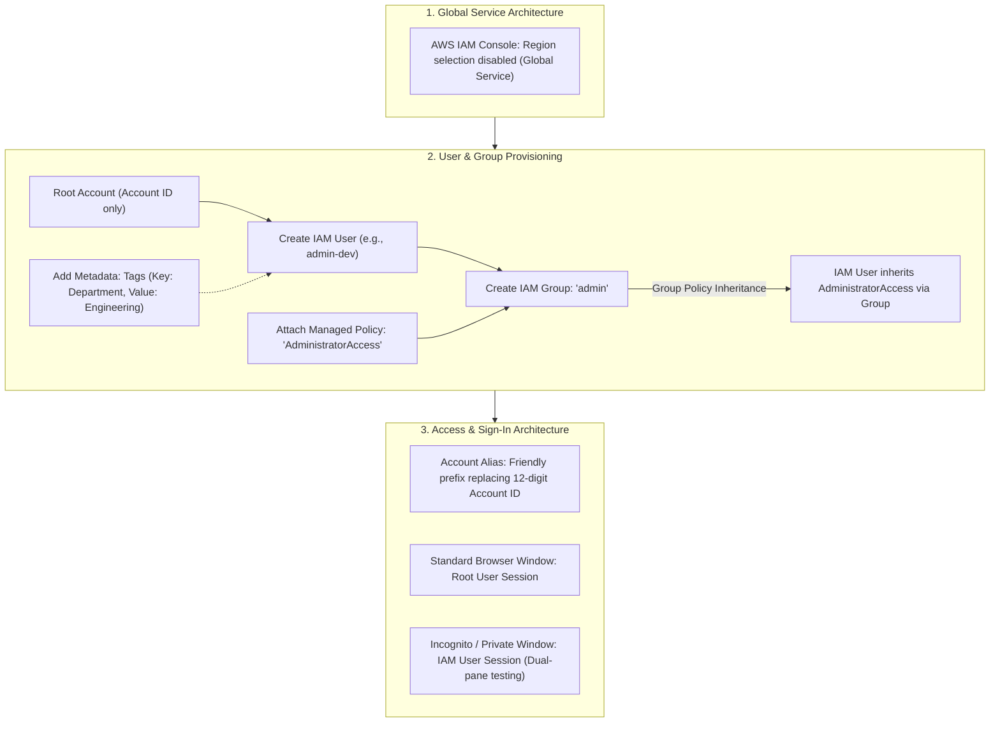
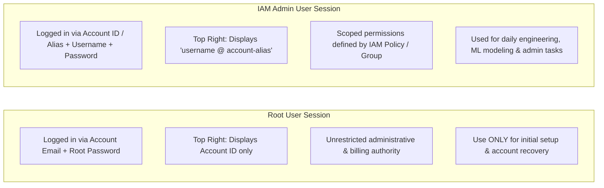

# Hands-On Lab: AWS IAM Users, User Groups, Account Aliases & Root vs. IAM Sign-In Workflows

---

## Key Takeaways

Configuring **AWS Identity and Access Management (IAM)** follows standard cloud operational security: bootstrap the account with the root user once, create an individual administrative IAM user, assign permissions via an **IAM User Group**, and isolate sessions during testing.

Key takeaways from this hands-on lab:

- **Global Scope:** IAM operates across all AWS Regions simultaneously; no region dropdown is selected in the console.
- **Group-Based Policy Inheritance:** Permissions (such as `AdministratorAccess`) should be attached to an **IAM Group** rather than individual users, allowing users to inherit permissions automatically.
- **Account Alias:** Customizing the default 12-digit AWS Account ID into a unique string creates an easy-to-read sign-in URL (`https://<account-alias>[.signin.aws.amazon.com/console](https://.signin.aws.amazon.com/console)`).
- **Session Isolation:** Testing root and IAM user permissions simultaneously requires separate browser profiles or an **Incognito / Private browsing window** to prevent session cookie collisions.

---

## Hands-On Workflow: Provisioning IAM Identities & Console Access

1. **Navigate to the IAM Console & Verify Global Scope:**
   - Open the AWS Management Console search bar and type **IAM**.
   - Observe the top-right navigation bar where the Region dropdown displays **Global**.
   - Note that changes made in IAM replicate across all worldwide AWS Regions automatically.
2. **Provision an Administrative IAM User:**
   - Navigate to **Users** in the left navigation panel and click **Create user**:
   - **User Name:** Enter an individual name (e.g., `admin-dev`).
   - **AWS Management Console access:** Check the box to enable console sign-in.
   - Select **Provide user access to the AWS Management Console - specify an IAM user** (or IAM Identity Center for enterprise deployments).
   - Choose **Custom password** (for personal admin accounts) or auto-generate with mandatory password reset on next sign-in (for third-party team members).
3. **Create an IAM User Group & Attach AdministratorAccess:**
   - In the **Set permissions** stage:
   - Select **Add user to group** and click **Create group**.
   - **User group name:** Enter `admin`.
   - **Permissions policies:** Filter and select `AdministratorAccess` (AWS Managed Policy).
   - Complete group creation and verify the new user is selected inside this group.
4. **Add Resource Tags & Review:**
   - Attach operational metadata tags:
   - **Key:** `Department` | **Value:** `Engineering`
   - Click **Create user**.
   - Download the credentials CSV file or note down the sign-in URL, Account ID, and credentials.
5. **Configure an AWS Account Alias:**
   - Return to the **IAM Dashboard**:
   - Locate the **AWS Account** widget on the right side.
   - Click **Create alias** next to the 12-digit Account ID.
   - Enter a globally unique alias (e.g., `corp-cloud-ai-lab`).
   - The sign-in URL updates immediately to: `https://<your-alias>[.signin.aws.amazon.com/console](https://.signin.aws.amazon.com/console)`.
6. **Execute Dual-Session Sign-In Verification:**
   - Keep the root user session open in your primary browser window.
   - Open a new **Private / Incognito Window** to prevent session cookie conflicts.
   - Paste the customized sign-in URL or choose **IAM User** on the standard AWS login page.
   - Enter the Account Alias (or Account ID), the IAM username, and the configured password.
   - Verify the top-right console indicator shows `username @ account-alias`, confirming successful non-root administrative access.

---

## Configuration Comparison: Root Account vs. IAM User

| Dimension                          | Root User Account                                                 | IAM User Account                                                                         |
| ---------------------------------- | ----------------------------------------------------------------- | ---------------------------------------------------------------------------------------- |
| **Authentication Identity**        | Account owner's email address and root password.                  | Unique IAM username + Account ID / Account Alias.                                        |
| **Console Identifier (Top Right)** | Shows **Account ID** only.                                        | Shows **`username @ account-alias`** (or Account ID).                                    |
| **Permission Scope**               | Absolute, unrestricted access; cannot be limited by IAM policies. | Explicitly controlled by attached IAM policies (inheriting least privilege).             |
| **Best Practice Usage**            | Emergency break-glass access and closing the AWS account only.    | All everyday administrative, development, data science, and MLOps tasks.                 |
| **Session Handling**               | Primary browser session.                                          | Dedicated browser window or **Incognito / Private window** to avoid session termination. |

---

## Exam Guide

### Exam Tips

- **Global Scope of IAM:** IAM is a **global AWS service**. You do not configure IAM users, groups, or policies per Region; configurations apply globally across all AWS Regions.
- **Group Policy Inheritance:** Attaching an IAM policy (like `AdministratorAccess`) to an IAM Group automatically grants those permissions to **all current and future users added to that group**. Permissions are attached to the group, not duplicated on each user.
- **Root Account Security Standard:** The AWS account root user should **never** be used for daily data science, engineering, or administration tasks. AWS best practice requires creating an IAM user with appropriate permissions and locking root access behind MFA.
- **Account Alias Functionality:** An **AWS Account Alias** provides a human-readable prefix that replaces the default 12-digit Account ID in the AWS Management Console sign-in URL.
- **Tags as Metadata:** Tags are key-value pairs (e.g., `Department: Engineering` or `Environment: Production`) applied across AWS resources to simplify cost allocation, access filtering, and governance.

---

### Practice Test

#### Question 1

A cloud engineer is setting up access for a team of machine learning specialists in a newly created AWS account. Which administrative approach aligns with AWS best practices for identity management?

- [ ] A. Share the AWS root account credentials among all team members to simplify login procedures
- [ ] B. Create individual IAM users for each specialist, assign them to an IAM group, and attach an IAM policy granting required permissions to the group
- [ ] C. Attach administrative IAM policies directly to the root user profile and enable password rotation
- [ ] D. Create an IAM group that contains multiple nested sub-groups for each engineering discipline

Correct Answer

- [x] B. Create individual IAM users for each specialist, assign them to an IAM group, and attach an IAM policy granting required permissions to the group
  - **Explanation:** AWS best practice mandates avoiding the root account for daily operations, provisioning distinct IAM user identities for each person, organizing users into **IAM Groups**, and managing permissions by attaching policies to the group rather than directly to individual users. (Groups also cannot contain nested groups.)

---

#### Question 2

An enterprise security team wants to simplify console sign-in for internal developers so they do not have to memorize the organization's 12-digit AWS Account ID. Which IAM feature should the administrator configure?

- [ ] A. Amazon Cognito User Pool
- [ ] B. AWS Account Alias
- [ ] C. Amazon Route 53 CNAME record
- [ ] D. Amazon Macie Discovery Identifier

Correct Answer

- [x] B. AWS Account Alias
  - **Explanation:** An **AWS Account Alias** replaces the default 12-digit AWS Account ID with a custom, user-friendly name in the sign-in URL (e.g., `[https://my-company-alias.signin.aws.amazon.com/console](https://my-company-alias.signin.aws.amazon.com/console)`).

---
