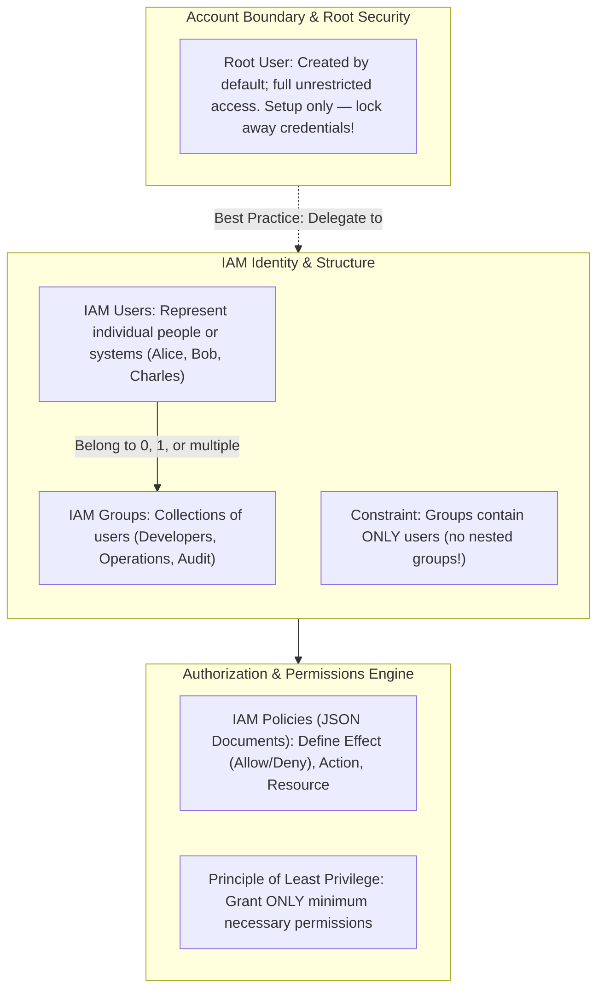
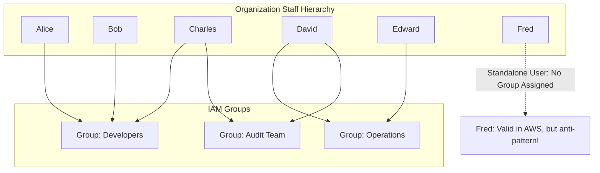
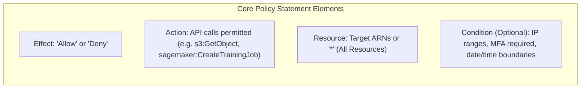
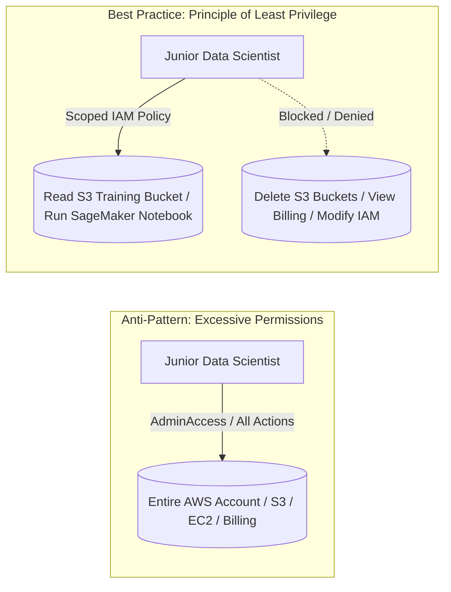

# AWS Identity and Access Management (IAM): Users, Groups, Policies & Least Privilege

---

## Key Takeaways

**AWS Identity and Access Management (IAM)** is a foundational, **global service** that manages authentication and authorization across your entire AWS environment. It controls who can sign in and what actions they are permitted or denied from executing on AWS resources.



- **Global Scope:** IAM operates globally across all regions without needing per-region deployment.
- **Root Account Protection:** The root user is created automatically with full, unrestricted access to all resources and billing. Best practice mandates using the root user only for initial account bootstrapping, locking it down with MFA, and never sharing or using it for daily operational or AI tasks.
- **Users vs. Groups:** Users represent individual people. Groups are logical collections of users. **Groups can only contain users—groups cannot be nested inside other groups.**
- **IAM Policies (JSON):** Declarative JSON documents assigned to users or groups that define permissions (`Effect`, `Action`, `Resource`).
- **Principle of Least Privilege:** Users and services receive only the minimum permissions required to perform their jobs, preventing security breaches, accidental deletions, and unexpected cloud spend.

---

## Main Discussion

### IAM Identity Hierarchy & Group Rules



#### Core Rules of IAM Groups

1. **Users can belong to multiple groups:** As illustrated above, _Charles_ and _David_ simultaneously belong to their functional teams (_Developers_ and _Operations_) and cross-functional teams (_Audit Team_).
2. **Groups cannot be nested:** An IAM group cannot belong to another IAM group. All group members must be individual IAM users.
3. **Users do not strictly have to belong to a group:** A standalone user (like _Fred_) can exist and have policies attached directly, though assigning permissions via groups is the recommended administrative best practice.

---

### Anatomy of an IAM Policy (JSON)

An IAM policy is a JSON document that explicitly grants or denies access to AWS actions and resources:

```json
{
  "Version": "2012-10-17",
  "Statement": [
    {
      "Sid": "AllowMonitoringAndComputeRead",
      "Effect": "Allow",
      "Action": [
        "ec2:Describe*",
        "elasticloadbalancing:Describe*",
        "cloudwatch:ListMetrics",
        "cloudwatch:GetMetricData"
      ],
      "Resource": "*"
    }
  ]
}
```



- **Explicit Deny Precedence:** In AWS IAM, if an action is not explicitly allowed, it is denied by default. If an action is explicitly denied in any applicable policy, the **explicit Deny always overrides any Allow**.
- **Policy Inheritance:** When an IAM policy is attached to an IAM Group, every user currently in or added to that group immediately inherits those permissions.

---

### The Principle of Least Privilege in AI Workloads



Granting full administrative access to practitioners increases risk:

- A team member could accidentally delete critical historical datasets in Amazon S3.
- Unchecked permissions could lead to accidentally provisioning massive, costly GPU clusters (e.g., `p5.48xlarge`) without organizational approval.
- Least privilege ensures users and automated pipelines can only access the exact training data and specific AI services needed for their role.

---

## Exam Guide

### Exam Tips

- **Global Service:** IAM is a **global service**. You do not select an AWS Region when creating IAM users, groups, or policies.
- **Root Account Best Practice:** The root user has complete access to everything. **Never use the root user for everyday tasks or training jobs.** Create dedicated IAM users/roles and secure the root credentials with Multi-Factor Authentication (MFA).
- **Group Rules for the Exam:**
  - Groups contain **users only**.
  - Groups **cannot contain other groups** (no nested groups).
  - A user **can belong to multiple groups**.
- **Principle of Least Privilege:** Always choose the answer that grants the **minimum permissions necessary** to accomplish the task (e.g., granting read-only access to an S3 training bucket rather than `s3:*` or `AdministratorAccess`).
- **IAM Policy Format:** Policies are written in **JSON** and define permissions via `Effect`, `Action`, and `Resource`.

---

### Practice Test

#### Question 1

A newly hired machine learning developer needs access to view active Amazon SageMaker training jobs and monitor model metrics in Amazon CloudWatch. The developer does not require permissions to launch new compute instances or delete S3 data. According to AWS best practices, how should the cloud administrator configure access?

- [ ] A. Share the AWS account root user credentials with the developer
- [ ] B. Create an IAM user for the developer and attach an IAM policy granting only read and describe permissions for SageMaker and CloudWatch
- [ ] C. Attach the `AdministratorAccess` AWS managed policy directly to the developer's user profile
- [ ] D. Create an IAM group that contains the root user and add the developer to that group

<details>
<summary>Correct Answer</summary>

- [x] B. Create an IAM user for the developer and attach an IAM policy granting only read and describe permissions for SageMaker and CloudWatch
  - **Explanation:** In accordance with the **principle of least privilege**, the administrator should create an individual IAM user and assign an IAM policy with only the specific read and describe permissions needed for SageMaker and CloudWatch, avoiding broad administrative access.

</details>

---

#### Question 2

An AWS administrator is configuring IAM for a data science department. Which of the following statements regarding IAM groups is correct?

- [ ] A. An IAM group can be placed inside another IAM group to inherit parent permissions
- [ ] B. An IAM group can contain both IAM users and other nested IAM groups
- [ ] C. An IAM user can belong to multiple IAM groups simultaneously, but an IAM group can only contain users
- [ ] D. IAM policies can only be attached to IAM users and cannot be attached to IAM groups

<details>
<summary>Correct Answer</summary>

- [x] C. An IAM user can belong to multiple IAM groups simultaneously, but an IAM group can only contain users
  - **Explanation:** In AWS IAM, an IAM user can be a member of multiple IAM groups (e.g., Developers and Audit), but **IAM groups cannot be nested**—a group can only contain IAM users, never other groups.

</details>

---
