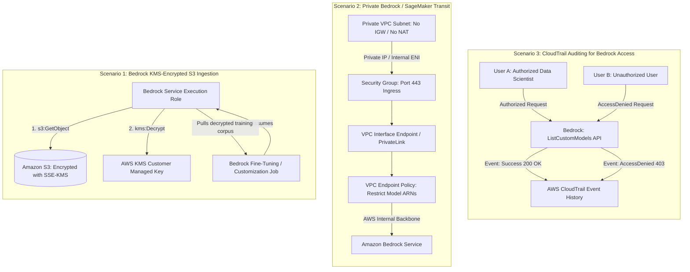
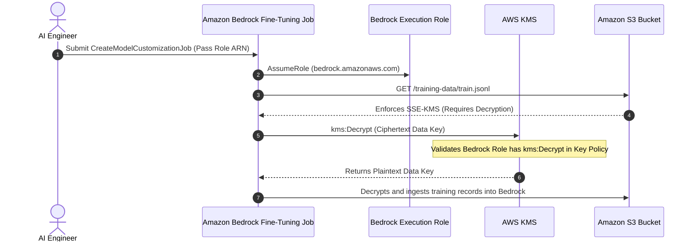
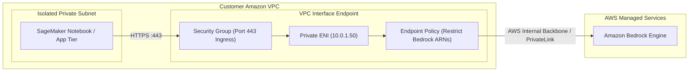
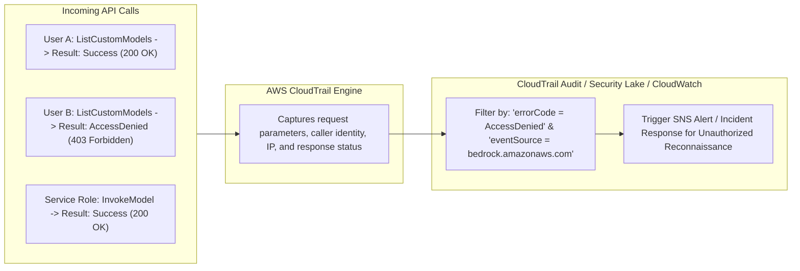

import ImageRow from '@site/src/components/ImageRow';
import VPCEndpointDefenseInDepth from './img/vpc-endpoint-defense-in-depth.png';
import AccessBedrockModel from './img/access-bedrock-model-diagram.png';
import CloudTrailAccessDenied from './img/cloudtrail-access-denied.png';
import CloudTrailAccessAuthorized from './img/cloudtrail-access-authorized.png';

# Applied Security Scenarios: Bedrock Encrypted S3 Access, PrivateLink Networking & CloudTrail Authorization Auditing

---

## Key Takeaways

Real-world AI architectures rarely rely on a single isolated security service. On the AWS Certified AI Practitioner (AIF-C01) exam, questions evaluate your ability to chain **Identity (IAM)**, **Cryptography (KMS)**, **Network Boundaries (VPC/PrivateLink)**, and **Auditing (CloudTrail)** into cohesive, multi-layered security architectures.



Key takeaways to master:

- **The Dual-Permission Requirement (KMS + S3):** When Amazon Bedrock or SageMaker accesses training datasets encrypted with **AWS KMS (SSE-KMS)**, granting `s3:GetObject` alone is insufficient. The service execution role must explicitly be granted **`kms:Decrypt`** permissions on the underlying KMS key policy and IAM identity policy.  
  
- **Defense-in-Depth for VPC Endpoints:** Securing private connections through **AWS PrivateLink** relies on three distinct layers:
  1. **Security Groups:** Network-level stateful firewall filtering (e.g., allowing inbound HTTPS port 443 from the private subnet CIDR).
  2. **VPC Endpoint Policies:** JSON resource policies attached to the endpoint itself that limit which IAM principals can access which specific AWS resource ARNs.
  3. **IAM Roles:** Identity-based policies attached to the invoking compute resource (EC2, Lambda, or SageMaker).
     <ImageRow>
       
       
     </ImageRow>
- **CloudTrail Captures Both Successes and Denials:** CloudTrail intercepts and logs **all API calls**, including unsuccessful, unauthorized requests resulting in `AccessDenied` (`403 Forbidden`). This makes CloudTrail a primary tool for detecting reconnaissance or unauthorized access attempts against AI services.
  <ImageRow>
    
    
  </ImageRow>

---

## Deep Dive: Common Exam Scenarios

### Scenario 1: Bedrock Model Customization with KMS-Encrypted S3 Datasets

When fine-tuning or customizing a foundation model, Bedrock pulls training data from an Amazon S3 bucket. If that bucket is secured using **Server-Side Encryption with AWS Key Management Service (SSE-KMS)**, the model customization job fails unless both permissions are explicitly configured.



#### The Two Required IAM Policy Blocks

```json
{
  "Version": "2012-10-17",
  "Statement": [
    {
      "Sid": "S3BucketAccess",
      "Effect": "Allow",
      "Action": ["s3:GetObject", "s3:ListBucket"],
      "Resource": [
        "arn:aws:s3:::enterprise-training-data",
        "arn:aws:s3:::enterprise-training-data/*"
      ]
    },
    {
      "Sid": "KMSKeyDecryption",
      "Effect": "Allow",
      "Action": ["kms:Decrypt", "kms:GenerateDataKey"],
      "Resource": "arn:aws:kms:us-east-1:123456789012:key/abcd-1234-xyz-5678"
    }
  ]
}
```

- _Exam Pitfall:_ Watch out for distractors that claim "enabling S3 permissions is sufficient because AWS handles decryption automatically." If the bucket uses **SSE-KMS** (specifically Customer Managed Keys / CMKs), explicit `kms:Decrypt` permissions are mandatory.

---

### Scenario 2: End-to-End Private Connectivity via VPC Endpoints

When security regulations state that training jobs or inference applications must reside in private subnets with **no route to the internet (no Internet Gateway, no NAT Gateway)**, private communication relies on VPC Endpoints:



1. **Routing Path:** The application sends API traffic to the service domain (`bedrock-runtime.us-east-1.amazonaws.com`). The VPC resolver maps this domain to the private IP of the VPC Endpoint's Elastic Network Interface (ENI).
2. **Network Filtering:** The **Security Group** attached to the endpoint's ENI must allow inbound traffic on **Port 443 (HTTPS)** from the private subnet's CIDR or the application security group.
3. **Endpoint Policies (Authorization at the Boundary):** In addition to IAM policies on the calling instance or role, you can attach an **Endpoint Policy** to the VPC Endpoint to enforce guardrails (e.g., ensuring requests routed through this endpoint can only invoke approved foundation model ARNs).

---

### Scenario 3: Auditing Unauthorized Bedrock Activity with AWS CloudTrail

CloudTrail acts as the primary flight recorder for both successful and denied API calls.



- **Detecting Insider Threats & Permission Misconfigurations:** By filtering CloudTrail logs for `errorCode = "AccessDenied"` where `eventSource = "bedrock.amazonaws.com"`, security teams can immediately identify:
- Users attempting to invoke models without proper IAM authorization.
- Misconfigured service roles on automated pipelines that are failing due to missing permissions.
- Reconnaissance attempts by compromised credentials trying to query model customizations or knowledge base contents.

---

## Exam Guide

### Exam Tips

- **KMS + Bedrock Customization (High Frequency):**
  - Training data in S3 encrypted with SSE-KMS requires the Bedrock execution role to have **both** `s3:GetObject` and **`kms:Decrypt`**.
  - The KMS key policy must also trust the Bedrock execution role (or the AWS account).
- **VPC Endpoints & PrivateLink Architecture:**
  - For Bedrock and SageMaker: Use **VPC Interface Endpoints** (powered by PrivateLink).
  - For Amazon S3: Can use an **S3 Gateway Endpoint** (associated with VPC route tables) or an Interface Endpoint.
  - Remember that VPC Endpoints can have **Endpoint Policies** attached to restrict access to specific models or resources.
- **CloudTrail Captures Errors:** CloudTrail does not log only successful actions; **it logs denied API calls (`AccessDenied`) as well**. If an exam question asks how to audit unauthorized access attempts to an AI service, the answer is **AWS CloudTrail**.

---

### Practice Test

#### Question 1

A machine learning engineer initiates a fine-tuning job in Amazon Bedrock using a training dataset stored in an Amazon S3 bucket. The bucket is encrypted using Server-Side Encryption with AWS KMS Customer Managed Keys (SSE-KMS). The IAM service role associated with the Bedrock fine-tuning job includes full read permissions for the S3 bucket (`s3:GetObject`, `s3:ListBucket`), but the job immediately fails with an access error. What is the most likely cause of this failure?

- [ ] A. Amazon Bedrock does not support model fine-tuning using datasets stored in Amazon S3
- [ ] B. The IAM service role lacks `kms:Decrypt` permissions on the AWS KMS key used to encrypt the S3 objects
- [ ] C. The S3 bucket does not have an S3 Gateway Endpoint attached
- [ ] D. AWS CloudTrail is not enabled in the region where the fine-tuning job was initiated

<details>
  <summary>Correct Answer</summary>

- [x] B. The IAM service role lacks `kms:Decrypt` permissions on the AWS KMS key used to encrypt the S3 objects
  - **Explanation:** When data in Amazon S3 is encrypted with AWS KMS (SSE-KMS), any principal reading that data must have both `s3:GetObject` permissions on the S3 resource **and** `kms:Decrypt` permissions on the KMS key. Because the IAM role was missing KMS decrypt rights, Bedrock was unable to decrypt the underlying training files.

</details>

---

#### Question 2

A security operations center (SOC) detects that an unauthorized third party may have obtained leaked IAM access keys for an internal development account. The SOC analyst needs to determine whether these credentials were used to query or export proprietary Amazon Bedrock foundation models or knowledge bases, including any failed attempts that resulted in authorization errors. Which AWS service should the analyst inspect?

- A. AWS Config
- B. AWS CloudTrail
- C. Amazon Inspector
- D. AWS Trusted Advisor

<details>
  <summary>Correct Answer</summary>

- [x] B. AWS CloudTrail
  - **Explanation:** **AWS CloudTrail** records all API activity across an AWS account, capturing both successful requests and failed requests (such as `AccessDenied` errors). The analyst can query CloudTrail for the compromised access key ID to see all API calls made to `bedrock.amazonaws.com`, the timestamps, the source IPs, and whether the requests succeeded or failed.

</details>

---
