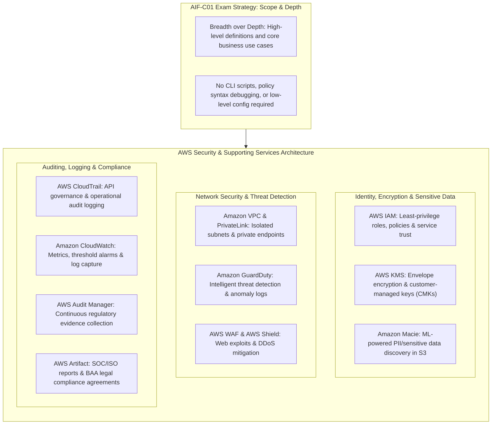
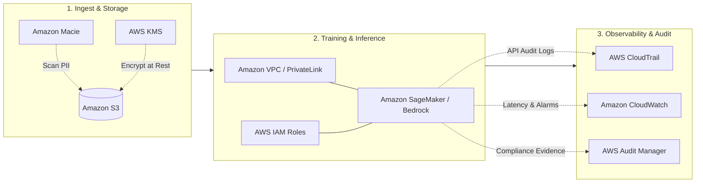

# AWS Security Services & Supporting Infrastructure: Section Scope & High-Level Service Directory

---

## Key Takeaways

While core AI concepts, model architectures, and SageMaker tools form the analytical engine of AI systems, production deployments require **foundational AWS security, governance, and infrastructure services**.

For the **AWS Certified AI Practitioner (AIF-C01)** exam, questions on these general AWS services remain strictly at a **foundational, conceptual level**. You do not need to memorize complex JSON IAM policy syntax, configure network routing tables, or debug API payloads; you only need to know **what each service does, its primary capability, and how it secures the AI/ML pipeline**.

---

## Main Discussion

### The Supporting Security Ecosystem for AI Workloads

Machine learning models cannot be operated securely in isolation. Data flowing into Amazon S3, compute jobs running in Amazon SageMaker, and APIs served via Amazon Bedrock rely on AWS platform services to maintain the **CIA Triad** (Confidentiality, Integrity, Availability).

---

### High-Level Service Directory for AIF-C01

| AWS Service                                  | Category           | Primary Function & Role in AI Systems                                                                                                                                                               |
| -------------------------------------------- | ------------------ | --------------------------------------------------------------------------------------------------------------------------------------------------------------------------------------------------- |
| **AWS Identity and Access Management (IAM)** | Identity & Access  | Controls authentication and authorization. Grants least-privilege permissions to human users and assigns execution roles to SageMaker notebooks, training jobs, and Bedrock agents.                 |
| **AWS Key Management Service (KMS)**         | Data Protection    | Creates and manages cryptographic keys used to encrypt training datasets in Amazon S3, model checkpoints, EBS storage volumes, and inference endpoints at rest.                                     |
| **Amazon Macie**                             | Data Privacy       | Uses machine learning and pattern matching to discover, monitor, and flag unprotected **Personally Identifiable Information (PII)** and sensitive data stored in Amazon S3 buckets before training. |
| **Amazon VPC & AWS PrivateLink**             | Network Security   | Provisions isolated private cloud networks. AWS PrivateLink (VPC Endpoints) ensures training jobs and inference calls connect to S3 and SageMaker without traversing the public internet.           |
| **Amazon GuardDuty**                         | Threat Detection   | Continuous security monitoring service that analyzes CloudWatch, VPC Flow Logs, and DNS logs using ML to detect unauthorized behavior, compromised instances, or suspicious API calls.              |
| **AWS WAF (Web Application Firewall)**       | Edge Security      | Protects web-facing AI inference applications from common web exploits (e.g., SQL injection, cross-site scripting) and enforces rate limits to prevent denial-of-service.                           |
| **AWS Shield**                               | Edge Security      | Managed Distributed Denial of Service (DDoS) protection safeguarding the availability of public AI APIs and applications.                                                                           |
| **AWS CloudTrail**                           | Governance & Audit | Records and retains account API calls (who did what, when, and from which IP), creating an immutable audit trail for model deployments, endpoint updates, and data access.                          |
| **Amazon CloudWatch**                        | Observability      | Monitors computational metrics (CPU/GPU utilization, invocation latency) and model alarms. Collects logs from training containers and inference endpoints.                                          |
| **AWS Audit Manager**                        | Compliance         | Continuously and automatically collects compliance evidence across AWS services to verify alignment with frameworks like HIPAA, PCI-DSS, and NIST.                                                  |
| **AWS Artifact**                             | Compliance         | Central portal providing on-demand access to AWS security and compliance reports (SOC, ISO) and self-service execution of legal agreements (e.g., HIPAA BAA).                                       |

---

## Exam Guide

### Exam Tips

- **High-Level Scope Rule:** You will **not** be tested on CLI flags, deep networking topologies, or JSON policy documents. You are tested on **service identification by function**.
- **Quick Disambiguation Matches:**
  - To scan S3 buckets for unprotected PII/PHI $\rightarrow$ **Amazon Macie**.
  - To manage encryption keys for training data and endpoints $\rightarrow$ **AWS Key Management Service (KMS)**.
  - To provide identity access roles for SageMaker training jobs $\rightarrow$ **AWS Identity and Access Management (IAM)**.
  - To track and audit API calls and administrative operations $\rightarrow$ **AWS CloudTrail**.
  - To track compute resource metrics (CPU/GPU) and trigger threshold alarms $\rightarrow$ **Amazon CloudWatch**.
  - To access official AWS SOC/ISO compliance reports or download agreements $\rightarrow$ **AWS Artifact**.
  - To protect public AI web endpoints from DDoS attacks and common web exploits $\rightarrow$ **AWS Shield** and **AWS WAF**.

---

### Practice Test

#### Question 1

An enterprise is preparing a dataset of customer support logs stored in Amazon S3 for an upcoming LLM fine-tuning job. The company's compliance policy requires that all stored datasets be automatically inspected to discover and flag unmasked Personally Identifiable Information (PII) before any model training begins. Which AWS service should be used?

- [ ] A. Amazon Inspector
- [ ] B. Amazon Macie
- [ ] C. AWS CloudTrail
- [ ] D. AWS Trusted Advisor

Correct Answer

- [x] B. Amazon Macie
  - **Explanation:** **Amazon Macie** is a fully managed data security and privacy service that uses machine learning and pattern matching to discover, monitor, and classify sensitive data (including PII) stored in Amazon S3.

---

#### Question 2

A machine learning team needs to ensure that training jobs running inside an Amazon SageMaker notebook can read training data from an Amazon S3 bucket without using hardcoded credentials. Which AWS service and mechanism should be used to grant this access securely?

- [ ] A. AWS Shield with an Advanced DDoS policy
- [ ] B. AWS Identity and Access Management (IAM) execution role attached to the SageMaker instance
- [ ] C. Amazon CloudWatch Metric Filter with SNS alerts
- [ ] D. AWS Artifact compliance agreements

Correct Answer

- [x] B. AWS Identity and Access Management (IAM) execution role attached to the SageMaker instance
  - **Explanation:** **AWS Identity and Access Management (IAM)** execution roles provide temporary, least-privilege credentials that allow Amazon SageMaker resources to access AWS services (such as Amazon S3) securely without embedding static access keys in code.

---
