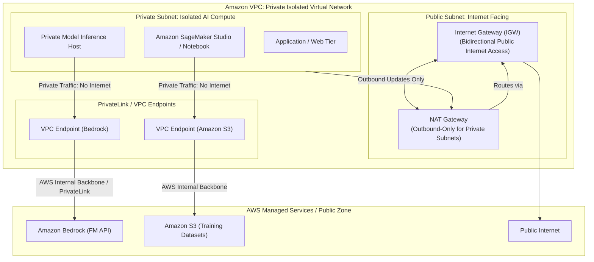
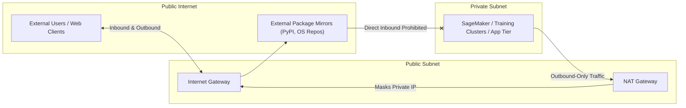
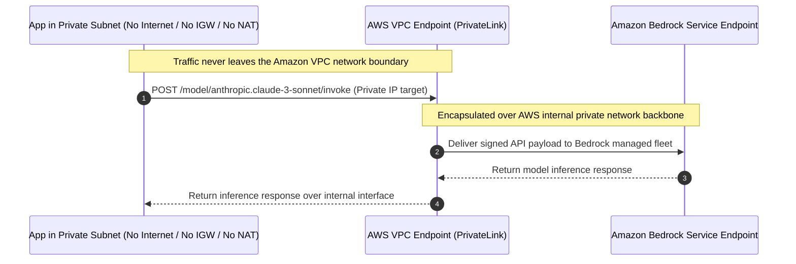

import ImageRow from '@site/src/components/ImageRow';
import VPCSubnetDiagram from './img/vpc-subnet-diagram.png';
import VPCDiagramMultiAZ from './img/vpc-diagram-multi-az.png';
import InternetNATGatewayDiagram from './img/internet-nat-gateway-diagram.png';
import VPCPrivateLinkDiagram from './img/vpc-privatelink-diagram.png';

# Amazon VPC & Network Security: Subnets, Gateways, VPC Endpoints & AWS PrivateLink

---

## Key Takeaways

**Amazon VPC (Virtual Private Cloud)** is your isolated, private virtual network in the AWS Cloud. For the AWS Certified AI Practitioner (AIF-C01) exam, networking focuses primarily on **private model deployments** and **accessing AWS AI services without traversing the public internet**.

- **Public vs. Private Subnets:**
  - **Public Subnet:** Contains a route to an **Internet Gateway (IGW)**; resources can have public IPs and are directly reachable from the internet.
  - **Private Subnet:** Has no direct route to an Internet Gateway; resources have private IPs only and are isolated from inbound internet traffic.
- **Outbound Internet Access (NAT Gateway):** Allows resources in a private subnet to make **outbound-only** connections to the internet (for OS updates, pip packages, container base images) while blocking any inbound connections initiated from the internet.
- **VPC Endpoints & AWS PrivateLink (Exam Priority):** Enables private connectivity between your VPC and supported AWS services (such as Amazon Bedrock or Amazon S3) over the **AWS internal private network backbone**, eliminating the need for an Internet Gateway, NAT Gateway, or public internet exposure.

---

## Main Discussion

### Subnet Topology & Egress Controls

<ImageRow>
  
  
  
</ImageRow>

| Component                  | Subnet Placement                                                                    | Directionality                          | Primary AI/ML Purpose                                                                                                                                     |
| -------------------------- | ----------------------------------------------------------------------------------- | --------------------------------------- | --------------------------------------------------------------------------------------------------------------------------------------------------------- |
| **Internet Gateway (IGW)** | Attached at VPC root; routed in public subnets.                                     | **Bidirectional** (Inbound & Outbound). | Allows public users to access an inference web app or API gateway frontend.                                                                               |
| **NAT Gateway**            | Must be deployed in a **Public Subnet**.                                            | **Outbound-only** from private subnets. | Allows training scripts on private instances to download Python dependencies (`pip install`) without exposing the instances to incoming internet attacks. |
| **Public Subnet**          | Configured with route table pointing `0.0.0.0/0` $\rightarrow$ IGW.                 | Inbound/Outbound.                       | Hosting public-facing load balancers (ALBs) or edge ingress proxies.                                                                                      |
| **Private Subnet**         | Route table points `0.0.0.0/0` $\rightarrow$ NAT Gateway (or has no default route). | Internal-only (or outbound via NAT).    | Securing sensitive model training jobs, proprietary datasets, database clusters, and internal LLM pipelines.                                              |

---

### Private Connectivity: VPC Endpoints & AWS PrivateLink

By default, AWS service APIs (such as `bedrock.amazonaws.com` or `s3.amazonaws.com`) are public endpoints accessible over the internet. When workloads handling proprietary data are deployed in private subnets without internet access, **VPC Endpoints** provide private routing over the AWS internal network.

#### Types of VPC Endpoints

1. **Interface Endpoints (AWS PrivateLink):**
   - Provisions an **Elastic Network Interface (ENI)** with a private IP address directly inside your private subnet.
   - Traffic to the service resolves to this private IP.
   - Supported by most AWS services, including **Amazon Bedrock**, **Amazon SageMaker**, and **AWS Systems Manager**.
2. **Gateway Endpoints:**
   - A target entry in your VPC route table.
   - Specifically supports **Amazon S3** and **Amazon DynamoDB** at no additional hourly fee.
   - Enables private subnets (e.g., a SageMaker training job) to download terabytes of training data from S3 without leaving the internal AWS network.

<ImageRow>
  
</ImageRow>

---

### Security Comparison for AI/ML Workloads

| Access Method                                   | Route Traversed                 | Inbound Risks                          | Outbound Path                   | Suitable For                                                                                                |
| ----------------------------------------------- | ------------------------------- | -------------------------------------- | ------------------------------- | ----------------------------------------------------------------------------------------------------------- |
| **Public Subnet + IGW**                         | Public Internet                 | High (requires strict Security Groups) | Public Internet                 | Public demonstration web apps, external client-facing web portals.                                          |
| **Private Subnet + NAT Gateway**                | Public Internet (outbound only) | Low (no inbound access from web)       | Public Internet via NAT         | Installing third-party packages, running OS security updates.                                               |
| **Private Subnet + VPC Endpoint (PrivateLink)** | **AWS Internal Network Only**   | **None (zero internet exposure)**      | **Direct private AWS backbone** | **Enterprise model inference (Bedrock), S3 training dataset ingestion, compliance-regulated AI pipelines.** |

---

## Exam Guide

### Exam Tips

- **Private Service Access Pattern (Core AIF-C01 Concept):**
  - When a scenario asks to connect an application in a private subnet to an AWS service (such as **Amazon Bedrock** or **Amazon S3**) **without traffic traversing the public internet** and **without provisioning an Internet Gateway**, the answer is **VPC Endpoints** (or **AWS PrivateLink**).
- **VPC Endpoints for S3 & DynamoDB:**
  - S3 and DynamoDB support **Gateway Endpoints**, which operate as route table entries and do not require public IPs or internet gateways.
- **NAT Gateway Architecture Rules:**
  - A NAT Gateway must be created in a **public subnet**.
  - Instances in the **private subnet** route their outbound internet traffic through the NAT Gateway.
  - NAT Gateways are **one-way only**: they allow internal instances to reach the internet, but prevent the internet from initiating connections to those internal instances.
- **High Availability Subnet Best Practice:**
  - For high availability, subnets must be distributed across **multiple Availability Zones (AZs)** within a region.

---

### Practice Test

#### Question 1

A financial services company is developing a fraud detection application that runs on Amazon EC2 instances located in a private subnet. The application must invoke an Amazon Bedrock foundation model to analyze transaction narratives. Company policy strictly prohibits these EC2 instances from having internet access, and no Internet Gateway or NAT Gateway may be attached to the VPC. How can the application invoke the Amazon Bedrock API securely?

- [ ] A. Configure an AWS Direct Connect connection to the public internet
- [ ] B. Deploy a VPC Interface Endpoint (AWS PrivateLink) for Amazon Bedrock inside the VPC
- [ ] C. Assign dynamic public IPv4 addresses to the EC2 instances
- [ ] D. Establish an AWS Site-to-Site VPN directly to the Amazon Bedrock public API endpoint

Correct Answer

- [x] B. Deploy a VPC Interface Endpoint (AWS PrivateLink) for Amazon Bedrock inside the VPC
  - **Explanation:** A **VPC Interface Endpoint**, powered by **AWS PrivateLink**, provisions a private network interface with a private IP address in your subnet. This allows instances in a private subnet to invoke Amazon Bedrock directly across the AWS private network backbone without requiring an Internet Gateway, NAT Gateway, or public internet exposure.

---

#### Question 2

An AI research team is running an Amazon SageMaker training job inside a private subnet. The training cluster needs to read multi-terabyte image datasets stored in an Amazon S3 bucket. The data must remain entirely within the AWS network to satisfy regulatory compliance requirements and avoid data transfer costs. Which solution fulfills this requirement with the least operational overhead?

- [ ] A. Provision a NAT Gateway in a public subnet and route S3 API traffic through it
- [ ] B. Create an Amazon S3 Gateway VPC Endpoint and associate it with the private subnet's route table
- [ ] C. Attach an Internet Gateway to the VPC and configure an S3 bucket policy allowing `0.0.0.0/0`
- [ ] D. Compress the dataset, copy it to an Amazon EBS volume, and detach the volume after training

Correct Answer

- [x] B. Create an Amazon S3 Gateway VPC Endpoint and associate it with the private subnet's route table
  - **Explanation:** An **Amazon S3 Gateway VPC Endpoint** allows resources in private subnets to communicate directly and privately with Amazon S3 through the internal AWS network. It keeps traffic completely off the public internet, fulfills regulatory data residency requirements, and incurs no data transfer charges.

---
