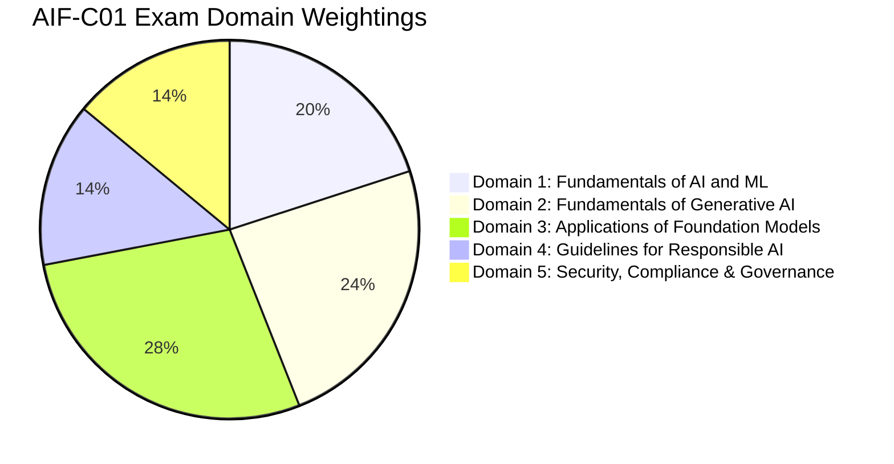
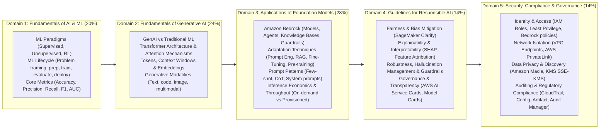
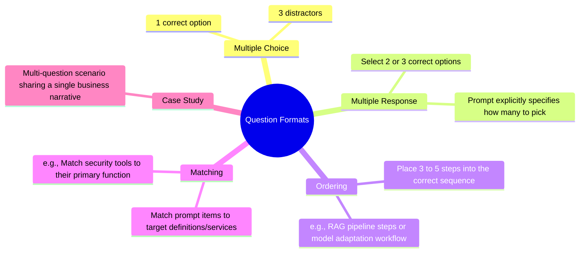
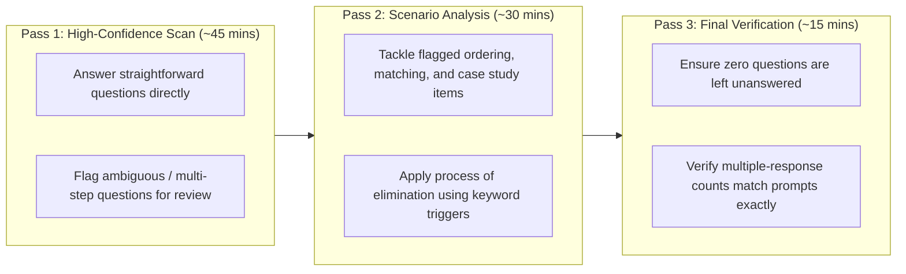

# State of Learning Checkpoint: AIF-C01 Blueprint, Domain Weightings & Exam Strategy

---

## Key Takeaways

The **AWS Certified AI Practitioner (AIF-C01)** exam is a foundational credential validating a holistic understanding of artificial intelligence, machine learning, generative AI, responsible AI principles, and security/governance on AWS.

- **Core Heavyweights:** Domains 2 and 3 together account for **52% of scored content**. Mastering foundation models, Bedrock capabilities, prompt engineering, and GenAI concepts makes up more than half the exam.
- **Scoring Structure:**
  - Total questions: **65 questions** (50 scored, 15 unscored beta questions randomly interspersed).
  - Scaled scoring: **100 to 1,000**, with a minimum passing score of **700**.
  - Time limit: **90 minutes**.
  - **No penalty for guessing:** Unanswered questions are scored incorrect; never leave a question blank.
- **Question Diversity:** Features modern AWS exam question formats—including multiple-choice, multiple-response, ordering sequences, matching pairs, and scenario-based case studies.
- **Scope Boundary:** Foundational conceptual knowledge and business use-case mapping are in scope. Low-level model implementation, custom loss function coding, deep hyperparameter tuning math, and complex data pipeline engineering are strictly out of scope.

---

## Deep Dive: The Five Exam Domains & Topic Breakdown

---

### In-Scope vs. Out-of-Scope Demarcation

| Domain Area            | In-Scope for AIF-C01 (Conceptual & Architectural)                           | Out-of-Scope (Reserved for Associate/Specialty)                                  |
| ---------------------- | --------------------------------------------------------------------------- | -------------------------------------------------------------------------------- |
| **Model Training**     | Choosing between pre-training, fine-tuning, RAG, and prompt engineering.    | Writing PyTorch/TensorFlow training loops; writing distributed training scripts. |
| **Data Engineering**   | Identifying S3 storage classes, selecting vector databases for RAG.         | Building complex Apache Spark jobs in EMR, AWS Glue ETL scripting.               |
| **MLOps & Metrics**    | Interpreting Precision, Recall, and Confusion Matrices at a business level. | Deriving backpropagation calculus, mathematical optimization algorithms.         |
| **Security & Network** | PrivateLink for Bedrock, Macie for PII scrubbing, IAM execution roles.      | Complex BGP routing, transit gateway peering topologies, deep kernel security.   |

---

### Question Format Breakdown

---

## Exam Day Execution Strategy

1. **Pacing:** 65 questions across 90 minutes gives you approximately **1.38 minutes (83 seconds) per question**.
2. **Never Leave Blanks:** Unanswered questions receive zero credit. Because there is no negative marking, submit an educated guess on every question before time expires.
3. **Keyword Trigger Technique:**
   - _"Unpredictable data access, no retrieval fees"_ $\rightarrow$ **S3 Intelligent-Tiering**
   - _"Discover PII in S3 before fine-tuning"_ $\rightarrow$ **Amazon Macie**
   - _"Scan container images in ECR for CVEs"_ $\rightarrow$ **Amazon Inspector**
   - _"Audit who executed an API call and from where"_ $\rightarrow$ **AWS CloudTrail**
   - _"Verify resource compliance rules and track configuration history"_ $\rightarrow$ **AWS Config**
   - _"Invoke Bedrock privately without traversing the public internet"_ $\rightarrow$ **VPC Interface Endpoint / PrivateLink**
   - _"Download third-party SOC 2 or ISO compliance reports for AWS"_ $\rightarrow$ **AWS Artifact**
   - _"Automate evidence collection across workloads for an external audit"_ $\rightarrow$ **AWS Audit Manager**

---
