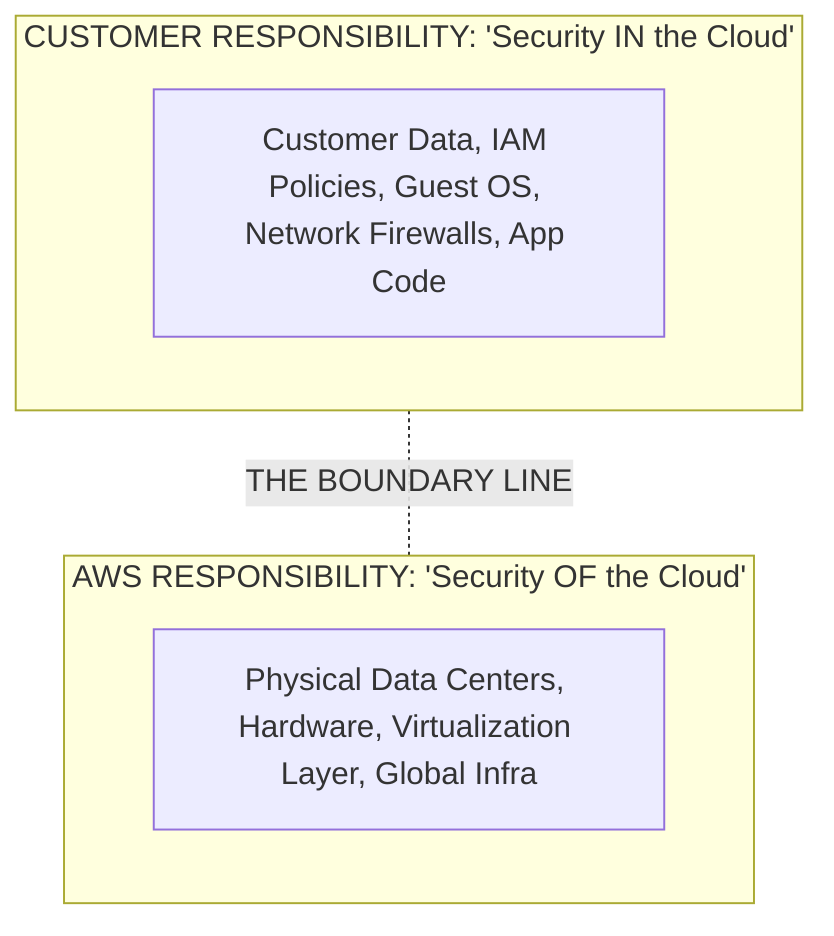

# Shared Responsibility Model & AWS Acceptable Policy

---

## Key Takeaways

Security in AWS is a team sport, but the boundaries are strictly defined. The simplest way to remember it: **AWS secures the cloud, while you secure what is in the cloud**.

Alongside security boundaries, every user agrees to the **AWS Acceptable Use Policy (AUP)**, which strictly forbids network abuse, illegal activities, security violations, and abusive messaging across cloud and AI workloads.

---

## Main Discussion

### Security OF the Cloud vs. Security IN the Cloud

The Shared Responsibility Model splits duties across physical infrastructure and logical configuration:

- **Security OF the Cloud (AWS Responsibility):** AWS manages and protects the physical facilities, hardware, host operating systems, virtualization layer, and foundational networking across all Regions and Availability Zones.
- **Security IN the Cloud (Customer Responsibility):** You are fully responsible for customer data classification, IAM access controls, encryption configurations, guest operating system patching (on IaaS), and security group firewall rules.

$$\text{Total Cloud Security} = \text{AWS Infrastructure ("OF the Cloud")} + \text{Customer Configuration ("IN the Cloud")}$$

---

### Service-Level Responsibility Matrix: How Responsibilities Shift

The amount of security configuration required depends directly on the service tier you select:

| Component               | IaaS (e.g. EC2) | PaaS / Managed AI | SaaS (AI APIs) |
| ----------------------- | --------------- | ----------------- | -------------- |
| Physical Hardware       | AWS             | AWS               | AWS            |
| Host Virtualization     | AWS             | AWS               | AWS            |
| Guest OS Patching       | CUSTOMER        | AWS               | AWS            |
| Network Configuration   | CUSTOMER        | Shared / Managed  | AWS            |
| Application Code / ML   | CUSTOMER        | CUSTOMER          | AWS            |
| Access / IAM Control    | CUSTOMER        | CUSTOMER          | CUSTOMER       |
| Customer Data & Prompts | CUSTOMER        | CUSTOMER          | CUSTOMER       |

- **Infrastructure as a Service (IaaS - e.g., EC2 for custom ML):** You manage the guest operating system, install updates, patch vulnerabilities, and set firewall rules.
- **Managed AI Services (e.g., Amazon Bedrock, SageMaker Serverless):** AWS manages the underlying compute runtime, OS patching, and model hosting hardware. You remain responsible for training datasets, prompt inputs, API access keys, and IAM policies.
- **Software as a Service (SaaS - e.g., Amazon Rekognition):** AWS manages model weights, retraining, scaling, and infrastructure. You only manage authentication, request data, and output handling.

---

### AWS Acceptable Use Policy (AUP) Boundaries

The Acceptable Use Policy defines prohibited uses of AWS services. Violations can lead to account suspension or termination:

- **Illegal or Harmful Content:** Storing, transmitting, or generating fraudulent, illegal, or defamatory materials.
- **Security Violations:** Unauthorized penetration testing, port scanning, or attempting to compromise the security or integrity of any network or system.
- **Network & Resource Abuse:** Launching denial-of-service (DoS) attacks, distributing malware, or crawling websites without authorization.
- **Message & Email Abuse:** Sending unsolicited mass email campaigns (spam), spoofing mail headers, or engaging in phishing.

---

## Exam Guide

### Exam Tips

- **The Keyword Rule:** Remember the core distinction on the exam:
  - Security **OF** the cloud = AWS handles it (Hardware, Physical facilities, Hypervisor).
  - Security **IN** the cloud = Customer handles it (Data, IAM permissions, OS updates on EC2, Security Groups).
- **Encryption is ALWAYS Customer Territory:** Even though AWS provides native tools like AWS KMS, deciding to enable encryption, managing keys, and applying access policies is always the customer's responsibility.
- **AUP Scope:** Penetration testing without following AWS authorized procedures, or using generative AI endpoints to spam users or distribute malware, directly violates the AWS Acceptable Use Policy.

---

### Practice Test

#### Question 1

A data engineering team is deploying a machine learning application on Amazon EC2 instances. Under the AWS Shared Responsibility Model, which security task is the sole responsibility of the customer?

- [ ] A. Maintaining the physical security of the host data center
- [ ] B. Applying security patches and updates to the guest operating system on EC2
- [ ] C. Managing the host virtualization hypervisor
- [ ] D. Decommissioning broken physical storage drives

Correct Answer

- [x] B. Applying security patches and updates to the guest operating system on EC2
  - **Explanation:** In an IaaS model such as Amazon EC2, the customer is responsible for maintaining the guest operating system, including installing software patches and applying OS-level security updates. AWS manages the underlying hardware, physical data center facilities, and hypervisor virtualization layer.

---

#### Question 2

A company is using Amazon Bedrock to run inference against foundation models. Which security responsibility remains with the customer?

- [ ] A. Securing the physical server racks hosting the foundation models
- [ ] B. Patching the operating systems running the underlying model compute cluster
- [ ] C. Managing IAM permissions and protecting user prompts and proprietary dataset access
- [ ] D. Maintaining the network infrastructure between AWS data centers

Correct Answer

- [x] C. Managing IAM permissions and protecting user prompts and proprietary dataset access
  - **Explanation:** Even when using managed generative AI services like Amazon Bedrock, the customer is strictly responsible for "Security in the Cloud", which includes configuring IAM access policies, managing authentication, and protecting customer data and prompt inputs. AWS takes care of the underlying hardware, infrastructure, and runtime environment.

---
