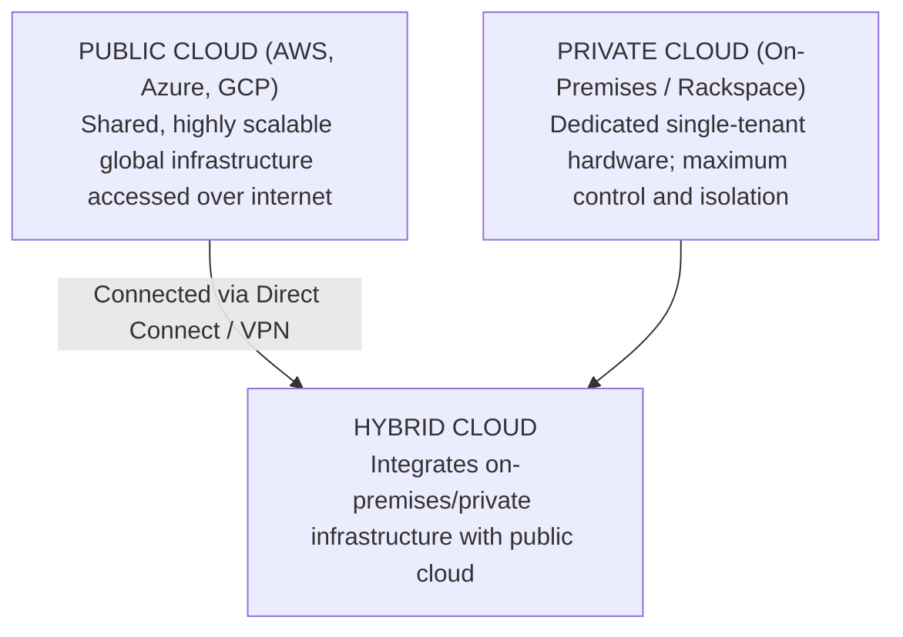
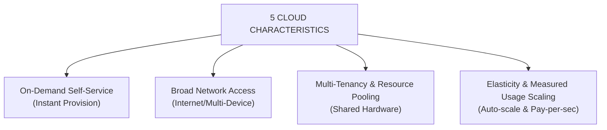

# What is Cloud Computing?

---

## Key Takeaways

Cloud computing is the **on-demand delivery** of compute, storage, database, and networking resources over the internet with **pay-as-you-go pricing**.

Instead of buying, owning, and maintaining physical data centers, you rent access to virtualized technology services from a cloud provider like Amazon Web Services (AWS). This eliminates guessing capacity and turns heavy upfront capital expenses into variable operational costs.

---

## Main Discussion

### The Three Cloud Deployment Models

Organizations adopt cloud infrastructure across three distinct deployment models based on compliance, control, and architectural requirements:

- **Public Cloud:** Fully owned and operated by third-party cloud service providers (CSPs) like AWS. Resources are delivered over the public internet.
- **Private Cloud:** Cloud infrastructure deployed exclusively for one organization. Offers strict data isolation but lacks massive scalability.
- **Hybrid Cloud:** Connects existing on-premises data centers to the public cloud, allowing organizations to retain sensitive legacy data locally while scaling cloud-native apps on AWS.

---

### The 5 Essential Characteristics of Cloud Computing

The National Institute of Standards and Technology (NIST) defines cloud computing through five foundational pillars:

$$\text{Cloud Utility} = \text{On-Demand Self-Service} + \text{Broad Access} + \text{Multi-Tenancy} + \text{Rapid Elasticity} + \text{Measured Service}$$

1. **On-Demand Self-Service:** Provision compute resources instantly without human intervention from AWS.
2. **Broad Network Access:** Resources are accessible over standard network protocols across diverse client platforms (web browsers, mobile, APIs).
3. **Multi-Tenancy & Resource Pooling:** Multiple customers (tenants) share the same physical underlying hardware while remaining securely isolated.
4. **Rapid Elasticity & Scalability:** Automatically scale resources out (add capacity during traffic spikes) and in (release capacity when idle).
5. **Measured Service:** Usage is metered down to the second/gigabyte, ensuring pay-as-you-go financial transparency.

---

### The 6 Core Business Advantages of AWS Cloud

| 6 ADVANTAGES OF THE CLOUD                                                |
| :----------------------------------------------------------------------- |
| 1. Trade Capital Expense (CapEx) for Variable Operational Expense (OpEx) |
| 2. Benefit from Massive Economies of Scale (Lower Pay-Per-Use Rates)     |
| 3. Stop Guessing Capacity (Auto-Scale Up or Down On-Demand)              |
| 4. Increase Speed and Agility (Launch Infrastructure in Seconds)         |
| 5. Stop Spending Money Running and Maintaining Data Centers              |
| 6. Go Global in Minutes (Deploy Applications Across Worldwide Regions)   |

---

## Exam Guide

### Exam Tips

- **CapEx vs. OpEx Tradeoff:** Remember that cloud computing converts **CapEx** (upfront hardware investments, server racks, real estate) into **OpEx** (pay-as-you-go variable expenses based on actual consumption).
- **Multi-Tenancy Isolation:** Multi-tenancy means multiple AWS accounts share physical servers underneath, but hypervisor-level security guarantees absolute logical data separation.
- **Hybrid Deployment Patterns:** Look for exam questions involving security/regulatory constraints where companies keep core databases on-premises while expanding web layers into AWS—this is always a **Hybrid Cloud** model.

---

### Practice Test

#### Question 1

A startup wants to launch an AI model inference API without purchasing physical server hardware or paying upfront data center leases. Which advantage of cloud computing best describes this financial shift?

- [ ] A. High capital expenditure with low operational agility
- [ ] B. Trading capital expenses (CapEx) for operational expenses (OpEx)
- [ ] C. Manual capacity guessing for fixed infrastructure scaling
- [ ] D. High total cost of ownership (TCO) through dedicated single-tenancy

Correct Answer

- [x] B. Trading capital expenses (CapEx) for operational expenses (OpEx)
  - **Explanation:** Cloud computing allows businesses to trade **CapEx** (purchasing physical servers and hardware upfront) for variable **OpEx** (paying only for the compute and storage resources consumed on demand).

---

#### Question 2

A enterprise financial firm maintains sensitive user records in an on-premises database due to legal compliance, but uses Amazon Bedrock in AWS to run generative AI summaries. Which cloud deployment model is this enterprise utilizing?

- [ ] A. Private Cloud
- [ ] B. Public Cloud
- [ ] C. Hybrid Cloud
- [ ] D. Multi-Region Serverless Cloud

Correct Answer

- [x] C. Hybrid Cloud
  - **Explanation:** A **Hybrid Cloud** deployment connects existing on-premises infrastructure with public cloud environments (like AWS), allowing companies to keep sensitive data on-prem while taking advantage of public cloud capabilities.

---

#### Question 3

A fintech company is looking to improve its software development lifecycle by adopting cloud-based solutions that allow for faster innovation and more efficient deployment of new features. The development team wants to leverage AWS Cloud to rapidly build, test, and launch its applications, while also minimizing infrastructure management overhead. To achieve this, they need to identify the specific AWS feature that supports accelerated development and faster time-to-market.

Which feature of AWS Cloud offers the ability to innovate faster and rapidly develop, test, and launch software applications?

- [ ] A. Elasticity
- [ ] B. Ability to deploy globally in minutes
- [ ] C. Agility
- [ ] D. Cost savings

Correct Answer

Cloud computing is the on-demand delivery of IT resources over the Internet with pay-as-you-go pricing. Instead of buying, owning, and maintaining physical data centers and servers, you can access technology services, such as computing power, storage, and databases, on an as-needed basis from a cloud provider like Amazon Web Services (AWS).

- [x] C. Agility
- **Explanation:** Agility refers to the ability of the cloud to give you easy access to a broad range of technologies so that you can innovate faster and build nearly anything that you can imagine. You can quickly spin up resources as you need them—from infrastructure services, such as compute, storage, and databases, to the Internet of Things, machine learning, data lakes and analytics, and much more.

Incorrect Answers

- [ ] A. Elasticity
  - **Explanation:** With cloud computing elasticity, you don’t have to over-provision resources upfront to handle peak levels of business activity in the future. Instead, you provision the number of resources that you need, scaling them up or down instantly to grow and shrink capacity as business needs change.
- [ ] B. Ability to deploy globally in minutes
  - **Explanation:** This benefit allows you to expand to new geographic regions and deploy globally in minutes across AWS infrastructure worldwide, putting applications closer to end users to reduce latency.
- [ ] D. Cost savings
  - **Explanation:** Cost savings refers to trading capital/fixed expenses (like physical data centers and servers) for variable expenses, paying only for IT as you consume it while benefiting from massive economies of scale.

Reference:

- [https://aws.amazon.com/what-is-cloud-computing/](https://aws.amazon.com/what-is-cloud-computing/)

---
