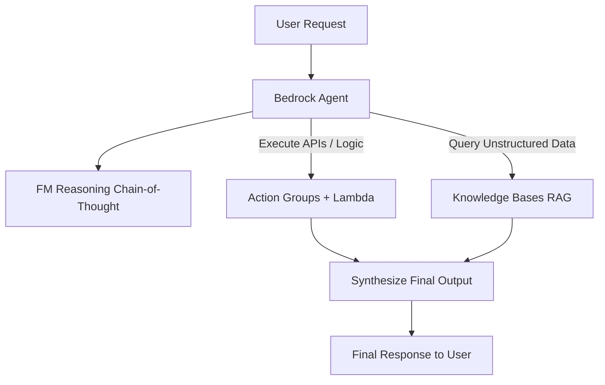
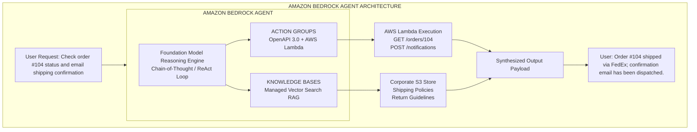
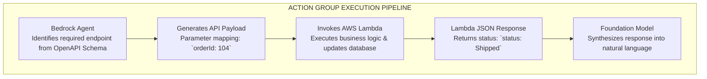

# Agents

---

## Key Takeaways

Amazon Bedrock Agents transitions foundation models from passive text generators into **autonomous task-executing agents**. Instead of simply replying to prompts, an Agent reasons through user requests, formulates a multi-step execution plan using **Chain-of-Thought (ReAct logic)**, and takes real actions across enterprise databases and APIs.

Bedrock Agents pairs foundation models with **Action Groups** (defined by **OpenAPI schemas** and executed via **AWS Lambda**) and **Knowledge Bases** (for RAG context), providing full execution visibility via built-in **Tracing**.

---

## Main Discussion

### The Agentic Architecture: Core Building Blocks

An Amazon Bedrock Agent orchestrates four foundational components:

| Component             | Technical Purpose & Operational Scope                                     |
| :-------------------- | :------------------------------------------------------------------------ |
| Foundation Model (FM) | The cognitive engine that interprets intent, breaks down tasks, and plans |
| Agent Instructions    | Natural language definition of the agent's persona, scope, and rules      |
| Action Groups         | Set of actions the agent can take, mapped via OpenAPI Schemas to Lambda   |
| Knowledge Bases (RAG) | Unstructured data sources (e.g., return policies, warranty guides) in S3  |

---

### Action Group Mechanics: OpenAPI Schemas & AWS Lambda

Action Groups define the external tools and operations the agent is authorized to execute.

- **OpenAPI 3.0 Schema:** An API specification stored in **Amazon S3** or defined inline. It details available endpoints, HTTP methods (`GET`, `POST`, `PUT`), parameter data types, and human-readable descriptions that guide the FM on _when_ and _how_ to call the API.
- **AWS Lambda Business Logic:** Serverless compute functions triggered by the agent to query relational databases, invoke external REST endpoints, deploy cloud infrastructure, or send emails.

---

### Reasoning Mechanics: The Chain-of-Thought (ReAct) Loop

Bedrock Agents relies on the **ReAct (Reason + Act)** prompting pattern to resolve non-trivial, multi-step queries dynamically without requiring hardcoded conditional workflows:

$$\text{Agent Step Loop} = \text{Thought (Reasoning)} \longrightarrow \text{Action (API / RAG Call)} \longrightarrow \text{Observation (Output Payload)} \longrightarrow \text{Next Step / Final Synthesis}$$

### The ReAct Execution Cycle

1. **THOUGHT:** "The user wants to order item X. First, I need to check stock."
2. **ACTION:** Invoke Action Group Lambda `checkInventory(itemId="X")`
3. **OBSERVATION:** Lambda returns `{"inStock": true, "inventory": 15}`
4. **THOUGHT:** "Item is in stock. Now I must execute `placeOrder`."
5. **ACTION:** Invoke Action Group Lambda `placeOrder(itemId="X", qty=1)`
6. **OBSERVATION:** Lambda returns `{"orderId": "ORD-9821", "success": true}`
7. **FINAL REPLY:** Synthesize confirmation message with order ID for the user.

---

### Observability & Debugging via Agent Tracing

When testing or running an agent, Bedrock provides **Tracing** capability directly in the console and via APIs (`InvokeAgent` response stream):

- **Step-by-Step Transparency:** Exposes every intermediate thought, generated API call payload, raw Lambda response, and retrieved Knowledge Base chunk.
- **Troubleshooting:** Allows developers to pinpoint whether an unexpected answer was caused by vague instructions, missing OpenAPI parameter descriptions, or Lambda execution errors.

---

## Exam Guide

### Exam Tips

- **Bedrock Agents vs. Standard Prompting:**
  - Use **Standard FM Invocations** for single-turn text generation, classification, or summarization.
  - Use **Bedrock Agents** when the system must execute **multi-step tasks**, orchestrate external API calls, query dynamic databases, or take automated actions in enterprise systems.
- **Action Group Prerequisites:** Every Action Group requires an **OpenAPI schema** (to define API endpoints and parameter descriptions) and an **AWS Lambda function** (to execute the actual business logic).
- **Tracing Feature Trigger:** If an exam question asks how an engineer can inspect the intermediate reasoning steps, tool calls, and execution rationale of a Bedrock Agent, the answer is **Agent Tracing**.
- **The "Holy Trinity" Pattern:** Bedrock Agents frequently combine **Action Groups** (taking actions/API calls), **Knowledge Bases** (grounding factual answers via RAG), and **Guardrails** (filtering safety/PII on inputs and outputs).

---

### Practice Test

#### Question 1

An insurance company wants to build an automated claims assistant. The assistant must accept customer claim details, consult internal claims policy documentation, calculate estimated claim payouts using backend corporate APIs, and file the final claim into the core database. Which AWS service and architecture should the company implement?

- [ ] A. Amazon Rekognition Custom Labels with Amazon S3 batch jobs
- [ ] B. Amazon Bedrock Agents configured with a Knowledge Base and Action Groups backed by AWS Lambda
- [ ] C. Supervised fine-tuning of an Amazon Titan model without external API integrations
- [ ] D. Amazon SageMaker Clarify with CloudWatch event triggers

Correct Answer

- [x] B. Amazon Bedrock Agents configured with a Knowledge Base and Action Groups backed by AWS Lambda
  - **Explanation:** **Amazon Bedrock Agents** can execute multi-step workflows by using **Knowledge Bases** to retrieve policy documentation and **Action Groups** (powered by OpenAPI schemas and **AWS Lambda**) to call backend APIs and update database records.

---

#### Question 2

A developer is testing an Amazon Bedrock Agent designed to book hotel reservations. During testing, the agent occasionally invokes the payment API before verifying room availability. How can the developer inspect the reasoning and execution flow of the agent to identify why this misordering occurs?

- [ ] A. Enable AWS CloudTrail data events for Amazon S3
- [ ] B. Inspect the Step-by-Step Tracing logs in the Amazon Bedrock Agent test panel
- [ ] C. Review the Amazon Titan Embeddings vector dimensions
- [ ] D. Configure a Denied Topic in Bedrock Guardrails

Correct Answer

- [x] B. Inspect the Step-by-Step Tracing logs in the Amazon Bedrock Agent test panel
  - **Explanation:** **Tracing** in Amazon Bedrock Agents exposes the model's step-by-step **Chain-of-Thought (ReAct)** reasoning, tool invocations, and observations, allowing developers to inspect and debug why specific actions were chosen and ordered.

---
