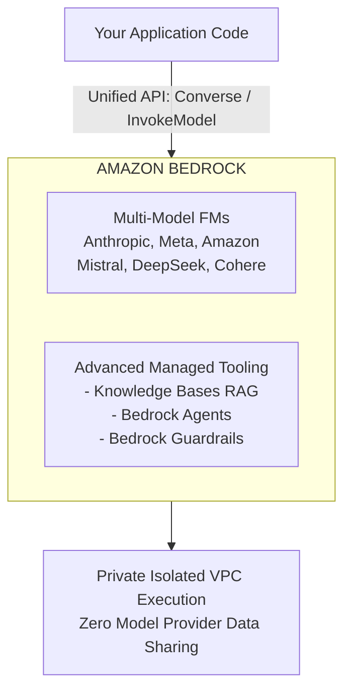
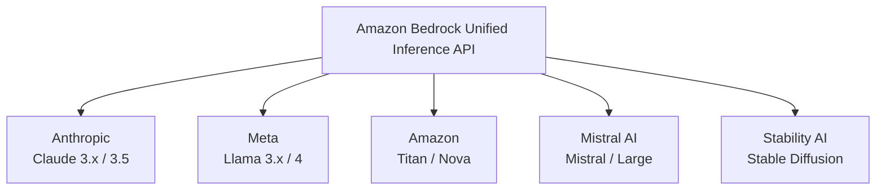
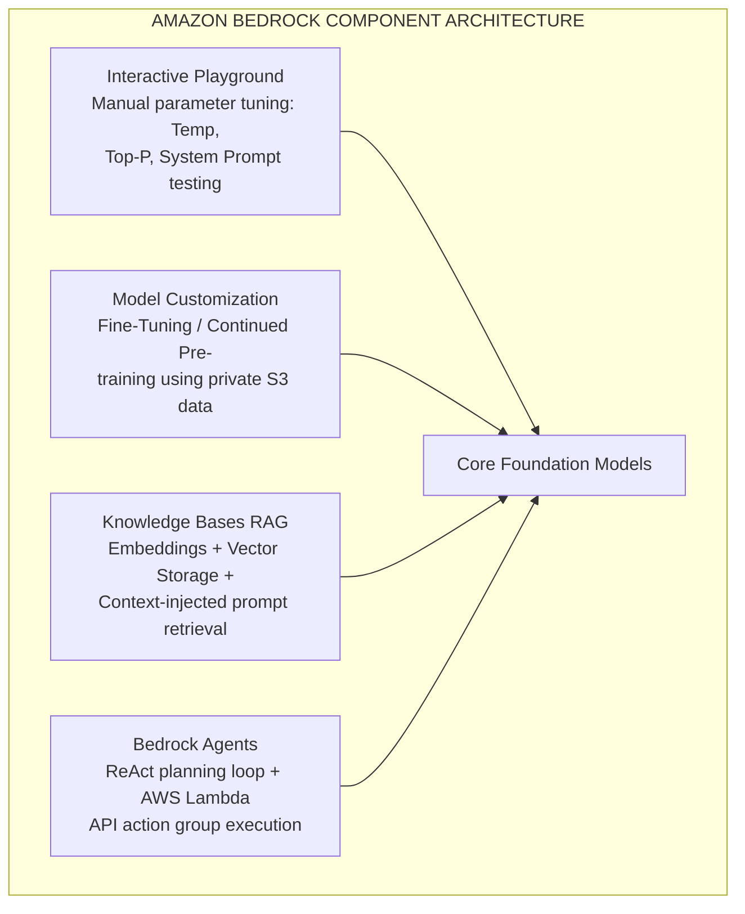

# Overview

---

## Key Takeaways

Amazon Bedrock is AWS's fully managed, serverless control plane for generative AI. Instead of deploying custom GPU clusters, maintaining model weights, or building custom inference endpoints, Bedrock lets you access industry-leading Foundation Models (FMs) through a single **Unified API**.

Crucially for enterprise security, every model invocation and fine-tuning job creates an isolated instance within your account boundary: **none of your prompt or training data is ever sent to third-party model providers or used to train base foundation models**.

---

## Main Discussion

### The Unified API & Multi-Provider Ecosystem

Amazon Bedrock unifies disparate foundation models under standardized request and response structures. You can swap foundation models by modifying a single parameter in your API call rather than rewriting application logic.

- **Multi-Provider Roster:** Bedrock partners directly with leading AI organizations (Anthropic, Meta, Mistral AI, Cohere, Moonshot AI, Stability AI) alongside Amazon's native model lines (**Amazon Titan** and **Amazon Nova**).
- **Unified API Abstraction:** Provides consistent endpoints (such as `InvokeModel` and `Converse` APIs) that standardize inputs, system prompts, and tool calling across different model providers.

---

### Amazon Bedrock Core Architectural Pillars

Bedrock delivers four native architectural components designed to move generative AI from prototype to production:

| Component               | Technical Architecture & Mechanics                          |
| :---------------------- | :---------------------------------------------------------- |
| Interactive Playgrounds | Web console for zero-code prompt testing & parameter tuning |
| Knowledge Bases (RAG)   | Managed Retrieval-Augmented Generation connecting S3 data   |
| Bedrock Agents          | Autonomous multi-step orchestration using AWS Lambda tools  |
| Model Customization     | Supervised Fine-Tuning & Continued Pre-training on S3 data  |

---

### Structural Request Path & Security Isolation Model

When an enterprise makes a request to Bedrock, the execution is encapsulated entirely within secure AWS infrastructure:

$$\text{Bedrock Request Pipeline} = \text{Client Prompt} \xrightarrow{\text{IAM / KMS}} \text{Isolated FM Runtime} \xrightarrow{\text{Zero Provider Telemetry}} \text{Response}$$

1. **Private Virtual Enclave:** When a foundation model is invoked, Bedrock processes the request in an isolated runtime environment dedicated to your request.
2. **Zero Provider Telemetry:** Prompts, completions, embeddings, and customized fine-tuning weights remain inside your AWS account environment and are never transmitted to model creators (e.g., Anthropic or Meta).
3. **Data Protection at Rest & in Transit:** All traffic is encrypted in transit via TLS 1.2/1.3 and can be encrypted at rest using your own **AWS KMS Customer Managed Keys (CMKs)**.

---

## Exam Guide

### Exam Tips

- **Managed Model Customization:** You can fine-tune models (e.g., Amazon Titan, Meta Llama, Anthropic Claude) in Bedrock by supplying labeled training data stored in **Amazon S3**. Bedrock creates a private copy of the custom model without modifying the public base model.
- **Unified API Benefits:** When an exam scenario describes migrating between different model providers without refactoring code or managing multiple vendor SDKs, the answer is **Amazon Bedrock's Unified API**.
- **RAG vs. Fine-Tuning Trigger:**
  - Use **Knowledge Bases (RAG)** when the model needs access to dynamic, frequently updated company documents without modifying model weights.
  - Use **Fine-Tuning** when you need the model to adopt a specific tone, vocabulary, style, or output structure using labeled domain examples.

---

### Practice Test

#### Question 1

A development team wants to build a generative AI customer support application. The team needs to test multiple foundation models from different providers (such as Anthropic and Meta) and integrate private internal knowledge documents from Amazon S3. The solution must minimize code refactoring and require zero server or GPU provisioning. Which AWS service should be used?

- [ ] A. Amazon SageMaker Training Jobs on EC2 GPU instances
- [ ] B. Amazon Bedrock with Knowledge Bases
- [ ] C. AWS Lambda custom container running open-source PyTorch models
- [ ] D. Amazon Comprehend custom classification endpoints

Correct Answer

- [x] B. Amazon Bedrock with Knowledge Bases
  - **Explanation:** **Amazon Bedrock** provides serverless, fully managed access to foundation models from multiple providers via a unified API. **Bedrock Knowledge Bases** natively connects models to enterprise data sources (such as Amazon S3) for managed Retrieval-Augmented Generation (RAG) with zero infrastructure management.

---

#### Question 2

A financial compliance officer is concerned about utilizing third-party foundation models hosted on Amazon Bedrock. They require guarantees that confidential corporate financial queries will not be used to train future public foundation models. Which statement accurately describes AWS Bedrock data privacy?

- [ ] A. Prompts are shared with model providers only after anonymization
- [ ] B. Bedrock uses customer data to continually pre-train global public models
- [ ] C. Bedrock does not use customer prompts or completions to train base foundation models, and data remains within the customer's AWS environment
- [ ] D. Data privacy guarantees apply only to Amazon Titan models, while third-party models retain full prompt logs

Correct Answer

- [x] C. Bedrock does not use customer prompts or completions to train base foundation models, and data remains within the customer's AWS environment
  - **Explanation:** In Amazon Bedrock, all customer prompts and completions remain strictly private and isolated within the customer's AWS environment. AWS and third-party foundation model providers do not use customer data to train or fine-tune public base models.

---
