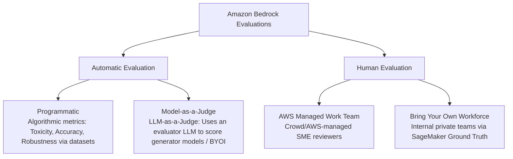

import ImageRow from '@site/src/components/ImageRow';
import evaluatorModel from './img/evaluator-model.png';
import inferenceModel from './img/inference-model.png';
import qualityMetrics from './img/quality-metrics.png';
import responsibleAIMetrics from './img/responsible-ai-metrics.png';

# FM Evaluation - Hands On

---

## Key Takeaways

Amazon Bedrock provides a native, structured evaluation engine under **Inference and Assessment > Evaluations** to systematically benchmark model quality, safety, and operational fit.

Automatic evaluation runs either **Programmatically** (using deterministic mathematical/algorithmic scoring) or via **Model-as-a-Judge** (using an advanced reasoning model like Claude 3.5 Sonnet to score outputs). For subjective tasks, **Human Evaluation** allows comparing **up to two models side-by-side** using either your own private workforce or an AWS-managed reviewer team.

---

## Hands-On Workflow: Configuring Bedrock Model Evaluations

1. **Navigate to Model Evaluations:**
   - Open the **Amazon Bedrock Console**.
   - In the left-hand navigation pane, locate the **Assess** section.
   - Click on **Evaluations** to open the evaluation dashboard.  
     
2. **Configure an Automatic Programmatic Evaluation:**
   - Click **Create** and select **Automatic: Programmatic**.
   - **Model Selection:** Choose the Foundation Model to evaluate (e.g., _Amazon Nova_ or _Meta Llama_).
   - **Task Type:** Select the target task domain (e.g., _General text generation_, _Text summarization_, _Question and Answer_, or _Text classification_).  
     
   - **Predefined Metrics:** Toggle desired algorithmic metrics such as **Toxicity**, **Accuracy**, and **Robustness**.  
     
   - **Datasets:** Select either the AWS **built-in curated prompt datasets** or provide your own custom dataset hosted in **Amazon S3**.
   - **Permissions & Output:** Designate an Amazon S3 URI to store evaluation output cards and reports, and assign the appropriate IAM service role.
3. **Set Up a Model-as-a-Judge Evaluation:**
   - Click **Create** and select **Automatic: Model as a judge** (LLM-as-a-Judge):
   - **Evaluator Model:** Select a high-reasoning judge model (e.g., **Anthropic Claude 3.5 Sonnet**).
   - **Inference Source:**
     - Choose a Bedrock-hosted model (e.g., _Amazon Nova Pro_), **OR**
     - Choose **Bring Your Own Inference (BYOI)** to score pre-generated inference responses from models hosted outside of Amazon Bedrock.
       <ImageRow>
         
         
       </ImageRow>
   - **Evaluator Metrics:** Select nuanced quality and alignment dimensions such as **Helpfulness**, **Faithfulness**, **Correctness**, and **Relevance**.
     <ImageRow>
       
       
     </ImageRow>
4. **Configure a Human Evaluation Job:**
   - Click **Create** and select **Human**:
   - **Workforce Type:**
     - **AWS Managed Team:** AWS provisions and manages vetted external annotators.
     - **Bring Your Own Workforce (Private Team):** Uses your organization's internal team members via Amazon SageMaker Ground Truth work teams.
   - **Model Comparison:** Select **up to two models** (e.g., _Amazon Nova Pro_ vs. _Anthropic Claude 3.5 Sonnet_) to present side-by-side responses to human raters.
   - **Task & Metrics:** Choose a standard task type or define a **Custom Task** with specific rating methods (e.g., Likert scales, Thumbs Up/Down, multi-attribute preference ranking).
   - Submit the job to route evaluation batches to the designated worker portal.  
     

---

## Exam Guide

### Exam Tips

- **Evaluation Taxonomy on the Exam:**
  - **Automatic: Programmatic:** Uses deterministic algorithms on datasets; best for rapid, reproducible checks on **Toxicity, Accuracy, and Robustness**.
  - **Automatic: Model-as-a-Judge:** Uses an LLM to evaluate another model's outputs; ideal for semantic quality dimensions like **Helpfulness, Faithfulness, and Factuality** without manual review overhead.
  - **Human Evaluation:** Best for subjective human preferences, styling, and empathy. Can evaluate **up to two models side-by-side**.
- **BYOI (Bring Your Own Inference):** Bedrock Model Evaluation supports evaluating models hosted _outside_ of Bedrock by uploading prompt-response pairs into Amazon S3 for evaluation by a Bedrock judge model.
- **Storage & IAM:** Evaluation reports, aggregated scores, and metric JSON files are always written to **Amazon S3** and require an IAM role with `s3:PutObject` permissions.

---

### Practice Test

#### Question 1

A data science team wants to evaluate whether an Amazon Bedrock foundation model generates toxic or unsafe responses when tested against a predefined set of adversarial prompts. The team requires a fully automated evaluation without human reviewers or using a secondary generative model as a judge. Which evaluation method in Amazon Bedrock should they choose?

- [ ] A. Human evaluation with an AWS Managed team
- [ ] B. Automatic: Programmatic evaluation selecting Toxicity as a metric
- [ ] C. Automatic: Model-as-a-Judge selecting Claude 3.5 Sonnet
- [ ] D. Supervised Fine-Tuning with an AWS Lambda validation split

Correct Answer

- [x] B. Automatic: Programmatic evaluation selecting Toxicity as a metric
  - **Explanation:** **Automatic Programmatic evaluation** uses predefined, deterministic algorithms and datasets to compute quantitative safety and quality metrics—such as **Toxicity, Robustness, and Accuracy**—without requiring human annotators or a secondary judge LLM.

---

#### Question 2

An enterprise wants to compare the customer friendliness and empathetic tone of two foundation models side-by-side before releasing a customer support chatbot. The company wants its internal customer experience team to rate and rank the model responses. Which Bedrock evaluation approach fulfills these requirements?

- [ ] A. Automatic Programmatic evaluation using BLEU and ROUGE metrics
- [ ] B. Automatic Model-as-a-Judge evaluation evaluating three models simultaneously
- [ ] C. Human evaluation using "Bring your own workforce" comparing up to two models
- [ ] D. Model Distillation with an AWS Lambda custom reward script

Correct Answer

- [x] C. Human evaluation using "Bring your own workforce" comparing up to two models
  - **Explanation:** **Human evaluation** in Amazon Bedrock supports evaluating and comparing **up to two models side-by-side** using a private internal workforce (**Bring your own workforce**) or an AWS-managed team to assess subjective qualities like friendliness, tone, and empathy.

---
