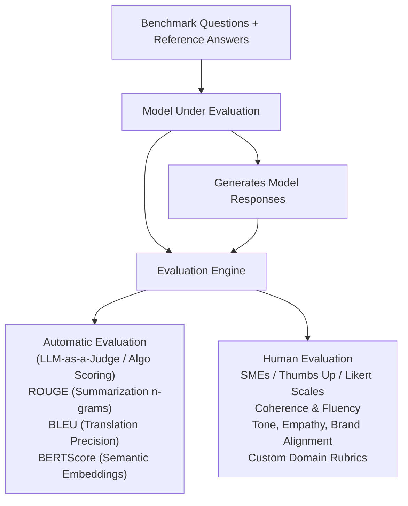

import ImageRow from '@site/src/components/ImageRow';
import automaticEvaluation from './img/automatic-evaluation.png';
import humanEvaluation from './img/human-evaluation.png';

# FM Evaluation

---

## Key Takeaways

Model selection isn't just about picking the biggest LLM; it requires empirical benchmarking against quality, safety, and operational criteria. Amazon Bedrock provides built-in **Automatic Evaluation** (via curated datasets and judge models) and **Human Evaluation** (via internal teams or subject matter experts) to grade candidate models objectively before deploying them into production.

Evaluating models with standard benchmark metrics—such as **ROUGE**, **BLEU**, **BERTScore**, and **Perplexity**—enables rapid identification of model bias, hallucination rates, and performance regressions with low administrative overhead.

---

## Main Discussion

### Automatic vs. Human Evaluation Architecture

Amazon Bedrock categorizes model evaluation workflows into two distinct operational paradigms:

### Bedrock Model Evaluation Workflows

| Dimension         | Automatic Evaluation                           | Human Evaluation                                  |
| :---------------- | :--------------------------------------------- | :------------------------------------------------ |
| Evaluator         | Pre-trained Judge LLM / Code                   | Internal workforce or SMEs                        |
| Evaluation Tasks  | Summarization, Q&A, Classification, Generation | Custom, open-ended, and nuanced qualitative tasks |
| Datasets Used     | Built-in curated or custom S3                  | Custom business prompt sets                       |
| Scoring Mechanism | ROUGE, BLEU, BERTScore, F1                     | Thumbs Up/Down, 1-5 Ranking                       |
| Speed & Cost      | Ultra-fast, highly scalable                    | Slower, higher resource cost                      |

<ImageRow>
  
  
</ImageRow>

---

### Quantitative Evaluation Metrics: ROUGE, BLEU, BERTScore & Perplexity

When measuring algorithmic output quality against reference ground truth, AWS utilizes distinct standard metrics:

#### 1. ROUGE (Recall-Oriented Understudy for Gisting Evaluation)

Primarily used for **automatic text summarization** and content extraction. It measures how much of the reference summary appears in the model-generated text.

$$\text{ROUGE-N} = \frac{\sum_{\text{gram}_n \in \text{Reference}} \text{Count}_{\text{match}}(\text{gram}_n)}{\sum_{\text{gram}_n \in \text{Reference}} \text{Count}(\text{gram}_n)}$$

- **ROUGE-N (e.g., ROUGE-1, ROUGE-2):** Measures $n$-gram overlap (single words or sequential word pairs) between candidate text and ground truth.
- **ROUGE-L:** Computes the **Longest Common Subsequence (LCS)**, rewarding models that preserve sentence-level word order without requiring continuous matches.

#### 2. BLEU (Bilingual Evaluation Understudy)

Primarily engineered for **machine translation** quality. BLEU is a precision-focused metric calculating modified $n$-gram precision combined with a penalty for overly short generated outputs (Brevity Penalty).

$$\text{BLEU} = \text{BP} \cdot \exp \left( \sum_{n=1}^{N} w_n \ln p_n \right)$$

$$\text{where } \text{BP} = \begin{cases} 1 & \text{if } c > r \\ e^{(1 - r/c)} & \text{if } c \le r \end{cases} \quad (c = \text{Candidate length}, \, r = \text{Reference length})$$

#### 3. BERTScore (Semantic Vector Similarity)

Unlike ROUGE and BLEU, which rely on exact string token matching, **BERTScore** computes semantic similarity using contextual token embeddings.

$$\text{BERTScore} = \text{Cosine Similarity}\left(\mathbf{e}_{\text{generated}}, \mathbf{e}_{\text{reference}}\right) = \frac{\mathbf{e}_g \cdot \mathbf{e}_r}{\Vert{}\mathbf{e}_g\Vert{} \Vert{}\mathbf{e}_r\Vert{}}$$

- Evaluates contextual meaning, allowing paraphrased answers with zero literal word overlap to score high if the semantic intent matches.

#### 4. Perplexity (PPL)

An intrinsic metric measuring how well a probability model predicts a sample. It represents the exponentiated average negative log-likelihood per token.

$$\text{Perplexity}(W) = \exp \left( -\frac{1}{N} \sum_{i=1}^{N} \ln P(w_i \mid w_1, \dots, w_{i-1}) \right)$$

- **Rule:** **Lower perplexity indicates higher model confidence** and predictive accuracy over the evaluation text.

---

### The Continuous Feedback & Production Business Metrics Loop

- **User Engagement & Satisfaction:** Collecting explicit user feedback (e.g., thumbs up/down, satisfaction surveys).
- **Operational & Financial Return (ROI):** Tracking revenue per interaction, customer conversion lifts, and compute inference costs per successful transaction.
- **Cross-Domain Versatility:** Assessing the model's robustness and generalization when handling inputs outside its primary training domain.

---

## Exam Guide

### Exam Tips

- **Metric Matching Cheat-Sheet:** Memorize these associations for fast question resolution:
  - **ROUGE:** Text **Summarization** (recall/n-gram overlap focus).
  - **BLEU:** Machine **Translation** (precision-focused with brevity penalty).
  - **BERTScore:** **Semantic Similarity** using contextual embeddings (meaning over syntax).
  - **Perplexity:** Token prediction uncertainty (**Lower is better**).
- **Bias Detection Strategy:** Using standardized, curated benchmark datasets in Amazon Bedrock provides an automated, low-overhead method to test foundation models for demographic bias, toxicity, and hallucinations before deployment.
- **Human vs. Automated Decision:** Choose **Human Evaluation** when assessing subjective attributes like conversational empathy, humor, visual coherence, or brand style alignment. Choose **Automatic Evaluation** for high-volume, standardized regression testing across common NLP tasks.

---

### Practice Test

#### Question 1

A development team is evaluating multiple foundation models on Amazon Bedrock for an automated document summarization pipeline. They need an automated metric that measures the overlap of n-grams and longest common subsequences between model-generated summaries and human-written reference summaries. Which evaluation metric should the team select?

- [ ] A. BLEU
- [ ] B. ROUGE
- [ ] C. Perplexity
- [ ] D. Area Under the ROC Curve (AUC)

Correct Answer

- [x] B. ROUGE
  - **Explanation:** **ROUGE** (Recall-Oriented Understudy for Gisting Evaluation) is the industry-standard metric specifically designed to evaluate text summarization performance by measuring n-gram overlaps (ROUGE-N) and longest common subsequences (ROUGE-L) against reference texts.

---

#### Question 2

An AI practitioner needs to compare two foundation models to determine which one is generating text with greater confidence and lower predictive uncertainty over a domain-specific dataset. Which metric should the practitioner analyze, and what value indicates superior performance?

- [ ] A. BLEU score; a lower score indicates better translation quality
- [ ] B. ROUGE-1 score; a lower score indicates higher vocabulary recall
- [ ] C. Perplexity; a lower score indicates higher confidence and predictive accuracy
- [ ] D. Perplexity; a higher score indicates greater model reasoning depth

Correct Answer

- [x] C. Perplexity; a lower score indicates higher confidence and predictive accuracy
  - **Explanation:** **Perplexity** measures a language model's uncertainty when predicting subsequent tokens. A **lower perplexity score** indicates the model is less "perplexed," reflecting higher confidence and tighter predictive alignment with the evaluation text.

---

#### Question 3

A financial services company is developing a machine-learning model to classify loan applications as either "approved" or "denied." To ensure the model performs effectively, the company wants to evaluate how accurately it predicts these outcomes. Specifically, they are interested in knowing the overall percentage of correct predictions, including both approved and denied applications. The company is considering several metrics to assess the model's performance in terms of the number of correct outcomes.

Which metric would be most appropriate for this purpose?

- [ ] A. The company should use R-squared, a statistical measure that indicates the proportion of variance in the dependent variable explained by the independent variables
- [ ] B. The company should use Root Mean Squared Error (RMSE), a metric that calculates the square root of the average of the squared differences between predicted and actual values
- [ ] C. The company should use F1 Score, a metric that considers both precision and recall by calculating their harmonic mean
- [ ] D. The company should use Accuracy, which measures the proportion of correctly predicted instances (both true positives and true negatives) out of the total number of instances

Correct Answer

- [x] D. The company should use Accuracy, which measures the proportion of correctly predicted instances (both true positives and true negatives) out of the total number of instances
  - **Explanation:** Accuracy is the most appropriate metric when the goal is to understand the proportion of correct outcomes in a binary classification problem. It provides a straightforward measure of how often the model correctly predicts the positive and negative classes. Accuracy is a suitable choice when the dataset is balanced (i.e., the number of positive and negative instances is approximately equal) and when the company wants a simple, overall performance measure of the model's correctness.

Incorrect Answers

- [ ] A. The company should use R-squared, a statistical measure that indicates the proportion of variance in the dependent variable explained by the independent variables
  - **Explanation:** R-squared is a metric that measures the goodness of fit in regression models. It shows how well the independent variables explain the variance in the dependent variable. Since R-squared is specific to regression tasks and not applicable to classification problems, it is not a suitable metric for evaluating the correct outcomes in a binary classification scenario.
- [ ] B. The company should use Root Mean Squared Error (RMSE), a metric that calculates the square root of the average of the squared differences between predicted and actual values
  - **Explanation:** RMSE is a metric used to measure the average magnitude of errors in a regression model's predictions. It is not appropriate for binary classification tasks because it is designed to assess continuous numeric predictions rather than categorical outcomes. Therefore, RMSE does not provide meaningful insights into the correct or incorrect outcomes in a classification context.
- [ ] C. The company should use F1 Score, a metric that considers both precision and recall by calculating their harmonic mean
  - **Explanation:** The F1 Score is a useful metric when dealing with imbalanced datasets in binary classification, as it balances precision (the proportion of true positive predictions among all positive predictions) and recall (the proportion of true positives among all actual positive instances). However, if the primary focus is simply to measure the correct outcomes without concern for the balance between precision and recall, then accuracy is a more straightforward metric. F1 Score is most appropriate when both false positives and false negatives need to be minimized, but it may not be necessary if the dataset is balanced and the company only wants to know the overall proportion of correct predictions.

Reference:

- https://aws.amazon.com/blogs/big-data/building-a-binary-classification-model-with-amazon-machine-learning-and-amazon-redshift/
- https://docs.aws.amazon.com/machine-learning/latest/dg/binary-classification.html

---
