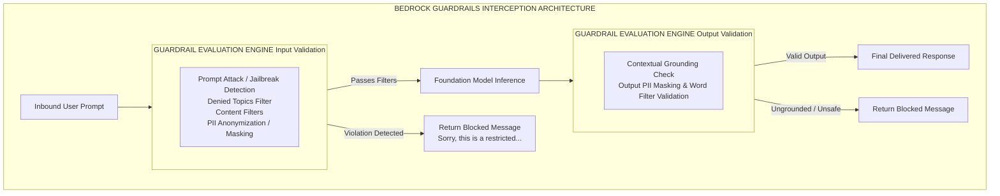

# GuardRails

---

## Key Takeaways

Amazon Bedrock Guardrails delivers a native, programmable safety and compliance boundary between your users and foundation models. Instead of attempting to control model behavior solely through fragile prompt engineering, Guardrails applies deterministic and probabilistic filters across both **User Inputs (Prompts)** and **Model Outputs (Completions)**.

Guardrails enforces **Denied Topics**, **Content Filters** (Hate, Violence, Sexual, Insults, Misconduct, Prompt Attacks), **Sensitive Information Filters** (PII redaction and masking), **Word Filters**, and **Contextual Grounding Checks** (hallucination reduction for RAG) across any Foundation Model in Bedrock or external models via the `ApplyGuardrail` API.

---

## Main Discussion

### The Five Functional Safeguards of Amazon Bedrock Guardrails

Guardrails operates as a multi-stage security pipeline inspecting incoming prompt payloads and outgoing generation streams:

| Safeguard Layer         | Technical Purpose & Operational Scope                                     |
| :---------------------- | :------------------------------------------------------------------------ |
| 1. Denied Topics        | Blocks domain-specific topics via natural language definitions & examples |
| 2. Content Filters      | Detects harmful content across 6 categories with configurable strengths   |
| 3. Sensitive Info (PII) | Redacts, masks, or blocks Personally Identifiable Information / RegEx     |
| 4. Word Filters         | Blocks custom profanity lists, competitor mentions, or standard files     |
| 5. Contextual Grounding | Calculates hallucination & relevance scores against RAG source context    |

---

### Contextual Grounding Checks: Mitigating Hallucinations in RAG

When pairing Bedrock Guardrails with **Bedrock Knowledge Bases (RAG)**, Guardrails introduces **Contextual Grounding Checks** to programmatically halt hallucinations before they reach end users.

$$\text{Grounding Evaluation} = \begin{cases} \text{ALLOW} & \text{if } S_{\text{grounding}} \ge \theta_g \land S_{\text{relevance}} \ge \theta_r \\ \text{GUARDRAIL\_INTERVENED} & \text{otherwise} \end{cases}$$

- **Grounding Score ($S_{\text{grounding}}$):** Measures whether claims in the model completion are factually supported by the reference documents retrieved from Amazon S3/OpenSearch.
- **Relevance Score ($S_{\text{relevance}}$):** Measures whether the model's generated answer directly addresses the user's input prompt.

---

### PII Protection & Data Masking Engine

Bedrock Guardrails protects user privacy by detecting predefined and custom sensitive information entities:

$$\text{Input String: } \text{"My SSN is 000-12-3456"} \xrightarrow{\text{PII Masking Filter}} \text{"My SSN is [SSN]"}$$

- **Predefined PII Types:** Social Security Numbers, Credit Card Numbers, Email Addresses, Phone Numbers, Driver's Licenses, Passport Numbers, and Bank Account details.
- **Custom Regex & Word Lists:** Custom regular expressions (e.g., proprietary internal employee IDs `EMP-[0-9]{6}`) and custom blocked terms (e.g., competitor brand names).
- **Action Types:** Choose between **Block** (halts execution and returns a pre-configured blocked message) or **Mask / Anonymize** (replaces sensitive tokens with generic placeholders like `[NAME]` or `[EMAIL]`).

---

### Multi-Level Versioning & Operational Telemetry

- **Draft vs. Numbered Versions:** Guardrails supports versioning (`DRAFT`, `v1.0`, `v2.0`), allowing security teams to iterate on filters and prompt attack rules without breaking production application deployments.
- **Cross-Model & Cross-Platform Support:** Guardrails can be attached to Bedrock FMs, Bedrock Agents, Bedrock Knowledge Bases, or external custom models via the `ApplyGuardrail` API.
- **CloudWatch & CloudTrail Monitoring:** Every guardrail intervention logs structured telemetry (`action: GUARDRAIL_INTERVENED`, policy assessment breakdown, confidence scores) to AWS CloudWatch for compliance audits.

---

## Exam Guide

### Exam Tips

- **Guardrails vs. SageMaker Clarify:**
  - **Bedrock Guardrails:** Real-time runtime safety, PII masking, hallucination blocking, prompt attack prevention, and denied topic filtering.
  - **SageMaker Clarify:** Offline bias detection during data preparation, model training, and post-training explainability (SHAP values).
- **Input vs. Output Interception:** Guardrails operates on **both** input prompts (preventing jailbreaks and off-topic queries) and output responses (preventing ungrounded claims, toxic completions, and PII leakage).
- **Prompt Attack Defenses:** Guardrails includes native protection against **Prompt Injections** (manipulating model system logic) and **Jailbreaks** (bypassing safety rules).
- **Cross-Model Portability:** Remember that Guardrails provides a unified safety layer that applies identical compliance rules across disparate models (e.g., Anthropic Claude, Meta Llama, and Amazon Titan) without changing application code.

---

### Practice Test

#### Question 1

A banking corporation is deploying a customer-facing assistant using Amazon Bedrock. The compliance team mandates that the assistant must never provide tax advice, must redact all customer Social Security Numbers from logs, and must block responses that deviate from verified corporate knowledge documents. Which AWS capability satisfies all three requirements?

- [ ] A. Amazon Bedrock Guardrails with Denied Topics, PII Sensitive Information Filters, and Contextual Grounding Checks
- [ ] B. AWS WAF with IP rate-limiting rules and CloudFront edge caching
- [ ] C. Amazon SageMaker Clarify with pre-training bias detection scripts
- [ ] D. Supervised Fine-Tuning of an Amazon Titan model using custom prompt templates

Correct Answer

- [x] A. Amazon Bedrock Guardrails with Denied Topics, PII Sensitive Information Filters, and Contextual Grounding Checks
  - **Explanation:** **Amazon Bedrock Guardrails** supports **Denied Topics** (blocking tax advice queries), **Sensitive Information Filters** (redacting/masking PII like SSNs), and **Contextual Grounding Checks** (validating that responses are grounded in source documents to eliminate hallucinations).

---

#### Question 2

An AI engineer observes that an LLM-based customer service agent occasionally fabricates warranty return windows that are not documented in the enterprise Knowledge Base. How should the engineer configure Amazon Bedrock Guardrails to automatically block these unverified claims?

- A. Set up Word Filters containing all product model numbers
- B. Enable Contextual Grounding Checks and define a Grounding threshold
- C. Increase the foundation model Temperature parameter in the Chat Playground
- D. Enable AWS Shield Advanced on the Amazon Bedrock API endpoint

Correct Answer

- [x] B. Enable Contextual Grounding Checks and define a Grounding threshold
  - **Explanation:** **Contextual Grounding Checks** in Amazon Bedrock Guardrails evaluate whether model responses are factually grounded in reference source data retrieved from the knowledge base. If the grounding score falls below the configured threshold, Guardrails blocks the hallucinated response.

---

#### Question 3

A global e-commerce company is utilizing a foundation model through Amazon Bedrock to enhance its customer service chatbot, providing automated support and answering user queries. However, the company is concerned about the potential for the model to generate inappropriate, sensitive, or malicious content that could harm its reputation or negatively impact customer experience. To mitigate these risks, the company seeks to implement safety measures that ensure the model consistently produces safe, relevant, and context-appropriate responses.

Given this goal, what would be the most effective approach to control these risks and maintain model safety?

- [ ] A. The company should retrain the underlying foundation model (FM) from scratch to prevent exposure
- [ ] B. The company should adjust the model hyperparameters to safeguard the output
- [ ] C. The company should instruct the model to stick to the prompt by adding explicit instructions to ignore any unrelated or potentially malicious content
- [ ] D. The company should develop an API that processes all responses from the model and checks for any risks of exposure, which involves creating a custom layer that monitors and filters all model outputs, scanning them for inappropriate or unsafe content before they are delivered to the end-user

Correct Answer

- [x] C. The company should instruct the model to stick to the prompt by adding explicit instructions to ignore any unrelated or potentially malicious content
  - **Explanation:** Providing explicit instructions within system prompts guides the model's behavior directly at generation time, establishing strict boundaries to ignore prompt injection attempts or off-topic prompts and reducing the likelihood of producing inappropriate or harmful content. This is a straightforward, low-overhead prompt engineering mechanism to enforce safety standards.

Incorrect Answers

- [ ] A. The company should retrain the underlying foundation model (FM) from scratch to prevent exposure
  - **Explanation:** Training a foundation model from scratch is prohibitively expensive, time-consuming, requires massive compute clusters, and cannot be done directly within Amazon Bedrock (where you can only customize pre-existing models).
- [ ] B. The company should adjust the model hyperparameters to safeguard the output
  - **Explanation:** Hyperparameters (such as temperature, top-p, or top-k) regulate randomness and token selection diversity, but they do not filter toxic concepts or enforce content moderation guidelines.
- [ ] D. The company should develop an API that processes all responses from the model and checks for any risks of exposure, which involves creating a custom layer that monitors and filters all model outputs, scanning them for inappropriate or unsafe content before they are delivered to the end-user
  - **Explanation:** Building a bespoke custom API layer introduces significant architectural complexity, latency, and maintenance burden. Instead of writing custom filtering microservices from scratch, native managed mechanisms (such as prompt guidance and Guardrails for Amazon Bedrock) are standard best practices.

Reference:

- https://aws.amazon.com/bedrock/guardrails/
- https://docs.aws.amazon.com/AWSCloudFormation/latest/UserGuide/aws-resource-bedrock-guardrail.html

---
