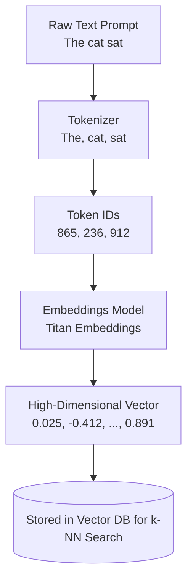
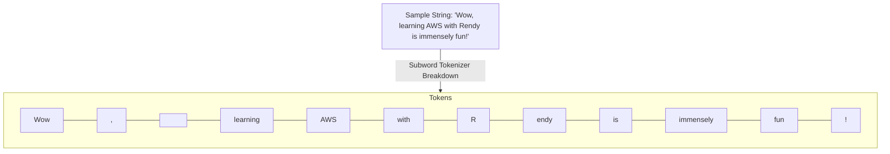

import ImageRow from '@site/src/components/ImageRow';
import twoDVisualization from './img/2d-visualization.png';
import colorVisualization from './img/color-visualization.png';

# More GenAI Concepts

---

## Key Takeaways

Generative AI models do not read characters, words, or pixels the way humans do. Raw unstructured text must first be split into discrete numerical identifiers (**Tokenization**) and mapped into continuous, multi-hundred-dimensional coordinate spaces (**Vector Embeddings**) where semantic meaning, syntactic grammar, and tone are mathematically encoded.

An LLM's **Context Window** defines its working memory limit—the maximum number of input and output tokens it can process in a single generation cycle. In vector search, words and concepts that share semantic meaning cluster closely together in latent space, enabling fast similarity search via nearest neighbor algorithms.

---

## Main Discussion

### The Mechanics of Tokenization

Tokenization is the mandatory pre-processing step that converts raw strings into integer arrays ($Token\ IDs$) that neural networks can process.

### Tokenization Strategies

| Tokenization Type                      | Operational Mechanism & Characterization                                                                                                                                    |
| :------------------------------------- | :-------------------------------------------------------------------------------------------------------------------------------------------------------------------------- |
| Word-based Tokenization                | Splits text strictly on whitespace and punctuation. Creates huge vocabularies; fails on typos and rare words.                                                               |
| Subword Tokenization (BPE / WordPiece) | Splits uncommon or complex words into frequent subword fragments (e.g., "unacceptable" -> "un" + "acceptable"). Handles prefixes, suffixes, and multilingual stems cleanly. |

[Sample OpenAI Tokenizer Output](https://platform.openai.com/tokenizer)

- **Rule:** Punctuation marks (commas, exclamation points, periods) and whitespace variations are mapped as distinct individual tokens.
- **Token-to-Word Ratio:** In English text, **1 token $\approx$ 0.75 words** (or 1,000 tokens $\approx$ 750 words).

---

### Context Window Capacities & Operational Trade-offs

The **Context Window** sets the ceiling on prompt capacity (instructions, chat history, RAG document context) combined with the generated completion.

$$\text{Total Window Utilization} = \text{Input Prompt Tokens} + \text{Generated Output Tokens} \le \text{Model Context Limit}$$

### Context Window Spectrum

| Foundation Model      | Window Capacity   | Workload Target                           |
| :-------------------- | :---------------- | :---------------------------------------- |
| Meta Llama 2          | 4,096 tokens      | Short conversational turns & Q&A          |
| Amazon Titan Text     | 8,192 tokens      | Standard enterprise tasks & summarization |
| OpenAI GPT-4 Turbo    | 128,000 tokens    | Comprehensive multi-page reporting        |
| Anthropic Claude 3.5  | 200,000 tokens    | Codebase analysis & book-length docs      |
| Google Gemini 1.5 Pro | 1,000,000+ tokens | Multi-hour video, audio, & repos          |

$$\text{Processing Overhead} \propto \mathcal{O}(N^2) \quad (\text{Standard self-attention compute scales quadratically with sequence length } N)$$

- **Benefits of Large Context Windows:** Ingest entire source repositories, multiple financial balance sheets, or full-length video streams directly into context without complex chunking strategies.
- **Trade-offs:** Ingesting large context loads demands significantly higher GPU memory, introduces higher inference latency, and increases cost per API invocation.

---

### High-Dimensional Vector Embeddings & Latent Space

Embeddings models (e.g., **Amazon Titan Text Embeddings V2**) convert token sequences into dense mathematical vectors $\mathbf{v} \in \mathbb{R}^d$ (typically $d = 256, 512, 1024, \text{or } 1536$ dimensions).

$$\mathbf{v}_{\text{text}} = \big[ v_1, v_2, v_3, \dots, v_d \big] \quad \text{where } v_i \in \mathbb{R}$$

- **Semantic Clustering:** Concepts with similar syntactic and contextual meanings share closer geometric proximity in latent vector space.  
  
- **Dimensionality Reduction:** Techniques like **t-SNE** or **PCA** compress 100+ dimensional vectors into 2D or 3D scatter plots for visual inspection while preserving relative distances.
  <ImageRow>
    
    
  </ImageRow>
- **Semantic Nearest Neighbor (k-NN) Search:** Powering enterprise search and RAG by querying the vector database to locate the closest vector clusters using distance metrics like Cosine Distance or Euclidean Distance ($L_2$).

---

## Exam Guide

### Exam Tips

- **Subword Tokenizer Behavior:** The exam tests your understanding of subword tokenization. Remember that subword algorithms split rare, compound, or domain-specific words into smaller tokens to keep vocabulary sizes manageable and handle unseen variations.
- **Context Window Boundaries:** If an application throws an error when feeding an entire product manual into a prompt, the root cause is exceeding the **Model Context Window**. The solutions are:
  - Switching to a foundation model with a larger context window (e.g., moving from an 8K model to a 200K model like Claude).
  - Implementing **RAG (Retrieval-Augmented Generation)** to chunk the document and pass only top-$k$ relevant text segments.
- **Embeddings Purpose:** Embeddings models generate numerical vectors representing **semantic meaning**. They do _not_ generate conversational text—they feed vector stores (like OpenSearch Serverless) to drive **semantic similarity and nearest neighbor searches**.

---

### Practice Test

#### Question 1

An e-commerce company wants to implement semantic search across its product catalog. When customers search for "warm winter footwear," the system must return listings for "snow boots" even if the exact keyword "footwear" is absent from the product description. Which AI technology makes this possible?

- [ ] A. Subword tokenization alone without vector conversion
- [ ] B. High-dimensional vector embeddings paired with nearest neighbor similarity search
- [ ] C. Rule-based SQL `LIKE` wildcard matching
- [ ] D. Linear regression forecasting

Correct Answer

- [x] B. High-dimensional vector embeddings paired with nearest neighbor similarity search
  - **Explanation:** **Vector embeddings** capture the underlying semantic meaning of words in a multi-dimensional coordinate space. Using a vector database with **nearest neighbor search**, the system identifies that "warm winter footwear" and "snow boots" share geometric proximity in latent space, enabling semantic retrieval without exact keyword matching.

---

#### Question 2

A developer is designing an internal tool to analyze legal deposition transcripts that average 150,000 words (approximately 200,000 tokens) in length. When using a foundation model with an 8,192 token limit, the API call fails. What is the most effective approach to resolve this limit?

- [ ] A. Switch to a foundation model supporting a 200K+ context window or implement a RAG pipeline to chunk and retrieve relevant sections
- [ ] B. Increase the inference Temperature to 1.0 to expand memory capacity
- [ ] C. Convert the input text into a single word-based token
- [ ] D. Disable subword tokenization in the IAM service role

Correct Answer

- [x] A. Switch to a foundation model supporting a 200K+ context window or implement a RAG pipeline to chunk and retrieve relevant sections
  - **Explanation:** The failure is caused by exceeding the model's **Context Window**. The issue can be resolved by selecting a foundation model designed for large contexts (such as Anthropic Claude with 200K tokens) or by using a **RAG pipeline** to chunk the transcript and retrieve only the relevant passages.

---

#### Question 3

An e-commerce company is developing a chatbot to enhance its user experience by allowing customers to submit queries that include both text descriptions and images, such as product photos or screenshots of issues. The company aims for the chatbot to understand these multi-modal inputs and provide accurate and context-aware responses, seamlessly combining visual and textual information to address customer needs effectively.

Which approach would be the most cost-effective for enabling the chatbot to process such multi-modal queries effectively?

- [ ] A. The company should use a multi-modal generative model, which can generate responses or outputs based on combined inputs from different modalities, such as text and images, enhancing the chatbot’s ability to provide contextually relevant answers
- [ ] B. The company should use a text-only language model, which is trained exclusively on textual data
- [ ] C. The company should use a convolutional neural network (CNN), a deep learning model primarily designed for processing image data
- [ ] D. The company should use a multi-modal embedding model, which is designed to represent and align different types of data (such as text and images) in a shared embedding space, allowing the chatbot to understand and interpret both forms of input simultaneously

Correct Answer

- [x] D. The company should use a multi-modal embedding model, which is designed to represent and align different types of data (such as text and images) in a shared embedding space, allowing the chatbot to understand and interpret both forms of input simultaneously
  - **Explanation:** A multi-modal embedding model is the most suitable and cost-effective choice for this task because it enables the integration of multiple types of data, such as text and images, into a unified representation. This allows the chatbot to effectively process and understand queries containing both text and visual content by aligning them in a shared embedding space, facilitating more accurate and context-aware retrieval and recommendations.

Incorrect Answers

- [ ] A. The company should use a multi-modal generative model, which can generate responses or outputs based on combined inputs from different modalities, such as text and images, enhancing the chatbot’s ability to provide contextually relevant answers
  - **Explanation:** While a multi-modal generative model can generate outputs based on multiple types of input data, it is more complex and typically used for generating new content rather than interpreting and retrieving query matches. Additionally, building and running inference on a multi-modal generative model is significantly costlier and computationally heavier compared to leveraging embedding-based retrieval.
- [ ] B. The company should use a text-only language model, which is trained exclusively on textual data
  - **Explanation:** A text-only language model cannot handle image data because it is designed to process and generate text exclusively. This model lacks the capability to understand or incorporate visual information.
- [ ] C. The company should use a convolutional neural network (CNN), a deep learning model primarily designed for processing image data
  - **Explanation:** A CNN is designed specifically for image recognition and processing tasks. It cannot process text-based inputs and therefore cannot fulfill the requirement of handling multi-modal queries that include both text and images without combining additional models, adding unnecessary complexity.

Reference:

- https://community.aws/content/2Z5Z29gSjBC2kRYeWpAQZzFE3tV/a-new-way-to-implement-product-search-using-titan-multimodal-embeddings-on-amazon-bedrock
- https://aws.amazon.com/about-aws/whats-new/2023/11/amazon-titan-multimodal-embeddings-model-bedrock/

---
