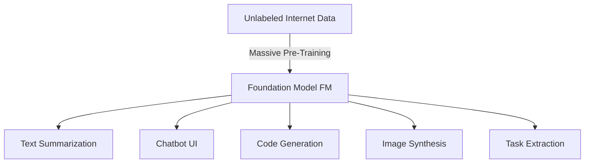

# What is Generative AI (GenAI)?

---

## Key Takeaways

Generative AI (GenAI) is a specialized subset of **Deep Learning** designed to create new, original unstructured artifacts—such as text, code, images, audio, and video—by learning patterns from massive pre-training datasets.

Large Language Models (LLMs) and Diffusion Models power this space. Because LLMs operate probabilistically by predicting the next most likely token, their default behavior is **non-deterministic** (identical prompts can produce different completions).

---

## Main Discussion

### The AI Hierarchy & The Foundation Model Paradigm

Generative AI sits at the core of the modern AI hierarchy:

$$\text{AI} \supset \text{Machine Learning (ML)} \supset \text{Deep Learning (DL)} \supset \text{Generative AI (GenAI)}$$

Instead of training isolated, single-purpose models from scratch for every task, the GenAI paradigm relies on **Foundation Models (FMs)**:

- **Foundation Models (FMs):** Extremely large neural networks trained on vast amounts of unlabeled data. They possess generalized reasoning and multi-task adaptability.  
  
- **Resource Scale:** Pre-training an enterprise-grade FM requires massive computational clusters, specialized accelerators (e.g., AWS Trainium, GPUs), and tens of millions of dollars, leading most organizations to consume pre-trained models rather than building them from scratch.
- **Open-Source vs. Proprietary/Commercial:**
  - _Open-Weights / Open-Source:_ Meta Llama, Google BERT.
  - _Commercial / API-Managed:_ Anthropic Claude, OpenAI GPT-4o, Amazon Titan.

---

### Large Language Models (LLMs) & Next-Token Probability

An **LLM** is an FM engineered specifically for natural language understanding and generation. It processes user input (**Prompts**) and generates output iteratively by computing probability distributions over vocabulary tokens.

---

$$\text{Predicted Next Token } \hat{w}_{t} = \arg\max_{w \in V} P(w \mid w_1, w_2, \dots, w_{t-1})$$

#### Why LLMs are Non-Deterministic

Traditional algorithms execute strict, deterministic conditional paths (`IF x THEN y`). LLMs use **probabilistic sampling** over candidate tokens. Even with identical prompts, sampling from probability distributions introduces variance across runs unless inference parameters (like Temperature) are set to force deterministic selection.

---

### Image Synthesis Mechanics: Diffusion Models

Modern generative image models (such as Stable Diffusion or Amazon Titan Image Generator) use a two-phase mathematical process:

1. **Forward Diffusion (Adding Entropy):** The model systematically injects Gaussian noise into training images across time steps until the image dissolves into pure static.
2. **Reverse Diffusion (De-noising / Generation):** The model learns to reverse the noise addition. During inference, it begins with random noise and iteratively removes noise guided by text embeddings from the prompt to construct a clean, novel image.

---

## Exam Guide

### Exam Tips

- **Taxonomy Precision:** Remember that **Foundation Models** are the base architecture, **LLMs** are text-focused foundation models, and **Diffusion Models** are primarily used for image/media generation.
- **Non-Determinism & Temperature:** The exam tests your understanding of model variability. Higher **Temperature** increases output randomness and creativity, while lowering Temperature toward `0.0` makes responses more deterministic and predictable.
- **Pre-training vs. Consumption:** Developing FMs from scratch involves massive capital and compute requirements; standard enterprise architecture focuses on consuming, prompt engineering, fine-tuning, or augmenting existing FMs using services like **Amazon Bedrock**.

---

### Practice Test

#### Question 1

A developer submits the exact same prompt to an LLM on Amazon Bedrock twice in separate sessions and receives two slightly different phrasing variations that convey the same core meaning. What fundamental characteristic of Large Language Models explains this behavior?

- A. Supervised regression overfitting
- B. Non-deterministic probabilistic token generation
- C. Lack of IAM permissions on the Bedrock foundation model
- D. High network latency across Availability Zones

Correct Answer

- [x] B. Non-deterministic probabilistic token generation
  - **Explanation:** LLMs generate responses through **probabilistic next-token prediction** rather than hardcoded deterministic rules. Because candidate tokens are selected from probability distributions during sampling, repeated calls with the same prompt naturally exhibit non-deterministic variations.

---

#### Question 2

An AI team wants to implement an image generation pipeline that synthesizes high-resolution product concepts from descriptive text prompts. Which generative AI model architecture is typically employed for this workload?

- [ ] A. Transformer-based Masked Language Models
- [ ] B. Rule-based Expert Systems
- [ ] C. Diffusion Models
- [ ] D. Linear Regression Models

Correct Answer

- [x] C. Diffusion Models
  - **Explanation:** **Diffusion Models** (such as Stable Diffusion) are the predominant generative AI architecture for synthesizing images and video by iteratively removing noise from a random latent space conditioned on text prompt inputs.

---

#### Question 3

A media company is looking to enhance its content creation processes by leveraging cutting-edge technologies and has been exploring the use of generative AI. The leadership team wants to understand the broader significance of generative AI in modern technological applications, including its potential to automate tasks, improve creativity, and optimize workflows across industries. Understanding why generative AI is considered important will help the company make informed decisions about integrating this technology into its operations.

Given this context, why is generative AI considered important in modern technological applications?

- [ ] A. Generative AI is the best fit for use cases related to gaming and entertainment applications
- [ ] B. Generative AI can replace all traditional databases with its own storage solutions
- [ ] C. Generative AI is important because it can autonomously create novel and complex data, enhancing creativity and efficiency in various domains
- [ ] D. Generative AI can easily perform simple tasks like sorting and filtering data

Correct Answer

- [x] C. Generative AI is important because it can autonomously create novel and complex data, enhancing creativity and efficiency in various domains
  - **Explanation:** Generative AI is important because it can autonomously create novel and complex data, which significantly enhances creativity and efficiency across various fields, such as content creation, design, and problem-solving.  
    

Incorrect Answers

- [ ] A. Generative AI is the best fit for use cases related to gaming and entertainment applications
  - **Explanation:** While generative AI can be used in gaming and entertainment, its applications extend far beyond these domains to include healthcare, finance, manufacturing, and more.
- [ ] B. Generative AI can replace all traditional databases with its own storage solutions
  - **Explanation:** Generative AI does not replace traditional databases; it works alongside them to enhance data-driven insights and applications.
- [ ] D. Generative AI can easily perform simple tasks like sorting and filtering data
  - **Explanation:** Generative AI is capable of much more than simple tasks like sorting and filtering data. Its primary strength lies in synthesizing new, complex data based on learned patterns.

References:

- https://aws.amazon.com/what-is/generative-ai/
- https://aws.amazon.com/ai/generative-ai/services/

---
