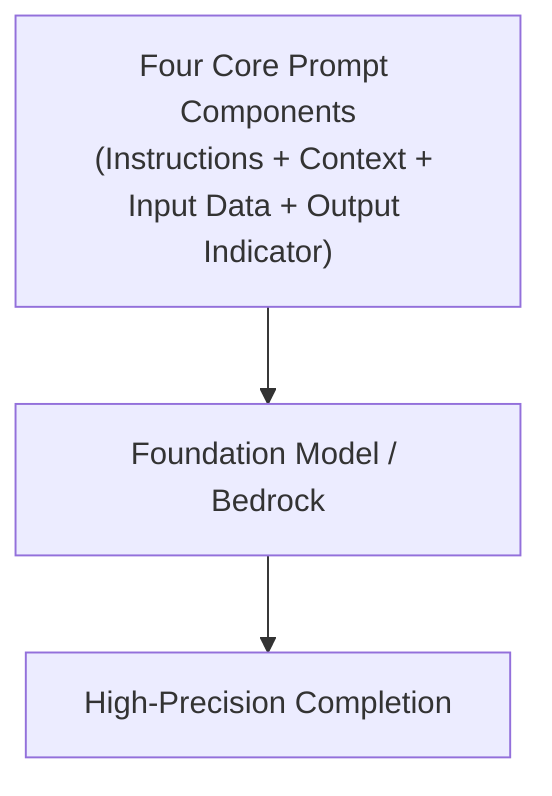

# What is Prompt Engineering?

---

## Key Takeaways

Prompt engineering is the systematic design and optimization of input text to guide Foundation Models (FMs) toward accurate, deterministic, and context-aligned responses. Instead of relying on naive, open-ended queries (e.g., _"Summarize what is AWS"_), enterprise prompts use **Four Core Structural Blocks**:

| Block                   | Description                                                 |
| :---------------------- | :---------------------------------------------------------- |
| **1. INSTRUCTIONS**     | The explicit task and behavioral guidelines                 |
| **2. CONTEXT**          | External background information and target audience persona |
| **3. INPUT DATA**       | The raw text, document, or data to be processed             |
| **4. OUTPUT INDICATOR** | The exact format, length, or structural constraint          |

To narrow model boundaries further, **Negative Prompting** explicitly defines what the model must **exclude or avoid**, eliminating irrelevant details, hallucinations, and unwanted technical jargon.

---

## Main Discussion

### The Four Pillars of Prompt Construction

When designing prompts for Amazon Bedrock or any LLM, organizing input into four distinct components minimizes ambiguity and improves consistency:

| Component               | Definition                                                          | Concrete Exam Example                                                |
| :---------------------- | :------------------------------------------------------------------ | :------------------------------------------------------------------- |
| **1. Instructions**     | Specifies the exact task to perform and behavioral rules.           | "Write a clear, concise summary focusing on core cloud services."    |
| **2. Context**          | Background situation, domain role, or target audience persona.      | "You are teaching a beginner-level cloud foundations class."         |
| **3. Input Data**       | The raw content, article text, or data records being analyzed.      | `<article> AWS provides on-demand compute and storage... </article>` |
| **4. Output Indicator** | Explicit schema, word count, tone, or structural formatting output. | "Provide a 2-3 sentence summary in a bulleted list format."          |

$$\text{Effective Prompt Execution} = \text{Instructions} + \text{Context} + \text{Input Data} + \text{Output Indicator}$$

---

### Negative Prompting: Establishing Clear Negative Constraints

Negative Prompting tells the model what **not** to do. While positive instructions define the target output, negative constraints prevent common generation pitfalls:

| Positive Guidance (What to include)                                                                    | Negative Constraints (What to exclude)                                                                                                |
| :----------------------------------------------------------------------------------------------------- | :------------------------------------------------------------------------------------------------------------------------------------ |
| _ Explain core benefits of AWS S3 _ Focus on storage durability \* Write for beginner learners | _ Do NOT use complex technical jargon _ Avoid mentioning pricing numbers or quotas \* Exclude speculative future capabilities |

- **Reduces Unwanted Content:** Directly suppresses off-topic remarks, speculative answers, or unverified claims.
- **Preserves Topic Focus:** Keeps multi-turn conversations anchored strictly to the intended business scope.
- **Improves Output Readability:** Prevents the LLM from leaking overly complex implementation code when addressing non-technical users.

---

## Exam Guide

### Exam Tips

- **Identify the Four Prompt Elements:** The exam frequently presents prompt snippets and asks you to identify the missing structural component (e.g., if a prompt provides a task, context, and data but forgets length/schema rules, it lacks the **Output Indicator**).
- **Negative Prompting Purpose:** When a scenario asks how to stop a model from outputting sensitive internal jargon, code snippets, or overly verbose commentary without retraining, the answer is **Negative Prompting**.
- **Prompt Optimization Order:** Always apply structured prompt engineering (instructions, context, formatting boundaries, and negative prompts) before reaching for more complex and costly methods like fine-tuning.

---

### Practice Test

#### Question 1

A marketing manager writes the following prompt for Amazon Bedrock: _"Summarize our quarterly release notes into two paragraphs for non-technical retail customers. Do not include internal bug tracker IDs or code syntax."_ Which two prompt engineering techniques are being used in this prompt? (Select TWO.)

- [ ] A. Negative Prompting
- [ ] B. Model Distillation
- [ ] C. Output Indicator
- [ ] D. Supervised Fine-Tuning
- [ ] E. Continued Pre-training

Correct Answer

- [x] A. Negative Prompting
- [x] C. Output Indicator
  - **Explanation:** Specifying _"Do not include internal bug tracker IDs or code syntax"_ is an explicit example of **Negative Prompting**. Specifying _"into two paragraphs for non-technical retail customers"_ defines the target structure and length, serving as an **Output Indicator** paired with context.

---

#### Question 2

An AI developer provides a foundation model with an extensive text article and asks: _"Extract all action items."_ The model returns a lengthy conversational paragraph with extra commentary rather than a clean list. Which core prompt engineering block should the developer add to enforce a concise bulleted list?

- [ ] A. Input Data
- [ ] B. Output Indicator
- [ ] C. Embeddings Vector
- [ ] D. Contextual Grounding Check

Correct Answer

- [x] B. Output Indicator
  - **Explanation:** An **Output Indicator** specifies the exact structure, format, length, or schema (e.g., _"Format your response as a numbered bullet list containing only action items"_) required from the model.

---
