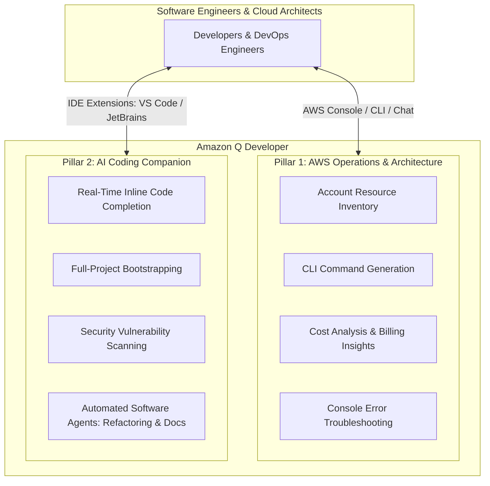
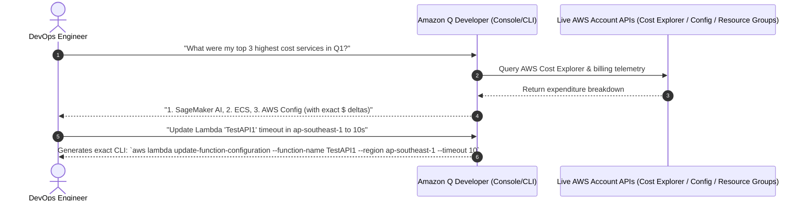
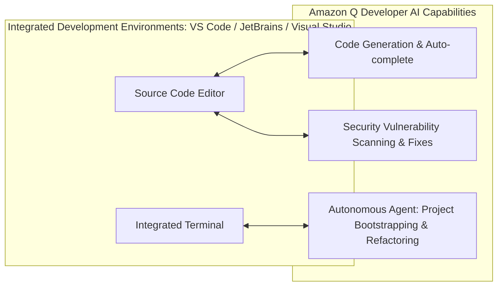

# Amazon Q Developer: Cloud Operations & AI Code Companion

---

## Key Takeaways

:::note
Amazon Q Developer has been rebranded as **Kiro**
:::

**Amazon Q Developer** is a specialized generative AI assistant designed for software engineers, DevOps practitioners, and cloud architects. It operates across two primary functional roles: an **AWS Cloud & Operations Expert** and an **AI Coding Companion**.

In the AWS Console and CLI, Amazon Q Developer queries account inventory, generates exact AWS CLI syntax, and analyzes billing trends. In the IDE (Visual Studio Code, JetBrains), it provides inline code completions, project bootstrapping, automated unit testing, code transformations (e.g., Java runtime upgrades), and security vulnerability scans.

---

## Main Discussion

### Pillar 1: AWS Cloud Expert & Operational Intelligence

Amazon Q Developer integrates natively into the AWS Management Console, CLI, and mobile apps to interact with your live AWS environments using natural language:

| Operational Capability      | Technical Functionality                                                     | Example Use Case                                            |
| --------------------------- | --------------------------------------------------------------------------- | ----------------------------------------------------------- |
| **Resource Inventory**      | Queries live AWS account resources across regions via natural language      | _"List all running EC2 instances in us-west-2"_             |
| **CLI Generation**          | Synthesizes precise AWS CLI commands with parameters and flags              | _"Generate CLI command to attach an IAM policy to my role"_ |
| **Billing & Cost Analysis** | Ingests AWS Cost Explorer data to summarize spend and identify cost drivers | _"Why did my RDS bill increase by 30% this month?"_         |
| **Error Diagnostics**       | Analyzes console error traces and recommends remediation steps              | Diagnosing IAM permission denials (`AccessDeniedException`) |

---

### Pillar 2: AI Code Companion & Autonomous Developer Agents

Inside supported Integrated Development Environments (IDEs), Amazon Q Developer serves as an end-to-end coding assistant optimized for AWS services and enterprise programming languages (Python, Java, JavaScript, TypeScript, C#, Go, and SQL):

| Developer Capability       | Scope & Workflow                                                                                                |
| -------------------------- | --------------------------------------------------------------------------------------------------------------- |
| **Inline Code Generation** | Proposes full functions and multiline completions as you type or write docstrings                               |
| **Security Scanning**      | Identifies security vulnerabilities, hardcoded secrets, and OWASP Top 10 risks with one-click fixes             |
| **Autonomous Task Agents** | Builds base project structures, implements complete features across multiple files, and generates documentation |
| **Code Transformation**    | Automates legacy codebase refactoring (e.g., upgrading Java 8/11 codebases to Java 17/21)                       |

---

### Feature Matrix: Amazon Q Developer vs. Amazon Q Business

| Dimension              | Amazon Q Developer                                      | Amazon Q Business                                              |
| ---------------------- | ------------------------------------------------------- | -------------------------------------------------------------- |
| **Target Persona**     | Developers, DevOps, SREs, Cloud Architects              | Business employees, HR, Marketing, Operations                  |
| **Primary Interfaces** | IDEs (VS Code, JetBrains), AWS Console, AWS CLI         | Standalone Web Chat, Slack, Microsoft Teams, Q Apps            |
| **Core Functions**     | Coding, debugging, IaC generation, AWS billing & CLI    | Workplace Q&A, enterprise document search, ticket logging      |
| **Data Sources**       | Code repositories, AWS docs, live AWS account telemetry | 40+ SaaS/Storage connectors (SharePoint, S3, Jira, Salesforce) |
| **Action Mechanism**   | Executes CLI scripts, IDE refactoring agents            | Invokes business plugins (ServiceNow, Jira, Zendesk)           |

---

## Exam Guide

### Exam Tips

- **Amazon Q Developer vs. Amazon Q Business Disambiguation:**
  - Choose **Amazon Q Developer** when scenarios involve **writing code**, **generating unit tests**, **troubleshooting AWS console errors**, **generating AWS CLI commands**, or **upgrading Java versions**.
  - Choose **Amazon Q Business** when scenarios involve non-technical staff querying **corporate policy PDFs**, searching **SharePoint/Confluence wikis**, or creating **no-code workplace applications (Q Apps)**.
- **CLI & Account Telemetry Role:** Amazon Q Developer can read AWS account resources and write executable CLI syntax, but it will **not silently execute destructive infrastructure changes** without user confirmation.
- **Security & Vulnerability Scanning:** Amazon Q Developer includes automated static security scanning in the IDE, flagging vulnerabilities and offering remediation code patches.
- **Supported IDEs:** Visual Studio Code, JetBrains IDE family (IntelliJ IDEA, PyCharm), Visual Studio, and AWS Cloud9.

---

### Practice Test

#### Question 1

A DevOps engineer needs to identify all inactive AWS Lambda functions across three AWS regions and determine which services contributed most to an unexpected increase in the monthly AWS bill. The engineer wants to interact with AWS account telemetry using natural language without writing custom analytical scripts. Which tool should the engineer use?

- [ ] A. Amazon SageMaker JumpStart
- [ ] B. Amazon Q Developer
- [ ] C. Amazon Comprehend Medical
- [ ] D. Amazon Bedrock Knowledge Bases

Correct Answer

- [x] B. Amazon Q Developer
  - **Explanation:** **Amazon Q Developer** provides conversational operational intelligence within the AWS Management Console and CLI, allowing engineers to query live resource inventories (like Lambda functions) and analyze AWS Cost Explorer billing data directly using natural language.

---

#### Question 2

A software development team wants an AI assistant in Visual Studio Code that generates Python functions for Amazon S3 file handling, performs automated security scans for vulnerabilities before commit, and assists with refactoring legacy application code. Which AWS service provides these features?

- [ ] A. Amazon Q Developer
- [ ] B. Amazon Q Business
- [ ] C. Amazon Polly
- [ ] D. AWS AppSync

Correct Answer

- [x] A. Amazon Q Developer
  - **Explanation:** **Amazon Q Developer** integrates directly into IDEs like VS Code to deliver inline code generation, project scaffolding, security vulnerability scanning, and automated code refactoring.

---

#### Question 3

A software development company is exploring Amazon Q Developer to enhance its internal tools and workflows. The company is particularly interested in leveraging the platform's capabilities to automate code generation, improve task automation, and integrate machine learning features into its applications. To understand how Amazon Q Developer can support these objectives, the development team needs a clear overview of its core functionalities.

Which of the following represents the capabilities of Amazon Q Developer? (Select two)

- [ ] A. Deploy your cloud infrastructure on AWS
- [ ] B. Modify your AWS resources to achieve cost-optimization
- [ ] C. Understand and manage your cloud infrastructure on AWS
- [ ] D. Get answers to your AWS account-specific cost-related questions using natural language
- [ ] E. Visualize your AWS account-specific cost-related data in Amazon Q Developer

Correct Answers

- [x] C. Understand and manage your cloud infrastructure on AWS
  - **Explanation:** Amazon Q Developer helps you understand and manage your cloud infrastructure on AWS. With this capability, you can list and describe your AWS resources using natural language prompts (e.g., "List all of my Lambda functions"), minimizing friction in navigating the AWS Management Console and compiling documentation.
- [x] D. Get answers to your AWS account-specific cost-related questions using natural language
  - **Explanation:** Amazon Q Developer can answer AWS cost-related questions using natural language by retrieving and analyzing cost data from AWS Cost Explorer.  
    

Incorrect Answers

- [ ] A. Deploy your cloud infrastructure on AWS
  - **Explanation:** Amazon Q Developer helps you understand and manage your cloud infrastructure, as well as generate AWS CLI commands or code templates, but it does not directly deploy your cloud infrastructure on AWS.
- [ ] B. Modify your AWS resources to achieve cost-optimization
  - **Explanation:** Amazon Q Developer can retrieve cost insights, analyze spending, and surface recommendations, but it does not autonomously modify your AWS resources to achieve cost optimization.
- [ ] E. Visualize your AWS account-specific cost-related data in Amazon Q Developer
  - **Explanation:** In this context, Amazon Q Developer answers cost-related questions using text and provides links to visualize that data in AWS Cost Explorer rather than providing native visualization dashboards.

Reference:

- https://docs.aws.amazon.com/amazonq/latest/qdeveloper-ug/what-is.html
- https://aws.amazon.com/blogs/aws/amazon-q-developer-now-generally-available-includes-new-capabilities-to-reimagine-developer-experience/

