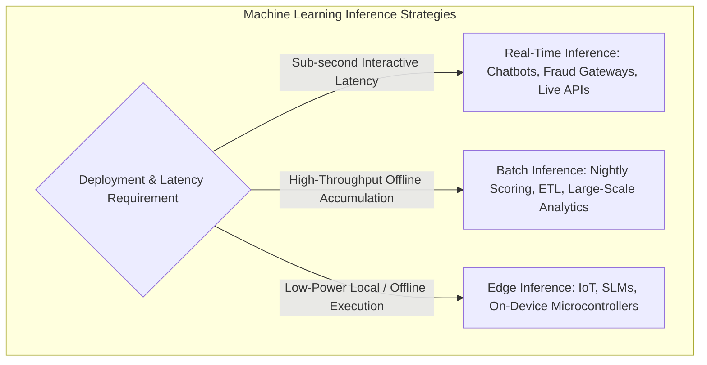
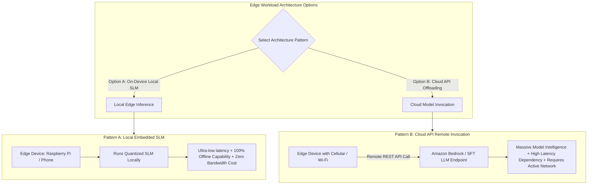

import RealTimeInference from './img/real-time-inference.png';
import BatchInference from './img/batch-inference.png';
import InferencingAtEdge from './img/inferencing-at-edge.png';

# Machine Learning Inference Strategies: Real-Time, Batch & Edge Architectures

---

## Key Takeaways

**Model Inference** is the operational phase where a trained machine learning model consumes new, unseen input data to generate predictions or generate novel content.



The optimal inference strategy is dictated by architectural trade-offs between **latency**, **throughput**, **hardware constraints**, **network connectivity**, and **compute costs**.

---

## Main Discussion

### Comparison: Real-Time vs. Batch vs. Edge Inference

<div className="grid grid-cols-1 md:grid-cols-4">

    <div className="md:col-span-2 w-full">
        ```mermaid
        flowchart LR
            subgraph RealTimePattern [1. Real-Time Inference]
                UserApp[Client App / Browser] -->|Synchronous API Request| RT_Endpoint[SageMaker Real-Time Endpoint / Bedrock API]
                RT_Endpoint -->|Sub-second Prediction| UserApp
            end
        ```
    </div>

    

</div>

<div className="grid grid-cols-1 md:grid-cols-4">

    <div className="md:col-span-2 w-full">
        ```mermaid
        flowchart LR
            subgraph BatchPattern [2. Batch Inference]
                S3In[(S3: Millions of Records)] -->|Asynchronous Batch Transform Job| BatchEngine[Batch Processing Cluster]
                BatchEngine -->|Write Predictions| S3Out[(S3: Output Parquet / CSV)]
            end
        ```
    </div>
    

</div>

<div className="grid grid-cols-1 md:grid-cols-4">

    <div className="md:col-span-2 w-full">
        ```mermaid
        flowchart LR
            subgraph EdgePattern [3. Edge Inference]
                Sensor[IoT Sensor / Mobile App] -->|Local Execution without Cloud Network| SLM[On-Device SLM / AWS IoT Greengrass]
            end
        ```
    </div>
    

</div>

| Dimension             | Real-Time Inference                                            | Batch Inference                                            | Edge Inference                                              |
| --------------------- | -------------------------------------------------------------- | ---------------------------------------------------------- | ----------------------------------------------------------- |
| **Response Latency**  | Milliseconds to seconds (Synchronous).                         | Minutes to hours (Asynchronous).                           | Single-digit milliseconds (Local on-device).                |
| **Input Processing**  | Single payload or mini-batch per request.                      | Massive static datasets processed en masse.                | Streaming local sensor feeds / on-device interactions.      |
| **Connectivity**      | Requires continuous internet connection to cloud endpoints.    | Processes offline data pools stored in cloud storage.      | Operates fully **offline** without network connectivity.    |
| **Hardware Location** | Cloud-hosted dedicated GPU/CPU instances.                      | Ephemeral distributed cloud compute clusters.              | Embedded devices, phones, smart cameras, Raspberry Pi.      |
| **Model Footprint**   | Large foundation models (LLMs) or complex ensembles.           | Deep models or massive tabular batch scoring algorithms.   | **Small Language Models (SLMs)**, quantized/pruned weights. |
| **AWS Services**      | Amazon SageMaker Real-Time Endpoints, Bedrock InvokeModel API. | Amazon SageMaker Batch Transform, Bedrock Batch Inference. | AWS IoT Greengrass, SageMaker Edge Manager.                 |

---

### Edge Architectures: Local Small Language Models (SLMs) vs. Cloud Offloading

Deploying machine learning to edge devices involves balancing model capacity against hardware limits:



| Strategy                   | Advantages                                                                                                                                        | Trade-offs & Constraints                                                                                                                                      |
| -------------------------- | ------------------------------------------------------------------------------------------------------------------------------------------------- | ------------------------------------------------------------------------------------------------------------------------------------------------------------- |
| **On-Device Local SLM**    | • Zero network latency overhead<br/> • Fully operational during network blackouts<br/> • Enhanced privacy (data never leaves the local perimeter) | • Constrained compute, memory, and battery capacity<br/> • Limited reasoning depth compared to multi-billion parameter LLMs                                   |
| **Cloud Model Offloading** | • Access to high-capacity Foundation Models (e.g., Claude 3.5, Amazon Nova)<br/> • Centralized model governance and security patches              | • High latency due to network transit hops<br/> • System fails if cellular/satellite connectivity drops<br/> • Recurring outbound data transfer and API costs |

---

## Exam Guide

### Exam Tips

- **Inference Strategy Decision Matrix:**
  - **Real-Time Inference:** Choose when scenarios require **sub-second, interactive responses** for end users (conversational chatbots, dynamic checkout fraud checks, real-time image moderation).
  - **Batch Inference:** Choose when scenarios involve **historical log scoring, scheduled ETL pipelines, nightly churn predictions, or processing millions of records where latency is not a priority**.
  - **Edge Inference (Local SLM):** Choose when scenarios require **offline operation, zero-latency physical hardware interaction, remote locations with intermittent connectivity (ships, oil rigs, underground mines), or strict on-device data privacy**.
- **Edge vs. Cloud Trade-off Rule:**
  - **Local Edge:** Lower latency, offline resiliency, smaller model capacity (SLMs).
  - **Cloud Remote API:** Higher latency, requires network connectivity, larger model capacity (LLMs).
- **AWS Services to Map:**
  - **Amazon SageMaker Batch Transform:** Batch predictions over S3 datasets.
  - **AWS IoT Greengrass:** Deploys and runs local ML inference models directly on edge hardware.

---

### Practice Test

#### Question 1

A maritime logistics firm operates cargo ships in remote international waters with intermittent, expensive satellite internet connections. The engineering team needs to run automated computer vision models on container cranes to detect structural cable wear in real time without sending gigabytes of high-resolution video streams over the satellite uplink. Which architecture satisfies these constraints?

- [ ] A. Stream raw camera footage directly to an Amazon SageMaker Real-Time Endpoint in the cloud
- [ ] B. Deploy a lightweight, optimized computer vision model directly onto edge computing hardware on the crane
- [ ] C. Run Amazon SageMaker Batch Transform jobs once per week via satellite upload
- [ ] D. Query Amazon Bedrock foundation models over HTTPS APIs for every video frame

<details>
<summary>Correct Answer</summary>

- [x] B. Deploy a lightweight, optimized computer vision model directly onto edge computing hardware on the crane
  - **Explanation:** Running inference **at the edge** allows the model to process video streams locally on physical hardware with zero dependence on continuous internet connectivity, completely avoiding the latency and high bandwidth costs of satellite transmission.

</details>

---

#### Question 2

A financial institution runs a daily fraud audit pipeline that analyzes 50,000,000 settled credit card transactions every night between 1:00 AM and 4:00 AM. The output predictions are written directly back to Amazon S3 for regulatory reporting. Which inference mechanism is most appropriate and cost-effective for this workload?

- [ ] A. Real-Time Inference with 24/7 provisioned Amazon SageMaker endpoints
- [ ] B. Small Language Models deployed on mobile devices
- [ ] C. Batch Inference using Amazon SageMaker Batch Transform
- [ ] D. Interactive Amazon Bedrock streaming chat sessions

<details>
<summary>Correct Answer</summary>

- [x] C. Batch Inference using Amazon SageMaker Batch Transform
  - **Explanation:** **Batch Inference** is designed for scheduled, high-throughput processing of large accumulated datasets where predictions are not required in real time, making it significantly more cost-effective than keeping real-time endpoints running continuously.

</details>

---
