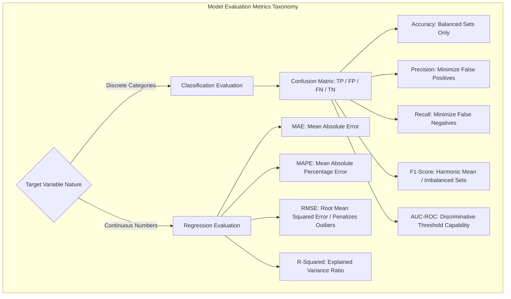
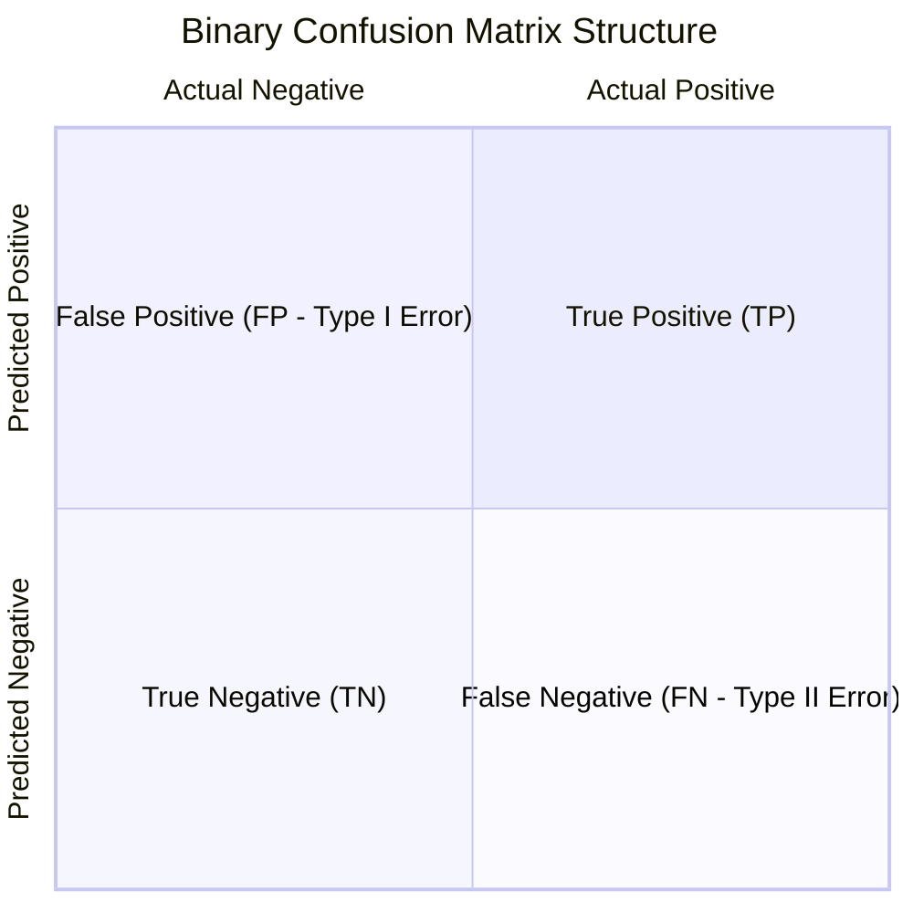
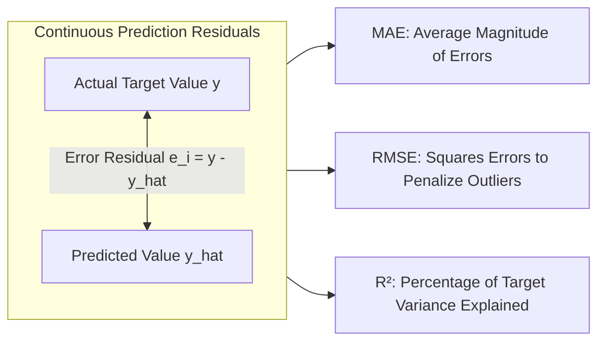

import ImageRow from '@site/src/components/ImageRow';
import AUCROC from './img/auc-roc.png';
import RegressionMetrics from './img/regression-metrics.png';

# Machine Learning Model Evaluation Metrics: Classification vs. Regression

---

## Key Takeaways

Model evaluation metrics quantify the performance of machine learning models against held-out validation and test sets. Evaluation strategies are strictly partitioned by the mathematical nature of the target variable: **Classification Metrics** (discrete categorical targets evaluated via the Confusion Matrix) and **Regression Metrics** (continuous numerical targets evaluated via residual error analysis).

Selecting the wrong metric (e.g., relying on Accuracy for an imbalanced fraud dataset or calculating RMSE on binary classes) leads to flawed model assessment.

---

## Main Discussion

### Classification Metrics & The Confusion Matrix

Binary classification outputs are mapped into a $2 \times 2$ grid comparing predicted labels against actual ground truth:

| Metric                   | Mathematical Formula                                                                                     | Core Objective                                                                                                                         | Optimal Business Context                                                                                                            |
| ------------------------ | -------------------------------------------------------------------------------------------------------- | -------------------------------------------------------------------------------------------------------------------------------------- | ----------------------------------------------------------------------------------------------------------------------------------- |
| **Precision**            | $$\text{Precision} = \frac{\text{TP}}{\text{TP} + \text{FP}}$$                                           | Measures the accuracy of positive predictions. Answers: _"Of all instances predicted as positive, how many were actually positive?"_   | Use when **False Positives are costly** (e.g., Spam filtering where important client emails must not go to junk).                   |
| **Recall** (Sensitivity) | $$\text{Recall} = \frac{\text{TP}}{\text{TP} + \text{FN}}$$                                              | Measures the model's ability to identify all actual positive cases. Answers: _"Of all actual positives, how many did we capture?"_     | Use when **False Negatives are catastrophic** (e.g., Cancer diagnostics or fraud detection where missing a case carries high risk). |
| **F1-Score**             | $$\text{F}_1 = 2 \times \frac{\text{Precision} \times \text{Recall}}{\text{Precision} + \text{Recall}}$$ | Harmonic mean of Precision and Recall. Balances both metrics into a single score.                                                      | Use when dealing with **imbalanced datasets** (e.g., 99% non-fraud, 1% fraud).                                                      |
| **Accuracy**             | $$\text{Accuracy} = \frac{\text{TP} + \text{TN}}{\text{TP} + \text{TN} + \text{FP} + \text{FN}}$$        | Overall proportion of correct predictions across all classes.                                                                          | Use **only on balanced datasets** where class distributions are roughly equal.                                                      |
| **AUC-ROC**              | Area Under the Receiver Operating Characteristic Curve ($x\text{: FPR}, y\text{: TPR}$)                  | Measures the model's ability to distinguish between classes across all possible classification probability thresholds ($0.0 \to 1.0$). | Benchmark model selection when evaluating threshold-independent discrimination capability.                                          |

<ImageRow>
  
  
</ImageRow>
---

### Regression Metrics (Continuous Value Evaluation)

Regression models are evaluated by measuring the **residuals** (the mathematical distance between the predicted continuous value $\hat{y}_i$ and the actual continuous value $y_i$):

| Metric                                         | Mathematical Formula                                                                                 | Key Characteristics & Behavior                                                                                                        |
| ---------------------------------------------- | ---------------------------------------------------------------------------------------------------- | ------------------------------------------------------------------------------------------------------------------------------------- |
| **MAE** (Mean Absolute Error)                  | $$\text{MAE} = \frac{1}{n}\sum_{i=1}^n \vert{}y_i - \hat{y}_i\vert{}$$                               | Measures average error magnitude in the same physical units as the target. Linear penalty across all error scales.                    |
| **MAPE** (Mean Absolute Percentage Error)      | $$\text{MAPE} = \frac{100\%}{n}\sum_{i=1}^n \left\vert{} \frac{y_i - \hat{y}_i}{y_i} \right\vert{}$$ | Expresses prediction error as an average percentage deviation. Useful for communicating accuracy to business executives.              |
| **RMSE** (Root Mean Squared Error)             | $$\text{RMSE} = \sqrt{\frac{1}{n}\sum_{i=1}^n (y_i - \hat{y}_i)^2}$$                                 | Squares the residuals before averaging, **heavily penalizing large outlier errors**. Expressed in original target units.              |
| **$R^2$ Score** (Coefficient of Determination) | $$R^2 = 1 - \frac{\sum (y_i - \hat{y}_i)^2}{\sum (y_i - \bar{y})^2}$$                                | Ranges from $0.0$ to $1.0$. Quantifies the proportion of variance in the target variable that is predictable from the input features. |

---

### Comprehensive Metric Selection Matrix

| Business Scenario / Problem Type             | Target Modality       | Primary Metric to Select | Justification                                                                                                                        |
| -------------------------------------------- | --------------------- | ------------------------ | ------------------------------------------------------------------------------------------------------------------------------------ |
| **Medical Disease Screening**                | Binary Classification | **Recall**               | Failing to detect a diseased patient (False Negative) is unacceptable.                                                               |
| **Email Spam Filtering**                     | Binary Classification | **Precision**            | Incorrectly sending critical business correspondence to the spam folder (False Positive) is costly.                                  |
| **Credit Card Fraud Detection (Imbalanced)** | Binary Classification | **F1-Score / AUC-ROC**   | Accuracy is misleading because a trivial model predicting 100% "No Fraud" gets 99.9% accuracy.                                       |
| **Supply Chain Demand Forecasting**          | Regression            | **RMSE**                 | Large forecasting errors cause supply shortages or massive overstock; large deviations must be penalized.                            |
| **House Price Estimation**                   | Regression            | **MAE / $R^2$**          | MAE gives an intuitive dollar error (e.g., "off by \$15,000 on average"), while $R^2$ confirms how much variance the model explains. |

---

## Exam Guide

### Exam Tips

- **Metric Categorization Rule:**
  - If the task is **Classification**: Precision, Recall, F1-Score, Accuracy, Specificity, AUC-ROC.
  - If the task is **Regression**: MAE, MAPE, MSE, RMSE, $R^2$.
- **The Accuracy Trap:** Never choose **Accuracy** as the primary metric if the scenario describes an **imbalanced dataset** (e.g., fraud detection, rare equipment failures). Choose **F1-Score** or **Recall**.
- **Precision vs. Recall Mnemonic:**
  - **Precision** $\rightarrow$ Focuses on **False Positives** (FP). (Spam filters, automated content moderation blocks).
  - **Recall** $\rightarrow$ Focuses on **False Negatives** (FN). (Cancer diagnosis, fraud detection, security breach alerts).
- **Interpreting $R^2$:** An $R^2$ of 0.85 means **85% of the variance** in the dependent variable is explained by the model's independent input features.
- **RMSE vs. MAE:** Use **RMSE** when large errors are disproportionately undesirable (because squaring the error terms magnifies outliers).

---

### Practice Test

#### Question 1

A hospital develops a machine learning model to detect early-stage sepsis in emergency room patients. The hospital's primary clinical objective is to minimize instances where a patient with sepsis is incorrectly flagged as healthy, ensuring nearly all positive sepsis cases are captured for immediate treatment. Which evaluation metric should the clinical data science team optimize?

- [ ] A. Precision
- [ ] B. Recall
- [ ] C. Mean Absolute Percentage Error (MAPE)
- [ ] D. $R^2$ Score

Correct Answer

- [x] B. Recall
  - **Explanation:** **Recall** (Sensitivity) measures the ability of a classification model to find all true positive instances. When the cost of a **False Negative** is severe (e.g., missing a life-threatening medical condition), Recall is the primary metric to optimize.

---

#### Question 2

A retail forecasting team builds a machine learning model to predict daily numerical customer foot traffic for 200 retail stores across the country. Which set of evaluation metrics is appropriate for assessing this predictive model?

- [ ] A. Accuracy and Confusion Matrix
- [ ] B. Precision and Recall
- [ ] C. Mean Absolute Error (MAE) and Root Mean Squared Error (RMSE)
- [ ] D. Area Under the ROC Curve (AUC-ROC) and F1-Score

Correct Answer

- [x] C. Mean Absolute Error (MAE) and Root Mean Squared Error (RMSE)
  - **Explanation:** Daily customer foot traffic is a continuous numerical variable, making this a **Regression** task. **MAE** and **RMSE** are regression metrics used to measure the difference between predicted continuous values and actual values. All other options are classification metrics.

---
