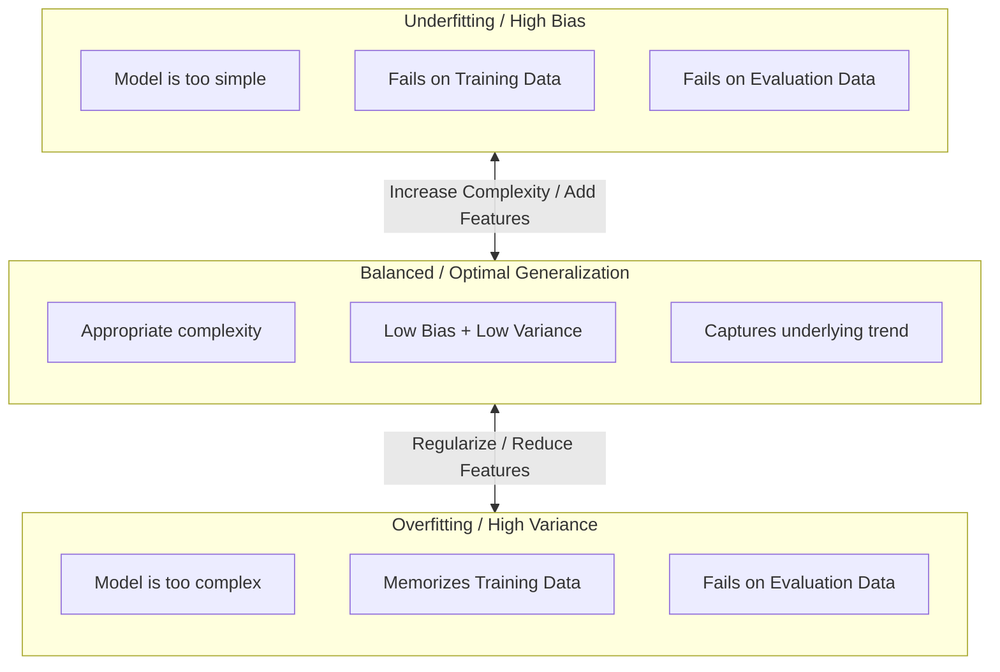
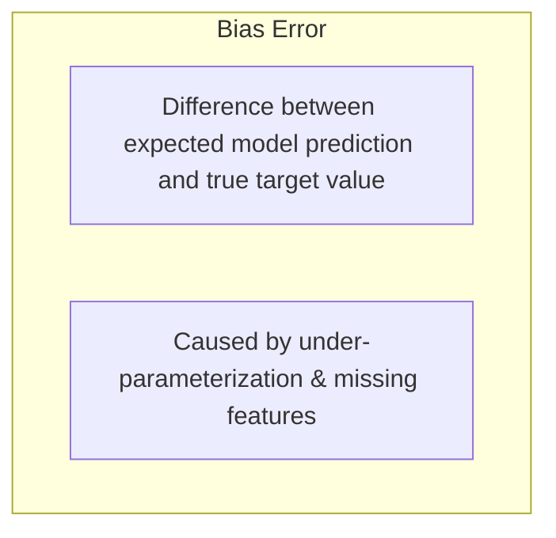
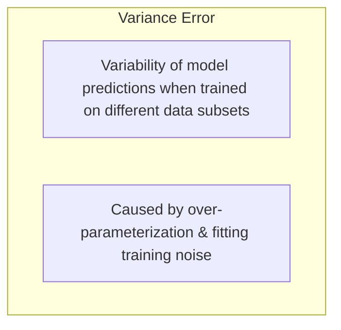
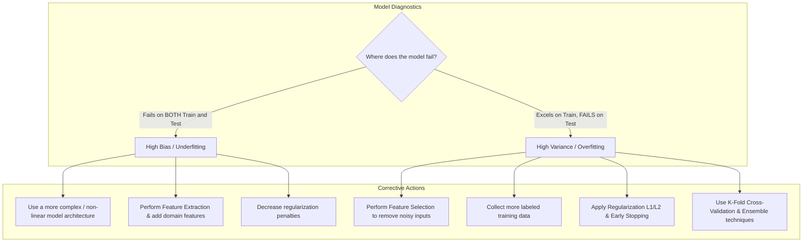

import ModelFit from './img/model-fit.png';
import BiasError from './img/bias-error.png';
import VarianceError from './img/variance-error.png';

# Model Generalization, Bias-Variance Tradeoff & Overfitting vs. Underfitting

---

## Key Takeaways

A central challenge in machine learning is achieving **generalization**—the ability of a trained model to perform accurately on new, unseen evaluation data rather than simply memorizing the training samples.



Model error originates from two competing dynamics: **Bias** (error from overly simplistic assumptions) and **Variance** (error from extreme sensitivity to small fluctuations in the training set). Balancing these dynamics is the **Bias-Variance Tradeoff**.

---

## Main Discussion

### Underfitting vs. Balanced vs. Overfitting

<div className="flex flex-col md:flex-row gap-4 mb-4">
    

    ```mermaid
    flowchart TD
        subgraph CurveProfiles [Geometric Fit Profiles]
            O_Curve["Overfitting: High-degree polynomial passing through every noisy point"]
            U_Curve["Underfitting: Linear line on non-linear data (High Error everywhere)"]
            B_Curve["Balanced: Smooth polynomial tracking real data distribution"]
        end
    ```

</div>

| State                           | Training Performance          | Evaluation Performance | Model Complexity                                    | Primary Cause                                                |
| ------------------------------- | ----------------------------- | ---------------------- | --------------------------------------------------- | ------------------------------------------------------------ |
| **Underfitting** (High Bias)    | **Poor** (High Error)         | **Poor** (High Error)  | Too simple (e.g., linear line for non-linear curve) | Insufficient features, overly restrictive model assumptions. |
| **Balanced** (Optimal)          | **Good** (Low Error)          | **Good** (Low Error)   | Appropriate capacity                                | Captures true underlying signal without fitting noise.       |
| **Overfitting** (High Variance) | **Near Perfect** (Zero Error) | **Poor** (High Error)  | Too complex (e.g., high-degree polynomial)          | Model memorizes training noise and outliers.                 |

---

### The Bias-Variance Tradeoff

Total expected prediction error on unseen data decomposes mathematically into three components:

$$\text{Total Expected Error} = \text{Bias}^2 + \text{Variance} + \text{Irreducible Noise } (\sigma^2)$$

<div className="flex flex-col md:flex-row gap-4 mb-4">




</div>

<div className="flex flex-col md:flex-row gap-4 mb-4">




</div>


---

### Remediation Strategies: How to Fix Model Fit Issues



| Problem Diagnosed               | Symptoms                                                                          | Remediation Techniques                                                                                                                                                                                                               |
| ------------------------------- | --------------------------------------------------------------------------------- | ------------------------------------------------------------------------------------------------------------------------------------------------------------------------------------------------------------------------------------ |
| **High Bias (Underfitting)**    | High training loss, high validation loss, inability to capture non-linear trends. | • Increase model complexity (e.g., deeper neural net, non-linear kernels)<br/> • Add new relevant input features via **Feature Extraction**<br/> • Reduce regularization penalties                                                   |
| **High Variance (Overfitting)** | Very low training loss, but high validation/test loss divergence.                 | • Remove irrelevant inputs via **Feature Selection**<br/> • Increase the volume and diversity of training samples<br/> • Apply **Regularization** (L1/L2, Dropout) and Early Stopping<br/> • Implement **$K$-Fold Cross-Validation** |

---

## Exam Guide

### Exam Tips

- **Symptom Identification Rules:**
  - If a scenario states the model gets **99% accuracy on training data but only 60% on evaluation data** $\rightarrow$ The model is **Overfitting (High Variance)**.
  - If a scenario states the model gets **poor accuracy on both training and test data** $\rightarrow$ The model is **Underfitting (High Bias)**.
- **Dartboard Target Analogy:**
  - **Low Bias, Low Variance (Target):** All darts tightly clustered directly in the bullseye.
  - **High Bias, Low Variance:** All darts tightly clustered together, but far away from the bullseye.
  - **Low Bias, High Variance:** Darts scattered widely across the entire board, but centered on average around the bullseye.
  - **High Bias, High Variance:** Darts scattered widely and completely off-target.
- **Remediation Matching:**
  - To fix **Overfitting**: Add more training data, remove noisy features, apply regularization.
  - To fix **Underfitting**: Increase model capacity/complexity, engineer more features, train longer.

---

### Practice Test

#### Question 1

A machine learning engineer trains a gradient-boosted decision tree model to predict real estate prices. The model achieves an $R^2$ score of 0.99 (nearly zero error) on the training set, but when evaluated on the holdout validation set, the $R^2$ score drops to 0.52 with high prediction error. What problem is the model experiencing, and what is the underlying statistical characteristic?

- [ ] A. Underfitting characterized by High Bias
- [ ] B. Overfitting characterized by High Variance
- [ ] C. Underfitting characterized by High Variance
- [ ] D. Data drift characterized by Low Bias

<details>
<summary>Correct Answer</summary>

- [x] B. Overfitting characterized by High Variance
  - **Explanation:** A model that achieves near-perfect accuracy on training data but fails to generalize to validation data is **Overfitting**, which is caused by **High Variance** (the model learned training set noise rather than the true underlying distribution).

</details>

---

#### Question 2

A data science team determines that their tabular fraud classification model suffers from high bias (underfitting) and performs poorly on both training and test datasets. Which action should the team take to reduce bias and improve model fit?

- [ ] A. Remove 50% of the input features from the dataset
- [ ] B. Increase model complexity and engineer additional relevant features
- [ ] C. Increase L2 regularization penalties
- [ ] D. Stop model training after the first epoch

<details>
<summary>Correct Answer</summary>

- [x] B. Increase model complexity and engineer additional relevant features
  - **Explanation:** **High Bias (underfitting)** occurs when a model is too simplistic to capture the underlying structure of the data. Increasing model complexity (e.g., using a more expressive algorithm) and engineering additional domain-specific features helps the model capture complex patterns.

</details>

---
