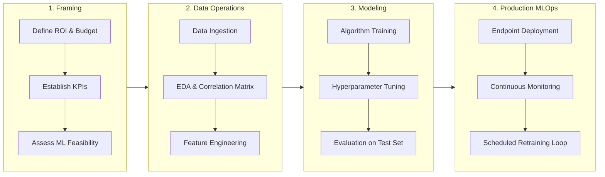
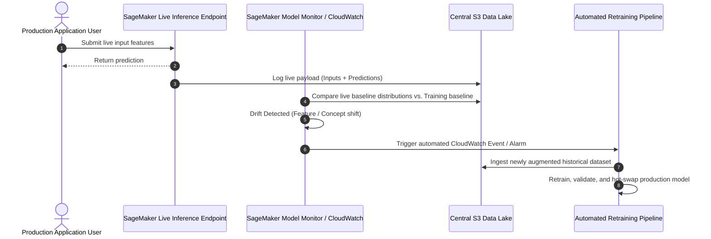

import CorrelationMatrix from './img/correlation-matrix.png';

# The End-to-End Machine Learning Lifecycle & Operational Workflows

---

## Key Takeaways

The **Machine Learning Lifecycle** is an iterative, multi-phase operational workflow spanning problem framing, data engineering, model development, deployment, and continuous production monitoring.


Machine learning is not a linear, one-time exercise. If evaluation metrics fail to meet defined business KPIs, teams iterate backwards to perform **data augmentation** or refine **feature engineering**. Once deployed, models require continuous monitoring to catch **concept and data drift**, feeding production inference logs back into the training loop for scheduled retraining.

---

## Main Discussion

### The Complete Machine Learning Phase Breakdown



| Lifecycle Phase                   | Core Operational Objective                                                                                                                                                     | Key Tools & Techniques                                                                   | Primary Stakeholders                                        |
| --------------------------------- | ------------------------------------------------------------------------------------------------------------------------------------------------------------------------------ | ---------------------------------------------------------------------------------------- | ----------------------------------------------------------- |
| **1. Business Problem & Framing** | Quantify business value, establish budget, select Key Performance Indicators (KPIs), and verify that machine learning is the appropriate solution over simple rule-based code. | Business case validation, ROI analysis, latency/accuracy trade-off targets.              | Business Stakeholders, Product Managers, Lead ML Architects |
| **2. Data Processing & EDA**      | Ingest and centralize raw data into a data lake; execute **Exploratory Data Analysis (EDA)** and statistical correlation analysis to understand distributions.                 | Amazon S3, AWS Glue, statistical distributions, correlation matrices.                    | Data Engineers, Data Scientists                             |
| **3. Feature Engineering**        | Transform raw inputs into high-signal numerical representations (extraction, scaling, selection).                                                                              | SageMaker Data Wrangler, TF-IDF, one-hot encoding, Min-Max normalization.                | Data Scientists, Machine Learning Engineers                 |
| **4. Model Development & Tuning** | Select appropriate algorithms, fit parameters on training sets, and optimize **hyperparameters** using validation data.                                                        | Amazon SageMaker Training Jobs, Hyperparameter Optimization (HPO), cross-validation.     | Machine Learning Engineers                                  |
| **5. Model Evaluation**           | Verify model generalization against unseen test sets and determine if model performance meets defined business KPIs.                                                           | Confusion matrices, F1-Score, AUC-ROC, RMSE, $R^2$, model explainability.                | Data Scientists, Business Stakeholders                      |
| **6. Model Deployment**           | Package and deploy the model artifact to an inference endpoint matching application latency requirements.                                                                      | SageMaker Real-Time Endpoints, Serverless Inference, Batch Transform, Greengrass (Edge). | DevOps Engineers, MLOps Engineers                           |
| **7. Monitoring & Retraining**    | Track live operational endpoints for performance degradation, detect data/concept drift, and feed ground-truth inferences back into the training loop.                         | Amazon SageMaker Model Monitor, Amazon CloudWatch, automated retraining pipelines.       | MLOps Engineers, SREs                                       |

---

### Exploratory Data Analysis (EDA) & The Correlation Matrix

Before training begins, data scientists run **Exploratory Data Analysis (EDA)** to evaluate relationships between input variables ($X$) and target outcomes ($y$):

<div className="grid grid-cols-1 md:grid-cols-2 gap-4 mb-4">
        
    ```mermaid
    flowchart TD
        subgraph CorrMatrixExample [Correlation Analysis Grid]
            StudyHours["Study Hours"] <-->|Strong Positive Correlation: +0.85| Score["Final Test Score"]
            SleepHours["Sleep Hours"] <-->|Moderate Positive Correlation: +0.60| Score
            RandomNoise["Student ID Number"] <-->|Zero Correlation: 0.00| Score
        end
```
</div>

$$\text{Pearson Correlation Coefficient: } r = \frac{\sum (x_i - \bar{x})(y_i - \bar{y})}{\sqrt{\sum (x_i - \bar{x})^2 \sum (y_i - \bar{y})^2}} \quad \in [-1.0, +1.0]$$

- **Positive Correlation ($r > 0$):** As the feature value increases, the target value increases (e.g., more study hours correlate with higher exam scores).
- **Negative Correlation ($r < 0$):** As the feature value increases, the target value decreases (e.g., vehicle mileage correlates inversely with resale value).
- **Zero Correlation ($r \approx 0$):** Feature provides no linear signal (e.g., ID numbers or phone numbers), marking it for removal during feature selection.

---

### The Continuous Monitoring & Retraining Loop

Model accuracy naturally degrades over time due to shifts in real-world distributions:



- **Data Drift:** The statistical distribution of input features shifts over time (e.g., user search terms evolve with seasonal trends).
- **Concept Drift:** The underlying relationship between input features and target labels changes (e.g., consumer purchasing patterns change after macroeconomic shifts).

---

## Exam Guide

### Exam Tips

- **Sequence of the ML Lifecycle:** Memorize the foundational sequence:  
  $$\text{Business Problem} \rightarrow \text{ML Formulation} \rightarrow \text{Data Collection/EDA} \rightarrow \text{Feature Engineering} \rightarrow \text{Model Training/Tuning} \rightarrow \text{Evaluation} \rightarrow \text{Deployment} \rightarrow \text{Monitoring/Retraining}$$
- **Iterative Loop Triggers:** If a model fails to meet business evaluation targets, the team does **not** proceed to deployment; they loop back to **data collection/augmentation, feature engineering, or hyperparameter optimization**.
- **Role of EDA & Correlation Analysis:** Exploratory Data Analysis and correlation matrices are used early in the lifecycle to understand feature relationships, drop uninformative variables, and select high-signal predictors.
- **Why Monitoring is Mandatory:** Models degrade post-deployment due to **data drift** (changing inputs) and **concept drift** (changing relationships). **Amazon SageMaker Model Monitor** tracks live endpoint data quality and triggers automated retraining.

---

### Practice Test

#### Question 1

A fashion retail company deployed a machine learning model three years ago to predict seasonal clothing demand. Over the past six months, the model's forecasting error has steadily increased, despite the infrastructure operating normally without technical outages. What is the most likely cause of this degradation, and what lifecycle action should the engineering team take?

- [ ] A. The model is underfitting due to a high learning rate; delete the validation dataset
- [ ] B. Real-world consumer trends have experienced concept and data drift; the team should retrain the model on recently collected data
- [ ] C. The model has exhausted its GPU memory limits; migrate to a smaller CPU instance
- [ ] D. The correlation matrix was calculated incorrectly; switch from supervised learning to association rule learning

<details>
<summary>Correct Answer</summary>

- [x] B. Real-world consumer trends have experienced concept and data drift; the team should retrain the model on recently collected data
  - **Explanation:** Over time, consumer preferences and market conditions evolve, leading to **data and concept drift**. When a model's predictive performance degrades in production, the standard remedy is collecting recent ground-truth data, augmenting the dataset, and **retraining the model**.

</details>

---

#### Question 2

During which phase of an end-to-end machine learning project do data scientists calculate summary statistics, plot variable distributions, and construct correlation matrices to determine which features have strong relationships with the target label?

- [ ] A. Model Deployment
- [ ] B. Exploratory Data Analysis (EDA)
- [ ] C. Reinforcement Learning from Human Feedback (RLHF)
- [ ] D. Real-Time Inferencing

<details>
<summary>Correct Answer</summary>

- [x] B. Exploratory Data Analysis (EDA)
  - **Explanation:** **Exploratory Data Analysis (EDA)** is performed during the data preparation phase to analyze distributions, compute correlations between features, identify outliers, and inform subsequent feature engineering decisions.

</details>

---

#### Question 3

A developer is working on an AI application for predicting customer churn. The developer is collaborating with a research team to ensure the best model is selected for the application. The application needs to accurately identify customers who are likely to leave the service within the next six months.

What should the developer ask the research team to do in order to ensure that the best model is selected for the AI application?

- [ ] A. Identify potential data sources for the application
- [ ] B. Define the target audience of the application broadly
- [ ] C. Determine the cost constraints for model training
- [ ] D. Define the use case of the application narrowly

<details>
<summary>Correct Answer</summary>

- [x] D. Define the use case of the application narrowly
  - **Explanation:** A narrowly defined use case provides clear and specific requirements for the application, helping the research team understand exactly what the model needs to accomplish. This clarity is crucial for selecting the most appropriate model that fits the specific needs and constraints of the application.

<details>
<summary>Incorrect Answers</summary>

- [ ] A. Identify potential data sources for the application
  - **Explanation:** While identifying data sources is important, it does not directly ensure the selection of the best model. It is a preliminary step that supports data collection rather than model selection.
- [ ] B. Define the target audience of the application broadly
  - **Explanation:** Defining the target audience broadly can lead to ambiguity and lack of focus on the specific requirements of the application. It can make it challenging to tailor the model to meet precise needs.
- [ ] C. Determine the cost constraints for model training
  - **Explanation:** Determining cost constraints is important for budget management, but it does not directly influence the selection of the best model for the application. Cost constraints affect the resources available for model training rather than the suitability of the model itself.

</details>

Reference:

- https://aws.amazon.com/what-is/machine-learning/

</details>

---
