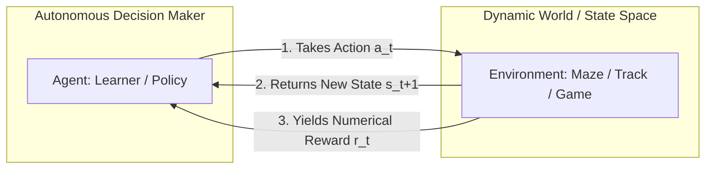
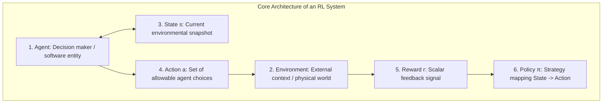
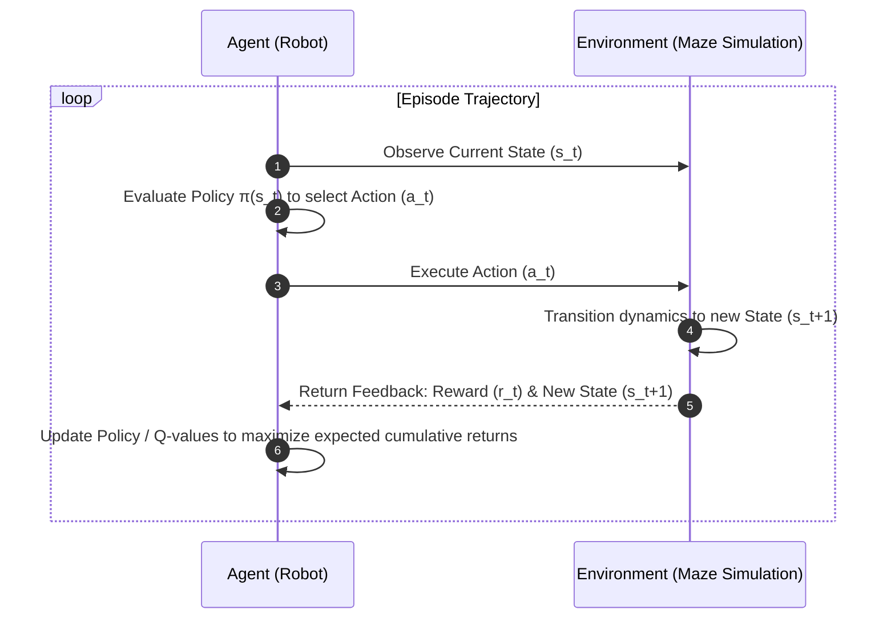
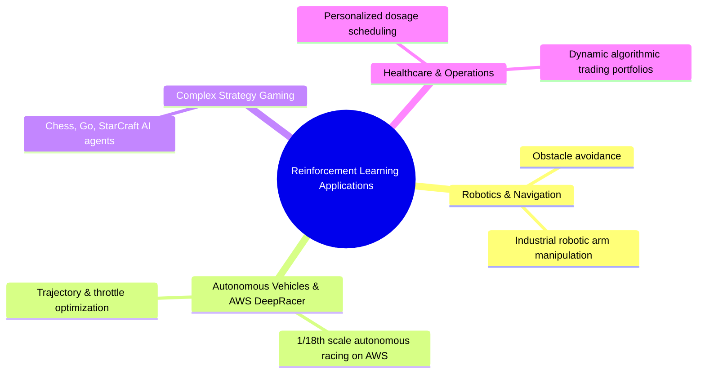

import RLComponents from './img/rl-components.png';
import RLSimulation from './img/rl-simulation.gif';

# Reinforcement Learning & The Markov Decision Framework

---

## Key Takeaways

**Reinforcement Learning (RL)** is a machine learning paradigm where an autonomous **Agent** learns to make sequential decisions within an **Environment** to maximize a **Cumulative Reward** over time through trial-and-error interaction.

Unlike supervised learning (which learns from static labeled examples) or unsupervised learning (which clusters unlabeled data), reinforcement learning relies on a **Feedback Loop**. The agent explores the environment, receives scalar rewards (positive or negative incentives), and updates its internal **Policy** ($\pi$) to discover optimal behavioral trajectories.

---

## Main Discussion

### The Six Core Components of Reinforcement Learning

| Component           | Formal Notation | Definition & Role                                                                                                   | Maze Example Mapping                                                        |
| ------------------- | --------------- | ------------------------------------------------------------------------------------------------------------------- | --------------------------------------------------------------------------- |
| **Agent**           | $A$             | The software learner and decision-maker interacting with the system.                                                | The virtual robot navigating the maze.                                      |
| **Environment**     | $E$             | The external world or simulation boundary the agent senses and affects.                                             | The physical/virtual maze walls, open paths, and exits.                     |
| **State**           | $s \in S$       | A snapshot representing the current condition or position of the agent in the environment.                          | Current coordinates: `(Row 4, Column 2)`.                                   |
| **Action**          | $a \in A(s)$    | The set of discrete or continuous moves available to the agent at state $s$.                                        | Move choices: `{Up, Down, Left, Right}`.                                    |
| **Reward Function** | $R(s, a)$       | A scalar numerical feedback signal evaluating the immediate outcome of an action.                                   | • Step taken: $-1$  • Wall collision: $-10$  • Exit reached: $+100$ |
| **Policy**          | $\pi(a \mid s)$ | The internal mathematical strategy or mapping function that dictates which action to select given a specific state. | The learned rule table or neural network guiding path selection.            |

$$\text{Optimization Objective: } \max_{\pi} \mathbb{E} \left[ \sum_{t=0}^{T} \gamma^t R(s_t, a_t) \right] \quad (\text{where } \gamma \in [0, 1] \text{ is the discount factor for future rewards})$$

---

### The Iterative Policy Optimization Loop

Reinforcement learning agents improve through thousands or millions of simulation episodes:

1. **Initial Exploration (High Entropy):** The agent begins with random actions, frequently incurring penalties (e.g., hitting walls with a $-10$ reward).
2. **First Success:** By exploring random trajectories, the agent eventually stumbles onto the terminal goal ($+100$ exit reward).
3. **Credit Assignment & Exploitation:** The algorithm backpropagates reward signals to the preceding state-action sequence, reinforcing optimal paths while penalizing inefficient detours.

---

### Comparison Across the Machine Learning Paradigms

| Learning Paradigm            | Training Data Input        | Feedback Signal                             | Primary Business Application                                  |
| ---------------------------- | -------------------------- | ------------------------------------------- | ------------------------------------------------------------- |
| **Supervised Learning**      | Labeled dataset ($X, y$)   | Direct ground-truth error loss              | Fraud classification, house price regression                  |
| **Unsupervised Learning**    | Unlabeled features ($X$)   | Inherent geometric / statistical similarity | Customer segmentation, anomaly detection                      |
| **Self-Supervised Learning** | Unlabeled corpus ($X$)     | Programmatic pseudo-labels (pretext tasks)  | Foundation model pre-training (LLMs, BERT)                    |
| **Reinforcement Learning**   | Dynamic state inputs ($s$) | Scalar reward / penalty feedback ($r$)      | Autonomous robotics, portfolio rebalancing, gaming (Go/Chess) |

---

### Practical Industrial & AWS Applications of RL

- **AWS DeepRacer:** AWS's dedicated reinforcement learning platform where developers write Python reward functions to train a 1/18th scale autonomous race car to drive along a track in a 3D simulator.
- **Autonomous Logistics:** Automated Guided Vehicles (AGVs) in fulfillment warehouses learning dynamic collision avoidance.

---

## Exam Guide

### Exam Tips

- **Core Characteristic of RL:** Look for keywords such as **Agent**, **Environment**, **State**, **Action**, **Reward Function**, **Penalty**, or **Cumulative Return**. If an AI system learns through **trial-and-error interaction and reward maximization**, it is **Reinforcement Learning**.
- **AWS DeepRacer Connection:** If the exam asks about an AWS educational tool or service designed specifically to teach **Reinforcement Learning** via autonomous driving models and reward functions, the answer is **AWS DeepRacer**.
- **Reward Function Mechanics:** The reward function defines _what_ behaviors are incentivized (e.g., staying near the center line on a track), not the exact manual steering instructions.
- **RLHF in Generative AI:** Reinforcement Learning from Human Feedback (RLHF) uses the RL framework (with human preference ratings serving as the reward model) to align Large Language Models with human safety and instruction-following standards.

---

### Practice Test

#### Question 1

An engineering team is developing an automated navigation system for warehouse robotic rovers. The rover must learn how to navigate busy factory floors, avoid stationary equipment, and reach loading docks via the fastest route. The software team sets up a virtual simulator where the rover receives positive numerical points for reaching checkpoints quickly and negative points for collisions. Which machine learning approach is being implemented?

- [ ] A. Supervised Linear Regression
- [ ] B. Unsupervised Association Rule Learning
- [ ] C. Reinforcement Learning
- [ ] D. Semi-Supervised Pseudo-Labeling

Correct Answer

- [x] C. Reinforcement Learning
  - **Explanation:** **Reinforcement Learning** is defined by an autonomous agent interacting with an environment to learn optimal behaviors by maximizing a cumulative numerical reward function through trial and error.

---

#### Question 2

In reinforcement learning terminology, what represents the strategy or mapping function that an agent utilizes to decide which action to take based on its current observed state?

- [ ] A. The Reward Function
- [ ] B. The Policy
- [ ] C. The Confusion Matrix
- [ ] D. The Hyperparameter Grid

Correct Answer

- [x] B. The Policy
  - **Explanation:** The **Policy** ($\pi$) is the decision-making strategy or mathematical function that maps an agent's current state to the optimal action choice to maximize long-term cumulative rewards.

---
