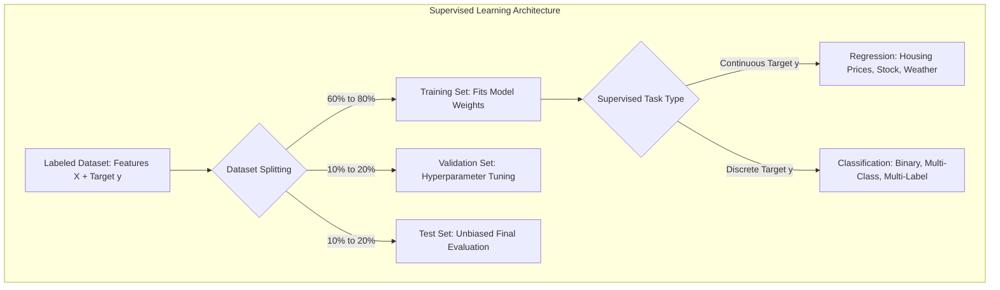
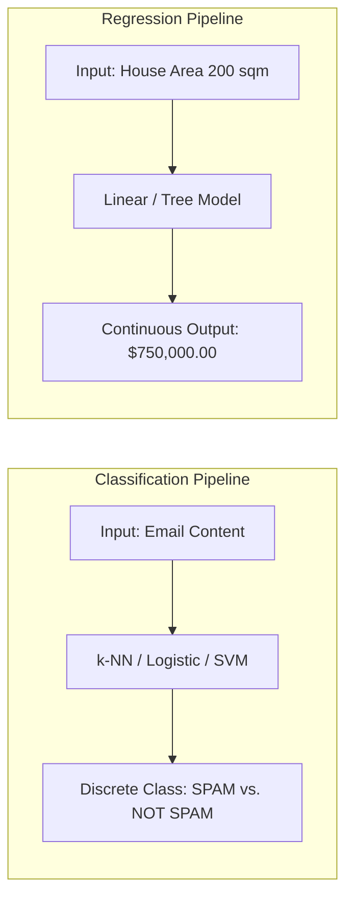
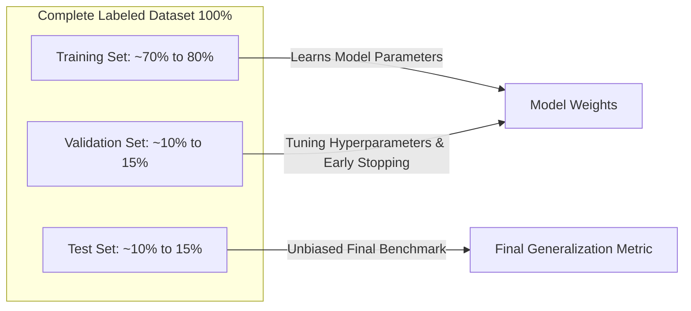
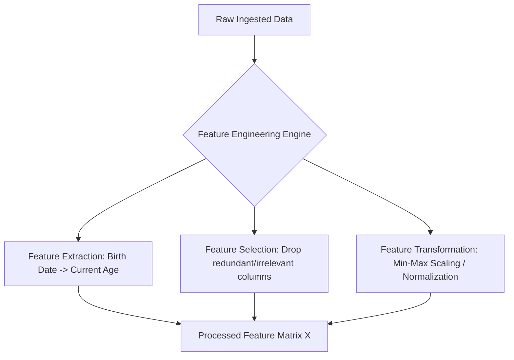

import ImageRow from '@site/src/components/ImageRow';
import RegressionExample from './img/regression-example.png';
import ClassificationExample from './img/classification-example.png';
import SupervisedLearning from './img/supervised-learning.png';

# Supervised Learning, Dataset Splitting & Feature Engineering

---

## Key Takeaways

**Supervised Learning** trains machine learning algorithms on **labeled data** (input features $X$ mapped to ground-truth targets $y$) to learn a predictive function $f(X) \rightarrow y$ capable of evaluating new, unseen inputs.

The predictive task is split between **Regression** (predicting continuous numerical quantities) and **Classification** (predicting discrete categorical classes). To ensure generalizability and avoid data leakage, raw datasets are partitioned into **Train**, **Validation**, and **Test** sets and refined using **Feature Engineering** (extraction, selection, and transformation).

---

## Main Discussion

### Regression vs. Classification

| Dimension                   | Regression                                                                     | Classification                                                                                                                                                                                                        |
| --------------------------- | ------------------------------------------------------------------------------ | --------------------------------------------------------------------------------------------------------------------------------------------------------------------------------------------------------------------- |
| **Target Variable ($y$)**   | **Continuous** numerical value (infinite real numbers within a range).         | **Discrete** categorical class label (finite predefined categories).                                                                                                                                                  |
| **Mathematical Goal**       | Fit a trend line, curve, or continuous surface minimizing error (e.g., MSE).   | Construct decision boundaries that separate distinct classes.                                                                                                                                                         |
| **Classification Subtypes** | Simple Linear, Multi-variable, Polynomial Regression.                          | • **Binary:** 2 classes (Spam / Ham, Churn / Retain)  • **Multi-Class:** $>2$ mutually exclusive classes (Cat, Dog, Giraffe)  • **Multi-Label:** Non-exclusive labels (Movie tagged as _Action_ and _Comedy_) |
| **Representative Examples** | Real estate price estimation, temperature forecasting, stock price projection. | Credit card fraud detection, medical diagnosis categorization, document tagging.                                                                                                                                      |

<ImageRow>
  
  
</ImageRow>

---

### Dataset Partitioning: Training vs. Validation vs. Test Sets

Splitting data prevents overfitting and measures how well the model generalizes to real-world inputs:

| Dataset Partition  | Standard Proportion | Core Responsibility in ML Lifecycle                                                                                                         |
| ------------------ | ------------------- | ------------------------------------------------------------------------------------------------------------------------------------------- |
| **Training Set**   | 60% to 80%          | The primary dataset used directly by the algorithm to learn mathematical weights and parameters.                                            |
| **Validation Set** | 10% to 20%          | Used during the development cycle to tune **hyperparameters**, guide architectural choices, and detect overfitting before final deployment. |
| **Test Set**       | 10% to 20%          | Held-out data used **only once at the end** to compute an unbiased final performance evaluation on unseen samples.                          |

---

### Feature Engineering: Structured & Unstructured Data

Feature engineering transforms raw, noisy inputs into optimized numerical representations to improve algorithm convergence and predictive accuracy:

| Feature Engineering Method | Purpose & Mechanism                                                                | Concrete Example                                                                                                                                                                         |
| -------------------------- | ---------------------------------------------------------------------------------- | ---------------------------------------------------------------------------------------------------------------------------------------------------------------------------------------- |
| **Feature Extraction**     | Derives new high-signal mathematical variables from raw fields.                    | • Converting `Date_of_Birth` to numerical `Age`  • Calculating `Price_per_Square_Foot` from `Price` and `Area` • Extracting text weights via **TF-IDF** or image edges via CNNs |
| **Feature Selection**      | Identifies and retains only high-impact predictors while dropping redundant noise. | Keeping `Location` and `Square_Footage` while discarding `Listing_ID` and `Agent_Phone_Number`.                                                                                          |
| **Feature Transformation** | Scales, normalizes, or re-encodes variables into uniform numerical spaces.         | Scaling disparate ranges (e.g., Income $0–$500k and Age 18–90) into standard scales $[0, 1]$ or $[-1, 1]$.                                                                               |

---

## Exam Guide

### Exam Tips

- **Task Categorization Rules:**
  - If the model predicts a **real continuous number** (e.g., dollars, temperature, square meters, probability percentages) $\rightarrow$ **Regression**.
  - If the model predicts a **bucket, category, discrete label, or flag** $\rightarrow$ **Classification**.
- **Classification Variants:**
  - **Binary:** Exactly two possible classes (e.g., Fraud = Yes/No).
  - **Multi-Class:** Multiple classes where each record gets **exactly one label** (e.g., Mammal, Bird, or Reptile).
  - **Multi-Label:** A single record can receive **multiple active labels simultaneously** (e.g., a movie categorized under both _Sci-Fi_ and _Comedy_).
- **Dataset Roles:**
  - **Training Set:** Trains internal weights.
  - **Validation Set:** Evaluates hyperparameter configurations and detects overfitting during training.
  - **Test Set:** Evaluates the final trained model on unseen data.
- **Feature Engineering Purpose:** Feature engineering does not change model weights directly; it cleans, derives, and transforms input data before training so that algorithms converge faster and make more accurate predictions.

---

### Practice Test

#### Question 1

A retail logistics company is training a machine learning model to estimate the exact delivery time in minutes for packages based on transit distance, courier vehicle type, driver experience, and weather conditions. What type of machine learning task is this?

- [ ] A. Unsupervised Clustering
- [ ] B. Supervised Binary Classification
- [ ] C. Supervised Regression
- [ ] D. Reinforcement Learning

Correct Answer

- [x] C. Supervised Regression
  - **Explanation:** Estimating delivery time in minutes involves predicting a continuous numerical value using historical labeled training data, which defines a **Supervised Regression** task.

---

#### Question 2

A data scientist splits a historical customer dataset into three subsets. Subset A is used by the algorithm to adjust internal weights, Subset B is used to evaluate different model hyperparameters and prevent overfitting during development, and Subset C is reserved strictly for the final performance evaluation. What are Subsets A, B, and C?

- [ ] A. Subset A: Validation, Subset B: Training, Subset C: Test
- [ ] B. Subset A: Training, Subset B: Validation, Subset C: Test
- [ ] C. Subset A: Test, Subset B: Training, Subset C: Validation
- [ ] D. Subset A: Training, Subset B: Test, Subset C: Validation

Correct Answer

- [x] B. Subset A: Training, Subset B: Validation, Subset C: Test
  - **Explanation:** In standard machine learning workflows, **Subset A** is the **Training set** (fits model parameters), **Subset B** is the **Validation set** (tunes hyperparameters and monitors overfitting), and **Subset C** is the held-out **Test set** (provides the final unbiased evaluation).

---

#### Question 3

A financial services company is building machine learning models to predict customer churn and detect fraudulent transactions. The data science team is exploring different machine learning approaches and needs to understand which methods fall under supervised learning, where the model is trained on labeled data with known outcomes. Identifying the correct supervised learning techniques will help the team select the most appropriate models for their predictive tasks.

Which of the following are examples of supervised learning? **(Select two)**

- [ ] A. Document classification
- [ ] B. Association rule learning
- [ ] C. Neural network
- [ ] D. Linear regression
- [ ] E. Clustering

Correct Answers:

Supervised learning algorithms train on sample data that specifies both the algorithm's input and output. For example, the data could be images of handwritten numbers that are annotated to indicate which numbers they represent. Given sufficient labeled data, the supervised learning system would eventually recognize the clusters of pixels and shapes associated with each handwritten number.

<ImageRow>
  
</ImageRow>

- [x] C. Neural network
  - **Explanation:** A neural network solution is a more complex supervised learning technique. To produce a given outcome, it takes some given inputs and performs one or more layers of mathematical transformation based on adjusting data weightings. An example of a neural network technique is predicting a digit from a handwritten image.
- [x] D. Linear regression
  - **Explanation:** Linear regression refers to supervised learning models that, based on one or more inputs, predict a value from a continuous scale. An example of linear regression is predicting a house price. You could predict a house’s price based on its location, age, and number of rooms after you train a model on a set of historical sales training data with those variables.

Incorrect Answers:

- [ ] A. Document classification
  - **Explanation:** This is an example of semi-supervised learning. Semi-supervised learning is when you apply both supervised and unsupervised learning techniques to a common problem. This technique relies on using a small amount of labeled data and a large amount of unlabeled data to train systems. When applying categories to a large document base, there may be too many documents to physically label. For example, these could be countless reports, transcripts, or specifications. Training on the unlabeled data helps identify similar documents for labeling.
- [ ] B. Association rule learning
  - **Explanation:** This is an example of unsupervised learning. Association rule learning techniques uncover rule-based relationships between inputs in a dataset. For example, the Apriori algorithm conducts market basket analysis to identify rules like coffee and milk often being purchased together.
- [ ] E. Clustering
  - **Explanation:** Clustering is an unsupervised learning technique that groups certain data inputs, so they may be categorized as a whole. There are various types of clustering algorithms depending on the input data. An example of clustering is identifying different types of network traffic to predict potential security incidents.

References:

- https://aws.amazon.com/what-is/machine-learning/
- https://aws.amazon.com/compare/the-difference-between-machine-learning-supervised-and-unsupervised/

---

#### Question 4

A retail company is developing a machine learning model to predict customer churn and is in the process of preparing its dataset. The data science team plans to divide the data into a training set, validation set, and test set to ensure the model performs well across different stages of development and evaluation. To proceed effectively, the team needs to fully understand the roles of each of these sets and how they contribute to building a robust model.

Which of the following is correct regarding the training set, validation set, and test set used in the context of machine learning? (Select two)

- [ ] A. Validation sets are optional
- [ ] B. Validation set is used to determine how well the model generalizes
- [ ] C. Test set is used for hyperparameter tuning
- [ ] D. Test set is used to determine how well the model generalizes
- [ ] E. Test sets are optional

Correct Answers:

Data used for ML is typically split into the following datasets:
The training set is used to train the model, the validation set is used for tuning hyperparameters and selecting the best model during the training process, and the test set is used for evaluating the final performance of the model on unseen data.

- [x] A. Validation sets are optional
  - **Explanation:** The validation set introduces new data to the trained model. You can use a validation set to periodically measure model performance as training is happening and also tune any hyperparameters of the model. However, validation datasets are optional.
- [x] D. Test set is used to determine how well the model generalizes
  - **Explanation:** The test set is used on the final trained model to assess its performance on unseen data. This helps determine how well the model generalizes.

Incorrect Answers:

- [ ] B. Validation set is used to determine how well the model generalizes
  - **Explanation:** Only the test set is used to determine how well the model generalizes.
- [ ] C. Test set is used for hyperparameter tuning
  - **Explanation:** The test set is used for evaluating the final performance of the model on unseen data.
- [ ] E. Test sets are optional
  - **Explanation:** Only validation sets are optional.

Reference:

- https://aws.amazon.com/blogs/machine-learning/create-train-test-and-validation-splits-on-your-data-for-machine-learning-with-amazon-sagemaker-data-wrangler/

---
