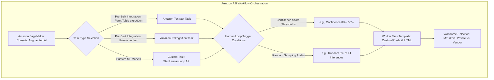
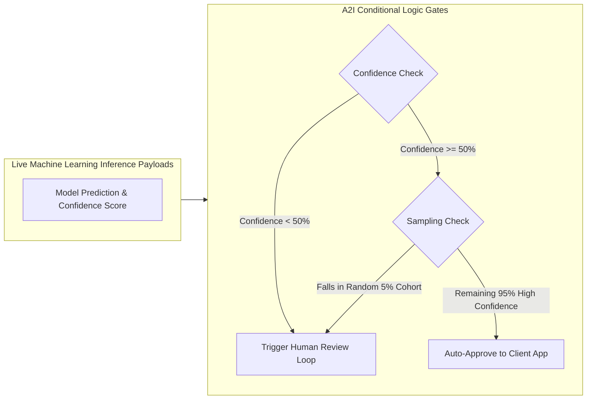

# Hands-On Lab: Amazon Augmented AI (Amazon A2I) Console, Workflow Definitions & Workforce Configuration

---

## Key Takeaways

**Amazon Augmented AI (Amazon A2I)** is managed directly within the **Amazon SageMaker Console**, providing a centralized human-in-the-loop (HITL) orchestration framework for machine learning workloads.

The hands-on setup workflow involves:

- Choosing between pre-built task types (**Amazon Rekognition** image moderation, **Amazon Textract** key-value extraction) or **Custom Tasks**.
- Setting automated invocation conditions based on **Confidence Thresholds** (e.g., routing scores below 50%) and **Random Sampling Rates** (e.g., routing 5% of all traffic for compliance auditing).
- Designing the review interface with **Worker Task Templates**.
- Assigning the review payload to an appropriate workforce tier (**Amazon Mechanical Turk**, **Private Teams**, or **AWS Marketplace Vendors**).

---

## Hands-On Workflow: Creating an A2I Human Review Workflow in the SageMaker Console

1. **Navigate to Augmented AI in the Amazon SageMaker Console:**
   - Open the AWS Management Console and search for **Augmented AI** (or navigate directly to **Amazon SageMaker** $\rightarrow$ **Augmented AI (A2I)** in the left navigation pane).
   - In the left menu under **Augmented AI**, select **Human review workflows**.  
     
   - Click **Create human review workflow** (Flow Definition).
   - Provide a unique name (e.g., `RekognitionContentModerationWorkflow`).
   - Specify the destination **Amazon S3 bucket** where completed human review results will be stored.  
     
2. **Select the Task Type:**
   - Choose the integration pattern that corresponds to your machine learning pipeline:
   - **Amazon Textract - Key-value pair extraction:** Audits document form field extractions.
   - **Amazon Rekognition - Image moderation:** Audits image moderation labels for sensitive or unsafe visual content.
   - **Custom:** Enables review loops for custom models hosted on Amazon SageMaker or on-premises by calling the `StartHumanLoop` API.  
     
3. **Configure Automated Human Review Trigger Conditions:**
   - Define the rules that route inferences to human workers:
   - **Confidence Threshold Conditions:** Set score ranges that trigger reviews (e.g., trigger a human loop if the moderation confidence score is between `0%` and `50%`, or when specific sensitive labels like _Explicit Nudity_ or _Violence_ are detected).
   - **Random Sampling Conditions:** Set a fixed percentage (e.g., `5%`) to route randomly sampled images for ongoing human quality assurance regardless of model confidence.  
     
4. **Design the Worker Task Template:**
   - Configure the web-based evaluation interface presented to reviewers:
   - Choose **Create from a default template** or select a custom HTML/Liquid template.
   - Add reviewer instructions (e.g., _"Please review the flagged image and verify whether it contains violence, hate symbols, or explicit content"_).
   - Preview the interactive checkboxes and category tags to ensure reviewers can categorize content accurately.  
     
5. **Assign the Workforce Tier & Set Compensation:**
   - Select the workforce group that will process the generated review tasks:
   - **Amazon Mechanical Turk:** Access 500,000+ global contractors for public, non-sensitive data. Configure the monetary reward per completed task (e.g., `$0.012` to `$1.20`).  
     
   - **Private Team:** Assign tasks to verified internal employees using corporate SSO/IAM Identity Center for confidential data and PII/PHI.  
     
   - **AWS Marketplace Vendors:** Select pre-screened third-party specialist firms bound by formal NDAs for domain-specific tasks (e.g., medical or legal reviews)  
     
6. **Review and Deploy the Flow Definition:**
   - Review the complete configuration summary:
   - Confirm IAM execution roles have read/write access to the designated input and output S3 buckets.
   - Click **Create workflow**.
   - Copy the resulting **Flow Definition ARN** to embed into your Amazon Rekognition, Amazon Textract, or custom application API calls.

---

## Human Review Invocation Triggers: Thresholds vs. Random Sampling

| Trigger Mechanism                 | How It Operates                                                                                                                                              | Why It Is Used                                                                                        |
| --------------------------------- | ------------------------------------------------------------------------------------------------------------------------------------------------------------ | ----------------------------------------------------------------------------------------------------- |
| **Confidence Threshold Triggers** | Automatically routes items when a model's predicted confidence score falls within a specific bounded interval (e.g., $0.00 \le \text{Confidence} \le 0.50$). | Captures low-confidence, borderline, or ambiguous predictions before they reach end users.            |
| **Random Sampling Triggers**      | Selects a fixed percentage of all inferences (e.g., 2% to 10%) at random to send to human reviewers regardless of confidence score.                          | Performs ongoing quality audits, prevents silent model drift, and generates new validation baselines. |
| **Specific Label Triggers**       | Triggers reviews whenever designated sensitive categories appear (e.g., explicit violence or critical financial fields).                                     | Enforces mandatory human sign-off on high-risk classifications.                                       |

---

## Workforce Selection Reference Matrix

| Workforce Option           | Primary Characteristics                                                                      | Security & Privacy Scope                                                                | Cost Model                                                                |
| -------------------------- | -------------------------------------------------------------------------------------------- | --------------------------------------------------------------------------------------- | ------------------------------------------------------------------------- |
| **Amazon Mechanical Turk** | 500,000+ on-demand public global workers available 24/7.                                     | **Public / Non-sensitive data only.** Prohibited for PII, PHI, or confidential records. | Micro-payments per task set by the requester (e.g., $0.012 – $1.00+).     |
| **Private Workforce**      | Internal company employees or authorized contractors managed via IAM Identity Center / OIDC. | **High confidentiality.** Compliant with HIPAA, GDPR, PCI-DSS, and trade secrets.       | Covered by existing employee payroll or internal hourly contractor rates. |
| **Vendor Workforce**       | Pre-vetted third-party agencies sourced via AWS Marketplace.                                 | **Controlled.** Covered by formal enterprise NDAs and vendor SLAs.                      | Subscription or contract pricing billed through AWS Marketplace.          |

---

## Exam Guide

### Exam Tips

- **Console Location:** Amazon Augmented AI (A2I) is located within the **Amazon SageMaker Console**.
- **Pre-Built Task Types:** A2I natively provides pre-built workflows for:
  1. **Amazon Rekognition** (Image Moderation / `DetectModerationLabels`).
  2. **Amazon Textract** (Key-Value Form Extraction / `AnalyzeDocument`).
- **Custom Integration API:** For models running outside Textract/Rekognition (such as custom SageMaker models or on-prem endpoints), use the **`StartHumanLoop` API** to trigger A2I reviews programmatically.
- **Dual Review Triggers:** Remember that A2I can trigger reviews based on **both confidence score thresholds** and **random sampling percentages**.
- **Workforce Selection Rule:**
  - **Public data / low cost / massive scale** $\rightarrow$ **Amazon Mechanical Turk**.
  - **PII, financial data, HIPAA / PHI** $\rightarrow$ **Private Workforce**.
  - **Specialized industry expertise / NDAs** $\rightarrow$ **Vendor Workforce (AWS Marketplace)**.

---

### Practice Test

#### Question 1

A media company uses Amazon Rekognition to detect inappropriate user uploads. The team needs to configure a human review workflow using Amazon Augmented AI (Amazon A2I) that flags borderline moderation results. In addition, the compliance team requires that 5% of all uploaded images are audited by humans regardless of model confidence. How should this workflow be configured?

- [ ] A. Train an Amazon Comprehend custom classifier with 5% sampling
- [ ] B. Configure an Amazon A2I Human Review Workflow with both a confidence score threshold and a 5% random sampling condition
- [ ] C. Deploy an Amazon Lex fallback intent connected to an AWS Lambda function
- [ ] D. Use Amazon Polly Speech Marks to stream audio alerts to moderators

 Correct Answer

- [x] B. Configure an Amazon A2I Human Review Workflow with both a confidence score threshold and a 5% random sampling condition
  - **Explanation:** **Amazon Augmented AI (Amazon A2I)** allows developers to define invocation conditions that combine specific **confidence score ranges** (e.g., low-confidence predictions) with a **random sampling percentage** (e.g., 5% of all traffic) to support ongoing compliance audits.

---

#### Question 2

An enterprise is configuring an Amazon A2I human review workflow for extracting medical data from scanned intake forms using Amazon Textract. The intake forms contain sensitive patient Protected Health Information (PHI) subject to HIPAA regulations. Which workforce option should the enterprise configure?

- [ ] A. Amazon Mechanical Turk
- [ ] B. A Private Workforce of vetted internal employees
- [ ] C. Public crowdsourcing via social media APIs
- [ ] D. Anonymous distributed web contractors

 Correct Answer

- [x] B. A Private Workforce of vetted internal employees
  - **Explanation:** Because the forms contain sensitive Protected Health Information (PHI) subject to strict HIPAA regulations, the review must be assigned to an authorized **Private Workforce** of internal employees rather than a public crowdsourced pool like Amazon Mechanical Turk.

---
