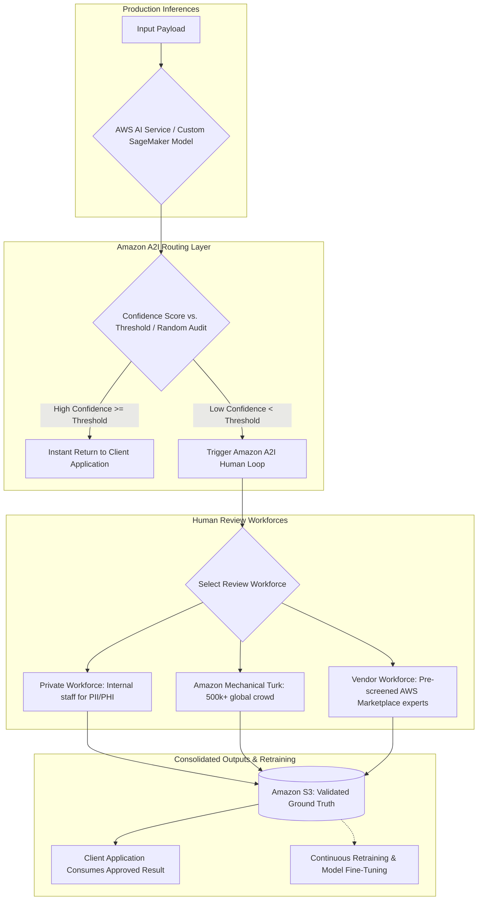
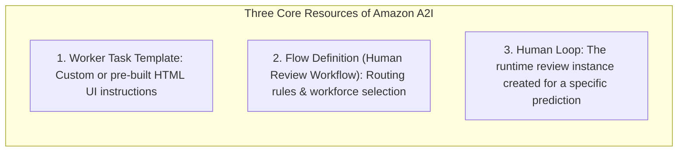
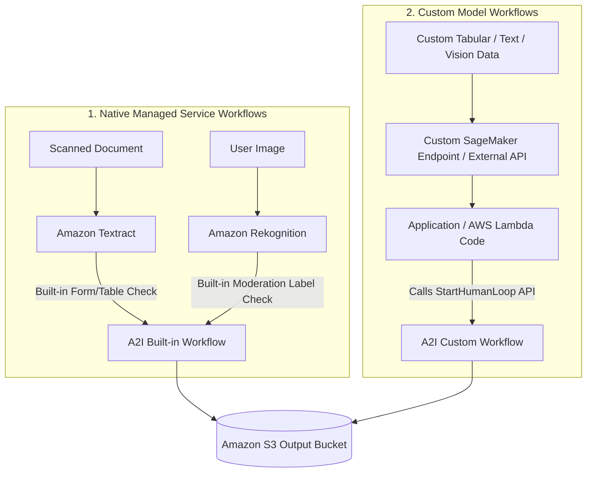
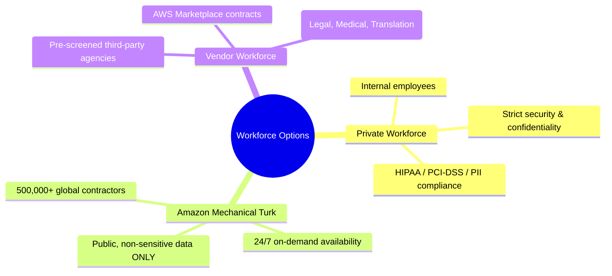

# Amazon Augmented AI (Amazon A2I): Human-in-the-Loop Oversight & Confidence Routing

---

## Key Takeaways

**Amazon Augmented AI (Amazon A2I)** is a fully managed service that simplifies building and managing **Human-in-the-Loop (HITL)** workflows for machine learning predictions. It automatically audits predictions and routes low-confidence or randomly sampled inference results to human reviewers before final delivery or downstream action.

Amazon A2I provides native built-in integrations for **Amazon Textract** (document parsing) and **Amazon Rekognition** (content moderation), as well as API support for **custom models hosted on Amazon SageMaker or external systems**. Review outputs are stored in **Amazon S3**, serving both as validated answers for end users and as augmented ground-truth data for model retraining.

---

## Main Discussion

### Core Components of Amazon A2I

| Component                      | Technical Role                                                                                             | Implementation Details                                                                                                            |
| ------------------------------ | ---------------------------------------------------------------------------------------------------------- | --------------------------------------------------------------------------------------------------------------------------------- |
| **Worker Task Template**       | Defines the web-based review UI presented to human reviewers.                                              | Built using over 60 pre-built HTML Crowd elements or custom HTML/JS templates.                                                    |
| **Flow Definition (Workflow)** | Configures the routing conditions, confidence score thresholds, workforce selection, and output S3 bucket. | Specifies when a human loop is triggered (e.g., Rekognition moderation confidence $< 90\%$ or Textract form confidence $< 85\%$). |
| **Human Loop**                 | The individual runtime execution task generated when an inference meets review trigger conditions.         | Created automatically via service integrations or triggered programmatically via the `StartHumanLoop` API.                        |

---

### Built-in Integrations vs. Custom Model Pipelines

Amazon A2I supports both native managed AI services and custom model endpoints:

- **Native Service Integration:**
  - **Amazon Rekognition:** Triggers human reviews based on confidence score filters on `DetectModerationLabels` (e.g., flagging ambiguous moderation content).
  - **Amazon Textract:** Triggers human reviews on `AnalyzeDocument` for specific form keys (e.g., verifying `SSN` or `Total` when extraction confidence falls below a set percentage).
- **Custom Models (SageMaker or External):**
  - The application evaluates custom confidence scores; if a prediction falls below the threshold, the app calls the **`StartHumanLoop` API** to trigger A2I human review.

---

### Workforce Selection Matrix

Amazon A2I supports three distinct workforce tiers to balance speed, cost, and compliance:

| Dimension         | Private Workforce                                                        | Amazon Mechanical Turk                                                    | Vendor Workforce (AWS Marketplace)                                        |
| ----------------- | ------------------------------------------------------------------------ | ------------------------------------------------------------------------- | ------------------------------------------------------------------------- |
| **Reviewer Pool** | Internal employees or dedicated contractors.                             | 500,000+ independent global workers.                                      | Pre-screened third-party agencies.                                        |
| **Data Privacy**  | **High:** Ideal for confidential records, PII, and HIPAA-regulated data. | **Public Only:** Prohibited for sensitive, proprietary, or personal data. | **Controlled:** Bound by formal enterprise NDAs and vendor security SLAs. |
| **Management**    | Configured via IAM Identity Center or OpenID Connect (OIDC).             | Fully managed crowdsourcing marketplace.                                  | Subscribed and billed directly through AWS Marketplace.                   |
| **Best Used For** | Sensitive medical claims, internal financial auditing.                   | High-volume public image moderation, casual text verification.            | Specialized legal terminology, multi-lingual translations.                |

---

## Exam Guide

### Exam Tips

- **Core Purpose:** **Amazon Augmented AI (Amazon A2I)** is the dedicated service for implementing **Human-in-the-Loop (HITL) review workflows** for machine learning predictions.
- **Trigger Conditions:** Human reviews can be triggered based on:
  1. **Confidence Thresholds:** Predictions falling below a defined score (e.g., $< 85\%$).
  2. **Random Sampling:** A percentage of all predictions (e.g., 5%) routed to humans for quality auditing.
- **Native vs. Custom:** Rekognition (moderation) and Textract (forms/tables) have **built-in A2I integrations**; SageMaker and custom models use the **`StartHumanLoop` API**.
- **A2I vs. SageMaker Ground Truth:**
  - **SageMaker Ground Truth:** Labels raw, unannotated data **before training** to produce training datasets.
  - **Amazon A2I:** Reviews model predictions **after deployment in production** (post-inference oversight).
- **Workforce Compliance:** Always recommend a **Private Workforce** if the review involves PII, confidential medical data (HIPAA), or financial records.

---

### Practice Test

#### Question 1

A media streaming service uses Amazon Rekognition to moderate user-uploaded profile avatars. The platform wants avatars with high moderation confidence scores approved automatically, but requires any avatar with a moderation confidence score below 80% to be evaluated by an internal safety team before going live. Which AWS service orchestrates this conditional human review workflow?

- [ ] A. Amazon SageMaker Ground Truth
- [ ] B. Amazon Augmented AI (Amazon A2I)
- [ ] C. Amazon Comprehend Custom Classification
- [ ] D. AWS Step Functions with Amazon Polly

 Correct Answer

- [x] B. Amazon Augmented AI (Amazon A2I)
  - **Explanation:** **Amazon Augmented AI (Amazon A2I)** integrates directly with Amazon Rekognition to create human review workflows that automatically route low-confidence predictions (e.g., confidence $< 80\%$) to human reviewers.

---

#### Question 2

An insurance enterprise hosts a custom fraud detection model on an Amazon SageMaker endpoint. To ensure regulatory compliance, the company needs to randomly route 3% of all production predictions to a team of internal claims adjusters for manual auditing. Which approach implements this requirement with the least operational overhead?

- [ ] A. Re-train the SageMaker model using Amazon Mechanical Turk
- [ ] B. Configure an Amazon A2I Human Review Workflow with random sampling and invoke the `StartHumanLoop` API from the client application
- [ ] C. Export all daily SageMaker logs to Amazon S3 Glacier and run Athena queries once a month
- [ ] D. Deploy an Amazon Textract AnalyzeExpense pipeline

 Correct Answer

- [x] B. Configure an Amazon A2I Human Review Workflow with random sampling and invoke the `StartHumanLoop` API from the client application
  - **Explanation:** Amazon A2I supports custom models via the **`StartHumanLoop` API** and allows workflows to route predictions based on **random sampling percentages** (e.g., 3%) to a Private Workforce of internal adjusters for regular model audits.

---
