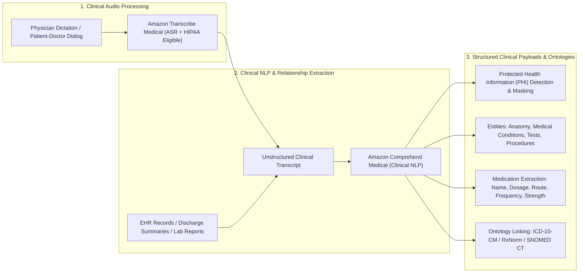
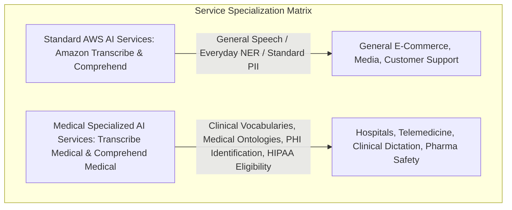
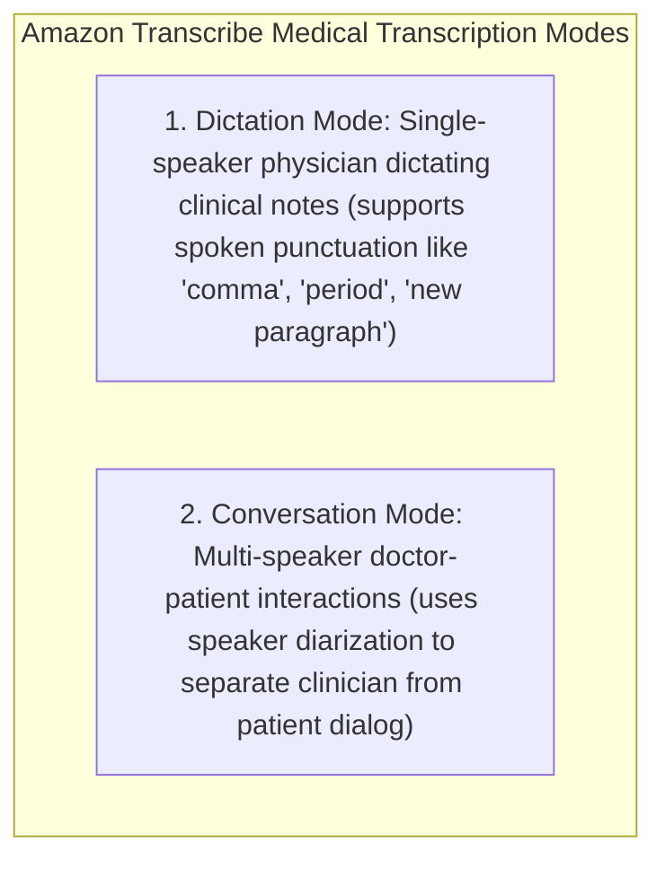
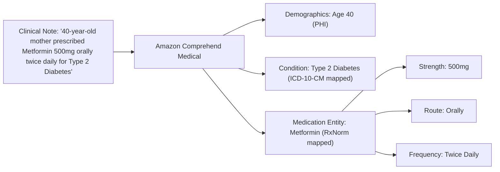
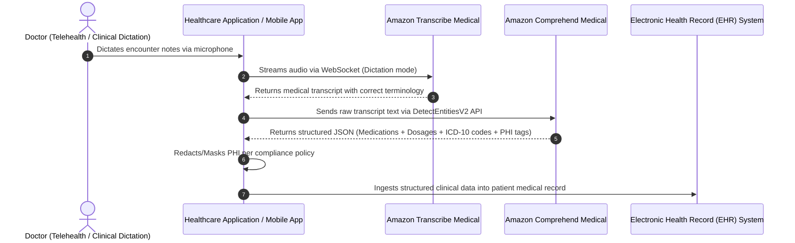

# Amazon Comprehend Medical & Amazon Transcribe Medical: Healthcare AI, HIPAA & Clinical NLP

---

## Key Takeaways

**Amazon Transcribe Medical** and **Amazon Comprehend Medical** are purpose-built, HIPAA-eligible specialized AI services designed to process clinical speech and unstructured electronic health record (EHR) text without requiring healthcare-specific ML model training.

- **Amazon Transcribe Medical:** A specialized Automatic Speech Recognition (ASR) service trained on complex clinical vocabularies, anatomical terms, pharmaceutical brand/generic names, and medical dictation punctuation.
- **Amazon Comprehend Medical:** A specialized Natural Language Processing (NLP) service that extracts clinical entities, medical condition relationships, medication attributes (dosage, strength, frequency), and identifies/redacts **Protected Health Information (PHI)** for HIPAA compliance.

---

## Main Discussion

### Comparison: Standard AI Services vs. Medical AI Services

| Dimension                               | Amazon Transcribe vs. Transcribe Medical                                                                                                                                                                                            | Amazon Comprehend vs. Comprehend Medical                                                                                                                                           |
| --------------------------------------- | ----------------------------------------------------------------------------------------------------------------------------------------------------------------------------------------------------------------------------------- | ---------------------------------------------------------------------------------------------------------------------------------------------------------------------------------- |
| **Vocabulary & Domain Training**        | Standard covers general colloquial language; **Medical** is trained on clinical terminology, pharmacology, pathology, and anatomical names.                                                                                         | Standard identifies general entities (Person, Location, Org); **Medical** extracts clinical categories (`MEDICATION`, `MEDICAL_CONDITION`, `ANATOMY`, `TEST_TREATMENT_PROCEDURE`). |
| **Privacy & Compliance Identification** | Standard detects general PII (credit cards, SSNs, phone numbers); **Medical** detects **Protected Health Information (PHI)** categories as defined under HIPAA (e.g., patient names, ages, hospital admission dates, provider IDs). |                                                                                                                                                                                    |
| **Relational Entity Linking**           | Standard extracts independent keywords/phrases; **Medical** links related attributes together (e.g., binds _500mg_ [Strength], _oral_ [Route], and _twice daily_ [Frequency] directly to _Amoxicillin_ [Medication]).               |                                                                                                                                                                                    |
| **Medical Coding Ontologies**           | Standard has no healthcare coding support; **Medical** provides pre-built ontology linking to **RxNorm** (medications), **ICD-10-CM** (diagnoses/conditions), and **SNOMED CT** (clinical terms).                                   |                                                                                                                                                                                    |

---

### Amazon Transcribe Medical: Modes & Capabilities

Amazon Transcribe Medical supports two distinct operational modes:

- **Dictation Mode:** Designed for physicians recording clinical encounter summaries, operative notes, or radiology impressions. Translates spoken punctuation commands (e.g., _"patient presents with acute bronchitis period new line prescribe amoxicillin"_) into formatted clinical records.
- **Conversation Mode:** Designed for multi-speaker dialogues (such as in-person examinations or telehealth appointments), separating and tagging speaker turns between clinician and patient.
- **Integration Channels:** Supports real-time WebSocket/HTTP2 audio streaming (e.g., live clinical dictation apps) and asynchronous S3 batch audio file processing.

---

### Amazon Comprehend Medical: Entity & Relationship Extraction

Comprehend Medical transforms raw, unstructured clinical text into structured JSON graphs of interconnected medical concepts:

#### Supported Entity Categories

| Category                                 | Extracted Entity Types & Attributes                                                                                         | Example                                       |
| ---------------------------------------- | --------------------------------------------------------------------------------------------------------------------------- | --------------------------------------------- |
| **`MEDICATION`**                         | Drug Name, Brand Name, Generic Name. **Nested Attributes:** `DOSAGE`, `STRENGTH`, `ROUTE_OR_MODE`, `FREQUENCY`, `DURATION`. | _Ibuprofen 400 mg by mouth every 6 hours_     |
| **`MEDICAL_CONDITION`**                  | Diagnosis, Sign, Symptom, Acuity. **Nested Attributes:** `ACUITY` (acute vs. chronic), `DIRECTION` (left vs. right).        | _Acute appendicitis, mild headache_           |
| **`ANATOMY`**                            | Body Part, System, Organ, Directionality.                                                                                   | _Left lower lung, lumbar spine_               |
| **`TEST_TREATMENT_PROCEDURE`**           | Diagnostic Tests, Surgical Procedures, Treatment Plans.                                                                     | _Chest X-ray, MRI, Colonoscopy_               |
| **`PROTECTED_HEALTH_INFORMATION` (PHI)** | Patient Names, Ages, Addresses, Phone Numbers, Hospital Names, Dates of Service.                                            | _John Doe, 40 years old, admitted 08/29/2026_ |

---

### End-to-End Clinical Voice-to-EHR Architecture Pattern

---

## Exam Guide

### Exam Tips

- **Medical Disambiguation Rule:**
  - Converting general audio $\rightarrow$ **Amazon Transcribe**.
  - Converting clinical/physician speech, doctor-patient audio, or medical dictation $\rightarrow$ **Amazon Transcribe Medical**.
  - General text NLP, sentiment, standard PII $\rightarrow$ **Amazon Comprehend**.
  - Clinical notes, prescription dosages, medical symptoms, ICD-10/RxNorm ontologies, or PHI $\rightarrow$ **Amazon Comprehend Medical**.
- **HIPAA Compliance:** Both Transcribe Medical and Comprehend Medical are **HIPAA-eligible services**, meaning healthcare organizations can sign an AWS Business Associate Addendum (BAA) and process Protected Health Information (PHI) securely.
- **Attribute Binding:** Remember that Comprehend Medical does not just extract standalone words; it associates medication attributes (dosage, frequency, strength, route) directly to the specific drug entity.
- **Ontology Linking APIs:** Comprehend Medical includes `InferICD10CM` (diagnoses), `InferRxNorm` (prescriptions), and `InferSNOMEDCT` (clinical concepts) to map text to standardized medical billing and classification codes.

---

### Practice Test

#### Question 1

A healthtech startup is developing a mobile application for doctors to dictate clinical encounter notes after patient rounds. The application must accurately capture complex pharmaceutical brand names, understand spoken punctuation commands, and comply with HIPAA regulations. Which AWS service should the development team use for the speech-to-text layer?

- [ ] A. Amazon Polly using the Generative Engine
- [ ] B. Amazon Transcribe Medical in Dictation Mode
- [ ] C. Amazon Rekognition Text in Image
- [ ] D. Amazon Lex with a medical slot type

 Correct Answer

- [x] B. Amazon Transcribe Medical in Dictation Mode
  - **Explanation:** **Amazon Transcribe Medical** is a HIPAA-eligible ASR service specifically trained on healthcare vocabularies and pharmacology. Its **Dictation Mode** handles spoken punctuation commands (such as "comma", "period", "new line") used during physician note recording.

---

#### Question 2

A hospital system needs to analyze thousands of unstructured electronic discharge summaries to extract patient medications, their exact dosages and administration frequencies, while automatically flagging all Protected Health Information (PHI) for privacy compliance. Which AWS service provides this capability without requiring custom machine learning model development?

- [ ] A. Amazon Comprehend Medical
- [ ] B. Amazon Translate with Custom Terminology
- [ ] C. Amazon Kendra
- [ ] D. Amazon Personalize

 Correct Answer

- [x] A. Amazon Comprehend Medical
  - **Explanation:** **Amazon Comprehend Medical** is purpose-built for clinical NLP. It extracts clinical entities, binds medication attributes (such as dosage and frequency) to drug names, and detects Protected Health Information (PHI) out of the box.

---
