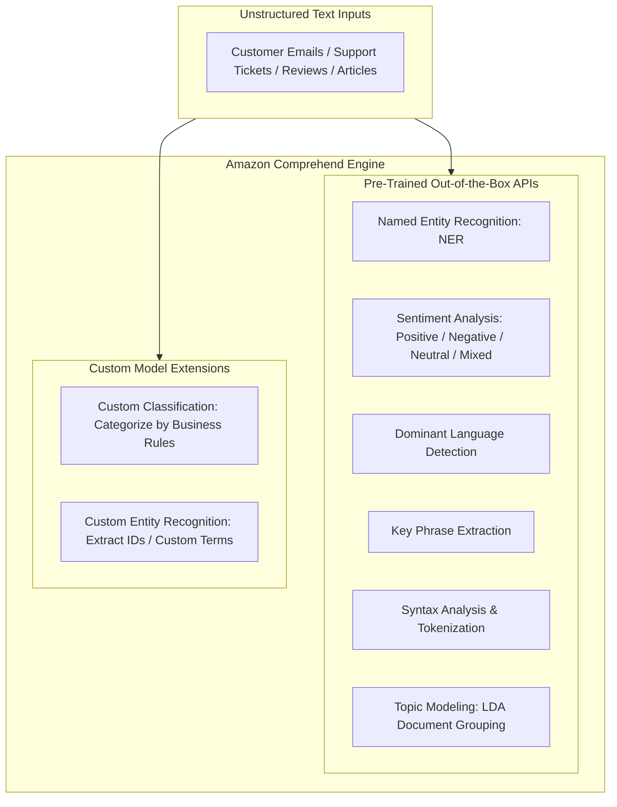
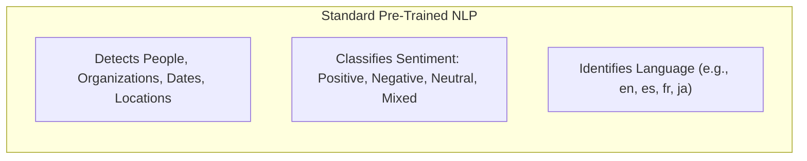
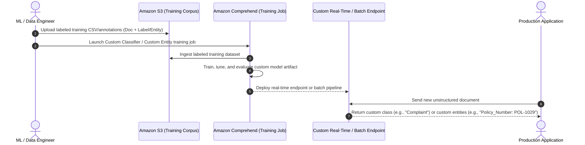

import ImageRow from '@site/src/components/ImageRow';
import ComprehendNER from './img/comprehend-named-entity-recognition.png';

# Amazon Comprehend: Natural Language Processing (NLP) & Custom Entity Extraction

---

## Key Takeaways

**Amazon Comprehend** is a fully managed, serverless **Natural Language Processing (NLP)** service that uses machine learning to extract insights, sentiments, entities, and structural relationships from unstructured text without requiring custom ML model development.



Out of the box, Amazon Comprehend provides **Named Entity Recognition (NER)**, **Sentiment Analysis**, **Key Phrase Extraction**, **Dominant Language Detection**, and **Topic Modeling**. For domain-specific workflows, it supports **Custom Classification** (labeling documents based on business taxonomy) and **Custom Entity Recognition** (extracting proprietary terms like policy numbers, parts codes, or legal clauses).

---

## Main Discussion

### Pre-Trained Capabilities vs. Custom Extensions

#### Pre-Trained Capabilities



#### Custom Extensions

<div className="flex flex-col md:flex-row gap-x-2">

    <div className="flex flex-col">
        ```mermaid
        flowchart LR
            subgraph CustomCaps [Custom Comprehend Models]
                C1["Custom Classification: Inbound Routing (Billing vs. Support vs. Complaints)"]
                C2["Custom Entities: Specialized extraction (Policy #, Claim ID, SKU)"]
            end
        ```

        

    </div>

    

</div>

<ImageRow>
  
</ImageRow>

#### Comprehend Capabilities Summary

| Capability                         | Model Type          | How It Works                                                                                            | Representative Output / Use Case                                                                  |
| ---------------------------------- | ------------------- | ------------------------------------------------------------------------------------------------------- | ------------------------------------------------------------------------------------------------- |
| **Named Entity Recognition (NER)** | Pre-trained         | Identifies standard semantic categories automatically.                                                  | Flags _"Zhang Wei"_ as `PERSON`, _"AnyCompany LLC"_ as `ORGANIZATION`, and _"July 31"_ as `DATE`. |
| **Sentiment Analysis**             | Pre-trained         | Analyzes emotional tone and outputs confidence scores across four emotional classes.                    | `POSITIVE: 0.02`, `NEGATIVE: 0.88`, `NEUTRAL: 0.08`, `MIXED: 0.02`.                               |
| **Key Phrase Extraction**          | Pre-trained         | Surfaces noun phrases and critical topical phrases.                                                     | Extracts _"annual health plan maximum"_, _"customer service escalation"_.                         |
| **Dominant Language Detection**    | Pre-trained         | Determines the primary RFC-5646 language code.                                                          | Identifies `en` (English), `es` (Spanish), `fr` (French) with confidence metrics.                 |
| **Topic Modeling**                 | Pre-trained (Async) | Uses Latent Dirichlet Allocation (LDA) to group large document collections into thematic clusters.      | Groups 100,000 raw support tickets into 10 distinct underlying problem topics.                    |
| **Custom Classification**          | Custom-trained      | Maps documents into custom, user-defined business categories based on training examples in Amazon S3.   | Automatically routes emails to `Complaints`, `Billing Inquiry`, or `Technical Support`.           |
| **Custom Entity Recognition**      | Custom-trained      | Learns to detect proprietary terms, specific codes, or unique business entities from annotated samples. | Extracts insurance policy IDs (e.g., `POL-9843-X`) or part serial numbers.                        |

---

### Custom Classification & Entity Recognition Pipeline

When standard pre-trained models do not capture business-specific jargon, Comprehend enables custom training workflows:



1. **Custom Document Classification:** Accepts multi-class (mutually exclusive) or multi-label training data. Supported formats include plain text, PDF, Word documents, and images.
2. **Custom Entity Recognition:** Uses entity lists or annotated documents to train Comprehend to recognize specialized patterns without writing regular expressions or complex rule engines.

---

### Real-Time vs. Asynchronous Batch Analysis

| Analysis Mode                        | Latency & Interaction Profile                                               | Supported File Modalities                                           | Best Suited For                                                                                 |
| ------------------------------------ | --------------------------------------------------------------------------- | ------------------------------------------------------------------- | ----------------------------------------------------------------------------------------------- |
| **Real-Time Analysis (Synchronous)** | Sub-second responses for interactive, single-document API calls.            | Plain UTF-8 text strings.                                           | Live chat sentiment scoring, real-time ticket triage, user submission filtering.                |
| **Asynchronous Batch Processing**    | Distributed batch processing jobs running against large pools of documents. | Plain text, PDF, DOCX, scanned document images stored in Amazon S3. | Nightly support ticket audits, regulatory document reviews, historical data warehouse analysis. |

---

## Exam Guide

### Exam Tips

- **Core Service Purpose:** **Amazon Comprehend** is the go-to AWS service for **text-based NLP**, **sentiment analysis**, **topic modeling**, and **entity extraction** on unstructured text.
- **Pre-Trained vs. Custom Rules:**
  - If a question asks to detect standard entities (people, dates, locations, organizations) $\rightarrow$ Use **Pre-trained Named Entity Recognition (NER)**.
  - If a question asks to extract proprietary business IDs (e.g., policy numbers, claim codes, internal product SKUs) $\rightarrow$ Use **Amazon Comprehend Custom Entity Recognition**.
  - If a question asks to route incoming support emails into specific business queues (e.g., billing, cancellation, technical support) $\rightarrow$ Use **Amazon Comprehend Custom Classification**.
- **Topic Modeling:** Comprehend uses **unsupervised topic modeling** to organize large document collections into clusters based on shared themes.
- **Serverless & Managed:** Comprehend is fully serverless; you do not provision or manage underlying EC2 instances or GPU clusters.

---

### Practice Test

#### Question 1

A customer service organization receives thousands of feedback emails daily in multiple languages. The organization wants an automated solution that analyzes incoming email text to identify the overall customer sentiment (Positive, Negative, Neutral) and extract referenced dates, locations, and company names without training or managing a custom machine learning model. Which AWS service should they use?

- [ ] A. Amazon Rekognition
- [ ] B. Amazon Comprehend
- [ ] C. Amazon Polly
- [ ] D. AWS Glue DataBrew

<details>
<summary>Correct Answer</summary>

- [x] B. Amazon Comprehend
  - **Explanation:** **Amazon Comprehend** is a fully managed NLP service that provides pre-trained APIs out of the box for sentiment analysis, dominant language detection, and Named Entity Recognition (NER) for standard categories such as dates, locations, and organizations.

</details>

---

#### Question 2

An insurance enterprise wants to automatically review legal claim documents to locate and extract custom policy numbers that follow a proprietary alphanumeric structure (`POL-XXXXX`). The solution must not require building or managing custom deep learning training scripts. Which approach meets these requirements?

- [ ] A. Use Amazon Rekognition Custom Labels
- [ ] B. Train an Amazon Comprehend Custom Entity Recognizer using annotated sample claim documents
- [ ] C. Deploy a linear regression model on Amazon SageMaker
- [ ] D. Configure an Amazon Kendra web crawler

<details>
<summary>Correct Answer</summary>

- [x] B. Train an Amazon Comprehend Custom Entity Recognizer using annotated sample claim documents
  - **Explanation:** **Amazon Comprehend Custom Entity Recognition** allows you to train a specialized entity extraction model using your own domain-specific training documents and annotations to reliably detect custom business entities, such as proprietary policy numbers.

</details>

---

#### Question 3

Consider a scenario where a fully-managed AWS service needs to be used for automating the extraction of insights from legal briefs such as contracts and court records.

What do you recommend?

- [ ] A. Amazon Translate
- [ ] B. Amazon Rekognition
- [ ] C. Amazon Transcribe
- [ ] D. Amazon Comprehend

<details>
<summary>Correct Answer</summary>

- [x] D. Amazon Comprehend
  - **Explanation:** Amazon Comprehend is a natural language processing (NLP) service that uses machine learning to find meaning and insights in text. Natural Language Processing (NLP) is a way for computers to analyze, understand, and derive meaning from textual information in a smart and useful way. By utilizing NLP, you can extract important phrases, sentiments, syntax, key entities such as brand, date, location, person, etc., and the language of the text.  
    You can use Amazon Comprehend to identify the language of the text, extract key phrases, places, people, brands, or events, understand sentiment about products or services, and identify the main topics from a library of documents. The source of this text could be web pages, social media feeds, emails, or articles. You can also feed Amazon Comprehend a set of text documents, and it will identify topics (or groups of words) that best represent the information in the collection. The output from Amazon Comprehend can be used to understand customer feedback, provide a better search experience through search filters, and use topics to categorize documents.  
    How Amazon Comprehend works:  
       
    Comprehend use cases:  
     

<details>
<summary>Incorrect Answers</summary>

- [ ] A. Amazon Translate
  - **Explanation:** Amazon Translate is a text translation service that uses advanced machine learning technologies to provide high-quality translation on demand. You can use Amazon Translate to translate unstructured text documents or to build applications that work in multiple languages.
- [ ] B. Amazon Rekognition
  - **Explanation:** Amazon Rekognition is a cloud-based image and video analysis service that makes it easy to add advanced computer vision capabilities to your applications. You can add features that detect objects, text, and unsafe content, analyze images/videos, and compare faces to your application using Rekognition's APIs.
- [ ] C. Amazon Transcribe
  - **Explanation:** Amazon Transcribe is an automatic speech recognition service that uses machine learning models to convert audio to text. You can use Amazon Transcribe as a standalone transcription service or add speech-to-text capabilities to any application.

</details>

Reference:

- [https://aws.amazon.com/comprehend/](https://aws.amazon.com/comprehend/)

</details>

---
