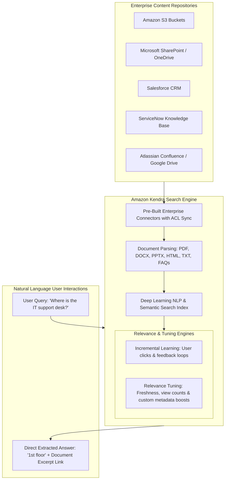
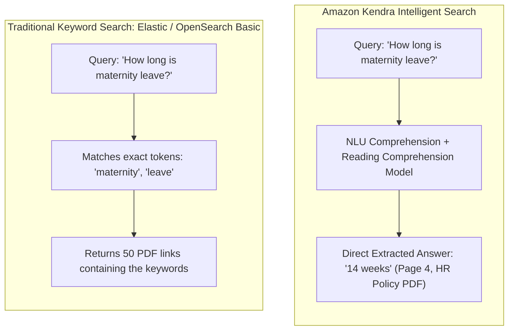
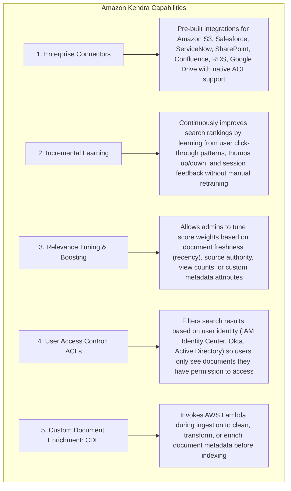
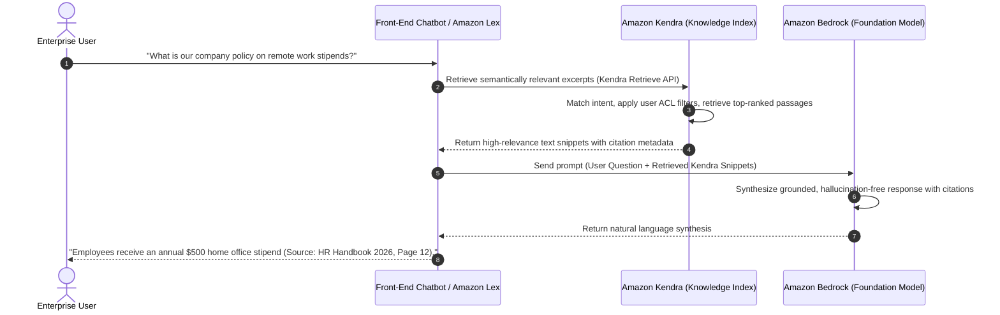

# Amazon Kendra: Intelligent Enterprise Semantic Search & Incremental Learning

---

## Key Takeaways

**Amazon Kendra** is a fully managed, machine-learning-powered **intelligent enterprise search service** that enables organizations to search across structured and unstructured data silos using natural language queries.

Unlike traditional keyword-based search engines that rely on exact lexical pattern matching (e.g., BM25 / TF-IDF), Amazon Kendra uses **natural language understanding (NLU)** and **semantic deep learning models** to comprehend the intent behind a question and extract direct answers (e.g., answering _"Where is the IT support desk?"_ with _"1st floor"_) from supported documents. It features **Incremental Learning** to continuously improve ranking based on user interactions, and allows administrators to fine-tune search relevance based on document freshness, authoritative authors, or custom metadata fields.

---

## Main Discussion

### Traditional Keyword Search vs. Amazon Kendra Semantic Search

| Search Dimension              | Traditional Keyword-Based Search (Lexical)                                 | Amazon Kendra Intelligent Semantic Search                                                              |
| ----------------------------- | -------------------------------------------------------------------------- | ------------------------------------------------------------------------------------------------------ |
| **Search Mechanism**          | Rigid token frequency matching (TF-IDF, BM25).                             | Deep learning **semantic understanding** and reading comprehension models.                             |
| **Query Style**               | Boolean keyword strings (e.g., `"VPN reset token steps"`).                 | Conversational **natural language questions** (e.g., _"How do I reset my VPN token?"_).                |
| **Result Format**             | Ranked list of document links; user must manually open and scan the files. | **Direct factoid answers**, extracted targeted text snippets, curated FAQ matches, and document links. |
| **Document Understanding**    | Treats text as unstructured strings.                                       | Understands document layout, headers, paragraphs, and embedded HTML tables.                            |
| **Security & Access Control** | Requires custom index filtering code.                                      | Native **Access Control List (ACL)** synchronization across enterprise connectors.                     |

---

### Core Architectural Features of Amazon Kendra

| Feature                                                | Operational Mechanism                                                                                                                             | Strategic Business Value                                                                                                     |
| ------------------------------------------------------ | ------------------------------------------------------------------------------------------------------------------------------------------------- | ---------------------------------------------------------------------------------------------------------------------------- |
| **Natural Language Answering & Reading Comprehension** | Scans multi-page PDFs, Word documents, and HTML pages to extract exact answers and relevant highlighted excerpts.                                 | Drastically reduces time spent by employees and customers searching for information across corporate intranets.              |
| **Incremental Learning**                               | Automatically analyzes user click streams, search history, and feedback (thumbs up / thumbs down).                                                | Search rankings improve dynamically over time without requiring manual model retraining or data science effort.              |
| **Relevance Tuning (Boosting)**                        | Administrators assign weight sliders to metadata fields (e.g., boosting documents updated in the last 30 days or published by official HR teams). | Prevents outdated or deprecated internal documentation from ranking above current policies.                                  |
| **Built-in Connectors & ACL Filtering**                | Connects to 14+ enterprise repositories and synchronizes user/group access permissions automatically.                                             | Guarantees that employees only see search results for documents they are authorized to view in the underlying source system. |
| **Curated FAQ Indexing**                               | Ingests structured CSV/JSON question-and-answer pairs directly into the index.                                                                    | Delivers instant, high-confidence direct answers for common company FAQs.                                                    |

---

### Amazon Kendra as a Retrieval-Augmented Generation (RAG) Engine

In modern generative AI architectures, Amazon Kendra acts as a high-precision knowledge retriever for Large Language Models (LLMs):

---

## Exam Guide

### Exam Tips

- **Primary Service Purpose:** **Amazon Kendra** is the go-to AWS service for **intelligent enterprise document search** powered by machine learning and natural language processing.
- **Semantic Search vs. Keyword Search:** Kendra does not just match keyword strings; it uses **deep learning semantic models** to understand natural language intent and extract direct answers from unstructured documents.
- **Incremental Learning:** When an exam question asks how a search engine can **automatically improve its search ranking over time based on end-user clicks and interaction feedback without manual retraining**, the answer is **Amazon Kendra Incremental Learning**.
- **Relevance Tuning & Boosting:** Administrators can manually adjust ranking weights based on **document freshness (recency), source authority, view count, or custom metadata tags**.
- **Supported Document Modalities:** Kendra natively parses text, PDF, HTML, Microsoft Word (`.docx`), PowerPoint (`.pptx`), and structured FAQs.
- **Enterprise Security:** Kendra respects and enforces **Access Control Lists (ACLs)** from source systems (SharePoint, Salesforce, ServiceNow) so users only see search results for documents they have permission to access.

---

### Practice Test

#### Question 1

An enterprise company has internal documentation scattered across Amazon S3, Microsoft SharePoint, and ServiceNow knowledge bases. Employees complain that standard intranet keyword search fails to answer complex questions such as "How do I request parental leave?" and forces them to manually read dozens of lengthy PDF manuals. Which AWS service provides a natural language search solution that extracts direct answers from unstructured documents with minimal operational overhead?

- [ ] A. Amazon Rekognition
- [ ] B. Amazon Kendra
- [ ] C. Amazon Polly
- [ ] D. Amazon Comprehend Custom Entity Recognition

 Correct Answer

- [x] B. Amazon Kendra
  - **Explanation:** **Amazon Kendra** is a fully managed, machine-learning-powered enterprise search service that indexes documents across multiple data sources (S3, SharePoint, ServiceNow) and uses natural language processing to extract direct answers and relevant passages in response to conversational questions.

---

#### Question 2

An administrator is managing an Amazon Kendra search index for an internal company wiki. The company recently published updated cybersecurity compliance guidelines, but users report that older, deprecated policies are still appearing at the top of search results. Which Amazon Kendra feature should the administrator use to prioritize recent documents and boost authoritative corporate sources?

- [ ] A. Amazon Translate Custom Terminology
- [ ] B. Amazon Kendra Relevance Tuning
- [ ] C. Amazon Transcribe Custom Language Model (CLM)
- [ ] D. Amazon Lex Utterance Analysis

 Correct Answer

- [x] B. Amazon Kendra Relevance Tuning
  - **Explanation:** **Amazon Kendra Relevance Tuning** allows administrators to manually adjust the importance and weighting of search results based on document freshness (creation/update date), source authority, view counts, or custom metadata attributes.

---
