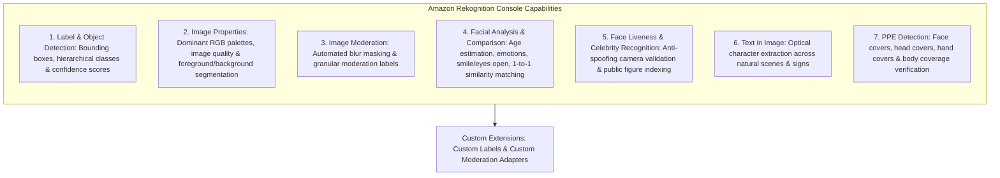

# Hands-On Lab: Amazon Rekognition Console Features, Vision Capabilities & PPE Detection

---

## Key Takeaways

**Amazon Rekognition** provides interactive, visual computer vision tools in the AWS Management Console to evaluate pre-trained deep learning computer vision models across multiple analytical categories without writing custom ML code.

The hands-on console interface enables instant testing of **Label Detection** (with hierarchical bounding boxes and parent-child categories like `Car -> Wheel`), **Image Properties**, **Content Moderation**, **Facial Analysis**, **Facial Comparison**, **Face Liveness**, **Celebrity Recognition**, **Text in Image Detection**, and **Personal Protective Equipment (PPE) Detection**.

---

## Hands-On Workflow: Testing Rekognition Capabilities in the Console

1. **Explore Label & Object Detection with Bounding Boxes:**
   - Open the **Amazon Rekognition Console** and select **Label detection** from the navigation menu.
   - Upload a test image or inspect the default sample (e.g., an urban street scene containing buildings, pedestrians, skateboards, and cars).
   - Observe the bounding box coordinates rendered around individual objects.
   - Note the hierarchical relationship of detected elements (e.g., detecting _Transportation_ $\rightarrow$ _Car_ $\rightarrow$ _Wheel_).
   - Review the generated confidence score metrics (e.g., 99% confidence) associated with each identified object label.  
     
2. **Analyze Image Properties & Content Moderation:**
   - Evaluate visual composition and safety filters:
   - **Image Properties:** Select the properties tab to inspect dominant color palettes (hex/RGB codes), sharpness, brightness, and foreground vs. background segmentation metrics.  
     
   - **Image Moderation:** Navigate to **Image moderation** to view how Rekognition identifies inappropriate or sensitive imagery. Observe the automated blur masking overlay and the underlying taxonomy of detected moderation labels.  
     
3. **Run Facial Analysis, Face Comparison & Celebrity Recognition:**
   - Test facial computer vision models:
   - **Facial Analysis:** Upload a portrait photo to inspect detected demographic and emotional attributes (e.g., estimated age range, gender presentation, smiling probability, eyes open state, emotional indicators like _Happy_ or _Calm_).  
     
   - **Facial Comparison:** Upload a source image and target image to compute biometric facial vector similarity scores (e.g., comparing two images of the same individual returns $>95\%$ similarity, while comparing distinct faces returns a low non-match score).  
     
   - **Celebrity Recognition:** Test images of prominent public figures to retrieve identity names, bios, and official reference URLs.  
     
4. **Extract Text in Image & Verify PPE Compliance:**
   - Inspect OCR and industrial safety inspection tools:
   - **Text in Image:** Test photos containing signs, billboard ads, or graphic text to extract raw text strings and polygon bounding boxes.  
     
   - **Personal Protective Equipment (PPE) Detection:** Upload photos of industrial or clinical environments to detect three standard PPE categories: **Face covers** (masks), **Head covers** (hard hats/helmets), and **Hand covers** (safety/surgical gloves), while verifying whether the protective item properly covers the corresponding body part.  
     

---

## Core Capabilities & Feature Comparison Matrix

| Console Capability        | Primary API Invocation                   | Data Returned                                                                                                                   | Representative Enterprise Use Case                                             |
| ------------------------- | ---------------------------------------- | ------------------------------------------------------------------------------------------------------------------------------- | ------------------------------------------------------------------------------ |
| **Label Detection**       | `DetectLabels`                           | Object names, parent taxonomy labels, confidence scores, bounding boxes (`Width, Height, Left, Top`).                           | Automated media asset cataloging, vehicle and pedestrian tracking.             |
| **Image Properties**      | `DetectLabels` (with `IMAGE_PROPERTIES`) | Dominant color distribution (Hex/RGB), brightness, sharpness, contrast metrics.                                                 | Digital asset management, assessing visual image quality for catalog listings. |
| **Image Moderation**      | `DetectModerationLabels`                 | Moderation taxonomy tiers (e.g., _Explicit Nudity_, _Violence_, _Visually Disturbing_).                                         | Filtering user-generated uploads on social apps and community forums.          |
| **Facial Analysis**       | `DetectFaces`                            | Age range, gender, emotions, eyeglasses/sunglasses, beard, smile, eye state.                                                    | Demographic analytics for retail foot-traffic, smart camera interfaces.        |
| **Facial Comparison**     | `CompareFaces`                           | Biometric similarity score ($0.0 - 100.0\%$), bounding boxes of matched and unmatched faces.                                    | Identity verification during customer digital onboarding.                      |
| **Face Liveness**         | AWS Amplify FaceLiveness integration     | Liveness confidence score, anti-spoofing flags (blocks printed photos and screens).                                             | Preventing replay and spoof attacks in mobile banking verification.            |
| **Celebrity Recognition** | `RecognizeCelebrities`                   | Celebrity name, match confidence, bounding coordinates, IMDB reference link.                                                    | Indexing broadcast news footage and entertainment archives.                    |
| **Text in Image**         | `DetectText`                             | Extracted words and lines of text, orientation angle, bounding polygon points.                                                  | Reading vehicle license plates, street signs, race jersey numbers.             |
| **PPE Detection**         | `DetectProtectiveEquipment`              | Persons detected, body parts (face, head, left/right hand), PPE type detected, coverage boolean (`CoversBodyPart: true/false`). | Construction site safety monitoring, cleanroom and healthcare OSHA compliance. |

---

## Exam Guide

### Exam Tips

- **PPE Detection Scope:** `DetectProtectiveEquipment` evaluates three specific equipment types: **Face covers**, **Head covers**, and **Hand covers**. It verifies not only presence, but also whether the equipment **properly covers the target body part** (e.g., verifying a mask covers the mouth and nose).
- **PPE vs. Facial Recognition:** PPE Detection identifies the _presence of persons and protective gear_ on body parts; it **does not** perform facial recognition or identify who the individual is.
- **Text Extraction Disambiguation:**
  - If a scenario describes extracting **scanned tables, invoices, multi-column forms, or PDF documents** $\rightarrow$ Use **Amazon Textract**.
  - If a scenario describes detecting **short text, signs, license plates, or race bib numbers inside natural image scenes/photos** $\rightarrow$ Use **Amazon Rekognition Text in Image** (`DetectText`).
- **Custom Models on Rekognition:**
  - To detect custom brand logos, proprietary store items, or industrial parts $\rightarrow$ **Amazon Rekognition Custom Labels**.
  - To adjust moderation sensitivity and add custom safety categories $\rightarrow$ **Amazon Rekognition Custom Moderation Adapters**.

---

### Practice Test

#### Question 1

A safety compliance team at a construction firm needs an automated solution to monitor video frames from entry gates to ensure workers are wearing hard hats and protective gloves before entering the work zone. The solution must determine if the protective equipment is properly covering the workers' heads and hands. Which Amazon Rekognition feature should be used?

- [ ] A. Amazon Rekognition Custom Labels trained on construction tools
- [ ] B. Amazon Rekognition Personal Protective Equipment (PPE) Detection (`DetectProtectiveEquipment`)
- [ ] C. Amazon Rekognition Celebrity Recognition
- [ ] D. Amazon Rekognition Face Liveness Detection

Correct Answer

- [x] B. Amazon Rekognition Personal Protective Equipment (PPE) Detection (`DetectProtectiveEquipment`)
  - **Explanation:** Amazon Rekognition **PPE Detection** is pre-trained to detect head covers, hand covers, and face covers, returning a structured summary indicating whether the equipment is present and properly covering the designated body parts.

---

#### Question 2

A media management company needs an automated workflow to process photos taken during city marathons to detect runner race numbers printed on running bibs and extract the numbers as digital text. Which Amazon Rekognition capability provides this functionality?

- [ ] A. Amazon Rekognition Face Comparison
- [ ] B. Amazon Rekognition Text in Image (`DetectText`)
- [ ] C. Amazon Rekognition PPE Detection
- [ ] D. Amazon Comprehend Custom Classification

Correct Answer

- [x] B. Amazon Rekognition Text in Image (`DetectText`)
  - **Explanation:** **Amazon Rekognition Text in Image (`DetectText`)** is designed to identify and extract printed or handwritten text embedded within natural scene images, such as street signs and race bib numbers.

---
